# Weekly Tanker Market Monitor: Week 29, 2026

**Date**: July 20, 2026 | **Category**: Tankers | **Section**: Monitors | **Source**: [https://www.thesignalgroup.com/weekly-market-monitor/weekly-tanker-market-monitor-week-29-2026](https://www.thesignalgroup.com/weekly-market-monitor/weekly-tanker-market-monitor-week-29-2026)

---

## SPOTLIGHT OF THE WEEK

## Tanker Count on Both Sides of Hormuz Exceeds 700 as Strait Tensions Reignite

AXSMarine's live fleet tracker recorded 728 tankers in the Arabian Gulf following the renewed escalation around the Strait of Hormuz. Crude tankers accounted for 179 vessels (24.6%) of the total tanker fleet present. Within the crude segment, VLCCs remained the dominant class with 123 vessels, representing 68.7% of crude tanker activity in the region, compared with 34 Suezmax units (19.0%) and 18 Aframax/LR2 vessels (10.1%).

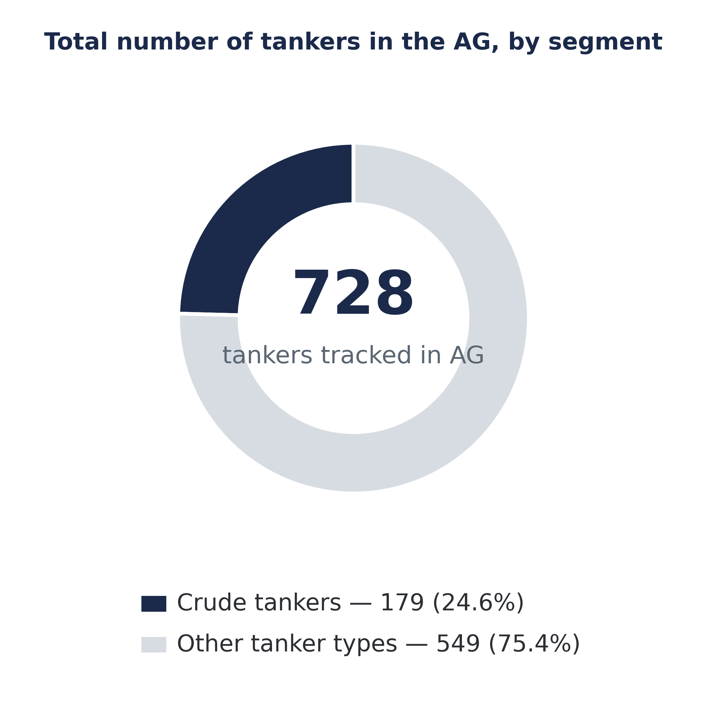
*Figure 1a.Vessel count: AXSMarine · data as of 15 July 2026*

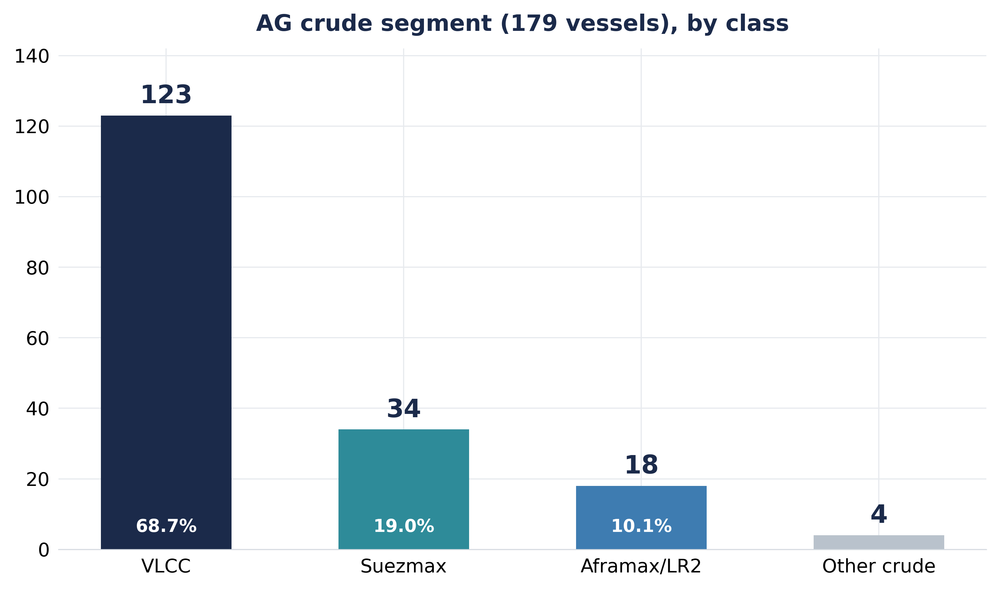
*Figure 1b.Vessel count: AXSMarine · data as of 15 July 2026*

Of the 728 tankers tracked, 381 vessels (52.3%) were at anchorage, while 234 (32.1%) were at sea and 59 (8.1%) were at berth. A further 246 vessels (33.8%) were not transmitting AIS positions. The share of AIS-inactive vessels was higher west of the Strait of Hormuz inside the Arabian Gulf (39.7%) than east of the Strait (28.6%).

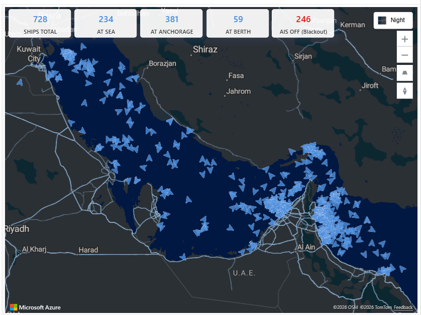
*Figure 1c.Live AG/Strait fleet tracker — 728 tankers, 246 not transmitting an AIS position.Vessel tracking: AXSMarine*

## EXECUTIVE SUMMARY

•  AG fleet:728 tankers were tracked on both sides of Hormuz, with crude tankers accounting for 179 vessels (24.6%). VLCCs remained the dominant crude class with 123 vessels (68.7%), followed by Suezmax (34) and Aframax/LR2 (18).

•  Ballast vs laden:Ballast vessels outnumbered laden vessels, 394 to 334 (54.1% versus 45.9%), with the widest imbalance recorded east of Hormuz (226 versus 159).

## Ballast vs. Laden — East and West of Hormuz

The split between ballast and laden vessels varied depending on the side of the Strait of Hormuz. To the west of the Strait, the fleet included 168 ballast vessels and 175 laden vessels, representing a split of 49.0% and 51.0%. To the east of the Strait, ballast vessels reached 226, while laden vessels stood at 159, resulting in a 58.7% to 41.3% split. Aggregating both sides, the fleet comprised 394 ballast vessels and 334 laden vessels, resulting in an overall split of 54.1% and 45.9%.

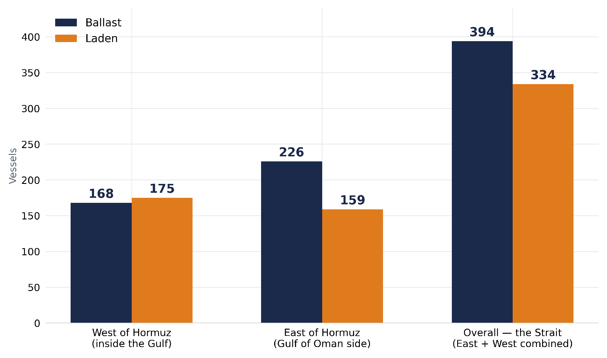
*Figure 2.Ballast vs. laden vessel counts, west and east of Hormuz, and combined for the Strait.Vessel tracking and AIS draft status: AXSMarine · data as of 15 July 2026*

## Ballasters — VLCC, Suezmax and Aframax in the Gulf

According to the Signal Ocean ballaster tracker, VLCC ballasters in the Arabian Gulf stood at 115 vessels for the week ending 15 July, representing a 1% week-on-week decline. The AG vessel count fluctuated between 100 and 120 during the first quarter of the year before surging to a peak of nearly 140 in mid-March 2026, amid the earlier stages of the conflict. After dropping sharply to roughly 90 vessels in mid-May, the count moved up to its current level of 115.

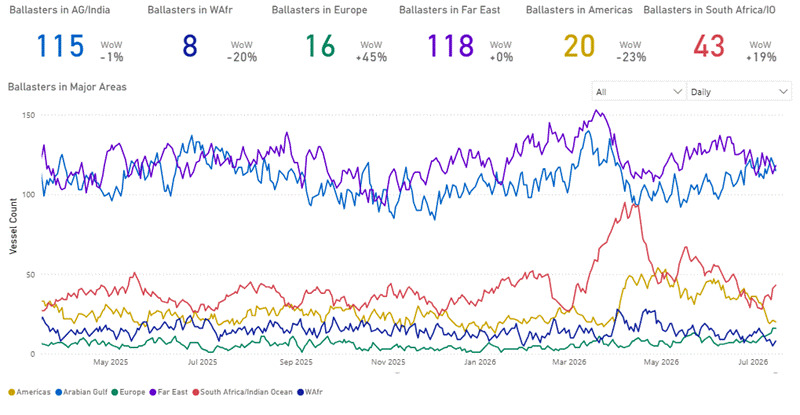
*Figure 3a.VLCC ballasters by region.Ballaster tracking: Signal Ocean Platform*

Suezmax ballasters stand at 46 vessels, up 10% week-on-week, from the last high of 65 seen in mid-June, one of the highest since the beginning of the previous year. Notable. Aframax/LR2 ballasters are at 75 vessels, up 21% week-on-week — the largest weekly move among the three crude classes, compared to a low range of 38-40 recorded in mid-April.

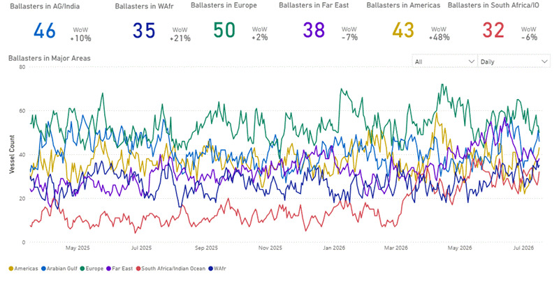
*Figure 3b.Suezmax ballasters by region.Ballaster tracking: Signal Ocean Platform*

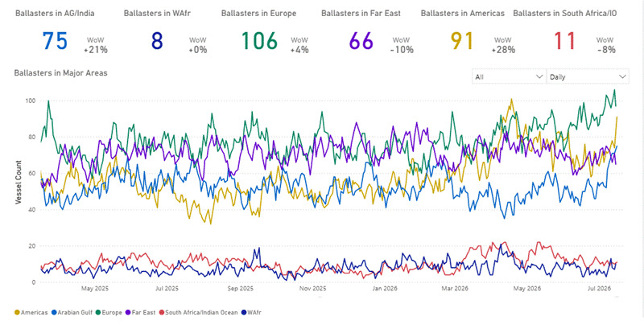
*Figure 3c.Aframax/LR2 ballasters by region.Ballaster tracking: Signal Ocean Platform*

AG ballasters, 15 Jul '26 (w/w):  VLCC 115 (-1%) · Aframax/LR2 75 (+21%) · Suezmax 46 (+10%) · VLCC March 2026 peak ~150

## Net Supply — Spot/Relet Availability by Class

Since June 2025, the 7-day moving average of commercially available spot and relet vessels in the Arabian Gulf has followed different trajectories across the VLCC, Suezmax and Aframax segments. Aframax availability reached a high of more than 28 vessels in October 2025 before declining to around 10 vessels in February 2026 and subsequently fluctuating within a 13–17 vessel range. Suezmax availability remained relatively constrained for much of the period, varying between approximately 4 and 14 vessels, before rising sharply to around 20 vessels in July 2026. The most pronounced change occurred in the VLCC segment, where available spot and relet supply increased from fewer than two vessels in November 2025 to more than 36 vessels in early July 2026.

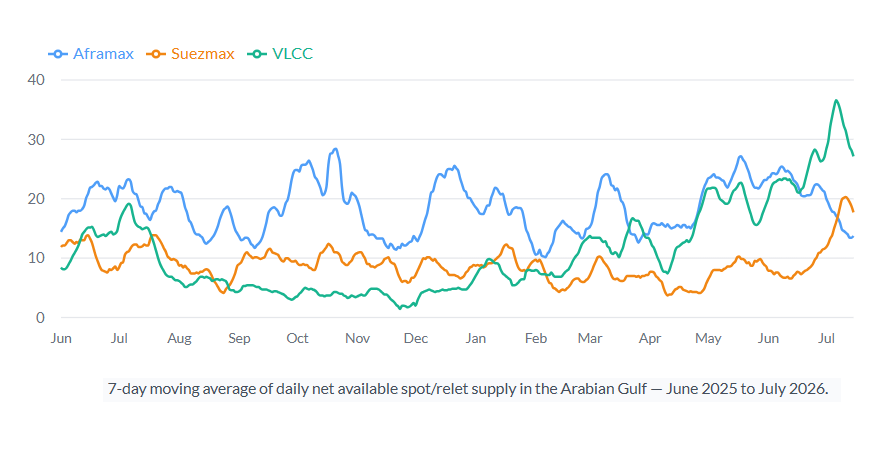
*Figure 4a.7-day moving average of daily net available spot/relet supply in the Arabian Gulf, June 2025–July 2026.Spot/relet availability: Signal Ocean Platform*

A year-on-year comparison over the same 1 June–16 July window shows average daily VLCC net supply rising from 14.5 vessels in 2025 to 26.9 in 2026, with the peak available count up from 23 to 39 vessels. Aframax net supply was little changed on average — 20.1 vessels in 2025 versus 20.0 in 2026 (peak 32 vs 28). Suezmax averages also moved only slightly (11.2 vs 11.6), though its peak availability rose from 17 to 24 vessels.

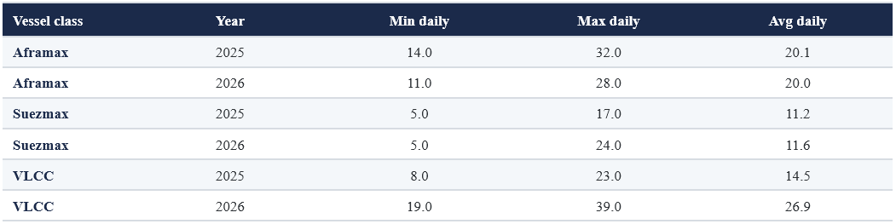
*Figure 4b.Net available spot/relet supply, 1 June–16 July, year-on-year comparison by vessel class.Spot/relet availability: Signal Ocean Platform*

Net spot/relet supply (7d MA):  VLCC low <2 (Nov '25) → high 36+ (early Jul '26) · Jun 1-Jul 16 avg 14.5→26.9 vessels y/y

## Freight Market — AG–China vs. USG–China

The VLCC time-charter-equivalent differential between the AG–China benchmark (TD3C) and the USG–China route (TD22) moved from -$24,423/day in early January 2026 — its 52-week low — to a 52-week high of $490,824/day on 16 March 2026, as the strikes resumed. It has since traded mostly in a $150,000–$400,000/day range, last printing $260,369/day (a 3.4x ratio) on 15 July. Monthly averages show the same pattern: -$1,420/day in January 2026, +$271,692/day in March, a peak of +$332,104/day in April, and +$215,256/day in July.

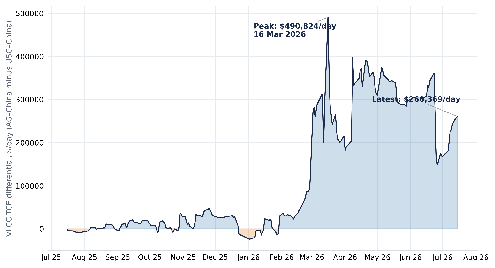
*Figure 5.VLCC TCE differential, AG–China (TD3C) minus USG–China (TD22), daily, July 2025–July 2026.Freight and TCE data: Signal Ocean Platform / Baltic Exchange route benchmarks*

TD3C–TD22 VLCC TCE differential:52-wk high $490,824/day (16 Mar '26) · 52-wk low -$24,423/day · latest $260,369/day (ratio 3.4x)

## Tonne-Miles — Saudi Arabia vs.USG to China

Dirty tonne-miles on the Saudi Arabia–China (VLCC, Suezmax and Aframax combined) opened 2026 in line with prior years, at 41.4bn in January, before falling to 19.6bn in May, the lowest May reading in the three-year series, and recovering to 23.0bn in June.

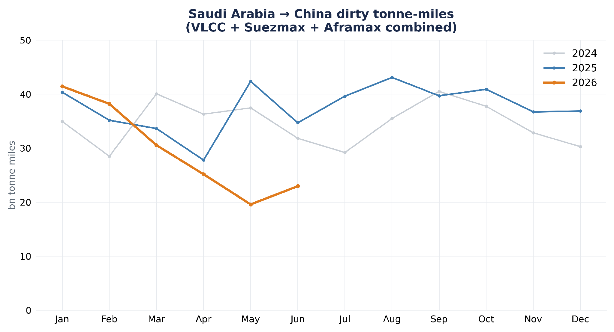
*Figure 6a.Monthly dirty tonne-miles, VLCC+Suezmax+Aframax, Saudi Arabia–China, by load year.AXSMarine*

On the US–China, tonne-miles had fallen from a 2023 high of 65.0bn (April 2023) to a low range of roughly 2–9bn per month through 2025 and early 2026, before rising to 41.5bn in June 2026, the strongest reading since 2023 and the highest June figure in the series, behind only April 2023 (65.0bn) and March 2023 (41.9bn).

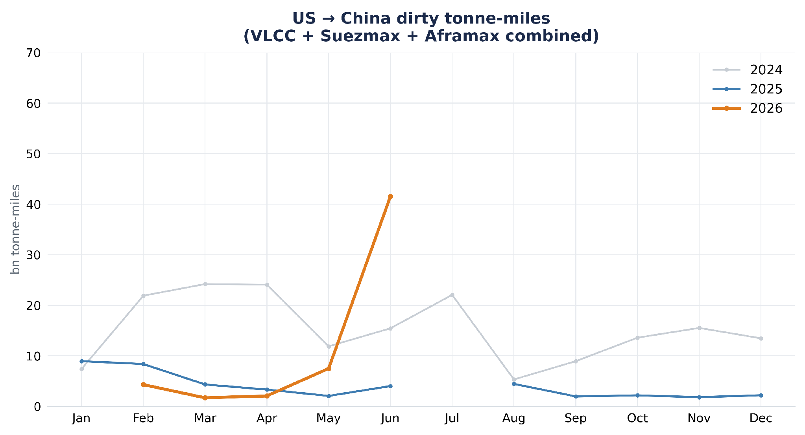
*Figure 6a.Monthly dirty tonne-miles, VLCC+Suezmax+Aframax, Saudi Arabia–China, by load year.AXSMarine*

Tonne-miles (VLCC+Suez+Aframax):Saudi Arabia→China: May '26 19.6bn, Jun '26 23.0bn · US→China: Jun '26 41.5bn (vs 2-8bn Jan-May '26)

## Strait of Hormuz Crossings — Ownership Transparency Through the MoU Cycle

AXSMarine crossing records for the Strait of Hormuz capture 759 tanker passages between 27 February and 15 July 2026, spanning the pre-agreement war phase, the Islamabad Memorandum of Understanding signed on 17 June, and the renewed escalation that began when Iran resumed attacks on commercial tankers in the Strait on 6–7 July. The ownership and transit profile of these crossings tracks the diplomatic cycle closely.

Through the pre-MoU war phase (to 16 June, 329 crossings), only 36% of passages were operated by transparently named owners; the remainder were sanctioned or ghost-fleet tonnage (43%) or vessels of opaque ownership (21%). The 60-day safe-passage window opened by the MoU reversed this: during 17 June–5 July (326 crossings), transparent named ownership rose to 67% as mainstream commercial operators returned to the Strait, and the combined sanctioned/opaque share fell to 33% from 61% pre-MoU war phase.

The pattern snapped back once Iran resumed attacks on commercial shipping on 6–7 July, prompting Washington to declare the 60-day ceasefire over on 8 July. Across the 104 crossings recorded from 6 July onward, transparent named ownership fell to 45% and sanctioned/ghost tonnage rose to 39% from 22% during the reopening phase. Of these 104 crossings, 103 carried at least one risk marker, opaque or sanctioned ownership, a dark (AIS-off) transit, or routing on the Iranian side of the Strait rather than the standard Omani traffic lane. Only one passage was fully conventional, a Singapore-owned chemical tanker on 6 July, named owner, AIS-on and on the Omani lane. Half (50%) transited dark, and 63 of 104 tracked the Iranian side.

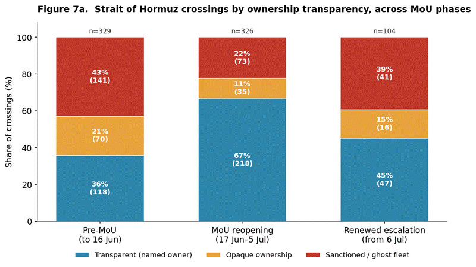
*Figure 7a.Strait of Hormuz crossings by ownership transparency across the three MoU phases; n=759.Strait of Hormuz crossings: AXSMarine · data as of 15 July 2026*

By cargo type, the reopening of the Strait shifted crossings back towards a more balanced mix of crude and clean tankers. Crude carriers (VLCC, Suezmax and Aframax) accounted for 25% of crossings during the war phase, rising to 44% under the MoU and 49% following 6 July. During the renewed escalation, crude tankers represented 51 of the 104 recorded crossings, led overwhelmingly by VLCCs with 41 transits, compared with five Suezmax and three Aframax vessels. The remaining 53 crossings comprised clean, chemical, and product tankers.

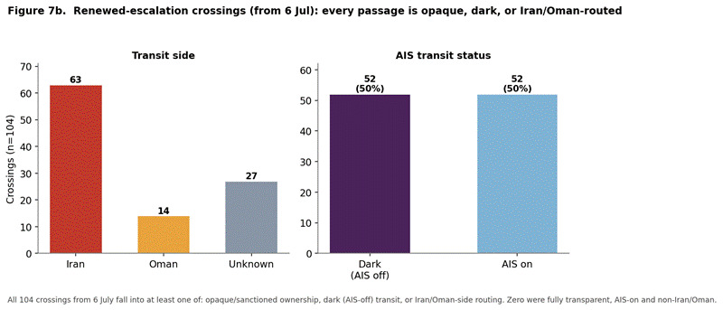
*Figure 7b.Renewed-escalation crossings (from 6 Jul, n=104): transit side and AIS status.Strait of Hormuz crossings: AXSMarine · data as of 15 July 2026*

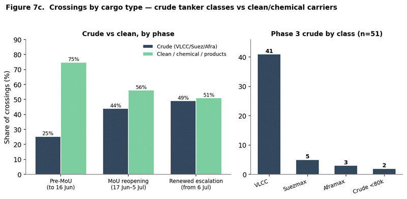
*Figure 7c.Crossings by cargo type — crude tanker classes vs clean/chemical carriers, by phase.Strait of Hormuz crossings: AXSMarine · data as of 15 July 2026*

‍Strait crossings (AXSMarine):Transparent-owner share — war 36% · MoU 67% · from 6 Jul 45%  ·  From 6 Jul: 100% opaque, dark or Iran/Oman-routed, 50% dark  ·  Crude 49% (VLCC 41 of 51)

## Outlook

The balance between the Arabian Gulf and the Atlantic Basin changed during 2026. Although the AG–China freight premium over USG–China has narrowed from its March peak, it remains well above the negative levels seen at the start of the year, indicating that Gulf freight continues to reflect geopolitical risk despite the recovery in vessel availability. At the same time, the ownership profile of Hormuz transits suggests that mainstream commercial participation has not fully recovered following the renewed escalation, with a larger share of traffic again involving sanctioned, opaque or Iranian-side transits. Together, these developments point to a market in which Atlantic cargoes have become relatively more competitive for China-bound trade, while Gulf employment continues to command a geopolitical risk premium.

This update reflects observed Gulf fleet, positioning, freight, and trade-flow data only and does not constitute a forecast of future market conditions. Vessel count, position, and AIS draft-status data for the Arabian Gulf and the Strait of Hormuz are sourced fromAXSMarine; freight, ballaster and tonne-mile data are sourced fromthe Signal Ocean Platform.

For the latest updates and insights, make sure to visit theSignal Ocean Newsroompage &subscribe to weekly reports.

For subscription to our FREE weekly market trends email, please contact us: research@thesignalgroup.com

-Republishing is allowed with an active link to the source
