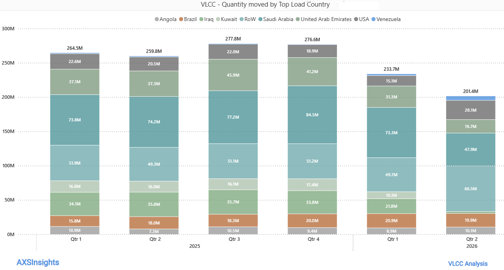
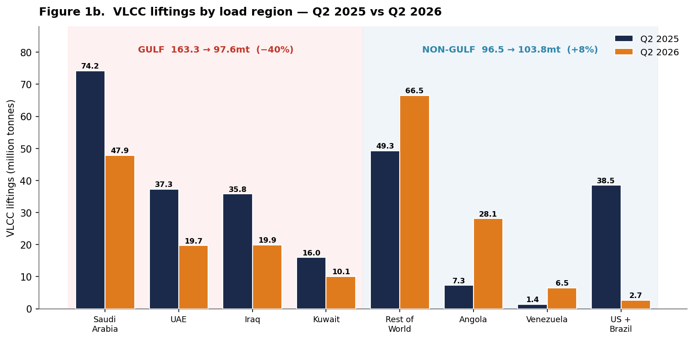
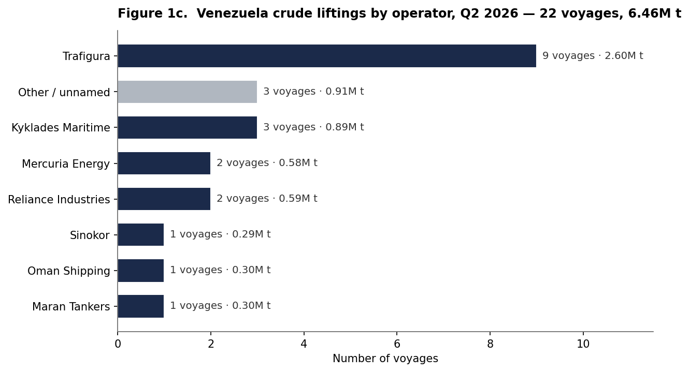
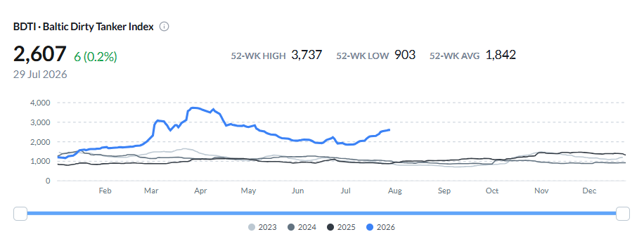
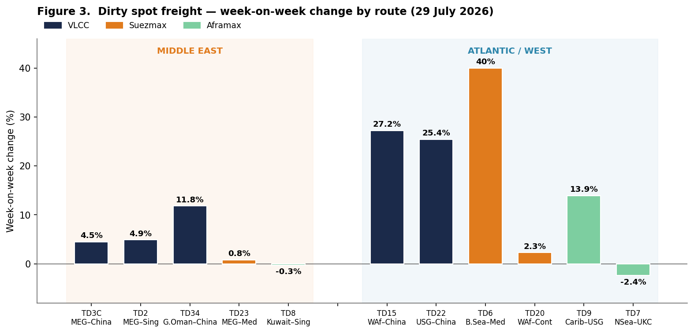
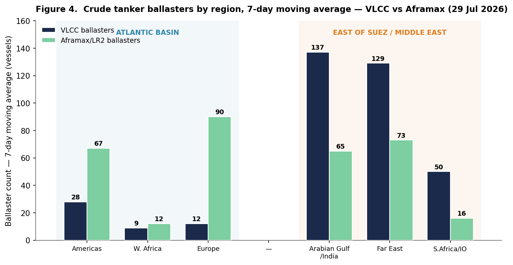
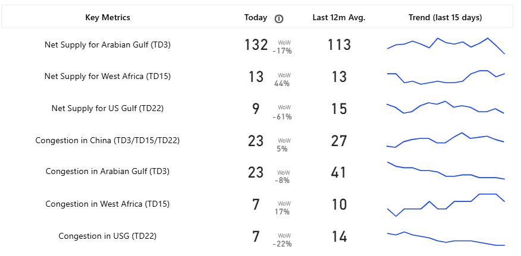
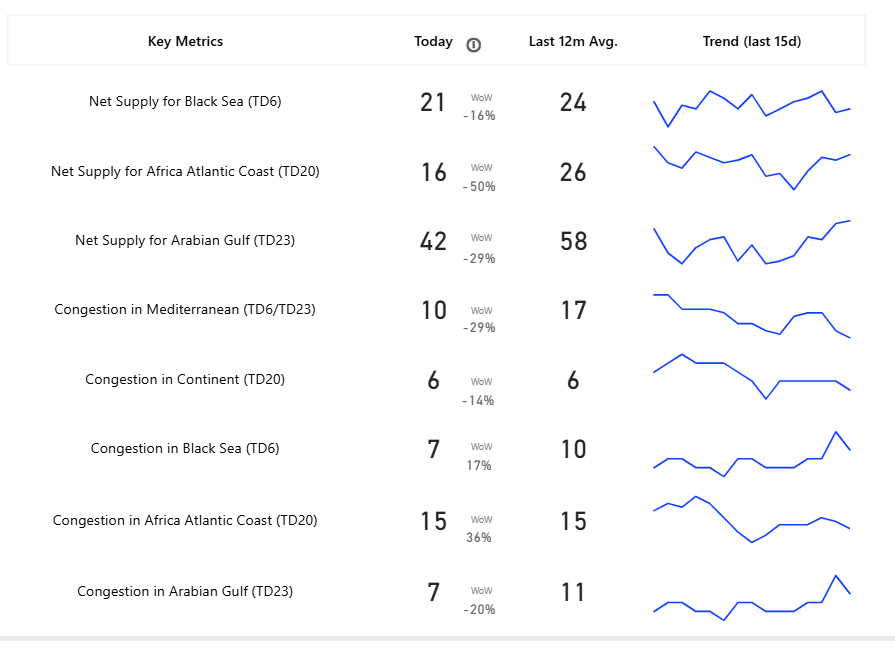
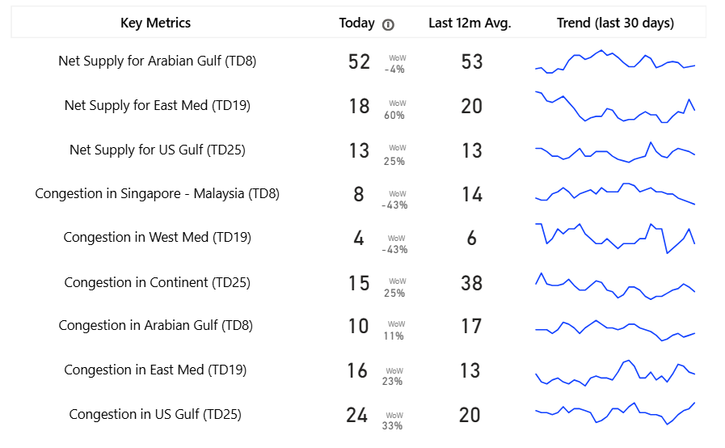

# Weekly Tanker Market Monitor: Week 31 2026

**Date**: July 31, 2026 | **Category**: Tankers | **Section**: Monitors | **Source**: [https://www.thesignalgroup.com/weekly-market-monitor/weekly-tanker-market-monitor-week-31-2026](https://www.thesignalgroup.com/weekly-market-monitor/weekly-tanker-market-monitor-week-31-2026)

---

## SPOTLIGHT OF THE WEEK

## Venezuela Steps In as the Hormuz Crisis Re-routes VLCC Trade Out of the Gulf

Throughout the first half of 2026, the crisis in the Strait of Hormuz has profoundly altered the global landscape of VLCC crude shipping. Evaluating quarterly liftings by primary loading countries reveals a continuous contraction in overall VLCC volumes, which dropped from 277.8 million tonnes in Q3 2025 to 233.7mt in Q1 2026, and further declined to 201.4mt in Q2 2026. This latest volume marks the lowest quarter in the observed data series (Q1 2025 - Q2 2026), representing a 22% reduction when compared to the 259.8mt logged in Q2 2025.

‍

*Figure 1a.VLCC crude liftings by top load country, quarterly, Q1 2025–Q2 2026 (million tonnes).VLCC voyage data:AXSMarine(AXSInsights)*

‍

The contraction was concentrated in the Middle East Gulf. Combined VLCC liftings from Saudi Arabia, the UAE, Iraq and Kuwait fell from 163.3 million tonnes in Q2 2025 to 97.6 million tonnes in Q2 2026, a 40% reduction. Saudi Arabia dropped to 47.9mt (from 74.2mt), the UAE nearly halved to 19.7mt (from 37.3mt), and Iraqi and Kuwaiti liftings fell to 19.9mt and 10.1mt, respectively (from 35.8mt and 16.0mt), as reliable Strait of Hormuz passage became harder to secure.

Non-Middle East Gulf origins absorbed the redirected demand, lifting their combined share even as total volumes fell. Angola jumped to 28.1mt (from 7.3mt), Rest-of-World volumes rose 35% to 66.5mt, and Venezuela climbed to 6.5mt (from 1.4mt). US Gulf and Brazilian VLCC liftings, by contrast, fell sharply to a combined ~3mt from 38.5mt a year earlier, shifting incremental VLCC demand towards West Africa, Venezuela and a more diversified group of alternative loading regions.

*Figure 1b.VLCC liftings by load region, Q2 2025 vs Q2 2026 (million tonnes).VLCC voyage data: AXSMarine*

‍

Venezuela recorded a marked increase in VLCC crude liftings during 2026. Volumes rose from 9 voyages (2.63mt) in Q1 to 22 voyages (6.46mt) in Q2, with the number of sailings more than doubling and the average cargo size reaching approximately 294kt per voyage. Identifiable operators accounted for 19 of the 22 Q2 voyages, representing 5.55mt of cargo. Trafigura was associated with 9 voyages (2.60 mt), followed by Greece's Kyklades Maritime with 3 voyages, while India's Reliance Industries and Mercuria were each linked to 2 voyages. Single voyages were associated with Maran Tankers, Oman Shipping and Korea's Sinokor.

*Figure 1c.Venezuela crude liftings by operator, Q2 2026 — 22 voyages, 6.46M t.Voyage data: AXSMarine*

‍

VLCC liftings, Q2 2026 vs Q2 2025:  Total 201.4mt (-22%)  ·  Middle East Gulf 97.6mt (-40%)  ·  Angola 28.1mt (from 7.3)  ·  RoW 66.5mt (+35%)  ·  Venezuela 6.5mt (22 voyages)

## Strait of Hormuz: Where Things Stand (30 July)

Negotiationsover the future transit framework for the Strait of Hormuz remain ongoing. Alongside Iran–Oman discussions on the operational management of commercial shipping, Pakistan has confirmed that parallel US–Iran talks under the Islamabad Memorandum of Understanding are continuing. The principal outstanding issues include the routing of inbound and outbound commercial traffic, the governance of the transit corridors, and a Gulf-backed proposal under which vessels would make voluntary contributions to fund navigational, search-and-rescue and environmental services, modelled on the Strait of Malacca. Iran has not accepted the proposal and continues to advocate a greater supervisory role over the waterway. For the tanker market, Gulf-loading VLCC volumes remain below pre-conflict levels, while geopolitical and insurance-related costs continue to support elevated freight risk until a more durable transit arrangement is agreed.

Strait of Hormuz (29 Jul):  Temporary transit framework still under negotiation · key issues remain routing, corridor governance and voluntary navigation contributions

## Dirty Freight — BDTI and Benchmark Spot Rates

The Baltic Dirty Tanker Index stands at 2,607 on 29 July, up roughly 9% (207 points) over the week but still below the 3,737 crisis peak of March–April 2026; the 52-week range is 903–3,737, average 1,842. Rates remain historically elevated, with the 2026 index tracking far above its 2023–2025 profile.

*Figure 2.Baltic Dirty Tanker Index(BDTI), 2023–2026; latest 2,607 on 29 July 2026.Index: Baltic Exchange via Signal Ocean*

The week's gains are overwhelmingly in the Atlantic. Among the Suezmaxes, Black Sea–Med (TD6) jumped 40% week-on-week to WS 430; on the VLCCs, West Africa–China (TD15, WS 149) rose 27% and US Gulf–China (TD22) 25%, while the Caribbean Aframax route (TD9, WS 427) gained 14%. Middle East benchmarks were comparatively flat: VLCC AG–China (TD3C) firmed just 4.5% to WS 404 and AG–Singapore (TD2) 4.9% to WS 397, Suezmax AG–Med (TD23, WS 476) added under 1%, and Aframax Kuwait–Singapore (TD8, WS 305) slipped 0.3%. The one Middle East mover was the longer Gulf of Oman–China VLCC route (TD34, +11.8%).

*Figure 3.Dirty spot freight — week-on-week change by benchmark route (to 29 July 2026).Freight/TCE data: Signal Ocean Platform / Baltic Exchange*

‍

Dirty spot (WoW):  BDTI 2,607 (+9%)  ·  Atlantic — Suezmax TD6 WS430 (+40%), VLCC TD15 (+27%) / TD22 (+25%), Aframax TD9 (+14%)  ·  Middle East — VLCC TD3C WS404 (+4.5%), Suezmax TD23 (+0.8%)

## Ballasters — Atlantic vs Middle East Concentration

On a 7-day moving-average basis, VLCC ballasters remain overwhelmingly concentrated east of Suez: 137 in the Arabian Gulf/India (up 10% w/w) and 129 in the Far East (up 9%), against just 49 across the entire Atlantic basin: 28 in the Americas (up 33%), 12 in Europe and 9 in West Africa. The heavy Middle East Gulf ballaster average reflects large tonnage repositioning empty toward Middle East loading even as liftings there have fallen. The Aframax/LR2 picture is the mirror image: ballasters (also 7-day moving average) concentrate in the Atlantic and Europe (90 in Europe, 67 in the Americas) versus 65 in the Gulf.

*Figure 4.Crude tanker ballasters by region, 7-day moving average — VLCC vs Aframax/LR2, 29 July 2026.Ballaster tracking: Signal Ocean Platform*

‍

Ballasters (29 Jul):  7-day MA · VLCC — AG/India 137 (+10%), Far East 129 (+9%), Atlantic 49 total  ·  Aframax — Europe 90, Americas 67, AG 65

## Net Supply — Key Metrics

VLCC net available (spot/relet) supply in the Arabian Gulf reads 132 vessels, down 17% week-on-week but still above its 12-month average of 113, an abundant length against subdued Gulf demand. West Africa net supply is thin at 13 (up 44% w/w) and the US Gulf at just 9 (down 61% w/w), showing how quickly Atlantic tonnage is being absorbed. Gulf congestion has eased to 23 vessels, well below its 41-vessel average.

*Figure 5a.VLCCnet-supply and congestion key metrics — spot/relet vessel counts (today vs 12-month average, with week-on-week change).Signal Ocean Platform*

‍

Availability in the Suezmax segment has tightened significantly, aligning with the sharp move in TD6 rates. This comes as Arabian Gulf net supply (TD23) dropped by 29% week-on-week to 42 vessels, well below its 12-month average of 58. Additionally, supply on the Africa Atlantic Coast (TD20) was halved to 16 vessels, while Black Sea (TD6) availability eased to 21.

*Figure 5b.Suezmaxnet-supply and congestion key metrics — spot/relet vessel counts (today vs 12-month average, with week-on-week change). Signal Ocean Platform*

Within the Arabian Gulf (TD8), Aframax vessel availability declined by 4% week-on-week to 52 ships, aligning closely with its 12-month average of 53. In contrast, the East Med (TD19) experienced a 60% week-on-week surge in supply, reaching 18 vessels, while the US Gulf (TD25) recorded 13 ships. Concurrently, congestion in the Continent dropped significantly to just 15 vessels, well below the historical average of 38, thereby releasing Atlantic Aframax tonnage back into the active market.

*Figure 5c.Aframaxnet-supply and congestion key metrics — spot/relet vessel counts (today vs 12-month average, with week-on-week change). Signal Ocean Platform*

Net supply (WoW):  VLCC — AG 132 (-17%), W.Africa 13 (+44%), US Gulf 9 (-61%)  ·  Suezmax — AG 42 (-29%), Africa Atlantic 16 (-50%), Black Sea 21 (-16%)  ·  Aframax — AG 52 (-4%), East Med 18 (+60%), US Gulf 13 (+25%)

## Outlook

Beyond the immediate geopolitical developments, this week's data highlights how quickly VLCC trading patterns can adjust when a major export region is disrupted. Changes in cargo sourcing, vessel positioning and regional fleet balances have become increasingly interconnected, with freight reflecting not only cargo demand but also where ships are available to load. The durability of these changes will ultimately depend on the recovery of Gulf export activity and the extent to which replacement Atlantic cargoes remain part of the trading pattern.

This update reflects observed fleet, positioning, freight and trade-flow data only and does not constitute a forecast of future market conditions. VLCC and Suezmax voyage, net-supply, ballaster, congestion and freight data are sourced from AXSMarine and the Signal Ocean Platform; the Baltic Dirty Tanker Index and benchmark route assessments are sourced from the Baltic Exchange. Data as of Wednesday, 29 July 2026.

For the latest updates and insights, make sure to visit theSignal Ocean Newsroompage &subscribe to weekly reports.

For subscription to our FREE weekly market trends email, please contact us: research@thesignalgroup.com

-Republishing is allowed with an active link to the source
