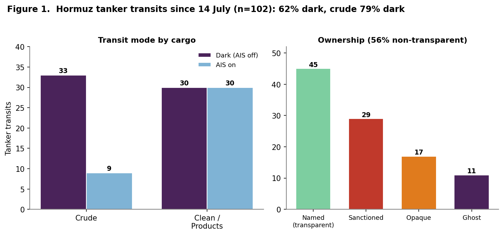
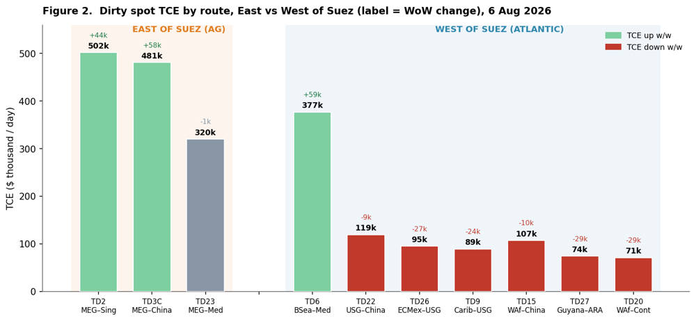
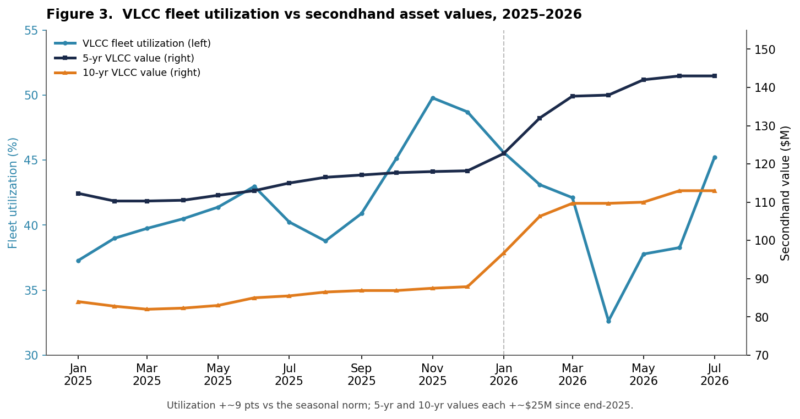
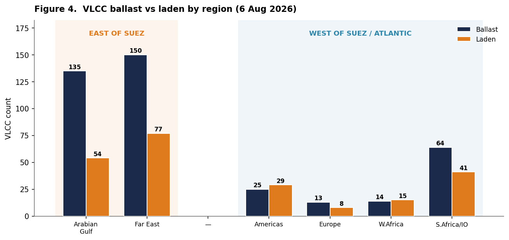
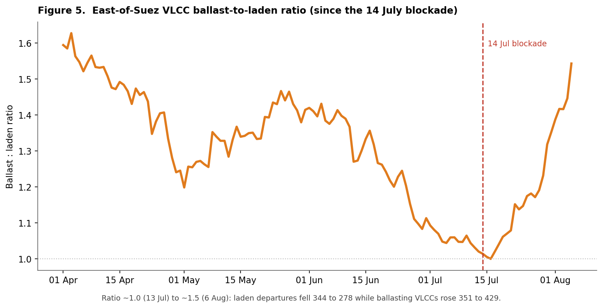

# Weekly Tanker Market Monitor: Week 32 2026

**Date**: August 7, 2026 | **Category**: Tankers | **Section**: Monitors | **Source**: [https://www.thesignalgroup.com/weekly-market-monitor/weekly-tanker-market-monitor-week-32-2026](https://www.thesignalgroup.com/weekly-market-monitor/weekly-tanker-market-monitor-week-32-2026)

---

## SPOTLIGHT OF THE WEEK

## Dark Tanker Transits Dominate Hormuz Since 14 July

Since the renewed naval blockade of the Strait of Hormuz took effect on 14 July, 102 tanker transits have been recorded. Nearly two-thirds (62%) crossed with AIS switched off, while 38% continued transmitting a position signal, making dark transits the prevailing operating pattern. The contrast is most pronounced in the crude trade, where 79% of crude tankers (33 of 42) transited without AIS, compared with 50% (30 of 60) of clean petroleum and product tankers, highlighting that AIS-off transits are substantially more common among crude carriers.

Of all transits, 56% were operated by non-transparent interests, comprising 29 sanctioned fleet vessels, 17 under opaque ownership and 11 ghost fleet vessels, while 44% were controlled by named, transparent owners. East-to-west crossings totalled 55, compared with 47 in the opposite direction, indicating traffic volumes in both directions. However, vessel routing was concentrated along the Iranian side of the Strait, where 45 transits were identified, while only four were confirmed on the Omani lane. The remaining 53 crossings could not be verified because AIS transmissions were unavailable for much or all of the passage.

*Figure 1.Hormuz tanker transits since 14 July (n=102) - transit mode by cargo, and ownership.*

Transit tracking: The Signal Group · data to 3 Aug 2026

## Hormuz transits since 14 Jul:  102 total  ·  62% dark (crude 79% vs clean 50%)  ·  56% non-transparent ownership · 45 Iran-side / 4 Oman-side / 53 untraceable

## Iran–Oman Route Agreement - Not Yet a Pathway

On 5 August, Iran announced that it had reached an understanding with Oman on the geographic coordinates of a proposed shipping corridor through the Strait of Hormuz, with inbound traffic routed along the Iranian side and outbound traffic along the Omani side. According to Iranian officials, a joint statement covering the technical, legal, security and environmental framework is being finalised. However, the proposed routing arrangements and any associated service fee mechanism remain unconfirmed and continue to face significant legal and commercial obstacles.

The proposal does not, by itself, point to a near-term increase in commercial vessel traffic. The United States has publicly opposed any transit fees, while the International Maritime Organization has maintained that international law provides no basis for discriminatory transit charges in the Strait of Hormuz. Adding to the uncertainty, an Iranian parliamentary committee is reviewing a preliminary bill that would prohibit U.S., Israeli and other "hostile" vessels from transiting the Strait and impose fines of up to 20% of cargo value for violations. The draft legislation remains under expert review and has not been adopted. Taken together, these developments suggest that the regulatory and legal environment for commercial shipping through the Strait remains uncertain, limiting the prospects for a meaningful recovery in vessel transits until greater clarity emerges.

## Iran–Oman route (5-6 Aug): Proposed routing remains unconfirmed • US opposes transit fees, IMO rejects tolls • no clear path to a sustained recovery in commercial transits.

## Freight - East vs West of Suez

As of 6 August, the East–West earnings gap remained pronounced.Arabian Gulf export routes continued to post the highest returns, with MEG–China (TD3C) at about$481k/day, up$58kWoW, and MEG–Singapore (TD2) at around$502,000/day, up$44k. MEG–Med Suezmax (TD23) was almost unchanged at about$320k/day. Across the Atlantic basin, most benchmark routes eased over the week, while the Black Sea–Mediterranean Suezmax route (TD6) was the only major route to strengthen, reaching about$377k/day(+$59k). US Gulf–China (TD22) stood at about$119k/day(−$9k), West Africa–China (TD15) at$107k/day(−$10k), Caribbean and East Coast Mexico Aframaxes at$89–95k/day(−$24kto −$27k), and West Africa and Guyana Suezmaxes (TD20, TD27) at$71–74k/day(−$29k).

*Figure 2.Dirty spot TCE by benchmark route, East vs West of Suez (label shows week-on-week change).*

Freight/TCE: The Signal Group / Baltic Exchange · 6 Aug 2026

## Dirty TCE ($/day):  East of Suez — TD3C 481k (+58k), TD2 502k (+44k), TD23 320k  ·  West — TD22 119k (-9k), TD15 107k (-10k), TD27 74k (-29k), Caribbean Aframax ~89k (-24k)

## VLCC Fleet Utilization and Asset Values

VLCC fleet utilisation followed two distinct phases in 2026. After remaining within a 42–46% range during the first quarter, utilisation weakened through the second quarter, reaching a year-to-date low of 32% in mid-April. It then recovered to 48.4% by 21 July, the highest reading of the year and around nine percentage points above both the three-year seasonal average (39%) and the equivalent level in 2025 (39%). The July recovery stands in contrast to the earlier weakness and marks the strongest utilisation levels recorded this year.

Asset values followed a different trajectory. Nearly 80% of this year's appreciation had already been recorded by March, well before fleet utilisation reached its July high. Five-year-old VLCC values increased from $118 million at end-2025 to $138 million by March and have since edged higher to around $143 million, while ten-year-old values rose from $88 million to $110 million before reaching about $113 million. The stronger appreciation in older tonnage (+29% versus +21% for five-year-old vessels) narrowed the price gap between five and ten-year-old VLCCs from around $30 million at end-2025 to approximately $26 million during February and March. From April onwards the differential widened steadily, returning to around $30 million by July after recording a narrower gap before the end of the first quarter.

*Figure 3.VLCC fleet utilization vs 5-yr and 10-yr secondhand asset values, 2025–2026 (monthly).Fleet & asset data: The Signal Group*

## VLCC fleet:  Ttilization 48.4% (vs 39% 3Y avg.) • 5Y $143M / 10Y $113M • 5Y +21%, 10Y +28% • 5Y–10Y gap back to ~$30M (from ~$26M in Q1)

## Ballast vs Laden - East vs West of Suez

Thelargest concentrationof VLCC ballasters remains east of Suez, with 150 vessels in the Far East and 135 in the Arabian Gulf, compared with a combined 52 across the Americas (25), West Africa (14) and Europe (13).Ballastvessels also outnumberladenships by 96% in the Far East (150 vs 77) and by 150% in the Arabian Gulf (135 vs 54), underlining the much heavier ballast presence in the eastern basin. West of Suez, fleet balances are considerably closer, with the Americas (25 vs 29) and West Africa (14 vs 15) near parity, while South Africa/Indian Ocean is the largest western concentration at 64 ballast vessels against 41 laden.

*Figure 4.VLCC ballast vs laden vessel counts by region, East vs West of Suez.Source: Signal Group · 6 Aug 2026*

The East of Suez ballast to laden ratio reversed sharply after 14 July, rising from about 1.0 to 1.5 by 6 August. Laden VLCCs declined from 344 to 278, while ballasters increased from 351 to 429. Although the ratio had previously reached similar levels in early April, the move since mid-July stands out for its speed, reversing the lower readings seen through late June and early July.

*Figure 5.East-of-Suez VLCC ballast-to-laden ratio, since the 14 July blockade.Source: The Signal Group*

## Ballast : laden (VLCC):  East of Suez B/L ratio 1.0 (14 Jul) → 1.5 (6 Aug) • Back to early-April levels after reaching near parity in mid-July.

## Takeaway

Three weeks after the renewed blockade, the market continues to exhibit three distinct characteristics: reduced transparency in crude movements through Hormuz, a sustained earnings premium on Arabian Gulf export routes and secondhand VLCC values that continue to hold close to their first-quarter gains. At the same time, the increase in the East of Suez ballast-to-laden ratio from around 1.0 to 1.5 indicates that vessel availability has increased more quickly than laden employment in the region. Rather than pointing to a normalisation in trading conditions, the combined evidence suggests that the VLCC market has adapted to a different operating environment, where fleet positioning, freight pricing and vessel deployment continue to reflect the disruption.

This analysis is based on observed market data and reflects conditions as of Thursday, 6 August 2026. Fleet, transit, positioning, ballast, utilisation and secondhand asset-value data are sourced from the Signal Ocean Platform and AXSMarine. Freight benchmarks (TCE assessments) are sourced from the Baltic Exchange. The analysis is intended for market information purposes only and should not be interpreted as a forecast of future market conditions.

For the latest updates and insights, make sure to visit theSignal Ocean Newsroompage &subscribe to weekly reports.

For subscription to our FREE weekly market trends email, please contact us: research@thesignalgroup.com

-Republishing is allowed with an active link to the source
