# Weekly Tanker Market Monitor: Week 52, 2025

**Date**: December 31, 2025 | **Category**: Tankers | **Section**: Monitors | **Source**: [https://www.thesignalgroup.com/weekly-market-monitor/weekly-tanker-market-monitor-week-52-2025](https://www.thesignalgroup.com/weekly-market-monitor/weekly-tanker-market-monitor-week-52-2025)

---

## Freight Fundamentals & Market Momentum

Ballast positioning | Supply Vs Cargo Demand | Tonne-day dynamics

Spotlight |Dirty vs. Clean tanker freight sentiment

- Tanker freight markets continue to diverge, with dirty segments losing momentum, while clean markets retain a firmer undertone.

## DirtyFreightMarket Sentiment

VLCCMEG- ChinaWeaker

‍

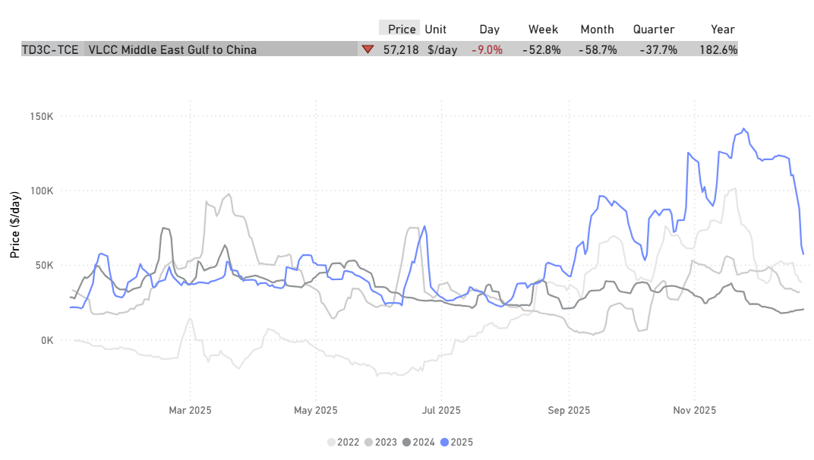
*Signal Figure*

(Last update December 24th)

‍

SuezmaxBlack Sea - MedFirmer

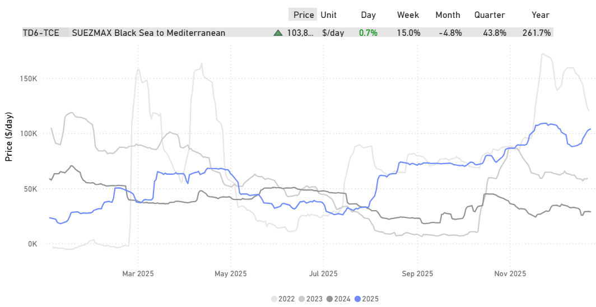
*Signal Figure*

(Last update December 24th)

‍

AframaxCross MedWeaker

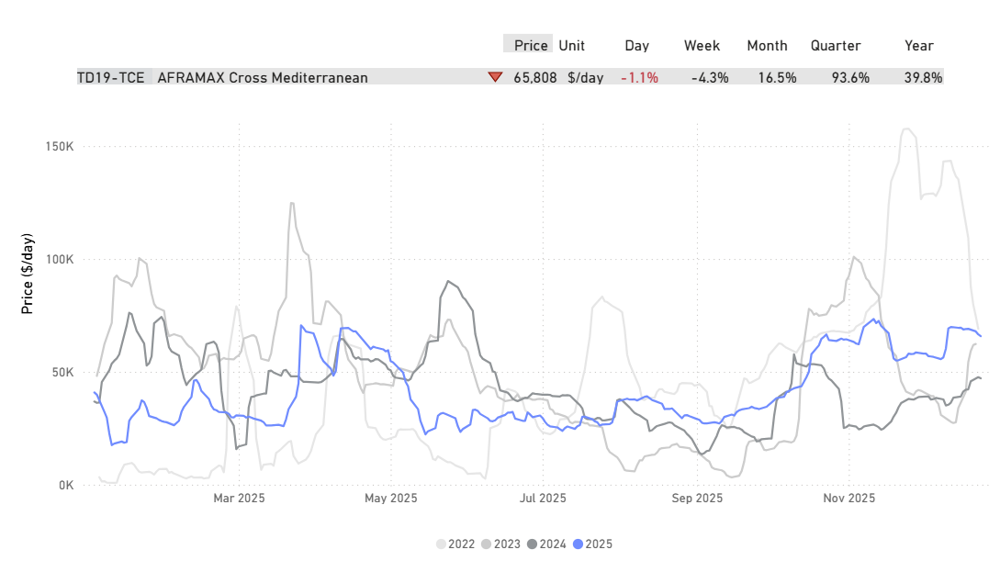
*Signal Figure*

(Last update December 24th)

‍

CleanFreightMarket Sentiment

‍

MRSikka - JapanFirmer

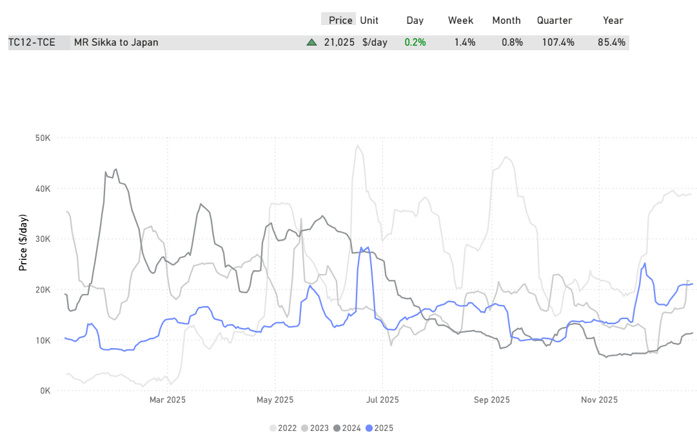
*Signal Figure*

‍

(Last update December 24th)

‍

LR2MEG - JapanSteady

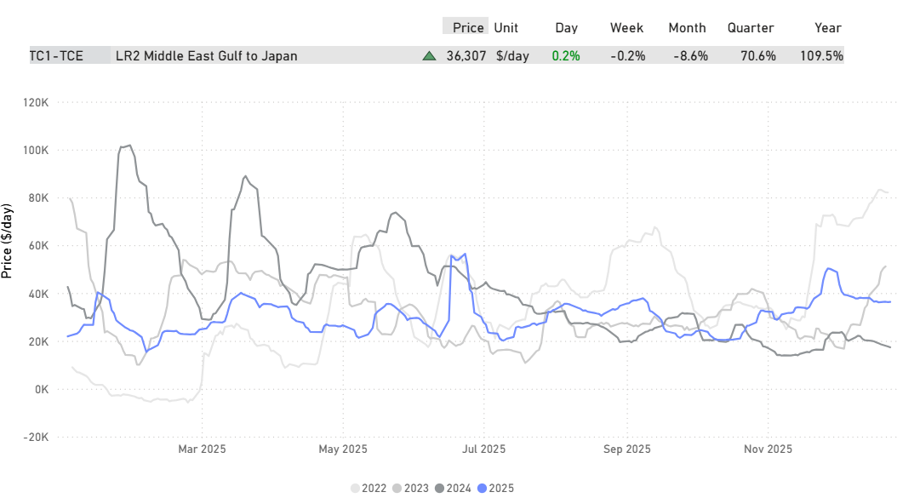
*Signal Figure*

(Last update December 24th)

‍

## Dirty Market Signals(WS | Ballast Positioning | Demand Volumes)

- What current fundamentals imply for the days ahead‍

VLCCWeaker

SignalAssessmentOverview

‍

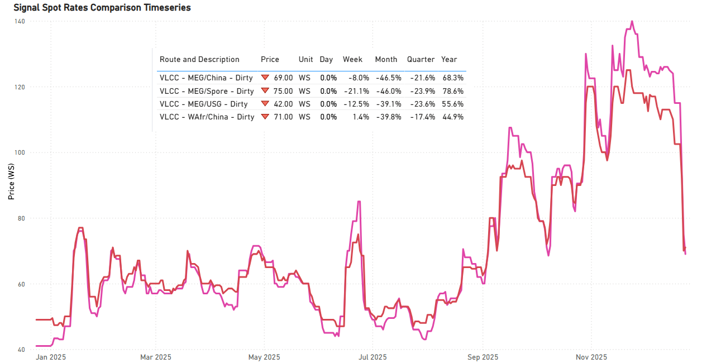
*Signal Figure*

‍

## Ballasters| AG & WAFRSupplyBuilding

Bearish for near-term freight

‍

- An increase in VLCC ballast availability in AG and West Africa is weighing on freight momentum into year-end, keeping rates under pressure in the near term.

‍

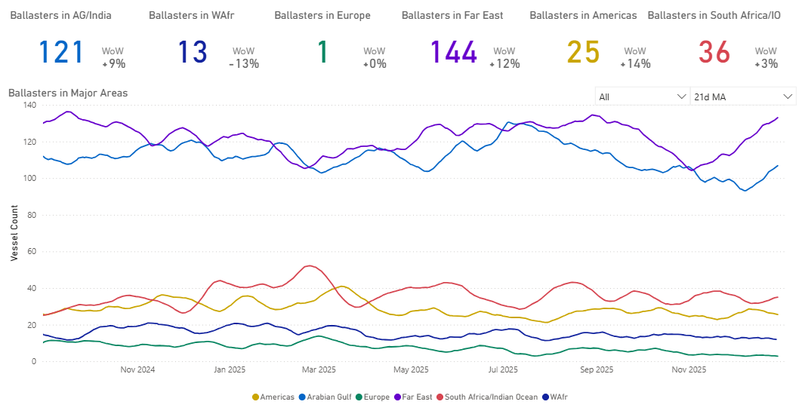
*Signal Figure*

‍

Gross Supply Vs Cargo Demand |TD3 & TD15

- The primary concern for the VLCC market approaching year-end is the noticeable disparity between the gross vessel supply and the anticipated cargo demand. Forward curves indicate that the rate of supply growth is expected to outpace demand in the coming weeks, particularly on the TD3C and TD15 routes.

‍

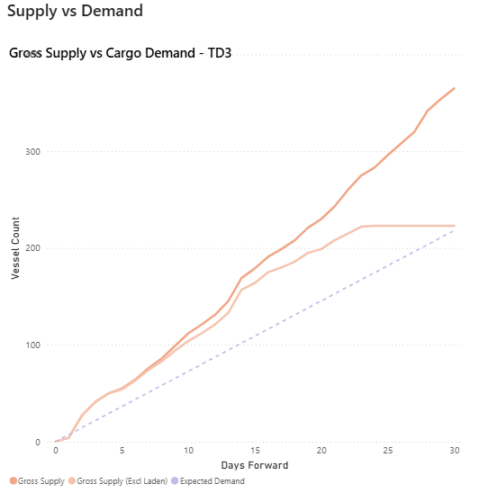
*Signal Figure*

‍

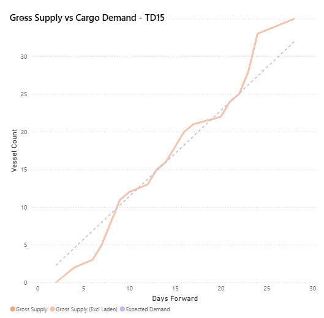
*Signal Figure*

‍

## Demand (Volume Loaded) | TD3C

Lack of incremental volume growth caps freight support

- TD3C loaded volumes are tracking close to the long-term benchmark (~14.0 mbbl). With 2025 activity yet to show meaningful incremental volume growth, and tonne-day generation gradually easing as voyage durations normalise, the scope for sustained upward pressure on freight rates appears limited.

‍

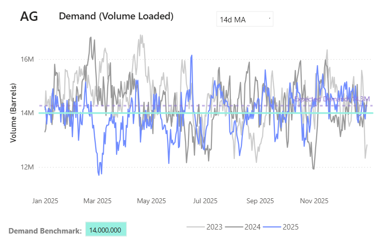
*Signal Figure*

‍

## VLCCTonneDays | AG to Far East

Momentum fading after recent highs

- VLCC tonne-days peaked earlier in the quarter and, while still at relatively high levels, have moderated in recent weeks. This easing in momentum has coincided with a softer rate environment toward year-end.

‍

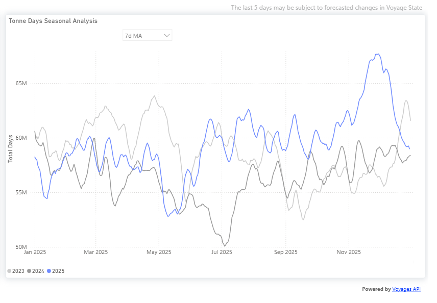
*Signal Figure*

‍

## Firmer Tonne-Day Trends | Dirty Aframax & Clean MR

- In Dirty Aframax and Clean MR, elevated tonne-days point to improving utilisation and a healthier market balance heading into year-end.

‍

DIRTY AFRAMAX

‍

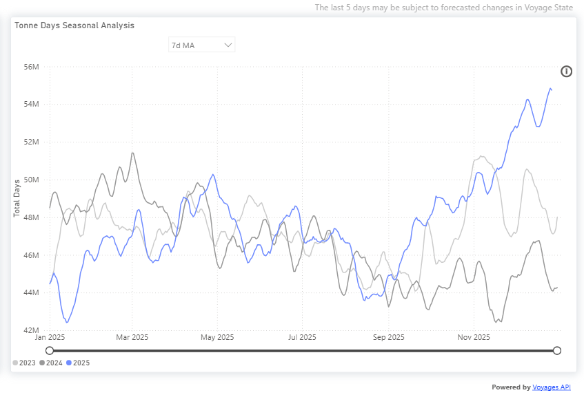
*Signal Figure*

‍

CLEAN MR

‍

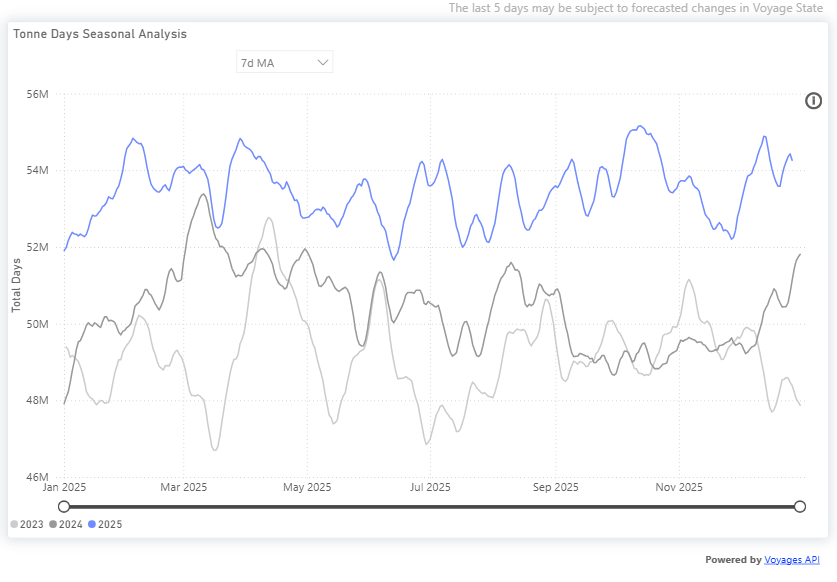
*Signal Figure*

## Takeaway

- As the year draws to a close, tanker markets are becoming more differentiated. VLCCs are facing near-term pressure amid rising supply and moderating tonne-day momentum, while clean and mid-size segments appear to show fewer signs of near-term softening.

‍

For the latest updates and insights, make sure to visit theSignal Ocean Newsroompage &subscribe to weekly reports. Clickhere to request a demo. Click here to see theprevious dry bulk weeklyreport.

For subscription to our FREE weekly market trends email, please contact us: research@thesignalgroup.com

-Republishing is allowed with an active link to the source
