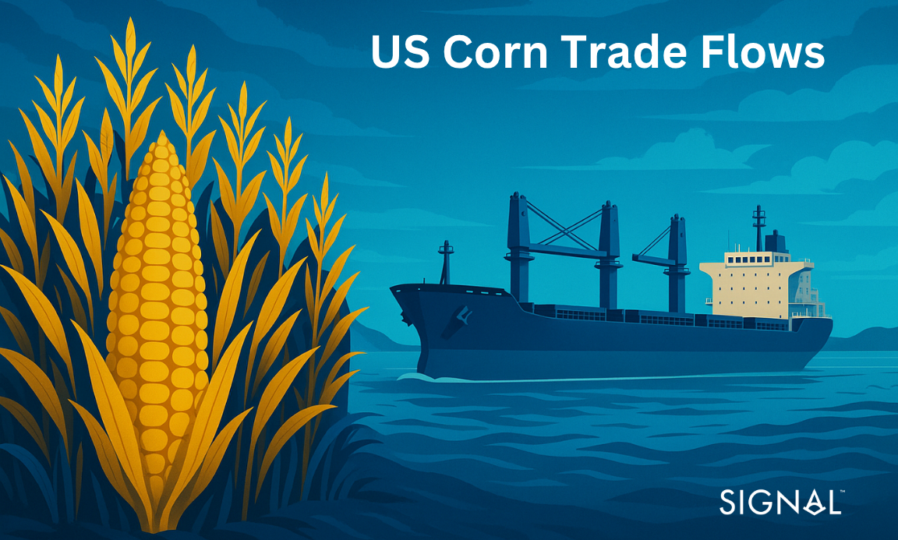
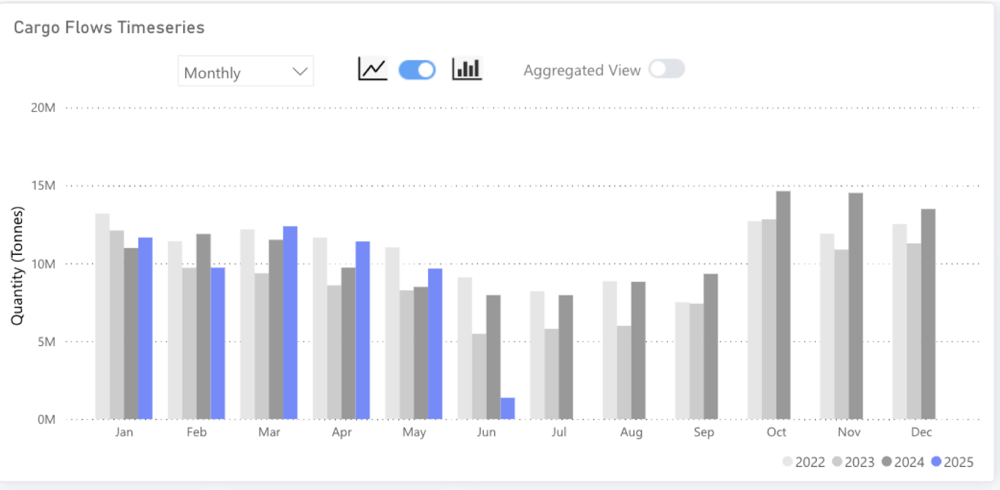
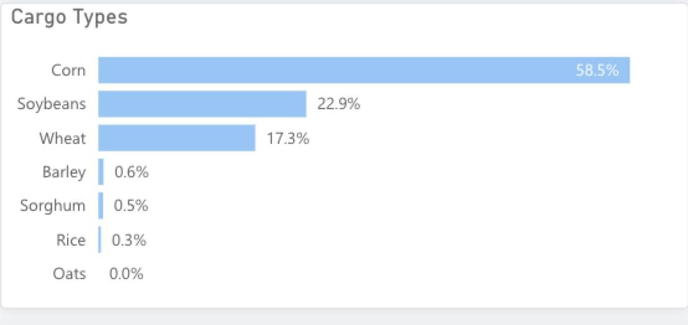
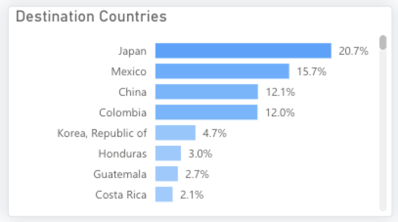
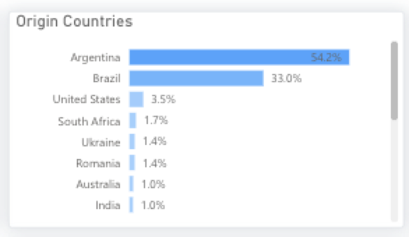

# Corn Cargo Exports: Trends, Price Fluctuations & Outlook

**Date**: June 10, 2025 | **Category**: Market Insights | **Section**: Newsroom | **Source**: [https://www.thesignalgroup.com/newsroom/a-kernel-of-truth-on-corn-trade-flows](https://www.thesignalgroup.com/newsroom/a-kernel-of-truth-on-corn-trade-flows)

---

## ‍Through our dry bulk flow tool, we have identified changing trends in the trade of corn. Similar to soybeans, both the U.S. and Brazil dominate the export market; however, unlike that market, the U.S. is seeing its exports strengthen. This report looks at whether the increase in U.S. corn exports is enough to make up for a much softer soybean export outlook in the globalcommodity tradinglandscape.

*Signal Figure*

‍

## U.S. corn production indicates exports are set to grow

Our recent insight highlightedthe declineinU.S. soybean exports as China looks to secure supply from Brazil.However, corn exports from the U.S. have been performing well, with 2025 Q1 figures indicating that exports could reach levels above those of 2022, 2023, and 2024.

As the largest U.S. dry bulk commodity export by tonnage, corn plays a pivotal role in shapingvessel demand from U.S. portsand the broader maritime trade environment.

Across millions of acres of land in the United States, corn is grown primarily in the Midwest, with Iowa and Illinois consistently ranking as the top corn-producing states. According to USDA data, these states produce the most corn, measured in billions of bushels, contributing significantly to the nation’s total production. The U.S. leads all countries in corn output, making it a key player in the world commodity market.

Corn production is vital to the U.S. economy, supporting agricultural income, exports, and related industries. Maize, the broader crop category, includes several main types grown in the U.S.: dent corn, flint corn, flour corn, sweet corn, popcorn, and pod corn. These varieties are used for animal feed, ethanol, food products, and even alcoholic beverages such as bourbon.

Approximately 30% of all Panamax vessel demand, 26% of Handysize demand, and 22% of Supramax demand are reliant on corn exports.

*U.S. corn exports from the Signal Ocean Platform (TSOP)Type image caption here (optional)*

Corn exports, therefore, lead those of soybeans in terms of tonnage but trail in terms of value. In 2023, corn exports accounted for 40% of U.S. agricultural commodity exports on a tonne basis. This grew to 45% in 2024, and so far in 2025, corn accounts for 59%. This tracks with general sentiment in the U.S. that corn will continue to provide better opportunities for profit as it remains more shielded from tariff retaliations than soybeans and also receives support through government policies like the Renewable Fuel Standards.

This policy maintains a minimum quantity of ethanol use in the country’s fuel supply each year. Ethanol production accounts for close to 40% of U.S. corn demand. As a result, farmers in the U.S. are planning to plant more corn in the coming year, which should lead to a larger yield of this crucial commodity, possibly for export in the next harvest cycle.

*A breakdown of U.S. agricultural exports from the Signal Ocean Platform (TSOP) YTD*

## Will Asia drive increased demand?

Further afield, Vietnam offers a possible opportunity. The country is transitioning to large-scale farming and requires much larger quantities of corn for use in the production of animal feed. The Vietnamese government has targeted a 10% growth in domestic animal feed production by 2030 from 2024 levels. Currently, less than 4% of Vietnam’s corn imports are from the U.S., but with greater crop yields likely to help lower the price of American corn, Vietnam could be attracted to increase imports of corn from the U.S. in support of its growing commodity trading relationships.

Other countries, such as Canada, also import significant quantities of U.S. corn. The United States is one of the leading commodity exporters in the world, supplying corn to many countries across the globe. This highlights the global importance of U.S. corn production and the role that various countries play in the international maritime commodity trading system.

*Breakdown of U.S. corn export destinations from January 2022 to now from TSOP*

Japan has been the leading destination for U.S. corn exports since TSOP started tracking trade flows. As stated above, Japan mainly consumes corn to produce animal feed, but meat consumption in Japan is expected to slow or even contract, given the ageing population and changing dietary choices. Compounding this, Japan is looking at improving efficiencies in animal feed by using a more optimized blend or substitution of corn entirely and replacing it with waste products from other food or bio-energy industries. These trends are negative for corn demand but are medium to longer term, and as such are unlikely to affect corn demand in the short term or even up to a few short years from now.

Mexico is the second-largest importer of U.S. corn and has much better growth expectations. Mexico imports the majority of its corn used for animal feed from the U.S., and domestic demand for meat is expected to rise alongside the population of the nation. The Mexican diet is also high in corn-based products, with reports saying that around 40% of calories in some rural parts of Mexico are from corn. As the population grows, demand for white corn, used in human food production, will also rise. The U.S. exports this in much lower quantities to Mexico, around 1mt of every 17mt exported to Mexico is white corn, but a rising population with rising demand for white corn is still a positive for U.S. corn exports. This trend is also likely to take a longer time to affect corn demand, but in the short term, Mexican demand for U.S. corn remains strong and positive.

Further afield, Vietnam offers a possible opportunity. The country is transitioning to large-scale farming and requires much larger quantities of corn for use in the production of animal feed. The Vietnamese government has targeted a 10% growth in domestic animal feed production by 2030 from 2024 levels. Currently, less than 4% of Vietnam’s corn imports are from the U.S., but with greater crop yields likely to help lower the price of American corn, Vietnam could be attracted to increase imports of corn from the U.S.

*Breakdown of Vietnam corn import origins from January 2022 to now from TSOP*

## Key takeaways

Thecurrent strong upward trajectory of U.S. corn exportshas been very positive for supramax, handymax, and panamax vessel demand from U.S. ports and has helped to place a floor under this demand as soybean exports come under pressure from tariff retaliations. Looking ahead, farmers are planting more corn as the crop is more shielded from the U.S.-China trade war, which should result in a large availability of the crop for export in the next harvest season.

The main export destination for U.S. corn is Japan. In the short term, demand will remain robust, but over the longer term, demand growth is unlikely given the changing demographics and preferences of its population. Mexico is also another key export location and has a brighter outlook, given the growing population and the high density of corn in the diet of the majority of the population. A more unexpected region of export demand growth could be Vietnam, as the nation increases domestic animal feed production. The country has relied on imports from Argentina and Brazil, but with more corn available for export from the U.S. and the likelihood of lower U.S. corn prices, Vietnam could shift to importing U.S. corn, further supporting its commodity trading partnerships and the maritime freight ecosystem.‍Stay updated with platform enhancements, insights, and market analysis. For demo inquiries,reach outto us and visit theSignal Ocean Newsroomfor the latest updates on market trends and platform developments. To check out our previous newsroom articleclick here.
