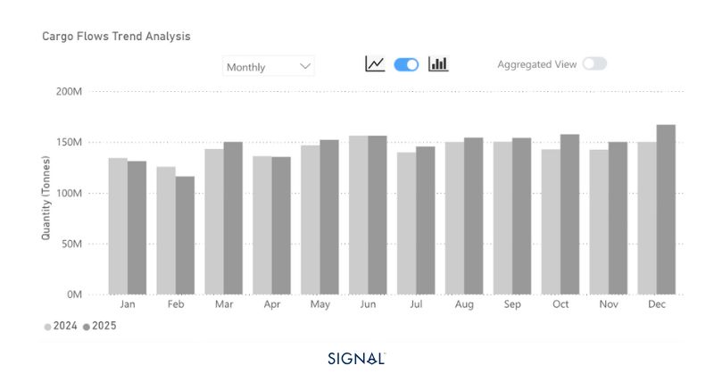
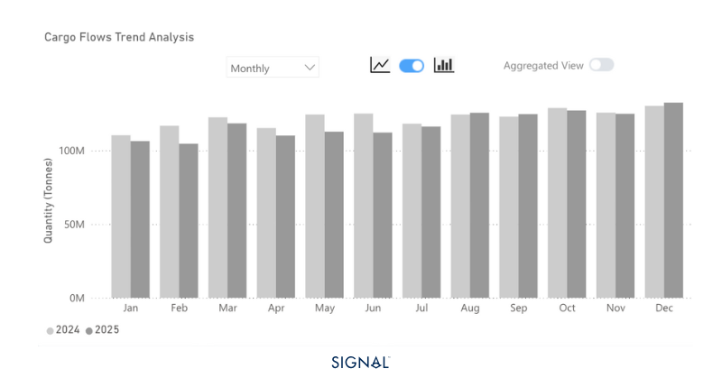
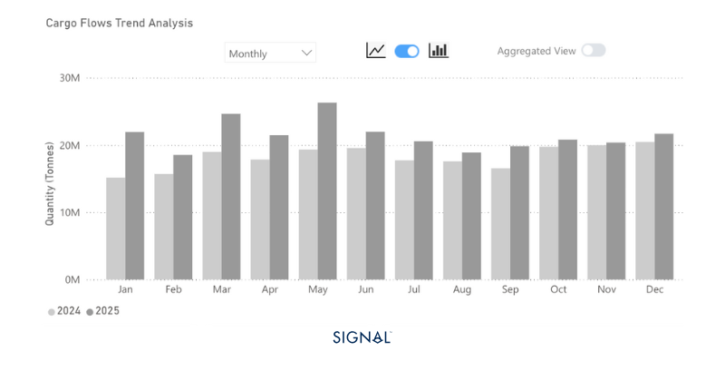
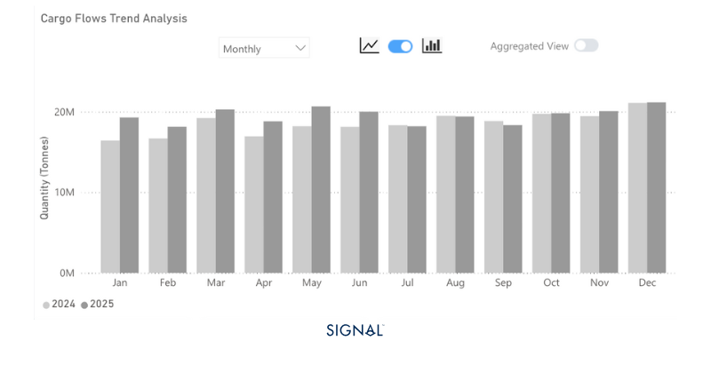

# Annual Review 2025 | Commodities & Geopolitical Risk

**Date**: January 6, 2026 | **Category**: Market Insights | **Section**: Newsroom | **Source**: [https://www.thesignalgroup.com/newsroom/annual-review-2025-commodities-geopolitical-risk](https://www.thesignalgroup.com/newsroom/annual-review-2025-commodities-geopolitical-risk)

---

## Annual Review 2025 | Commodities & Geopolitical Risk

## China’s demand is the heaviest factor for commodities in 2025

In 2025, seaborne dry bulk flows showed mixed trends across major commodities. Iron ore exports grew modestly, with China remaining the dominant importer despite a slowdown in domestic steel production. Coal shipments fell, reflecting China’s rising domestic production and shift toward renewables. Bauxite flows surged, driven by strong Chinese aluminium production and, more recently, due to substitution for higher-cost copper. Chinese steel exports rose as domestic demand softened, with India emerging as a key destination.

## Dry Bulk Flows| Iron Ore

In 2025, Signal Ocean recorded that seaborne iron ore flows increased by 2.5% to reach 1.8 billion tons. Australia was the origin for 55% of all seaborne iron ore exports, consistent with the previous year. China remained the top destination for flows, accounting for 75%, which was consistent with the figure in 2024. Given that the global overall volumes increased by 2.5%, China imported 23mt more seaborne iron ore in 2025 than in 2024.

Despite this, the steel sector in China, the largest consumer of iron ore, has seen a persistent slowdown. The most recent figures, up to November 2025, show a year-to-date decrease in crude steel production in China of close to 5%.

2026 is shaping up to be an interesting year for iron ore, with considerable downward pressure likely on price. The market consensus is that Chinese steel production will continue to fall y/y as the government tightens production controls and global trade barriers weigh on export opportunities. Weaker demand from the largest global consumer comes at a time when supply is set to surge as the largest untapped, high-grade iron ore mine, Simandou, starts to ramp up production. Once at full capacity, the mine will produce around 120mt per annum.

India will increase steel production in 2026 to align with domestic demand growth from infrastructure developments. However, in both 2025 and 2024, India has accounted for less than 2.5% of global iron ore imports, so growth will not be enough to meaningfully move the needle for the shipping industry.

Lower iron ore prices could incentivize buyers to replenish their inventories, supporting export volumes. Yet, the effect of this will be limited in the short term as Chinese port stocks of iron ore are reportedly already high. Buyers will wait until prices drop before returning to the market. Low prices in 2025 already led to an inventory build that would be unsustainable for the entirety of 2026.

*Signal Figure*

‍

## Dry Bulk Flows| Coal

In 2025, Signal Ocean recorded that seaborne coal flows decreased 3.4% to 1.4 billion tonnes. Indonesia was the origin for 37% of all seaborne coal tonnage recorded by TSOP, softening slightly from a 38% share in 2024. China remained the largest receiver of seaborne coal from TSOP, but it did soften in 2025 to 29% from 31% in 2024.

Thermal coal makes up the majority of seaborne coal tonnage, around 77%. China has imported 11% less seaborne thermal coal in 2025 than it did last year. Some of this is due to increased domestic coal production. The latest figures from the NBS show that Chinese coal production is 3% ahead of the same period in 2024. A more interesting trend, though, is China’s divergence away from thermal power generation, towards greater reliance on renewable energy. NBS statistics state that thermal power production in China is 1% lower so far in 2025 than over the same period in 2024, with solar, wind, hydro, and nuclear all notably above last year. This is all while total electricity production is up by 2.4%.

Read more at AXSMarine:Another Record Year for Dry Bulk Flows in 2025

2026 will likely see increased pressure on seaborne coal demand. With the growth in Chinese electricity production being driven by renewables, demand for coal will continue to face challenges. China has increased domestic coal-fired power capacity, but this is a move to ensure energy security rather than a planned increase in coal consumption.

This will have consequences on capesize demand, with the outlook for iron ore already weak; another year of lower coal flows could weigh heavily on capesize demand, particularly in the Pacific.

*Signal Figure*

## Dry Bulk Flows| Bauxite

In 2025, Signal Ocean recorded that seaborne bauxite flows increased by 18% to 257mt. Guinea was the origin for the majority of these bauxite flows this year, increasing its share from 65% to 68%. China was the destination for the majority of these seaborne flows, and its proportion of total seaborne imports increased from 83% in 2024 to 85% in 2025.

China’s aluminium production figures have been strong in 2025, averaging slightly above the monthly pace needed to stay below the 45mt annual production cap, with only December production to come. Given the shortage of copper and subsequent high prices, aluminium substitution is being adopted at pace. Aluminium is 39% less efficient than copper in conductivity, but can be 3 to 4 times cheaper per unit weight.

This is one factor that should keep utilization rates at Chinese aluminium smelters high through the first quarter of 2026. Another factor is the tight supply of aluminium more broadly, brought about by the high cost of power in regions such as Europe and the US. As a result, we expect to see continued strong flows of bauxite to China through the start of 2026.

Bauxite, therefore, provides some positivity in the capesize market. The outlook for iron ore and coal is softer, and this will drag on capesize demand, but bauxite should continue to outperform. Longer term, the restructuring of Guinea’s domestic bauxite processing remains a risk to bauxite flows, but it is unlikely to have any meaningful impact until the later stages of the decade.

*Signal Figure*

## Dry Bulk Flows| Steel

In 2025, Signal Ocean recorded that seaborne steel flows increased by 4% to reach 233mt. Unlike the other commodities mentioned above, China is not a top destination. Rather, the countries taking the highest proportion of seaborne flows are the U.S., 9%, Turkey, 8%, and India, 4%. Both the U.S. and Turkey were in the same position in 2024, but India has broken into the top three, over-taking Mexico, Indonesia, and China, which sat above it.

China dominates the origin of seaborne steel flows. The proportion of steel flows originating in China has surged in 2025, reaching 39%, up from 33% in 2024. This aligns with a downturn in domestic Chinese demand, prompting producers to target export demand.

The trend of weaker domestic demand is expected to continue into 2026, albeit with a less steep decline. Given the years of oversupply of steel in China, even if Chinese steel mills cut back production in 2026 as expected, they will still look to target export markets. Of these markets, India appears to offer the biggest upside. Steel demand in India is forecast to increase by 9% and imports have grown annually to feed it. Some steel products face tariffs when imported into India, but the percentages are much lower than in Europe or the U.S. We expect India to move further into the top spots for steel import flows through 2026 and beyond.

Steel products are shipped overwhelmingly by supramax vessels, 47% since 2022. Yet, of all the cargo typically carried by supramax vessels, less than 9% is steel on a tonnage basis. This means that steel performance is unlikely to shift the supramax rates in a meaningful manner. However, this is more pronounced on short-to-medium distance routes, such as China to India or China to other Southeast Asian countries. As a result, rates on supramaxes on these routes could see some upward pressure based on the increased expectation of Chinese steel exports, particularly to India.

*Signal Figure*

## Takeaways

## Chinese performance will weigh on commodity-driven vessel demand in 2026

How China chooses to structure its domestic production of steel, electricity, and aluminum will be the strongest factor in how dry commodities affect vessel demand throughout 2026. A stronger reliance on renewable energy and lower production of steel will weigh heavily on the two largest dry bulk commodities, iron ore and coal. Bauxite demand is strong in China, and market developments look positive for aluminium demand, further offering encouragement for bauxite. Yet, the aluminium production cap in China, reached in 2025, provides a ceiling for bauxite demand growth. Steel performance is unlikely to move the needle on prices outside of well-defined shipping routes.

As a result, freight rates in 2026 are expected to come under pressure. Uncertainty around tariffs, CBAM in Europe, and Chinese domestic policy adds to softer price sentiment. Yet, things can change quickly, and supply disruptions, through conflict, natural disasters, or further sanctioning, can flip markets overnight.
