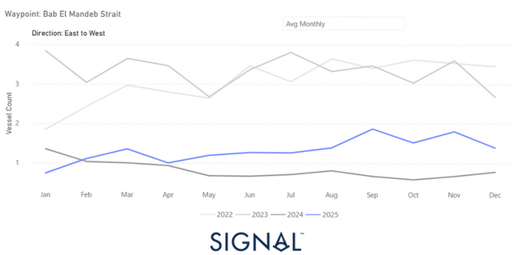
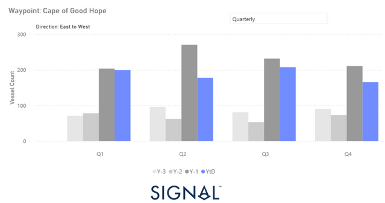
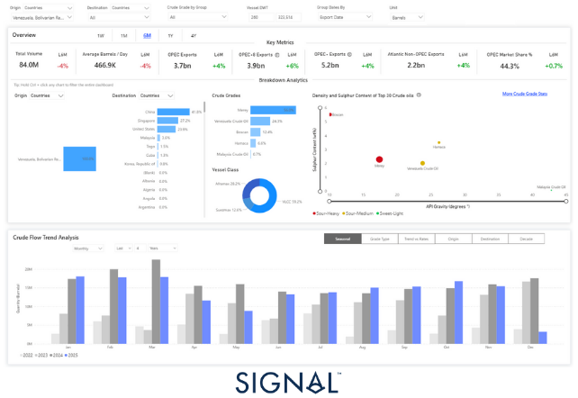
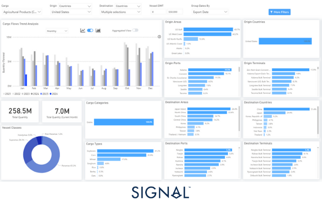
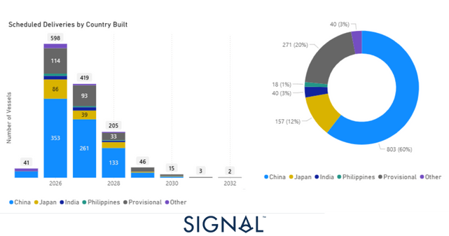
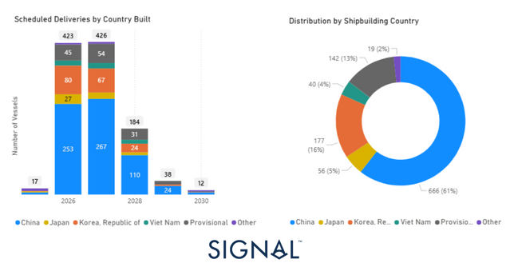
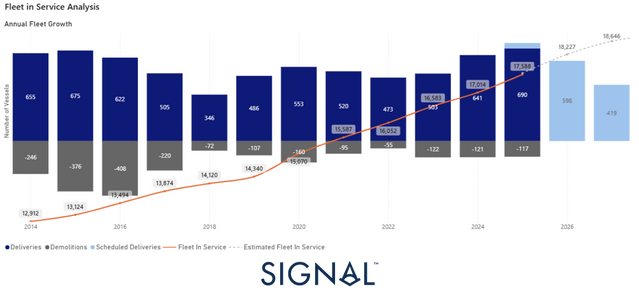
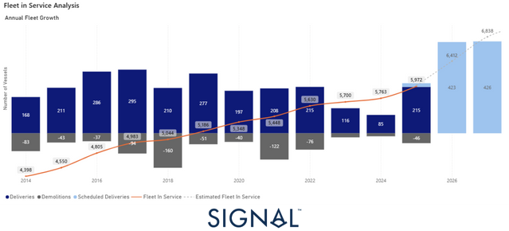

# Annual Review 2025 | Freight Markets, Commodities & Geopolitical Risk

**Date**: December 19, 2025 | **Category**: Market Insights | **Section**: Newsroom | **Source**: [https://www.thesignalgroup.com/newsroom/annual-review-2025-freight-markets-commodities-geopolitical-risk](https://www.thesignalgroup.com/newsroom/annual-review-2025-freight-markets-commodities-geopolitical-risk)

---

This review examines how geopolitical forces altered freight mechanics in 2025 and why they continue to impose a volatility floor heading into 2026.

As 2025 draws to a close, we take a step back to assess the most significant shifts in freight and commodity markets. Changes in trade flows, geopolitical disruptions, policy interventions, and growing demand trends have not only shaped market behaviour throughout the year but are also redefining expectations for 2026. This review focuses on the latest developments and late-year inflection points, many of which appear as de-escalations on the surface, yet carry a wave of implications for trade patterns and freight market dynamics in the year ahead.

## Preview Summary

Geopolitical developments remain a key source of uncertainty for maritime trade in 2025, with disruption increasingly transmitted through policy actions, enforcement measures, and security conditions that shape routing decisions and operating costs.

The Russia–Ukraine war remains central through its influence on sanctions policy. While diplomatic engagement around ceasefire parameters and post-conflict security arrangements has increased, market expectations still lean toward continuity rather than reversal of existing restrictions. In crude markets, this is reflected in reports that G7 member states have signalled dissatisfaction with the current price-cap framework and are discussing potential adjustments, including tighter controls on maritime services and insurance. These measures could be introduced from 2026, with implications for tanker access, compliance requirements, and costs.

In parallel, U.S. enforcement pressure on Venezuelan crude exports has intensified, with tanker seizures, warnings of further interdictions, tighter licensing conditions, and cargoes remaining offshore adding friction, raising transaction costs, and reducing effective tanker supply. In the Red Sea–Suez corridor, security conditions have eased from earlier peaks, enabling limited transit resumption by selected operators and some easing in war-risk premiums, yet traffic remains materially below pre-crisis levels, and Cape of Good Hope routing continues to dominate commercial assumptions. Vessel activity through the Bab el-Mandeb Strait shows only a modest recovery in 2025 versus 2024, still structurally below pre-crisis ranges.

Beyond security-driven disruptions, policy-based cost relief has been limited and temporary. The U.S. Trade Representative’s one-year suspension of Section 301 port entry fees on Chinese-linked maritime and logistics activity removes a defined burden during the suspension period without changing the broader U.S.–China relationship. Non-energy trade flows remain uneven: Chinese purchases of U.S. soybeans have resumed but remain below historical averages. Looking into 2026, the trajectory implied is gradual and uneven, with policy constraints and maritime security issues continuing to influence trade flows and delaying a full return to pre-crisis conditions.

## Geopolitical transmission channels into maritime trade

Geopolitical risk in maritime markets is increasingly reflected not through isolated shocks, but through more persistent constraints embedded in policy frameworks, enforcement practices, and security conditions. These channels influence commercial outcomes by affecting compliance requirements, insurance availability, routing decisions, and effective vessel supply. While some areas appear to have experienced tactical easing during 2025, the underlying structure of risk appears to remain largely intact.

## Sanctions policy and enforcement: continuity over reversal

The Russia–Ukraine war continues to be a central factor in this environment through its influence on sanctions policy. Diplomatic engagement around ceasefire parameters and post-conflict security arrangements appears to have increased, but prevailing market expectations still lean toward continuity rather than reversal of existing restrictions. For shipping markets, this distinction is important, as even incremental diplomatic progress has not, to date, translated into a material easing of compliance burdens or enforcement risk.

In crude markets, this is reflected in reports of a reassessment of the G7’s approach to Russian oil exports. Member states are reported to be reviewing potential alternatives to the current price-cap framework, which may include tighter restrictions on maritime services and insurance. While such measures are generally viewed as unlikely to be implemented before 2026, their consideration alone contributes to uncertainty around tanker access, documentation standards, and operational costs, particularly for fleets exposed to long-haul crude trades into Asia.

## ‍Enforcement-driven disruption in Atlantic-sanctioned crude flows

Alongside Russia, U.S. enforcement pressure on Venezuelan crude exports appears to have increased. Tanker seizures, warnings of further interdictions, and tighter licensing conditions have coincided with some cargoes remaining offshore for extended periods. These developments tend to increase operational delays, raise transaction costs, and reduce effective tanker supply, even in the absence of formal changes to sanctions regimes.

For shipping markets, the impact appears to be less about volume loss and more about inefficiency, including longer ballast legs, delayed employment, elevated counterparty risk, and greater uncertainty around voyage completion. As a result, enforcement intensity has emerged as an increasingly important factor in tanker availability and pricing dynamics.

## Maritime security and routing economics

Security conditions represent a third major transmission channel. In the Red Sea–Suez corridor, attack intensity appears to have moderated from earlier peaks, coinciding with limited and selective transit resumption by some operators. Insurance pricing and terms continue to reflect elevated risk.

‍Waypoints| Bab el-Mandeb Strait

This cautious adjustment is visible in vessel activity through the Bab el-Mandeb Strait. Volumes in 2025 show a modest recovery from 2024 lows but remain structurally below pre-crisis ranges, contributing to continued reliance on Cape of Good Hope routing.

*Signal Figure*

‍Waypoints| COGH

Despite the November announcement indicating a pause toHouthiattacks, the Red Sea corridor has yet to fully normalize, with operators continuing to manage the route cautiously. Against this backdrop, quarterly data points to a moderation in clean product rerouting via the Cape of Good Hope in the second half of the year. East–West COGH flows declined by around 10% year-on-year in Q3, with the easing becoming more pronounced in Q4 YTD at roughly 25%, despite persistent month-to-month volatility.

‍Clean Product Rerouting Eases from Peaks, Despite Monthly Volatility

*Signal Figure*

Oil Flows| Trading Tensions Persist

Venezuela’s crude oil production is estimated at around 860,000 bpd (IEA), a sharp decline from levels a decade ago and less than 1% of global supply.

Despite the reduced upstream output, seaborne crude exports remain clearly visible inTSOPdata, with China absorbing the majority of shipments over the past six months. Export flows are highly concentrated in large vessels, with VLCCs carrying close to 60% of total volumes, underscoring Venezuela’s continued reliance on long-haul Asian demand.

*Signal Figure*

Dry Bulk Flows| U.S. - China Grain Tensions

Non-energy trade flows show a similarly uneven picture. Chinese purchases of U.S. soybeans have resumed but remain materially below historical averages, pointing to only partial normalization in agricultural trade.

According to USDA daily export sales reporting, China has resumed purchases of U.S. soybeans following the late-October reopening of trade channels. Between October 30 and December 15, cumulative reported sales to China reached approximately 3.51 million mt in MY 2025–26 (September–August), with repeated large transactions recorded throughout November and early December. Individual daily sales ranged from 100,000 mt to nearly 800,000 mt, indicating a series of sizeable buying windows rather than a single bulk commitment.

USDA data show that a substantial share of these sales is scheduled for near-term shipment, primarily during December and January, following a four-month pause in buying earlier in the marketing year. While total export sales remain well below historical peak levels, the frequency and scale of recent transactions confirm a material re-engagement by Chinese buyers.

This renewed sales activity is already reflected in trade flows, as illustrated in the Signal Ocean Platform data below, which show rising U.S. Gulf and U.S. West Coast soybean shipments moving toward China and other Asian destinations, supported mainly by Panamax (65%) and Supramax tonnage (28%).

*Signal Figure*

## ‍Port Fees Suspended | A Late-Year Reset

The U.S. Trade Representative’s one-year suspension of Section 301 port entry fees on certain Chinese-linked maritime and logistics activity temporarily removes a defined cost component for affected U.S. port calls. Over the suspension period, this reduces the application of these fees for eligible port calls, with potential near-term implications for operating costs across carriers, terminal operators, and cargo interests. The measure does not, however, modify the underlying policy framework governing U.S.–China trade relations and should be viewed as a time-bound administrative action rather than evidence of a broader policy realignment.

Available evidence suggests that the one-year suspension has not yet influenced vessel ordering patterns or shipyard concentration in the maritime sector. Scheduled deliveries for both dry bulk and tanker fleets continue to be predominantly allocated to Chinese shipyards. This indicates that the measure has not significantly affected demand for China-built vessels. Instead, commercial considerations, such as pricing, shipyard capacity, and delivery schedules, appear to remain the primary drivers of fleet investment decisions, with policy uncertainty playing a secondary role.

‍‍DRY| Scheduled Deliveries by Country BuiltDeliveries YTD 690 (~60% of China)

*Signal Figure*

‍Tanker| Scheduled Deliveries by Country BuiltDeliveries YTD 215 (~60% of China)

*Signal Figure*

## If Geopolitics Quiet Down in 2026… the Supply Side Won’t

Even under a relatively calmer near-term geopolitical backdrop, supply-side conditions remain a key consideration for the freight market, with forward delivery schedules indicating higher net fleet growth. While short-term geopolitical risks may fluctuate in 2026, vessel supply dynamics continue to be driven by the existing orderbook and delivery pipeline.

Fleet in Service Analysis| Moderate Fleet Growth

*Signal Figure*

Dry bulk fleet growth remains moderate through 2025, although an inflection point is visible in forward projections. Deliveries accelerate into 2026 as late-2024 and 2025 ordering waves hit the water, while demolition remains insufficient to absorb incoming tonnage.

Fleet in Service Analysis| Stroger Supply Inflection

*Signal Figure*

Tankers are projected to record higher net fleet growth compared with recent years, based on current delivery schedules. After an extended period of limited net expansion, scheduled deliveries increase in 2026, resulting in a larger net addition to the fleet under existing assumptions. Under the current projections, tanker supply conditions in 2026 may be more sensitive to variations in demand and operational factors, including geopolitical developments.

## ‍Takeaways

Entering 2026: Fewer Shocks, Persistent Risk

The close of 2025 points to a period of greater geopolitical alignment entering 2026, though this alignment should be interpreted as conditional rather than structural. Across several key theatres, the Red Sea, U.S.–China relations, Russia–Ukraine and global supply chains,  major elements have, for now, converged around shared short-term incentives to reduce disruption and preserve economic stability.

This has translated into a more predictable operating environment for shipping, with fewer abrupt shocks and clearer trade patterns. However, the underlying strategic dynamics remain largely unchanged. Rivalry, militarisation of chokepoints, sanctions risk and supply-chain reconfiguration continue to shape decision-making beneath the surface.

As a result, 2026 is likely to be characterised less by volatility spikes and more by sustained pressure. Geopolitical risk has not disappeared; it has become more latent and more structural. In this context, rising fleet supply becomes a critical counterweight, meaning that even modest demand softness could have outsized freight implications.

In sum, the current alignment reflects a shared preference for stability, not a resolution of core tensions. It represents a pause in escalation rather than a new equilibrium, supportive for predictability, but inherently fragile.

‍

‍

The above analysis leveraged the advanced freight analytics ofThe Signal Ocean Platform, offering a comprehensive summary of annual trends across key market indicators, including Fleet, Demand, Ship Prices, and Voyages. As we step into the New Year, we invite you to explore these trends further through ourweekly monitors, which provide in-depth analyses of Freight, Supply, and Demand metrics.Stay tunedfor more enhancements to our platform, including new features that will deepen your understanding of market behaviour and improve operational planning.
