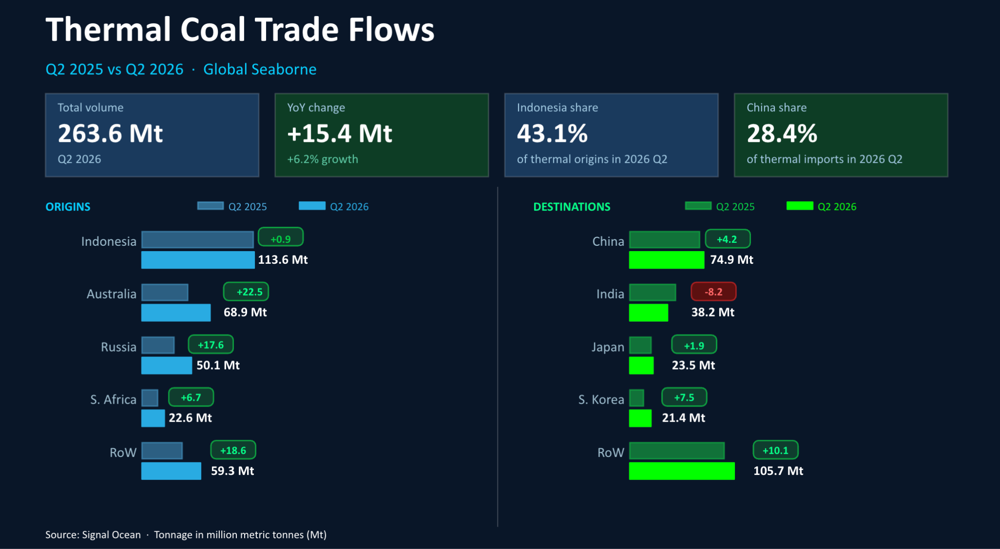
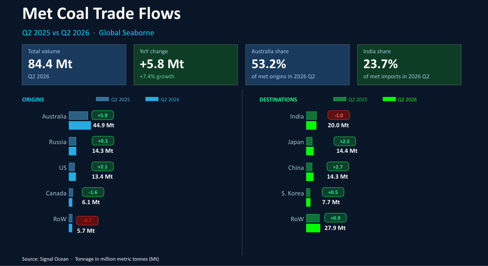

# COMMODITY RADAR | Coal Look Back 2026 Q2

**Date**: July 7, 2026 | **Category**: Market Insights | **Section**: Newsroom | **Source**: [https://www.thesignalgroup.com/newsroom/commodity-radar-coal-look-back-2026-q2](https://www.thesignalgroup.com/newsroom/commodity-radar-coal-look-back-2026-q2)

---

## COMMODITY RADAR | Coal Look Back 2026 Q2

The second quarter of 2026 saw both thermal and met coal flows accelerate, driven by Arabian Gulf supply disruptions redirecting Asian power demand toward coal and strong met coal demand from Japan and China.

- Global seaborn thermal coal flows rose 6% to reach 263.6mt in 2026 Q2
- Global seaborn met coal flows rose by over 7% to reach 84.4mt in 2026 Q2

## Global seaborne thermal coal

Seaborn thermal coal flows recorded by Signal Ocean reached 263.6mt in 2026 Q2. This figure represents a 6.2% increase from the same period a year earlier.  All of the major exporters saw significant increases in volumes except Indonesia, where coal production quotas have been slashed, and uncertainty around export allowances contained growth to less than 1%.

The top destinations for thermal coal remained those countries most dependent on the commodity for domestic power generation. The Republic of Korea saw growth of over 53% as thermal coal imports were used to replace the lack of LNG flows from the Arabian Gulf. India imported less as domestic production increased and domestic green energy rose.

*Source:Seaborn thermal coal  flows origins and destinations from Signal Ocean https://app.signalocean.com/dry/dynamic/drybulkflows*

## Global seaborne met coal

Global seaborne met coal flows surged to 84.4mt in 2026 Q2, up over 7% from the same period a year earlier. Three of the top four exporters all saw exports increase in the quarter, with Canada recording a large 21% decrease in exports.

Increases in domestic Indian coal production led to a decline in imports of met coal to India. The other large importers all recorded much stronger import volumes, with China recording the largest percentage growth.

*Source:Seaborn met  coal flows origins and destinations from Signal Oceanhttps://app.signalocean.com/dry/dynamic/drybulkflows*

‍

## ‍

## ‍
