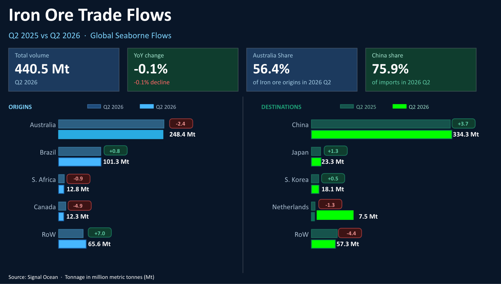
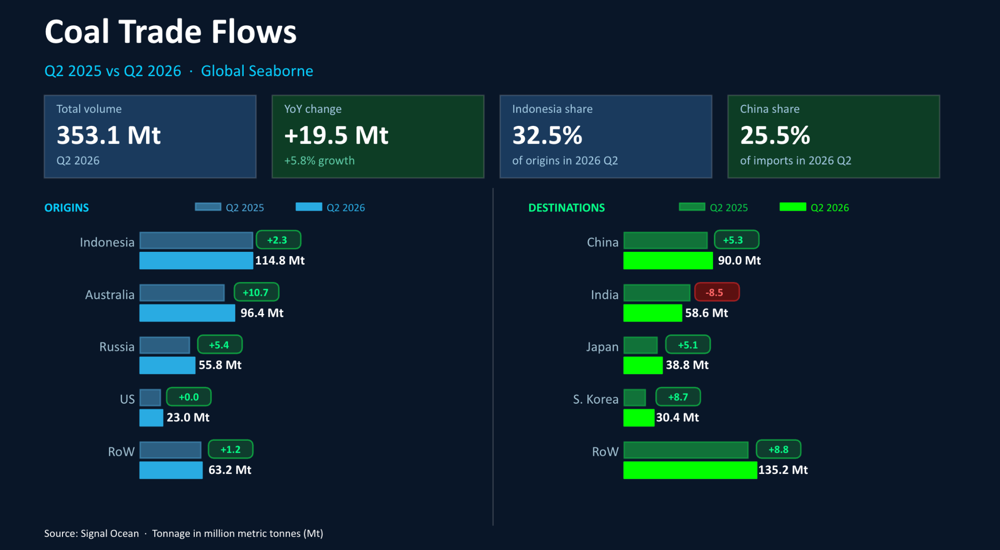
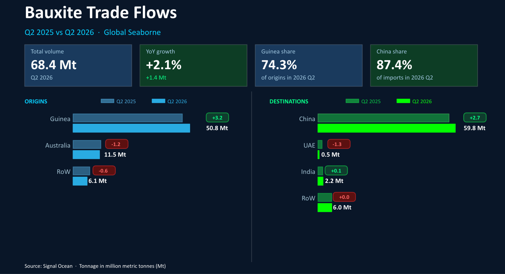

# COMMODITY RADAR | Major Bulk Look Back 2026 Q2

**Date**: July 2, 2026 | **Category**: Market Insights | **Section**: Newsroom | **Source**: [https://www.thesignalgroup.com/newsroom/commodity-radar-major-bulk-look-back-2026-q2](https://www.thesignalgroup.com/newsroom/commodity-radar-major-bulk-look-back-2026-q2)

---

## COMMODITY RADAR | Major Bulk Look Back 2026 Q2

The second quarter of 2026 saw coal flows accelerate as Arabian Gulf supply disruptions redirected Asian power demand, while iron ore held flat and bauxite continued its steady climb.

- Global seaborn iron ore flows stayed flat y/y, at 440.5mt in 2026 Q2
- Global seaborn coal flows surged to 353.1mt, up 6% y/y in 2026 Q2
- Global seaborne bauxite flows increased by 2% in 2026 Q2 to reach 68.4mt

## Global seaborne iron ore

Seaborn iron ore flows record by Signal Ocean reached 440.5mt in 2026 Q2. This figure represents a very small fall, 0.1%, from the same period a year earlier.  Three of the four largest exporters of iron ore saw decreases in tonnage shipped, with only Brazil recording a modest increase y/y. The RoW figure is driven by the super-project Simandou in Guinea.

China increased seaborne iron ore imports during 2026 Q2, as did Japan and South Korea. Of the top importers, only the Netherlands saw imports fall compared to the same period in 2025.

*Source:Seaborn iron ore flows origins and destinations from Signal Ocean https://app.signalocean.com/dry/dynamic/drybulkflows*

## Global seaborne coal

Global seaborne coal flows surged to 353.1mt in 2026 Q2, up 6% from the same period a year earlier. The top four exporters all saw exports increase in the quarter, with Australia seeing the largest increase.

The war in Iran and the disruption of energy commodities from the Arabian Gulf saw a scramble for coal for use in power generation. As a result, nations in East Asia saw a surge in coal demand, and rising coal imports followed.

*Source:Seaborn coal flows origins and destinations from Signal Oceanhttps://app.signalocean.com/dry/dynamic/drybulkflows*

## Global seaborne bauxite

Global seaborne bauxite flows rose by 2% to reach 68.4mt in 2026 Q2. Of the two largest exporters, only Guinea saw exports increase, but this was more than enough to offset losses of exports from Australia.

China and India both saw imports increase, whilst the UAE saw imports fall as major ports became inaccessible due to the conflict in the wider Gulf region.

*Source:Seaborn baxuite flows origins and destinations from Signal Oceanhttps://app.signalocean.com/dry/dynamic/drybulkflows*

‍
