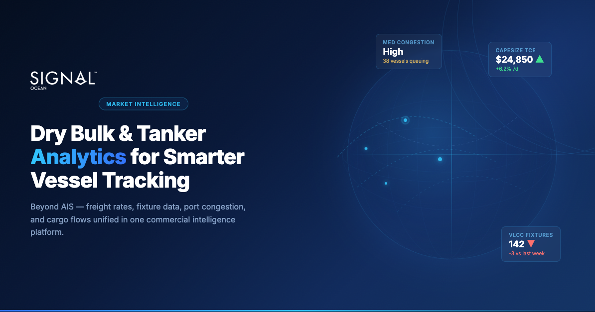

# Dry Bulk and Tanker Analytics for Smarter Vessel Tracking

**Date**: March 9, 2026 | **Category**: Market Insights | **Section**: Newsroom | **Source**: [https://www.thesignalgroup.com/newsroom/dry-bulk-and-tanker-analytics-for-smarter-vessel-tracking](https://www.thesignalgroup.com/newsroom/dry-bulk-and-tanker-analytics-for-smarter-vessel-tracking)

---

*Signal Figure*

Knowing where a vessel is located tells you almost nothing about whether you should charter it, what freight rate to expect, or how congestion at the discharge port will affect your schedule. A position on a map is a starting point. The commercial decisions that drive dry bulk and tanker markets require context that AIS data alone cannot supply.

Dry bulk and tanker analytics combine vessel movement data with cargo flows, fixture activity, freight rates, port congestion patterns, and supply-demand signals. For charterers, traders, analysts, and fleet teams, the difference between tracking ships and understanding markets determines the quality of every fixing, trading, and operational decision they make.

## Why Vessel Tracking Alone Falls Short

AIS was designed for maritime navigation safety and collision avoidance — not freight economics. The U.S. Coast Guard defines it as a system that provides vessel identity, type, position, course, speed, and navigational status automatically to equipped stations and ships. That scope is intentional. It was never meant to answer whether a Capesize ballasting toward the Atlantic will find a fixture before reaching West Africa.

Raw AIS data can tell you that a VLCC is anchored off Ras Tanura. It cannot tell you whether that vessel is waiting for a berth, storing cargo on behalf of a trader, or simply between fixtures. The OECD has demonstrated that AIS-derived data supports macro-level indicators on ports and maritime trade. Translating those indicators into actionable commercial intelligence requires additional layers: fixtures, cargo nominations, freight benchmarks, and congestion metrics.

Most professionals searching for "ship tracking" or "vessel tracking" actually need commercial analytics wrapped around positional data. If your workflow stops at coordinates, you are making decisions with incomplete information.

## What Dry Bulk and Tanker Analytics Should Include

### Vessel Positions, Voyage Status, and Availability

Position data is the foundation: vessel class, current location, speed, heading, draught, and navigational status. What separates analytics from tracking is what sits on top — whether a vessel is laden or ballast, which load zone it is heading toward, and when it will likely open for its next fixture.

For a Panamax fleet operator watching the Pacific Basin, knowing that 15 vessels are ballasting toward Southeast Asia is only useful if you also know their estimated open dates and likely loading areas. Without that layer, you have movement without meaning.

### Cargo Flows, Fixtures, and Freight Context

Cargo flow data shows where commodities are moving, in what volumes, and on which vessel classes. Fixture data reveals what has actually been booked, at what rates, and on what routes. A spike in Aframax fixtures on the Mediterranean-to-Northwest Europe route signals near-term tightness in that segment. Freight rate context — whether spot rates are rising or softening relative to time charter equivalents — shapes whether a charterer books now or waits.

Without fixture and rate data integrated alongside positions, you are guessing at market direction.

### Port Congestion and Arrival Patterns

Congestion at key loading and discharge ports directly affects vessel supply. Forty bulk carriers queuing at a major coal terminal are effectively removed from the available fleet, tightening supply in adjacent basins. Arrival pattern data — vessel counts approaching a port, how long the queue has been building, whether it is growing or shrinking — provides a leading indicator for both freight rates and operational scheduling.

This metric tends to be underweighted by teams that focus on fleet positions. Port congestion has a faster and more direct impact on near-term rate movements than most other variables.

### Predictive and Scenario-Based Market Views

Historical data explains what happened. Predictive analytics model what comes next: anticipated rate movements, expected vessel counts in specific regions, shifts in supply-demand balance. Scenario modeling lets teams stress-test assumptions — if iron ore demand from China softens by a given percentage, how does Capesize tonnage availability in the Atlantic shift?

Weekly market reports covering freight rates, ballaster counts, vessel supply-demand shifts, and anticipated rate direction are a practical example of how forward-looking framing adds value for regular decision-making.

## How Different Teams Use the Same Data

### Charterers

A charterer's core question is: which vessels are available, when, and at what cost? For a charterer evaluating whether to fix a Supramax for a grain shipment out of the US Gulf, today's open list matters less than how that list will look in two weeks. Vessel availability projections combined with freight context turn a tracking screen into a decision support tool.

### Traders and Analysts

Commodity traders use vessel data to read supply and demand across entire trade flows. If more VLCCs are loading in the Middle East Gulf than last month, that pattern informs views on crude oil supply into Asia. Analysts watching dry bulk markets track rising Capesize ballaster counts in the Pacific as an indicator of future rate pressure.

For this use case, the analytical layer needs to support filtering, aggregation, and time-series comparison — not vessel-by-vessel inspection. The question is never "where is this ship" but "what is the fleet telling me about this market."

### Owners, Operators, and Fleet Teams

Fleet teams need to know where their vessels are, when each will be open, and where the most attractive next fixture might be. Voyage planning tools that incorporate bunker costs, canal transit options, and TCE calculations help operators compare potential voyages on a like-for-like basis.

Congestion exposure is a fleet-level concern too: if three of your vessels are approaching ports with growing queues, demurrage risk needs to factor into your schedule before it becomes a cost.

## How the Main Platforms Compare

The analytics platforms most commonly used in dry bulk and tanker markets each take a different approach to the same underlying data.

Kpleris built primarily around cargo flow intelligence. It tracks vessel movements to infer commodity volumes — crude, refined products, LNG, dry bulk — at the flow and inventory level. Its strength is in trade flow visibility and supply-side analysis for commodity traders and analysts. It is less oriented toward charterer workflows or vessel availability views.

Vortexacovers a similar space with strong tanker and LNG cargo flow data, and has invested in freight analytics layered on top of its cargo intelligence. It is widely used by traders needing real-time flow data and freight context in one environment. Dry bulk coverage is more limited than its tanker offering.

MarineTrafficis the most widely used vessel tracking platform by volume, with a large free-tier user base. It excels at positional visibility and vessel identification but does not natively integrate fixture data, freight benchmarks, or commercial analytics. It serves well as a tracking tool; it was not built as a commercial decision-support platform.

VesselsValuefocuses on vessel valuation, casualty tracking, and fleet ownership data. It is most useful for S&P desks, financial analysts, and insurers rather than charterers or fleet operators making day-to-day fixing decisions.

Signal Oceanintegrates AIS tracking with cargo, fixture, and freight rate data in a single environment. Its orientation is commercial — the platform is designed around charterer and fleet operator workflows rather than trade flow aggregation or vessel valuation. TCE calculations, voyage planning, port congestion monitoring, and open vessel lists are connected rather than siloed. The main tradeoff relative to Kpler and Vortexa is that Signal Ocean's commodity flow intelligence is narrower; those platforms have deeper flow and inventory data for traders whose primary question is cargo volume rather than freight economics.

No single platform is comprehensive across all use cases. The right choice depends on whether your primary workflow is cargo flow analysis (Kpler, Vortexa), positional tracking (MarineTraffic), asset valuation (VesselsValue), or freight decision-making for charterers and operators (Signal Ocean).

## What to Evaluate in a Platform

Data coverage and granularity.Verify the platform covers the vessel classes and trade routes relevant to your market. A dry bulk tool strong on Capesize and Panamax but thin on Handysize or Supramax will leave gaps. For tankers, check coverage across VLCC, Suezmax, Aframax, and product tanker classes, with cargo flow data that includes origin, destination, commodity type, and estimated volumes.

Workflow integration.The most common frustration I hear from maritime teams is fragmentation: one tool for tracking, another for freight benchmarks, a spreadsheet for voyage calculations, a broker report for fixtures. A strong platform connects these inputs so you can move from vessel position to freight context to voyage economics without switching systems.

Speed to insight.Freight market conditions change within hours. If answering "how many Aframax vessels are available in the Mediterranean, and what is the spot rate for a Med-to-UKC voyage?" requires more than a few clicks, the platform is not keeping pace with the market.

Flexibility across roles.If your organization includes charterers, analysts, and fleet managers, you need a platform that serves all three without forcing a single workflow on everyone. Role-based views or configurable dashboards matter more than feature count.

## Frequently Asked Questions

What is the difference between vessel tracking and maritime analytics?Vessel tracking provides positional data: where a ship is, its speed, heading, and navigational status. Maritime analytics layers commercial context on top — fixture data, freight rates, port congestion, cargo flows — to support actual commercial decisions rather than just fleet visibility.

Can AIS data alone tell me whether a vessel is available for charter?No. AIS tells you a vessel's position and status. Determining availability requires knowing the vessel's current cargo commitment, estimated discharge date, and likely repositioning route — none of which come from AIS directly. That context comes from fixture databases and voyage tracking layered on top of positional data.

What causes port congestion, and how does it affect freight rates?Port congestion builds when vessel arrivals exceed berth or handling capacity, often triggered by weather delays, terminal disruptions, or a surge in cargo demand. Vessels queuing at port are temporarily removed from the active fleet, which tightens effective vessel supply and typically pushes spot freight rates higher in affected trade lanes.

How do dry bulk and tanker analytics differ?The vessel classes, trade routes, and commodity flows are different, but the analytical framework is similar: positions plus cargo flows plus fixtures plus congestion. Tanker analytics often emphasizes crude and product flow data and floating storage detection. Dry bulk analytics focuses more on commodity-specific demand signals (iron ore, coal, grain) and load zone activity for specific vessel classes.

What should I look for in a freight analytics platform if I'm a charterer?Prioritise open vessel lists with projected availability dates, fixture data for relevant routes, and spot rate trends relative to time charter equivalents. The ability to run TCE calculations against potential voyages in the same environment - rather than exporting to a spreadsheet — meaningfully reduces decision cycle time.

Is predictive freight rate modeling reliable?Directionally useful, not precisely accurate. Models that incorporate ballaster counts, port congestion trends, and seasonal demand patterns tend to produce better near-term directional signals than those relying on historical rate averages alone. Treat model outputs as one input into a view, not a forecast to trade against directly.

## Choosing the Right Platform

The platforms that deliver repeatable value in dry bulk and tanker markets connect vessel tracking to commercial intelligence in a single workflow. Raw AIS is a commodity input. Cargo flows, fixture data, freight benchmarks, port congestion signals, and predictive market views are what turn that input into decisions.

When evaluating platforms, test them against the questions your team actually asks every day. If answering "what vessels are available and at what rate?" requires stitching together three different tools, the platform is not solving your workflow problem.
