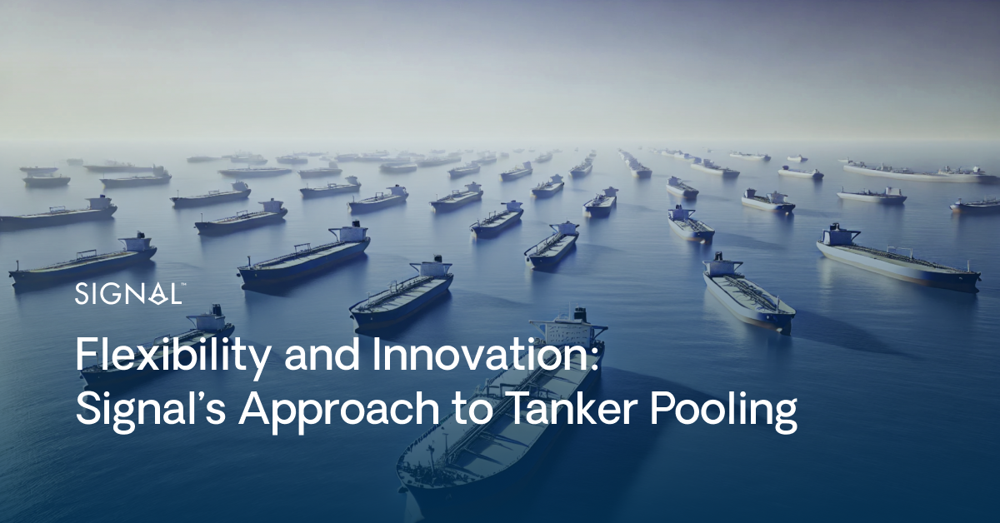

# Flexibility and Innovation: Signal’s Approach to Tanker Pooling

**Date**: March 11, 2025 | **Category**: Market Insights | **Section**: Newsroom | **Source**: [https://www.thesignalgroup.com/newsroom/flexibility-and-innovation-signals-approach-to-tanker-pooling](https://www.thesignalgroup.com/newsroom/flexibility-and-innovation-signals-approach-to-tanker-pooling)

---

## Flexibility and Innovation: Signal’s Approach to Tanker Pooling

*Signal Figure*

In the dynamic world of shipping, vessel owners face a constant challenge: how to maximise returns and operational efficiency while maintaining the flexibility to adapt to market changes. Signal has redefined vessel pooling experience by combining cutting-edge technology and data analytics with a commitment to fairness and flexibility. Signal Aframax Pool offers unparalleled ease and value for vessels, enabling owners to join and exit effortlessly at any area and time.

## Seamless Entry and Exit

Traditional vessel pools often operate within rigid frameworks that hinder owners from responding to market opportunities. Signal has eliminated these barriers, with an easy onboarding process and a flexible pooling model, designed for owners that demand control over their assets when the market is volatile and opportunities emerge. Owners can confidently join or leave the pool at their convenience, without penalties or disruptions.‍Andreas Michalopoulos, CEO of Performance Shipping Inc (NASDAQ: PSHG). highlighted Signal’s flexibility by sharing his experience:‍“One of the key advantages of Signal’s tanker pool is the unparalleled flexibility it offers. When we joined, we knew we could enter seamlessly from anywhere in the world, but what truly set it apart was the ability to exit with virtually zero notice at the end of a voyage. This proved invaluable when we secured a highly attractive Time-Charter deal - thanks to the pool’s structure, we could capitalize on the opportunity without delay. This level of flexibility is rare in the market and a game-changer for owners looking to maximise their trading options.”

This flexibility has proven beneficial in practice, not just theoretically. For example, the aforementioned owner strategically positioned a tanker in the pool while awaiting a more favourable long-term charter opportunity. Market conditions initially made securing a Time Charter deal unattractive, so the vessel remained in the pool for six months, earning strong returns. When a desirable charter opportunity arose, the pool’s structure allowed for a seamless transition, ensuring the vessel could be redelivered without operational delays.

Signal’s pooling model has also empowered companies from different shipping segments capitalising on market opportunities.In one case, a company acquired Aframax vessels and leveraged the pool's structure to optimise earnings in a favourable market. Rapid surge in asset values presented a sale opportunity, which the owner swiftly capitalised on. Thanks to pool’s flexibility, the vessels were smoothly redelivered, enabling a successful transaction without operational difficulties.

Stamatis Tsantanis, Chairman and CEO of United Maritime Corporation (NASDAQ: USEA) highlighted this advantage, stating:

"While focused on the dry bulk segment, in 2022 we decided to grasp an opportunity in tankers, due to the appealing entry point, by acquiring a fleet of tanker vessels. Joining Signal’s Aframax Pool with two of our Aframax vessels was a seamless and strategic decision for United Maritime Corporation. The Pool’s flexibility allowed us to deploy the vessels efficiently, enjoy leading spot earnings while we monitored the market for the right S&P opportunity. When market conditions surged, we were able to exit smoothly and capitalise on a strong sale without any operational constraint. This level of adaptability, combined with Signal’s strong commercial performance, proved invaluable in optimising our investment."

These cases highlight how Signal enables owners to adapt swiftly to market opportunities, optimising their strategies.

## Position Value: The foundation of fairness and flexibility

The Position Value concept is a key element of Signal’s pooling model. It assigns a monetary value to all areas worldwide based on their earnings potential. This innovative metric considers historical trading patterns, current market conditions and voyage sequences to deliver a live dollar value for each area.

For vessels entering or exiting the Pool, Position Value acts as a financial equaliser. Owners can join or leave the Pool at any location, ensuring fairness among partners. The system operates as a zero-sum game: an entry or exit credit for one vessel is balanced by a corresponding debit across the Pool and the other way around. For example, a vessel entering the Pool with a favourable Position Value enhances the Pool’s earnings potential, benefiting all partners, thus this vessel enjoys a credit that can be considered equal to the difference in earnings between what she could make individually starting from this area vs. the pool earnings she will receive for this month.

For many vessels over the years, Position Value ensured a seamless integration into and exit from the Pool, reflecting their optimal market positioning and aligning the Pool’s operations with the owners’ commercial strategies. This framework fosters trust among participants and enhances operational efficiency.
