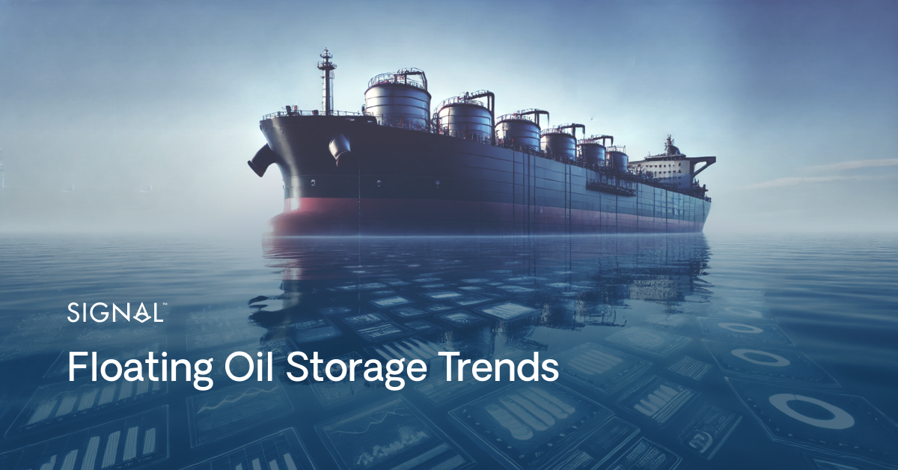
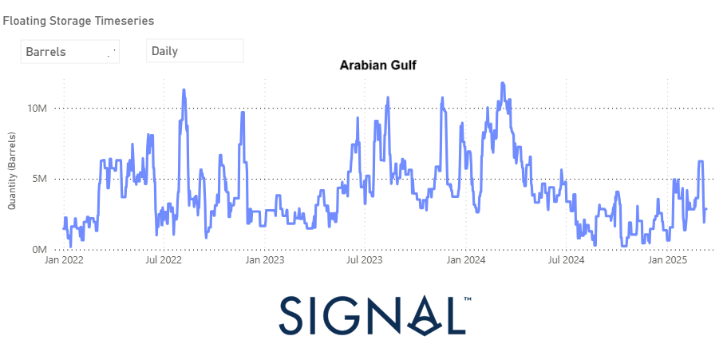
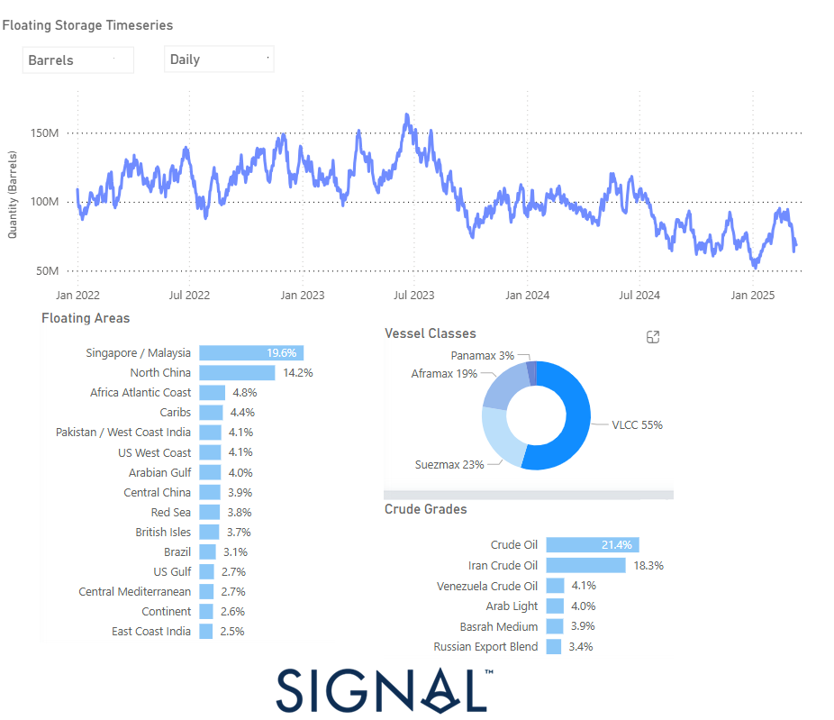

# Floating Oil Storage Trends

**Date**: March 24, 2025 | **Category**: Market Insights | **Section**: Newsroom | **Source**: [https://www.thesignalgroup.com/newsroom/floating-oil-storage-trends](https://www.thesignalgroup.com/newsroom/floating-oil-storage-trends)

---

## ‍Through our analysis, we provide a comprehensive historical timeline of key events that have shaped the era of floating oil storage. Leveraging the new Signal Ocean Platform floating storage feature, you can seamlessly explore market trends, track the evolving patterns of oil storage, and monitor the latest developments. As geopolitical tensions and trade tariffs continue to drive fluctuations in oil prices and freight market transportation costs, this tool offers valuable insights to help navigate the ever-changing energy landscape.

*Signal Figure*

The floating oil storage sector has undergone marked fluctuations since 2020, attributable to global economic circumstances, war sanctions, geopolitical tensions, and evolving market forces. Principal determinants affecting storage utilisation encompass the COVID-19 pandemic, imposed sanctions, oscillations in oil prices, and the strategic measures undertaken by Western, Middle East, and Asian markets. The influence of Iranian oil reserves, Saudi Arabia, and OPEC in determining supply-demand equilibriums is of considerable significance. Concurrently, emerging risks and legal complexities are increasingly becoming prominent.

## The historical timeline of key events influencing floating oil storage trends

#### The Impact of COVID-19 (2020-2021)

At the onset of the COVID-19 pandemic, the oil tanker storage market witnessed an unprecedented surge as global lockdowns and travel restrictions drastically reduced oil demand. The sharp drop in consumption led to a supply glut that overwhelmed onshore storage capacity, making floating storage units a crucial alternative for oil traders and producers. As storage terminals filled up, companies turned to Very Large Crude Carriers (VLCCs) and other oil tanker storage to store unsold crude, significantly altering the dynamics of global energy markets.

Oil tankers, which were traditionally used for transportation, were increasingly repurposed for long-term storage, driving up tanker charter rates to record highs. This reshaped global crude trading patterns, as vessels idled offshore in strategic locations such as Singapore, the U.S. Gulf Coast, Middle East, and the North Sea, waiting for demand recovery or favourable price conditions.

InApril 2020, oil prices experienced a historic collapse, with West Texas Intermediate (WTI) crude briefly trading in negative territory for the first time. This extreme price movement was driven by a confluence of factors, including plummeting demand, storage shortages, and logistical bottlenecks. The situation incentivised traders to capitalise on the contango market structure, where future oil prices were significantly higher than spot prices. This encouraged large-scale stockpiling on tankers, as companies sought to profit from holding crude for future resale at a premium.

Bylate 2021 and into 2022, as widespread vaccination programs facilitated economic recovery, global oil demand rebounded. The gradual reopening of industries, resumption of travel, and increased energy consumption led to a steady drawdown of stored crude. As a result, floating storage volumes declined, and tanker charter rates began to stabilise. Market normalisation followed, with oil supply and demand dynamics returning to more traditional patterns.

‍

## Sanctions, Geopolitics, and the Role of OPEC+ (2022-Present)

#### Russia-Ukraine Conflict and Sanctions on Russian Oil

The 2022 Russia-Ukraine war fundamentally transformed the global crude oil trade, disrupting established supply chains and maritime logistics. Western war sanctions against Russian crude forced traders to find new markets, causing a dramatic shift in oil flows and trade routes. This, coupled with regulatory constraints and logistical bottlenecks that slowed the movement of sanctioned oil, led to a surge in demand for floating storage.

Before the war, Russia’s Urals blend crude was a key supply source for European refiners. However, the EU embargo and G7-imposed price caps on Russian crude and refined products dismantled traditional trade corridors, forcing Russian oil to pivot towards Asia. China, India, and Turkey emerged as dominant buyers, capitalising on discounted pricing to secure a steady inflow of Russian crude. China and India significantly increased imports, refining the oil domestically and, in some cases, re-exporting products to Western markets. Turkey positioned itself as a crucial transit and blending hub, facilitating the movement of Russian crude while maintaining its role as a bridge between sanctioned and non-sanctioned trade flows.

As Russian oil found new destinations, floating storage and shadow fleet operations played an increasingly vital role in sustaining these alternative trade routes. The displacement of Russian crude led to congestion in transit corridors and heightened reliance on offshore storage, as shipments faced prolonged delays due to logistical challenges and evolving sanctions compliance. The so-called dark fleet—a growing network of aging, under-the-radar tankers operating beyond mainstream regulatory oversight—expanded rapidly to facilitate sanctioned oil shipments. Many of these vessels were reflagged under jurisdictions with minimal compliance requirements, bypassing Western maritime insurance to continue operations. Some were repurposed as floating storage units, particularly in international waters where enforcement mechanisms were weak, allowing sanctioned oil to be transferred or blended before reaching its final destination.

The geopolitical crisis has triggered a major shift in global crude trade, leading to longer voyage distances, higher freight costs, and increased market fragmentation. This has permanently reshaped traditional shipping patterns and global oil flows. With ongoing geopolitical tensions, the future remains uncertain. However, the crisis has underscored the growing importance of sanctions-compliant maritime logistics and alternative supply routes.

## Iranian and Venezuelan Oil Trade & Shadow Fleet Expansion

Sanctions onIranandVenezuelahave continued to shape floating storage trends, as both nations navigate restrictions to sustain their oil exports. Despite U.S. sanctions, Iran has expanded its crude shipments, primarily to China, relying heavily on offshore storage solutions and ship-to-ship (STS) transfers to circumvent regulatory barriers. The rise in "dark fleet" activity, characterized by aging tankers operating without insurance, has not only heightened risks in maritime transport but also prompted tighter compliance measures from the International Maritime Organisation (IMO).

## OPEC+ Strategies and Saudi-Iranian Influence on Floating Storage

OPEC+has played a decisive role in shaping oil supply trends, which directly impact floating storage dynamics.Saudi Arabia,as the world's leading oil exporter, has been at the forefront of these efforts, particularly through voluntary production cuts implemented between 2023 and 2024. These reductions, aimed at stabilising prices, temporarily tightened global supply and led to fluctuations in floating storage levels.

Meanwhile,Iran’sability to re-enter the market, whether through sanctions evasion or potential diplomatic breakthroughs, has significantly influenced offshore storage trends. The data from 2023 and 2024 shows a notable increase in Iranian crude oil floating storage, particularly in key transit hubs such as Singapore/Malaysia, and North China. This surge aligns with increased Iranian oil exports to China, driving storage volumes higher at various points throughout the period.

## Red Sea Disruptions and Houthi Attacks (2023-2024)

Geopolitical instabilityhas significantly impacted floating storage utilization. Attacks on vessels byHouthirebels in the Red Sea disrupted key shipping lanes, particularly affecting Suez Canal transit routes. As a result, oil tankers were forced to reroute around Africa’s Cape of Good Hope, increasing transit times and causing temporary buildups in floating storage near the Arabian Gulf and the Indian Ocean.

The floating storage data for the Arabian Gulf reflects these disruptions, with noticeable spikes in stored quantities corresponding to periods of heightened instability. Since early 2022, storage levels have fluctuated significantly, with peak accumulations exceeding 10 million barrels, particularly in mid-2022, early 2023, and early 2024. These trends suggest that logistical bottlenecks and supply chain adjustments in response to geopolitical tensions have played a critical role in shaping storage patterns.

*Signal Figure*

## Emerging Forces Behind Floating Storage Trends

#### China’s Strategic Reserves and Their Impact on Floating Storage

China has emerged as a key driver of floating storage trends, leveraging its massivestrategic petroleum reserves (SPR)and commercial stockpiles to manage supply fluctuations and take advantage of market opportunities. The country’s approach to crude oil storage is deeply intertwined with its energy security strategy, price arbitrage decisions, and long-term geopolitical positioning.

One of the primary ways China influences floating storage demand is throughbulk purchasing during price dips. When crude oil prices drop, Chinese refiners and state-owned enterprises (SOEs) ramp up imports, often exceeding immediate onshore storage capacity. This excess crude is temporarily stored in floating storage—typically on very large crude carriers (VLCCs)—until demand aligns with domestic refinery intake or strategic stockpiling schedules. This pattern was particularly evident during the oil price crash in2020, when China aggressively increased imports, pushing floating storage levels to historic highs.

China’s strategic use of its reserves also plays a crucial role in regulating floating storage dynamics. The government periodically releases crude from its SPR to stabilise domestic fuel prices or counteract supply disruptions, reducing the need for additional floating storage. This was evident in2021 and 2022when China strategically offloaded crude to control inflationary pressures and maintain economic stability. By adjusting its stockpile strategy based onglobal price trends, refinery margins, and geopolitical factors, China indirectly dictates the availability of floating storage capacity in key maritime hubs.

Additionally, China’s role as amajor buyer of sanctioned crude from Iran, Venezuela, and Russiahas further amplified floating storage usage. With these shipments often facing delays due to complex financial and logistical arrangements, a significant portion of this oil remains inoffshore storage near major refining hubs like Shandong and Dalian, or in transit near Singapore and Malaysia. The expansion of China’s teapot refineries—independent refiners that frequently purchase discounted crude—has also contributed to storage fluctuations, as these smaller refiners adjust procurement based on refinery maintenance cycles and margin expectations.

China’s growing influence over floating storage is not only a reflection of its sheer oil demand but also an indicator of broader shifts in global energy trade. As the country continues to secure long-term supply agreements and navigate geopolitical tensions, its storage strategies will remain a defining force in crude oil markets, affecting everything fromtanker rates and supply chain congestiontoglobal inventory levels,Middle East export dynamics,and price volatility.

‍

## 2025: Global Floating Storage Trends in 2025 vs. 2024

As we move through 2025, the global floating storage market is showing notable shifts compared to 2024, particularly in terms of storage distribution, vessel size rankings, and fuel grades. While overall storage levels have been declining since mid-2024, regional distribution and vessel utilisation trends indicate strategic adjustments by market players in response to supply chain constraints, geopolitical influences, and evolving demand patterns.

In terms of floating storage distribution, Singapore/Malaysia and North China continue to dominate, holding 19.6% and 14.2% of global floating storage, respectively. These figures highlight Asia’s continued importance as a refining and crude trading hub. However, their shares have remained relatively stable from 2024 to 2025, suggesting that offshore storage reliance in these regions has not undergone major structural changes. The Arabian Gulf, on the other hand, has experienced a modest decline in floating storage share, dropping to 4.0%. This shift suggests a greater emphasis on efficient crude movement and a potential preference for land-based storage solutions rather than prolonged offshore storage. Meanwhile, storage levels in the US Gulf and US West Coast remain relatively low, reinforcing the decreasing role of North America in global floating storage. Other regions, such as the African Atlantic Coast and the Caribs, continue to hold steady at 4.8% and 4.4%, respectively, reflecting their ongoing significance as transit-heavy storage locations.

‍

*Signal Figure*

When examiningvessel size rankings, VLCCs continue to dominate in 2025, accounting for 55% of total floating storage, a trend that remains unchanged from 2024. Their continued dominance is driven by their cost-efficiency in long-term crude storage and their ability to hold large volumes over extended periods. Suezmax vessels remain in second place with a 23% share, serving mid-sized crude shipments, particularly in constrained waterways or regional storage hubs. Aframax vessels also retain a strong presence at 19%, reflecting their critical role in shorter-haul crude transportation and regional storage needs. Panamax vessels, on the other hand, maintain a minimal role in floating storage, accounting for only 3%, as they are primarily used for refined product transport rather than long-term crude storage.

The composition of fuel grades in floating storage has also remained largely stable from 2024 to 2025. Crude oil remains the largest stored fuel type, representing 21.4% of total floating storage, indicating overall market stability and consistent demand for generic crude. Iranian crude oil continues to hold a significant share at 18.3%, a figure that underscores ongoing trade restrictions limiting its direct market access, which necessitates offshore storage. Similarly, Venezuelan crude oil, at 4.1%, remains a consistent component of floating storage, highlighting continued geopolitical constraints affecting its trade flows. Other key fuel grades, such as Arab Light (4.0%) and Basrah Medium (3.9%), continue to be stored in offshore locations, reflecting the steady reliance on Middle Eastern crude. Russian Export Blend has also maintained a stable presence at 3.4%, suggesting that while crude flows from Russia have adjusted to shifting global trade dynamics, logistical and trading challenges persist.

## Legal risks

The use of tankers for floating storage presents significant legal risks, particularly about charter party agreements. Under time charters, whether a vessel can be used as floating storage depends on the specific contractual terms, with some agreements explicitly permitting it while others remain silent. For voyage charters, prolonged stationary use can contradict the vessel’s intended purpose, potentially leading to disputes over breach of contract. Additionally, orders for floating storage must align with the duty to proceed with utmost dispatch, requiring careful legal review to avoid potential liability.

Safety and maintenance concerns also pose legal challenges. The choice of storage location affects liability, as unsafe areas can expose vessels to adverse weather, piracy, or environmental risks. Prolonged idleness increases hull fouling, which can degrade vessel performance and incur costly maintenance. Depending on the charter party terms, responsibility for these expenses may fall on the charterers in time charters, whereas owners might bear the burden in voyage charters. Cargo degradation is another major risk, as prolonged storage of oil cargoes can lead to quality deterioration, potentially resulting in claims from receivers. Proper risk assessments and preventive measures are necessary to safeguard cargo integrity.

Finally, insurance coverage must be reviewed, as floating storage operations alter a vessel’s risk profile. Standard insurance policies may not automatically extend coverage to liabilities arising from long-term storage, necessitating additional provisions or amendments. Owners and charterers should clarify who bears the financial responsibility for securing appropriate coverage. Given these legal complexities, all parties involved in floating storage should proactively assess risks, ensure clear contractual agreements, and implement mitigation strategies to prevent disputes and financial losses.

## Key Takeaways

As of early 2025, the floating oil storage market remains a critical indicator of geopolitical disruptions and evolving trade patterns. Despite declining overall floating storage levels since mid-2024, 2025 trends indicate stability in regional distribution, vessel type rankings, and stored crude grades.Asia remains the focal point offloating storage, whileVLCCs dominate vessel selection, andgeopolitical influences continue to shape the stored crude mix.Looking ahead, the continued buildup of floating storage presents potential risks to oil prices and market stability. A sudden release of stored crude could disrupt pricing, particularly in Asia and the Mediterranean, affecting refining margins and freight costs. The use of shadow fleets, regulatory compliance challenges, and rising chartering costs further complicate the market landscape. As geopolitical tensions persist, floating storage will remain a key factor in supply chain management, price volatility, and global energy security.

‍

Explore the latest trends in oil floating storage with theSignal Ocean Platformfeature beta version. Stay updated with platform enhancements, insights, and market analysis. For demo inquiries,reach outto us and visit theSignal Ocean Newsroomfor the latest updates on market trends and platform developments.
