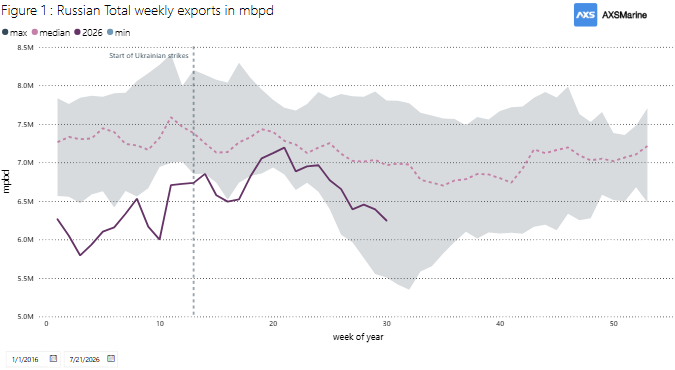
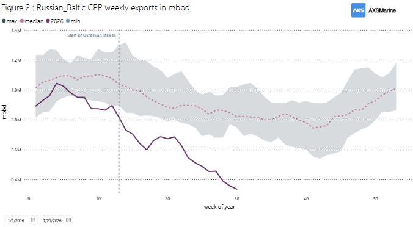
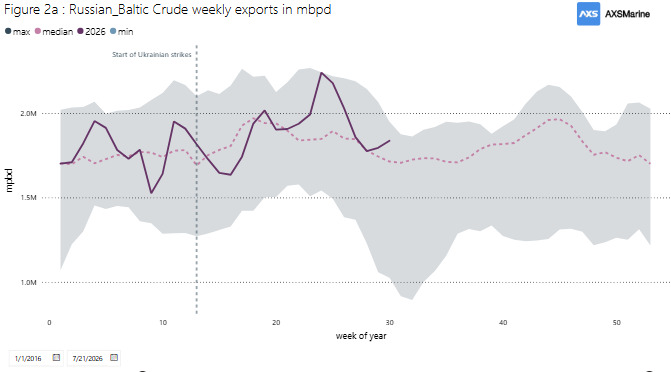
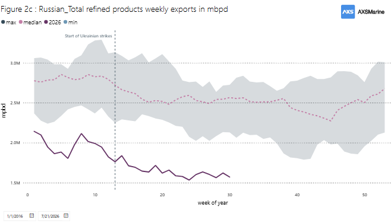
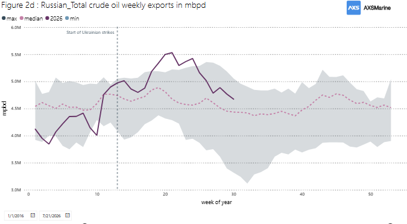
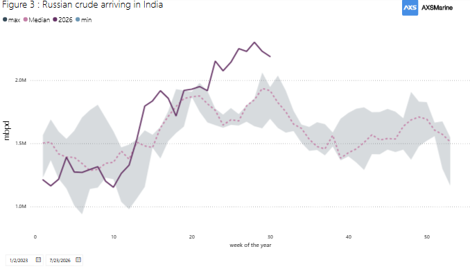
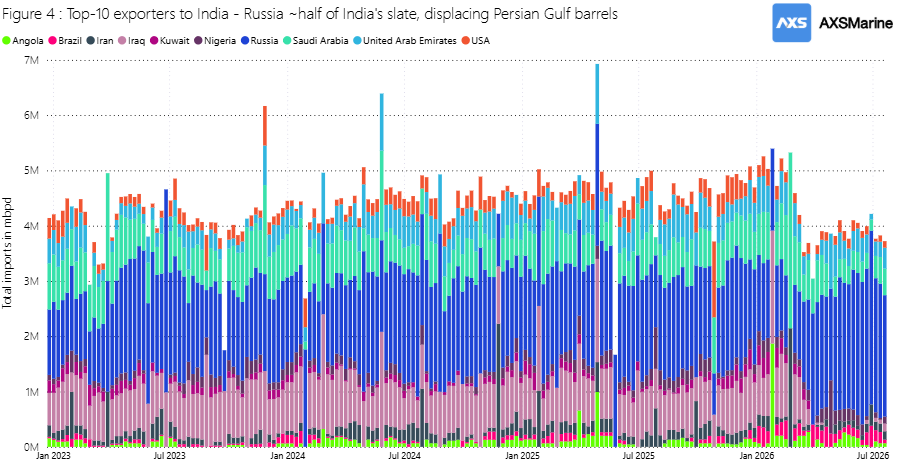

# From products to crude: how the strikes reshaped Russia's seaborne exports

**Date**: July 29, 2026 | **Category**: Market Insights | **Section**: Newsroom | **Source**: [https://www.thesignalgroup.com/newsroom/from-products-to-crude-how-the-strikes-reshaped-russias-seaborne-exports](https://www.thesignalgroup.com/newsroom/from-products-to-crude-how-the-strikes-reshaped-russias-seaborne-exports)

---

## From products to crude: how the strikes reshaped Russia's seaborne exports

Ukraine's strikes on Russian ports and refineries stepped up sharply after March 2026, and the effect on Russia's seaborne oil trade was not really a simple fall in volumes. What changed was the mix. Refined product exports out of the Baltic terminals fell apart, while crude exports, above all to India, ran higher. Those two moves are really one story. With refineries damaged, the crude that would normally have been processed at home was pushed onto the water instead. At the same time the closure of the Strait of Hormuz cut Middle East supply to India and pulled Russian barrels in from the demand side. Because the crude surge cushioned the product collapse, the headline total barely moved, which is exactly why looking at the total on its own is misleading. The story is in the composition.

## The total looks quiet

Add everything up, all loading regions and every commodity, and Russian seaborne exports in 2026 sat inside their normal historical range for most of the year, sliding into the lower half of that range after the strikes (Figure 1) . Anyone glancing at that line would reasonably conclude not much had happened. However the strikes impact are visible once you split the flows by product and by loading region.

*Signal Figure*

## Products: the Baltic terminals fold

The clearest damage shows up in clean products loaded at Russia's Baltic terminals, Ust-Luga and Primorsk. After the strikes, clean product loadings from these two ports drop well below their ten-year floor and stay there, the steepest fall of anything on the board, with the 2026 line running at a fraction of a normal year.(Figure 2) .

*Signal Figure*

*Signal Figure*

Crude leaving the same terminals holds up far better (Figure 2a), so this is not the Baltic suffering across the board. It is specifically refined products, the output of refineries, that has been knocked out.

The same picture holds nationally. Total refined product exports fell to around 1.6 million b/d by June and stayed close to that into late July, below the ten-year range for the time of year. Diesel and gasoil took the worst of it, and Moscow imposed a full diesel export ban on 8 July.

*Signal Figure*

## Crude: the barrels head east

*Signal Figure*

Crude runs the other way. Total Russian seaborne crude exports pushed to the top of their ten-year range, peaking around 5.5 million b/d in late spring and still above 4.6 million into late July, the strongest run in years.

India took the bulk of it. Russian crude arriving at Indian ports climbed above 2 million b/d, past its historical range, lifting Russia from about a third of India's imports to around half, the first time any single supplier has held a majority of India's crude (Figure 3). Kozmino, on the Pacific, tells the same story, running above its own multi-year ceiling.

*Signal Figure*

Russia overtook Iraq as India's leading supplier and pushed out Persian Gulf barrels, with Saudi volumes into India falling the hardest, from roughly 1.0 million b/d in February to about 330,000 in June (Figure 4). Much of that was about routing rather than price. India replaced most of Gulf barrels, especially the Iraqi ones, from Russia, which captures now almost half of Indian imports.

*Signal Figure*
