# From Summer to Autumn: 2025 Dirty Tanker Market Review

**Date**: October 2, 2025 | **Category**: Market Insights | **Section**: Newsroom | **Source**: [https://www.thesignalgroup.com/newsroom/from-summer-to-autumn-2025-dirty-tanker-market-review](https://www.thesignalgroup.com/newsroom/from-summer-to-autumn-2025-dirty-tanker-market-review)

---

## From Summer to Autumn: 2025 Dirty Tanker Market Review

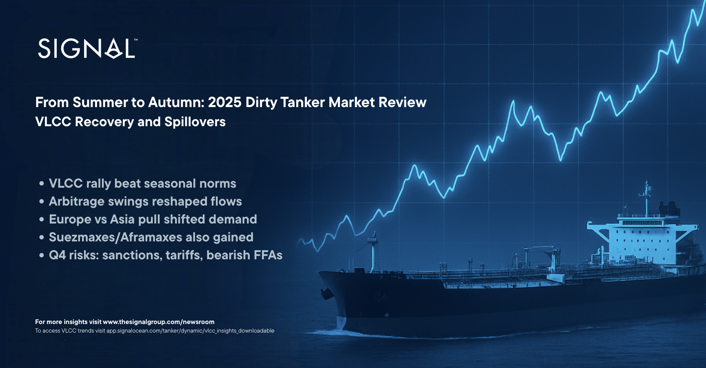
*Signal Figure*

## ‍Snapshot: A Powerful Rally - Scenarios behind the Recovery

The summer of 2025 surprised with earnings, as VLCC rates climbed well above seasonal norms. In the sections that follow, we outline the key dynamics that, whether acting individually or in combination, underpinned this momentum and sustained strength through late summer into September. Whether these factors acted individually or in combination is impossible to determine, but their influence was enough to drive eastbound tonne-mile demand, keeping VLCC supply tight and spot rates elevated.

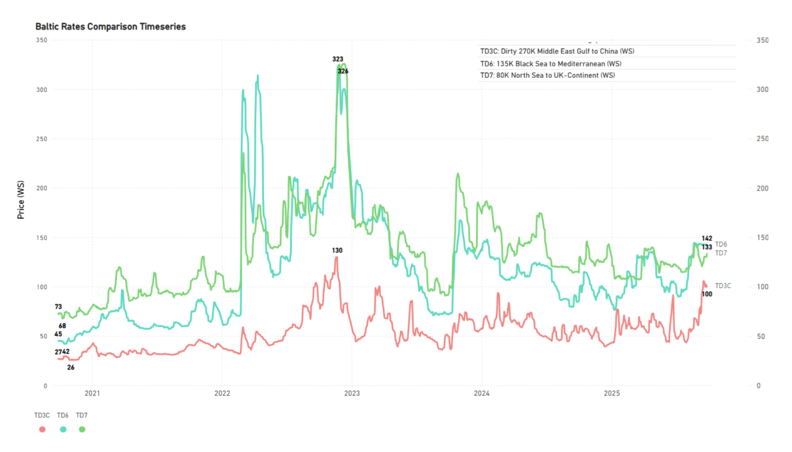
*Signal Figure*

### ‍Dynamic 1 – Brent-Dubai EFS Swings and Shifting Arbitrage

Mid-summer dynamics were driven largely by price spreads and shifting arbitrage flows. The Brent–Dubai Exchange of Futures for Swaps (EFS) briefly turned negative, opening a short-lived window for West African and U.S. Gulf crudes into Asia. That opportunity closed quickly as TD22 (USG–Far East) freight surged and the Brent–Dubai spread rebounded into positive territory.

The temporary dip in EFS reflected firmer Dubai pricing and lingering uncertainty over Russian flows following Ukrainian strikes on refineries and infrastructure. Meanwhile, China continued stockpiling, including Atlantic basin cargoes (West Africa, Brazil), while WTI was priced to move eastward, sustaining U.S. Gulf flows to the Far East and tightening VLCC availability. From August onwards, WTI increasingly priced for export rather than domestic consumption as the summer demand season drew to a close.

At the same time, Indian refiners came under heightened scrutiny as Washington threatened secondary sanctions on Russian crude. This raised the prospect of reduced spot purchases from Russia and greater reliance on alternative suppliers such as the Middle East Gulf, West Africa, and potentially the U.S. Gulf. With Dubai time-spreads firming and sour benchmarks tightening, Atlantic sweet crudes gained relative appeal.

### Dynamic 2 – USG Flows: Europe Vs Asia

The third quarter was among the strongest for European crude imports in recent years. However, U.S. Gulf Coast exports to the region moved in the opposite direction. In July, liftings dropped to 47.7 million barrels, almost 30% below the previous year. August recorded a partial recovery to 56 million barrels, but this was short-lived. September volumes eased again, leaving all three months trailing 2024 levels (seeFigure1).

Such volatility does not necessarily indicate weaker European demand, nor can it be explained entirely by refinery maintenance in the United States. Rather, it points to Europe’s growing flexibility in adjusting its supply mix. The region has shown a greater capacity to substitute U.S. barrels with alternative sources when pricing or arbitrage conditions change.

The more likely scenario is that Europe continues to act as the main absorber of displaced U.S. Gulf volumes. With the U.S. Gulf–Asia arbitrage effectively closed, Asian buyers have been less competitive in securing these flows, creating additional space for Europe. This outcome reflects short-term trade dynamics rather than a structural change in demand.

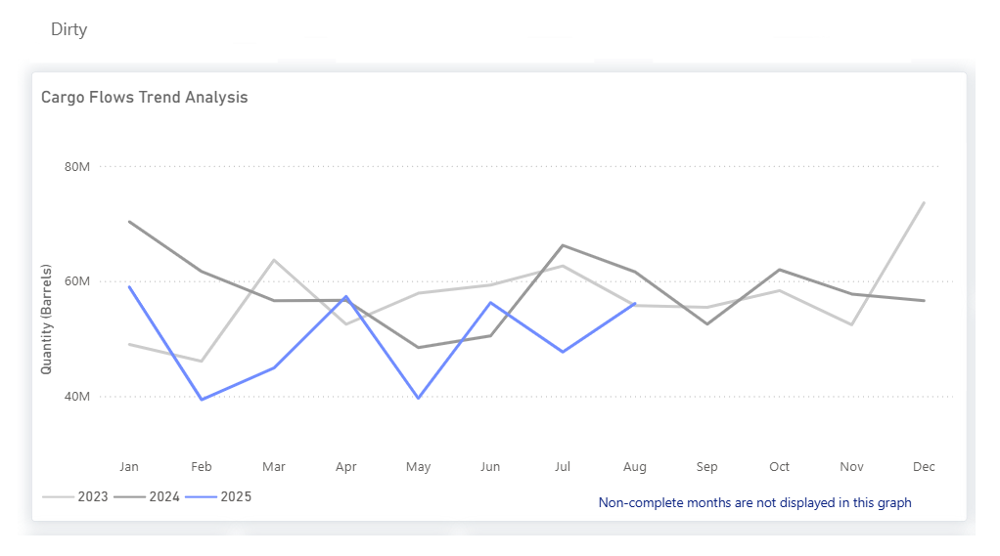
*Figure 1: USG crude export flows to Europe, Jan–Aug 2023, 2024 vs 2025 (Source: Signal Ocean Cargo Flows Trend Analysis).https://app.signalocean.com/tanker/dynamic/oilflows*

From mid-September, Shell’s 404 kb/d Pernis refinery in the Netherlands, Europe’s largest, entered a major turnaround expected to last through October and possibly into November, temporarily curbing regional crude demand. While some market participants noted that refinery maintenance has not been hefty overall this year, market talk suggests that runs could rebound in November and December, reversing the slowdown from September and October.

In parallel, Europe’s pull on Atlantic Basin barrels has weakened, opening space for more flows to be diverted eastward, including PADD 3 to the Far East/India, Brazil to the Far East/India, and WAFR to the Far East/India (seeFigure2), supported by favorable arbitrage economics. From October, US exports to Europe are also expected to increase, with WTI now competitively priced into the region.

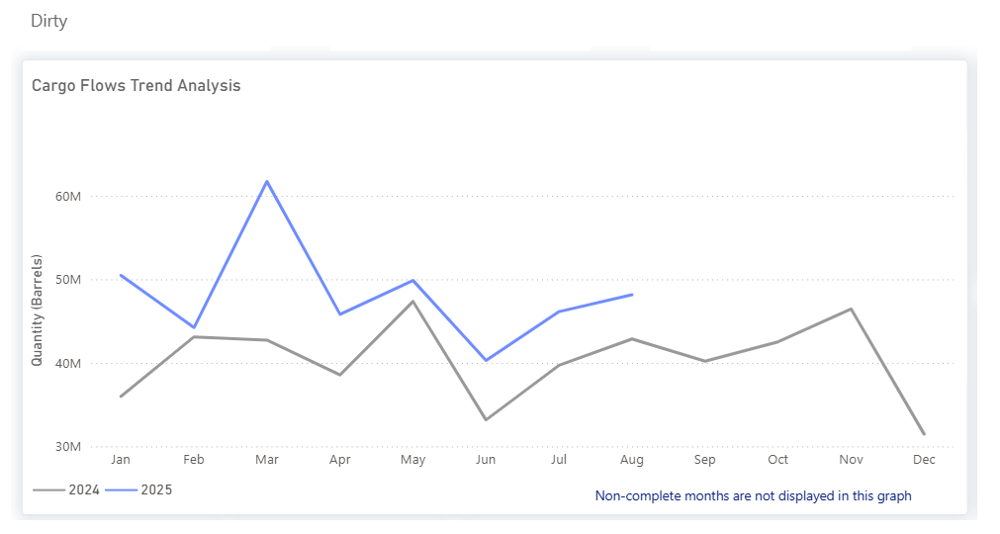
*Figure 2: Africa Atlantic Coast crude export flows to Far East/ India, Jan–Aug 2024 vs 2025 (Source: Signal Ocean Cargo Flows Trend Analysis).https://app.signalocean.com/tanker/dynamic/oilflows*

Meanwhile, Guyana and Brazil both increased exports to Europe and Asia over the summer months, a trend that market participants are confident will continue (seeFigure3). These additional flows not only diversified supply but also pushed tonne-miles higher, reinforcing the eastward pull on Atlantic Basin barrels.

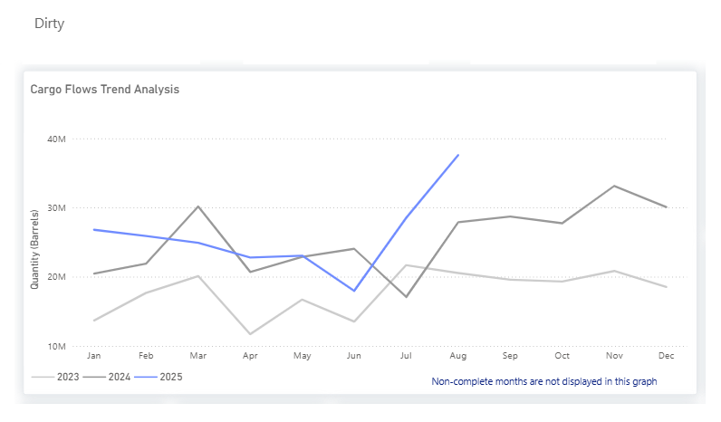
*Figure 3: Guyana / BRAZIL crude export flows to Europe, Jan–Aug 2023, 2024 vs 2025 (Source: Signal Ocean Cargo Flows Trend Analysis).https://app.signalocean.com/tanker/dynamic/oilflows*

## ‍Dynamic 3 – Early Summer Fixing and Saudi Export Surge

One of the earliest signs of tightening appeared from voyages scheduled well before August loadings. Softer freight rates in May and early June, combined with weaker crude prices, encouraged charterers to secure vessels earlier than usual in anticipation of increased demand through late summer. At the same time, Saudi Arabia’s seasonal crude burn declined, freeing up additional barrels for export. In August 2025, flows from the Kingdom reached 192 million barrels, up from 177 million barrels a year earlier, highlighting the scale of the surge (seeFigure4).

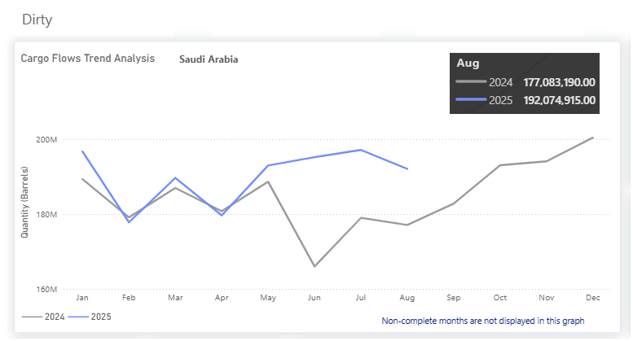
*Figure 4: Saudi Arabia crude export flows, Jan–Aug 2024 vs 2025 (Source: Signal Ocean Cargo Flows Trend Analysis).https://app.signalocean.com/tanker/dynamic/oilflows*

‍

## Segment Performance

### VLCC

On the TD3C benchmark (MEG–China), Worldscale levels climbed sharply, peaking just above WS100 on September 19, before easing to WS95–97 by September 25. By September 30, rates had retreated further to WS89.8, reflecting some cooling in sentiment but still standing well above seasonal norms. (seeFigure5 and 6)‍

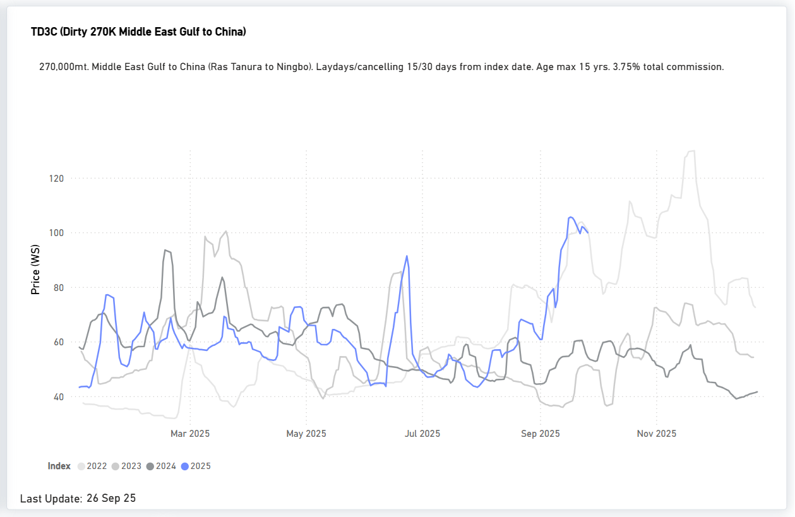
*(Source: Signal Ocean Market Prices).https://app.signalocean.com/tanker/dynamic/market-prices-tankers*

‍

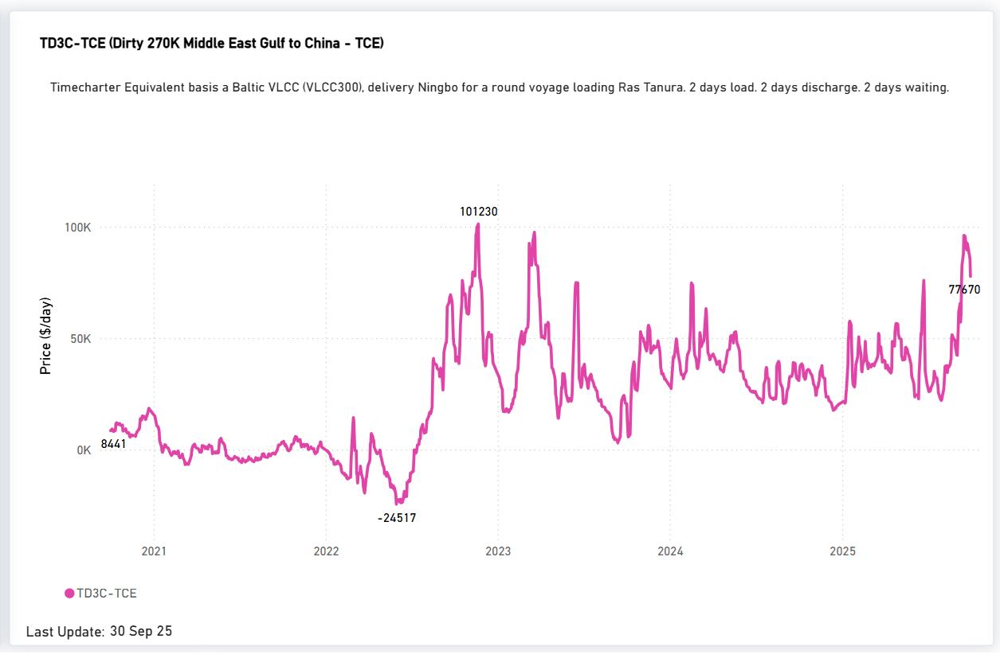
*Figure 6 TD3C Seasonal Evolution MEG - China TCE(Source: Signal Ocean Market Prices).https://app.signalocean.com/tanker/dynamic/market-prices-tankers*

‍

### USG–China (TD22)

On the TD22 benchmark (US Gulf–China), rates surged through September, peaking near USD 12M mid-month before easing back towards USD 10M by September 30. Despite the late pullback, current levels remain substantially above historical averages, highlighting strong US export activity and limited tonnage availability for long-haul voyages to Asia. (seeFigure7)

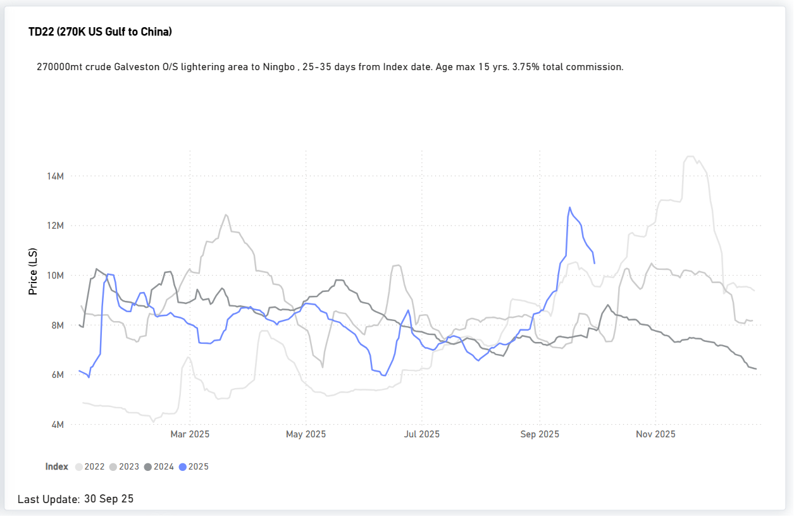
*Figure 7: TD22 Seasonal Evolution USG - China(Source: Signal Ocean Market Prices).https://app.signalocean.com/tanker/dynamic/market-prices-tankers*

‍

Suezmaxesalso benefited from Atlantic basin dislocations. By late August, the TD20 Nigeria–UKC benchmark hovered around WS130, equivalent to roughly $48,000 per day before dropping to WS 104. (seeFigure8 & 9)‍

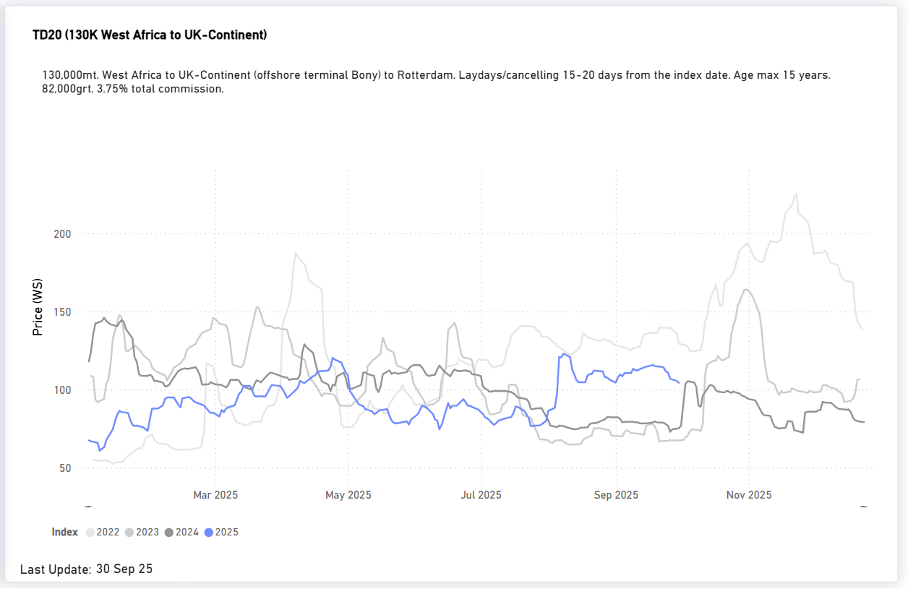
*Figure 9: TD20 Seasonal Evolution Wafr - Uk Continent(Source: Signal Ocean Market Prices).https://app.signalocean.com/tanker/dynamic/market-prices-tankers*

‍

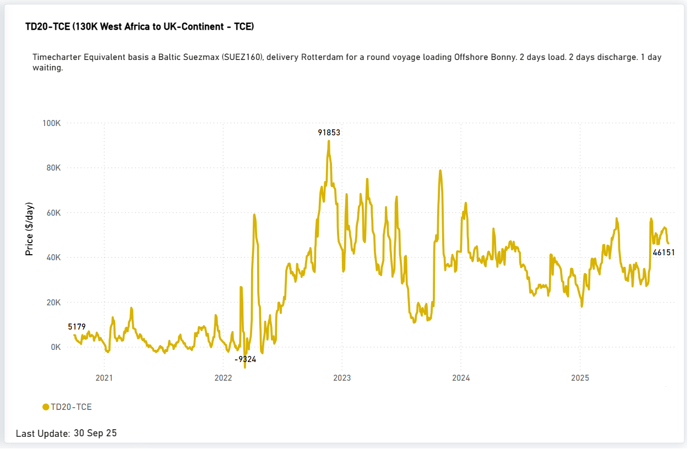
*Figure 9 TD20 Seasonal Evolution Wafr - UK Continent TCE(Source: Signal Ocean Market Prices).https://app.signalocean.com/tanker/dynamic/market-prices-tankers*

## Risks & watch-items for Q4

Shadow Fleet SegmentationSanctions enforcement has also contributed to a segmentation of the fleet. A significant share of older units continues to operate almost exclusively in Russia-linked or sanctioned trades, effectively removing them from the mainstream pool of vessels accessible to top-tier charterers. As a result, the “real” available fleet is much smaller than headline capacity figures suggest, particularly given that around a third of crude tanker capacity is already older than 15 years.

European Sanctions on TankersBrussels has increasingly targeted the tanker segment directly, tightening restrictions not only on Russian crude but also on vessels engaged in deceptive practices such as ship-to-ship transfers and flag-hopping. EU regulations have extended restrictions to services provided to tankers reasonably suspected of circumventing the price cap, further constraining the shadow fleet’s ability to access European-linked insurance, classification, and ports.

India’s Position and U.S. Tariff PressureWashington’s threats of tariff escalation against India’s purchases of Russian crude, particularly during August–September, introduced added uncertainty for crude and product flows. While India has insisted that it will continue buying on economic grounds, the prospect of U.S. tariff measures raised the risk of precautionary reroutes and timing adjustments, increasing tonne-mile demand.

## FFA Market & Forward Signals

While spot fundamentals drove the summer rally, the FFA market is now showing early warning signs for the near term. Signal Ocean Market Forecast Insights on September 22 highlighted amoderately bearishsentiment, which has sincematerialized. That said, TCE earnings on the MEG–China route remain above $70,000/day, suggesting that sentiment alone can't explain the pullback, especially as vessel availability stays tight. Still, macroeconomic and geopolitical risks remain, and the forward curve indicates a retracement, either a VLCC retest of summer highs or a softer correction heading into year-end.

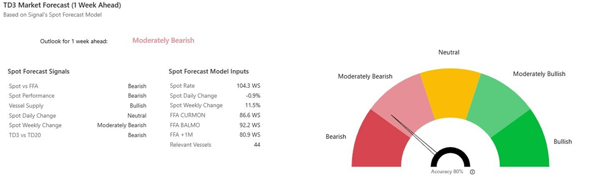
*Figure 10 Vlcc Insights Market Forecasts*

‍

‍
