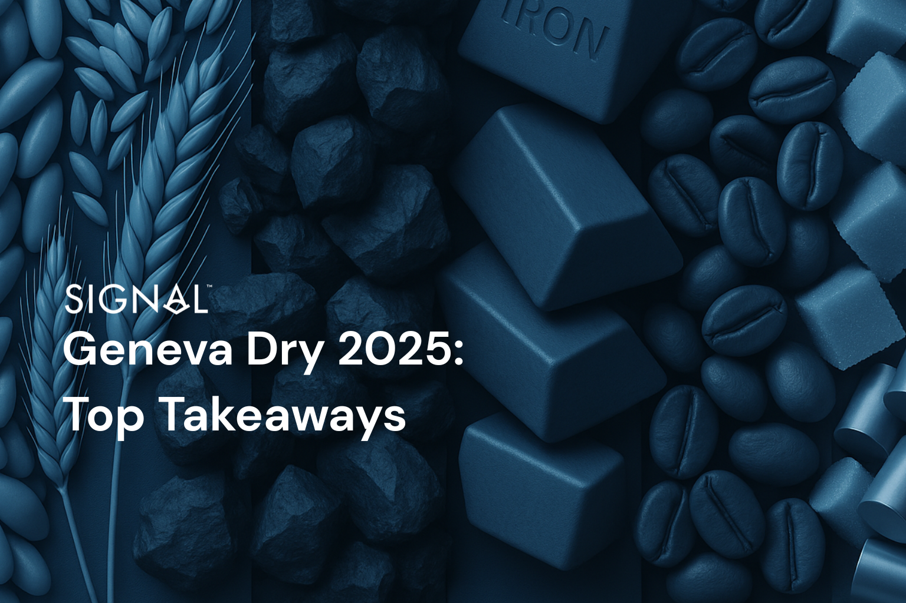

# Geneva Dry 2025: Top Takeaways

**Date**: May 07, 2025 | **Category**: Market Insights | **Section**: Newsroom | **Source**: [https://www.thesignalgroup.com/newsroom/geneva-dry-2025-top-takeaways](https://www.thesignalgroup.com/newsroom/geneva-dry-2025-top-takeaways)

---

## The world of dry bulk shipping convened in Geneva over two days last week for the annual Geneva Dry conference hosted by Splash247. A strong team from Signal Ocean attended and has put together the following piece, crystallizing our top commodity talking points from the conference, arising from both the formal sessions and wider conversations with attendees during and at our after-conference event.

*Signal Figure*

## Is Bauxite still a minor bulk?

The first commodity-specific session on day 2 focused on minor bulks, and inevitably, bauxite took center stage. The commodity has overtaken coal as the second most shipped by capesize behind iron ore, and the growing trade ofbauxite from Guinea to China is well documented. Despite Chinese aluminium production reaching close to the 45mt limit, domestic bauxite reserves are of low quality and insufficient to feed the domestic market, meaning imports will remain critical.

‍

Pushing this further is the growth of aluminium smelting capacity in India. Plans are underway to increase domestic bauxite production through mine development, but the quality of the ore is an issue for some operations, so imports to India are a possible area of growth. The same is true in the Middle East, driven by vast construction projects consuming large amounts of aluminium. Several nations in the region are working together to elevate the region as a major aluminum production hub, requiring more and more bauxite to do so, as they lack an adequate domestic supply. We see this growing trade flow of bauxite from Guinea to Asia as the critical driver for capesize demand, particularly off the African Atlantic coast.

‍

## Coal has peaked, but when will it soften?

Following the positivity with bauxite, the feeling around coal was more muted. The panel agreed that coal demand in China and globally peaked last year in 2024 and will, at some point, soften. Last year, China commissioned over 94.5 GW of new coal-fired power station capacity and resumed construction of some 3.3 GW of coal-fired power capacity that had been paused. This would require around 236 mt of coal a year to run at the standard 70% capacity, so surely the outlook for coal is positive?

However, this fails to tell the whole story, and as the panel correctly discussed, the additional coal capacity does not mean it will be used. This additional coal capacity is more of a safety net for China as it invests and relies more on renewable energy, particularly in industrial northern provinces like Inner Mongolia. We are likely to see older, less efficient coal power stations decommissioned as the new capacity comes online, so net capacity growth will likely be lower than the numbers above.

Met coal has the same outlook. Met coal makes up about 25% of the total coal market, 3x smaller than thermal coal, and is almost exclusively used in steel production. In China, total crude steel production is expected to also decrease in the coming years, further weighing on coal demand. Our view is that total coal demand will slowly reduce as renewable energy and its infrastructure in China improve, and crude steel production softens. Steel production elsewhere, particularly in India, will increase, but it will not be enough to offset the fall in China.

## Are iron ore trade flows set for a shake-up?

This panel session had some of the most compelling discussions given the state of iron ore trade flows going forward. The most poignant talking point was Simandou, the super mine in Guinea set to come online by the end of 2025. The mine is expected to produce 120 mt of iron ore once fully ramped up, placing it as the largest mine for iron ore globally by some way.

The ownership and investment in the mine and necessary infrastructure have been dominated by Chinese companies, a key clear indication that mine output will be earmarked for Chinese steel producers. The ore grade is also very high, around 65% Fe, higher than the average Australian grade and similar to high-grade Brazilian ores. Maybe more importantly, it is well above the 30-35% average Chinese grade ores. High-grade ores help produce steel with lower emissions, which is a priority for China and its self-set emissions targets.

Given the grade of the ore in Simandou and the ownership structure, we expect iron ore shipments from Guinea to push out those from Australia and even squeeze Brazil, particularly on the route to China. Guinea will become an increasingly important origin area for capesize demand, given the higher iron ore and bauxite exports expected in the coming years.

## Agri-commodities: When will it be time to harvest new and returning trade flows?

The sentiment from the panel around grains and other agricultural commodities was positive. Many pointed to growth in Latin America, notably Brazil and Argentina, as good demand drivers for Panamax vessels going forward. As is inevitable with agricultural products, weather and climate risks were mentioned as things to be aware of. This year,  2025, transitions from La Nina to ENSO conditions. La Nina conditions often negatively affect crop yields in Latin America, so the transitions out of this period are positive for shipping demand in the region.

China has tried to reduce its reliance on soybean imports by changing the formulation of animal feed, the largest demand segment for soybeans, and there is also a shift away from hog (pork) production in the country as consumer preferences change. Both of these factors are negative for soybean demand, but so far have done little to curb imports, and food security in China remains a priority.

And finally, not a commodity but still an interesting trading opportunity…

## Will the FFA market continue to grow?

This session highlighted the changes in the FFA market and expectations of where it will go. FFA volumes boomed following COVID-19, attracting more attention and liquidity from hedge funds, banks, and other financial institutions, with those employing algo-trading cementing their place in the FFA market. This presents a sharp contrast to the market before, which was dominated by shipowners and charterers. The panel agreed that greater transparency and better liquidity have helped improve the FFA market for use as a speculation tool and that its role as a hedging tool remains vital. The maturing of the FFA market, therefore, seems beneficial to all involved.

Taking a step back, the FFA market thrives in volatility, and this is what attracted financial institutions to the market in the first place. A smoothing of this volatility would likely see some of these players remove themselves from the market, but with technology within the sector on the whole becoming more advanced, expanding the capabilities of the brokers rather than replacing them, we expect the market to only develop further.

Furthermore, the current macro uncertainty does appear to be a key factor in the shipping industry, currently causing some volatility, so we think the liquidity and the participation levels in the FFA market will continue and have room to grow for the foreseeable future.

## Overall take-away

The overall takeaway from the conference for us was that the dry bulk market is in a period of transition, with the commodities driving the vessel demand and the trade routes they follow. Transition is difficult at any time, but the current macro environment is placing a further shroud of uncertainty on top.

However, uncertainty provides opportunity. Despite tariffs, despite a slowing Chinese economy, opportunities remain for those willing to take them, and the shipping industry is well placed to take advantage of what is to come.

Stay updated with platform enhancements, insights, and market analysis. For demo inquiries,reach outto us and visit theSignal Ocean Newsroomfor the latest updates on market trends and platform developments. To check out our previous newsroom articleclick here.
