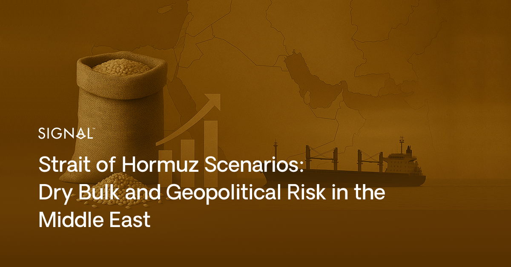
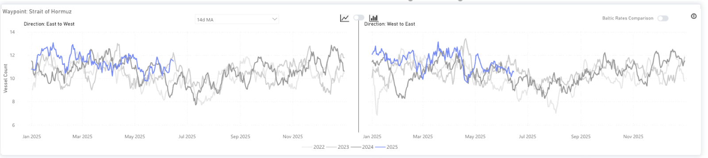
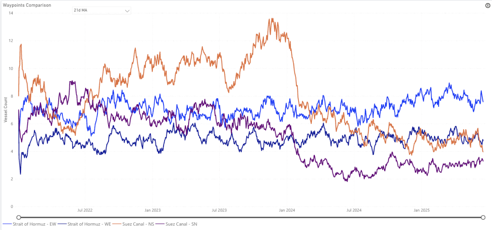
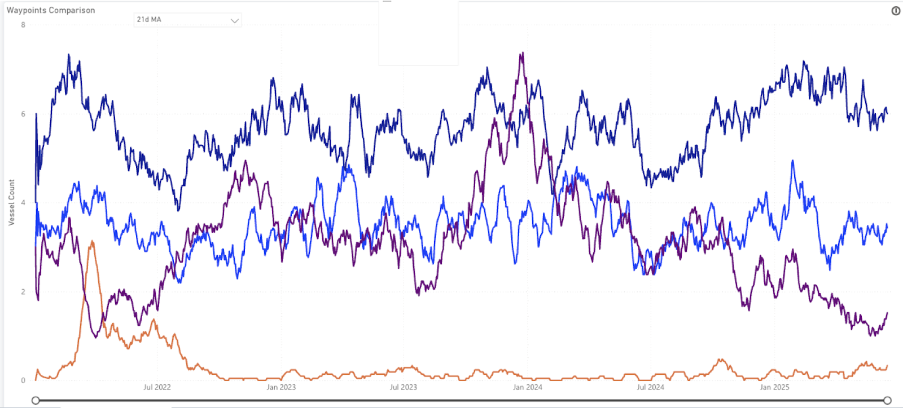
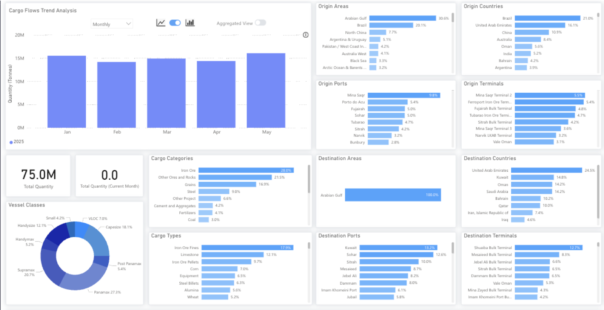
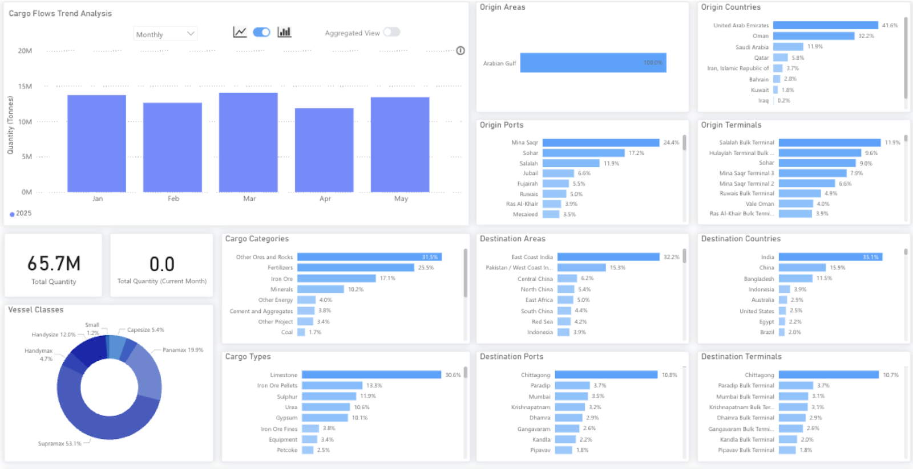

# Impact of Iran-Israel Tensions on the Dry Bulk Shipping Industry

**Date**: June 18, 2025 | **Category**: Market Insights | **Section**: Newsroom | **Source**: [https://www.thesignalgroup.com/newsroom/geopolitical-spillover-assessing-the-impact-of-iran-israel-tensions-on-the-dry-bulk-shipping-industry](https://www.thesignalgroup.com/newsroom/geopolitical-spillover-assessing-the-impact-of-iran-israel-tensions-on-the-dry-bulk-shipping-industry)

---

## ‍

*Signal Figure*

## Executive Summary:

Escalating tensions between Iran and Israel are analysed for their potential effects on dry bulk markets, particularly concerning the Strait of Hormuz. While historical data indicates a full closure by Iran is improbable, disruptions via attacks, mines, or vessel harassment could significantly affect shipping routes and freight rates, but unlike in oil, it will have a negligible effect on dry bulk commodities. Iran and China have a strategic relationship in the oil market, but in terms of dry bulk, Iran is not a notable exporter. The report details two scenarios: a complete closure and a partial disruption, examining their respective consequences and possible mitigation strategies.

## Table of Contents

1. Current view of the market2. Scenario Analysis- Scenario A: Full Closure- Scenario B: Disruption

3. Why a Long-Term Closure Scenario is Considered Not Strategic for the Iranian Oil Revenue Industry4. Conclusion‍

## Current view of the dry bulk market in the Strait of Hormuz

For a strategic overview of the importance of the Strait of Hormuz, please see our first report focusing on how tanker markets have been affected by the situation in the Middle East.

The dry bulk market is expected to be less affected by the ongoing situation between Iran and Israel; however, examining the current situation can help determine the best way to position oneself in the market. Given that the region bordering the strait is a net importer of dry bulk, particularly of raw materials needed for the construction sector, and grain, we see many more laden vessels enter the strait, east to west, than exit, west to east.

Currently, the vessel count in the Strait moving in both directions sits within the recent year averages, and follows the typical seasonality, indicating the market is currently comfortable with the risk presented by the situation. The Strait appears to be more resilient against the wider geopolitical uncertainty in the Middle East than other nearby passages, such as the Red Sea. The Suez Canal has seen a real decline in traffic since the beginning of 2025, when the security of vessels became a key concern, yet the Strait of Hormuz has continued with consistent levels of vessel traffic.‍

*Waypoint analysis of the Strait of Hormuz from the Signal Ocean Platform (TSOP)*

‍

*Signal Figure*

*Laden vessel count in the Strait of Hormuz vs Suez Canal from the Signal Ocean Platform (TSOP) as of Tuesday, 17 June 2025‍*

‍

*Ballast vessel count in the Strait of Hormuz vs Suez Canal from the Signal Ocean Platform (TSOP) as of Tuesday, 17 June 2025‍*

## 2. Scenario Analysis

## Scenario A: Full Closure of the Strait

The worst-case scenario for shipping due to the ongoing tensions would be a complete closure of the Strait of Hormuz, preventing any vessels from entering or exiting. This would have a real impact on trade flows, and although not large in tonnage terms, it would have a significant effect on many of the Gulf countries. Reduced grain imports would weaken food security, and fewer arrivals of raw materials would interrupt the vast construction projects ongoing in the region. This would then have a wider impact on the Gulf countries' GDP and be quite inflationary if the blockade were to persist.

The UAE would be particularly vulnerable to a complete closure of the Strait. So far in 2025, the country has received 25% of all dry bulk tonnage arriving in the Arabian Gulf, but only around 5% of those imports have arrived at Fujairah, a port accessible without passing through the Strait. Other importers in the Gulf, mainly Saudi Arabia and Oman, have ports outside the Strait, so the impact will be more in terms of logistics that need to be adapted.

The UAE also leads in terms of dry bulk tonnage export from the Arabian Gulf, leaving the Arabian Gulf at close to 42%. Again, only a small amount of these exports leave from Furjariah. A full closure would lead to much higher congestion at this port, likely leading to higher freight rates due to the bottlenecks, higher risk premiums, and scarce loading capacity.

*Dry Bulk flows to the Arabian Gulf from the Signal Ocean Platform (TSOP) YTD*

## ‍

*Dry Bulk flows from the Arabian Gulf from the Signal Ocean Platform (TSOP) YTD*

‍

## Scenario B: Partial Disruption

A scenario deemed more realistic currently is that the Strait of Hormuz may become partially disrupted. This could be a result of Iran-backed attacks or the hijacking of vessels. Further to this, Iran could utilise its influence over militant groups like the Houthis, who have a track record of attacks on vessels in the Red Sea, to disrupt shipping operations further afield in the region. In this instance, some ship owners could avoid the region, reducing the availability of vessels, raising the cost of freight moving to the Arabian Gulf. However, given that the region is not a large player in global dry bulk terms, overall freight rate effects would be negligible.

## 3. Why a Long-Term Closure Scenario is Considered Not Strategic for the Iranian Oil Revenue Industry

Iran, a significant global oil exporter, primarily sends its oil to China, a crucial partner in Asia. Notably, Iranian oil sales to China saw a rise in mid-March, preceding increased U.S. sanctions. This mid-March increase was the fourth set of sanctions Washington had placed on Iran's oil industry since February, when President Trump announced the reinstatement of a "maximum pressure" approach intended to completely stop the country's oil exports. Should Tehran escalate further by attacking tankers to disrupt shipping, similar to its actions during the Iran-Iraq war in the 1980s, Iranian oil revenues would suffer. This is because China is Iran's only major strategic oil trading partner, importing over 1 million barrels daily. In the case of an increased Iranian oil supply disruption, China could likely seek to strengthen its existing partnership with Brazilian oil companies; however, it is uncertain if this would be able to fully replace Iranian oil supplies.

## 4. Conclusion

The situation between Iran and Israel is complex and ever-changing, with any forecasts beyond the next few minutes being speculative. The longer to conflict continues, the more unlikely a full closure of the Strait of Hormuz becomes, and we don't expect the conflict to have much of an effect on dry commodity prices or bulk freight rates in the wider sector.Stay updated with platform enhancements, insights, and market analysis. For demo inquiries,reach outto us and visit theSignal Ocean Newsroomfor the latest updates on market trends and platform developments. To check out our previous newsroom articleclick here.
