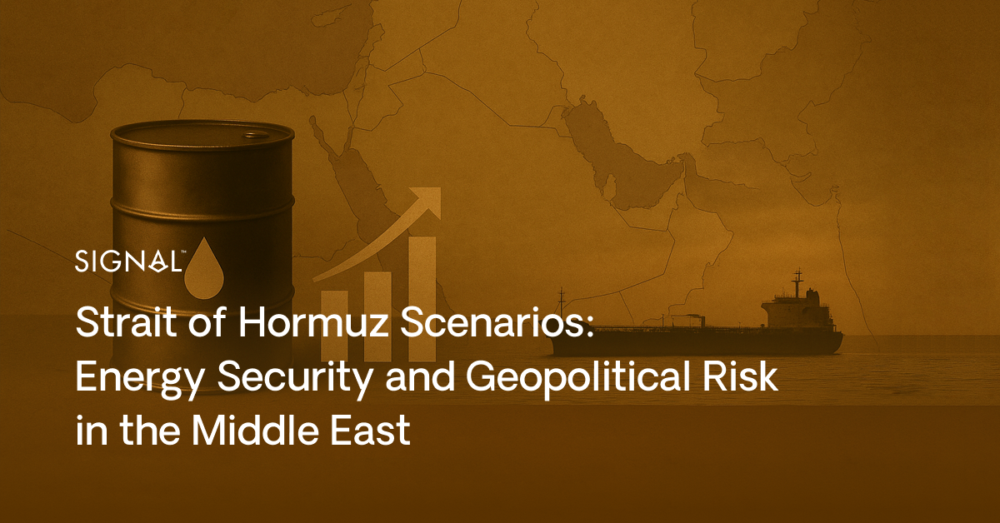
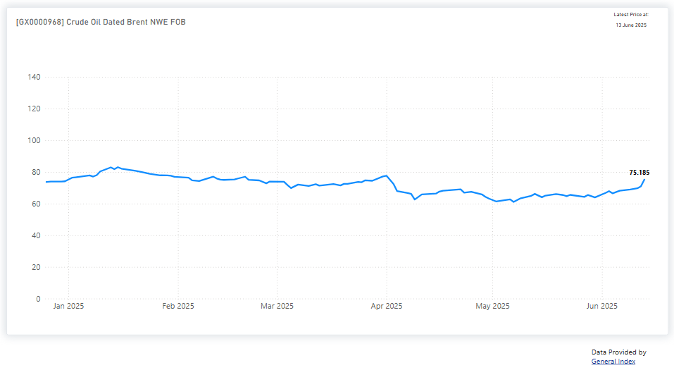
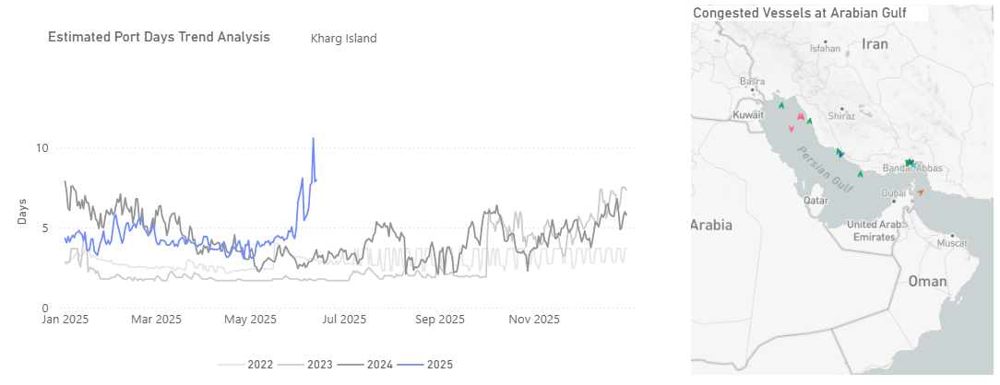
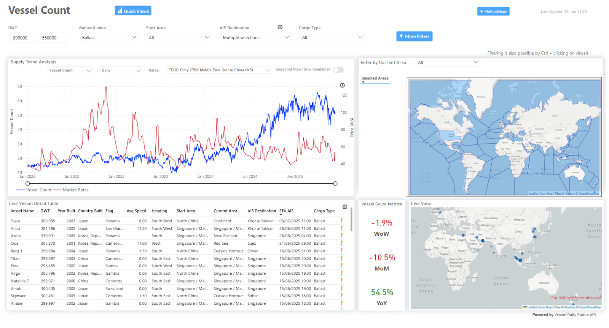
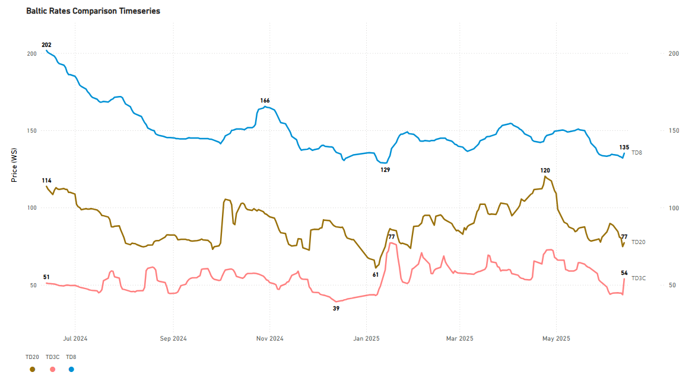
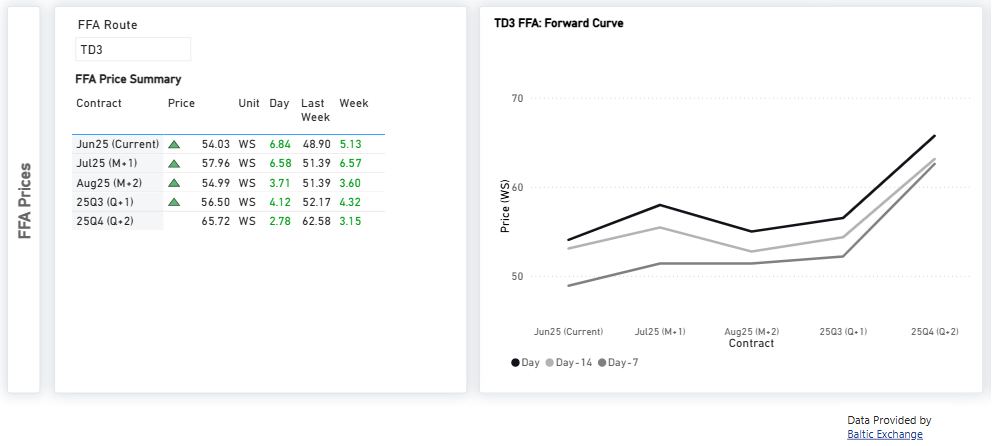
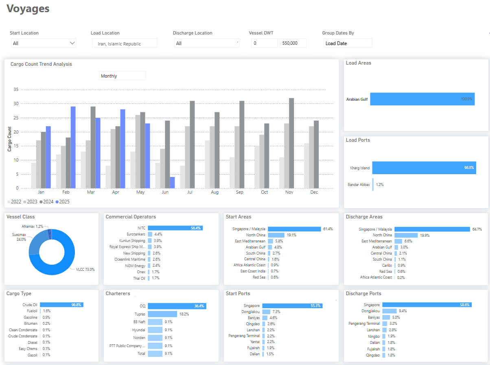

# Iran-Israel Tensions: Impact on Tanker Shipping

**Date**: June 17, 2025 | **Category**: Market Insights | **Section**: Newsroom | **Source**: [https://www.thesignalgroup.com/newsroom/geopolitical-spillover-assessing-the-impact-of-iran-israel-tensions-on-the-tanker-shipping-industry](https://www.thesignalgroup.com/newsroom/geopolitical-spillover-assessing-the-impact-of-iran-israel-tensions-on-the-tanker-shipping-industry)

---

*Signal Figure*

## Executive Summary:

Escalating tensions between Iran and Israel are analysed for their potential effects on global energy markets, particularly concerning the Strait of Hormuz. While historical data indicates a full closure by Iran is improbable, disruptions via attacks, mines, or vessel harassment could significantly affect oil prices, shipping routes, and freight rates. Given China's position as Iran's primary oil buyer and strategic ally, a sustained closure would negatively impact Iran's revenue. The report details two scenarios: a complete closure and a partial disruption, examining their respective consequences and possible mitigation strategies.

## Table of Contents

1. Strategic Context2. Port Infrastructure and Freight Market Impacts3. Scenario Analysis- Scenario A: Full Closure- Scenario B: Disruption4. Implications for Asian Partners5. Strategic Alternatives7. Conclusion8. Appendix

## 1. Strait of Hormuz: Strategic Context

The Strait of Hormuz is one of the world’s most critical maritime chokepoints and plays a central role in global energy trade as it connects the Persian Gulf to the Gulf of Oman and the Indian Ocean.

In 2023, an estimated 20.9 million barrels per day of petroleum liquids transited through the strait, according to the U.S. Energy Information Administration, accounting for approximately 20% of global consumption and over a quarter of all seaborne oil exports. Despite its strategic sensitivity, the Strait has remained operational through some of the most volatile periods in modern Middle Eastern history.

## Risk Overview

During the Iran-Iraq War (1980–1988), particularly in the so-called "Tanker War" phase, both nations targeted oil tankers transiting the Gulf; yet the Strait itself was never fully closed. The U.S. and its allies intensified naval escorts and mine-sweeping operations to ensure the uninterrupted flow of oil, underscoring the global imperative to maintain the route's accessibility. Iran has frequently threatened to shut the Strait in response to sanctions or military pressure, using it as a strategic deterrent. However, a total closure would mark an unprecedented escalation with far-reaching consequences, not only for global energy markets but for Iran itself.

The country relies on the Strait to export its oil and maintain vital economic lifelines with Asia. Given this context, a full blockade remains unlikely. Instead, historical precedent suggests that Iran is more likely to engage in forms of disruption, such as the harassment of commercial vessels, drone attacks, or mine-laying operations. These actions signal intent without provoking an overwhelming international response.

## 2. Port Infrastructure & Freight Market Impacts

Recent developments triggered a sharp surge in oil prices, with Brent crude rising from the mid-$60s to the mid-$70s as of Friday, June 13, reinforcing the upward momentum that had begun earlier in the week. This spike echoed the market reaction during the early stages of the Russia-Ukraine conflict when oil prices climbed even higher due to disruption risks tied to Russia’s role at the time as the world’s third-largest oil producer.

The current rally appeared to stem from a localized but volatile threat landscape, most notably the risk of a closure of the Strait of Hormuz, a vital chokepoint for global oil flows. However, market sentiment has since begun to ease. As of today, the uninterrupted passage of tankers has reduced immediate fears, leading to a modest price pullback and suggesting that the geopolitical risk premium may have peaked in the near term.

Nonetheless, the risk of broader regional escalation remains a key concern. A worst-case scenario involving sustained conflict and disruption of flows through the Strait of Hormuz could trigger a severe supply shock. According to JPMorgan, such an escalation could remove well over 2.1 million barrels per day from the market and push Brent crude prices sharply higher, potentially exceeding $100 per barrel.

*https://app.signalocean.com/tanker/dynamic/oil_prices*

‍

## Elevated Risk to Iranian Oil Port Infrastructure

Reports indicate that Israeli strikes targeted defenses near Iran’s key port of Bandar Abbas. Although Iran maintains that operations remain unaffected, any significant damage to this strategically located port, adjacent to the Strait of Hormuz, could disrupt oil vessel traffic. The National Iranian Oil Refining and Distribution Company has stated that its refining and storage facilities remain fully operational and have sustained no damage. Nevertheless, the risk of disrupted oil flows persists, especially given Iran’s past threats to block the strait. The risk of missile attacks on Iranian oil port infrastructure is causing increased uncertainty, evidenced by a rise in estimated waiting times at Kharg Island port. The recently estimated waiting period for vessels has significantly increased to eleven days before the end of last week, up from five days at the start of May. This surge occurred without a corresponding increase in port congestion, as indicated by vessel count.

*https://app.signalocean.com/tanker/dynamic/congestion_report_tanker_download*

## Freight Market - Vessel count in the AG (VLCC)

We have started seeing a reduction in the vessel count at the load area of AG for the VLCC TD3C route, although the WS direction upward trend is not yet significantly pronounced.

## ‍

*https://app.signalocean.com/tanker/dynamic/vessel_count_tanker_downloadable*

*https://app.signalocean.com/tanker/dynamic/market-prices-tankers-downloadable*

## 3. Scenario Analysis

## Scenario A: Full Closure of the Strait

Closure of the Strait of Hormuz could trigger oil price spikes exceeding $100 per barrel, leading to global economic instability and a higher risk of wider conflict. Even countries not directly importing Gulf oil would be affected due to an immediate drop in global supply, driving up prices across the supply chain. Despite geopolitical concerns, JP Morgan anticipates oil prices remaining in the low-to-mid $60s through 2025 and at $60 in 2026, according to their base case forecast. However, they acknowledged that severe worst-case scenarios could potentially double these price levels. A full closure would also cause a temporary surge in dirty oil freight rates, but cargo availability issues would lead to losses in both the short and long term.‍

## FFA Market Signals a Sharp Rise amid Middle East Tensions

*https://app.signalocean.com/tanker/dynamic/market-prices-tankers-downloadable*

‍

Forward Freight Agreement (FFA) market analysts are projecting a significant increase in VLCC earnings on the Middle East Gulf to China route, with July rates expected to exceed $40,000 per day. These FFA projections reflect growing uncertainty and bullish sentiment in the tanker segment as geopolitical tensions escalate.

Given the daily importance of crude oil shipments via the Strait to China, a short-lived closure with increased vessel traffic disruptions is a more likely scenario.

## Scenario B:Partial Disruption

In a scenario where shipping passage disruptions occur, Iran could implement measures such as attacks or hijacking, along with overall strategies to impede oil vessel movements. Iran is also expected to utilize the Houthis' increasing attacks against Red Sea shipping activities, although the Houthis' strength remains uncertain following U.S. efforts to degrade their capabilities since the end of last year. In this scenario, some shipowners may choose to avoid involvement in oil transits through Hormuz, leading to a tighter supply of available vessels for East loadings as they seek safer loading zones in the Atlantic. In such a scenario, Middle Eastern oil exports would be maintained, but the limited availability of vessels would drive up AG dirty oil freight costs, with shipowners pushing for higher freight rates for oil exports through Hormuz. The disruption of oil transit would further extend the rise in oil prices, benefiting U.S. and other global oil producers, particularly those in the Atlantic, who could capitalize on the situation.‍

## 4. Asian Oil Consumption: Why a Long-Term Closure Scenario is Considered Not Strategic for the Iranian Oil Revenue Industry

Iran, a significant global oil exporter, primarily sends its oil to China, a crucial partner in Asia. Notably, Iranian oil sales to China saw a rise in mid-March, preceding increased U.S. sanctions. This mid-March increase was the fourth set of sanctions Washington had placed on Iran's oil industry since February, when President Trump announced the reinstatement of a "maximum pressure" approach intended to completely stop the country's oil exports. Should Tehran escalate further by attacking tankers to disrupt shipping, similar to its actions during the Iran-Iraq war in the 1980s, Iranian oil revenues would suffer. This is because China is Iran's only major strategic oil trading partner, importing over 1 million barrels daily. In the case of an increased Iranian oil supply disruption, China could likely seek to strengthen its existing partnership with Brazilian oil companies; however, it is uncertain if this would be able to fully replace Iranian oil supplies.

*https://app.signalocean.com/tanker/dynamic/oilflows|‍*

While the dashboard indicates that theprimary discharge area is "Singapore/Malaysia" (64.7%), this doesnot reflect the final destinationof the cargo. In reality, most of this oil istransshipped to China, using Singapore and Malaysian ports as intermediate storage or blending points.

## 5. Bypassing the Strait: Strategic Alternatives and Pipeline Options

The United States has, in recent years, become far less dependent on oil from the Persian Gulf because of the rise of fracking and other advanced techniques to extract oil. However, the closure of the Strait, as analyzed above, would be a significant blow for China, which still imports large quantities of oil from the region. In the scenario of a Strait closure, only Saudi Arabia and the United Arab Emirates (UAE) are reported to have operating pipelines that can circumvent the Strait of Hormuz. Saudi Aramco operates the 5-million-b/d East-West crude oil pipeline and expanded the pipeline’s capacity to 7 million b/d in 2019 when it converted some natural gas liquids pipelines to accept crude oil. The UAE links its onshore oil fields to the Fujairah export terminal on the Gulf of Oman with a 1.5 million b/d pipeline. In the case of Iran, the country inaugurated the Goreh-Jask pipeline and the Jask export terminal on the Gulf of Oman with a single export cargo in July 2021. The pipeline’s capacity was 0.3 million b/d at that time, although Iran has not used the pipeline since then. The IEA estimates that around 3.5 million b/d of effective unused capacity from these pipelines could be available to bypass the Strait in the event of a supply disruption

## Strategic reserves

The International Energy Agency is closely monitoring the impacts on oil markets of the Israel-Iran situation. The oil market is currently well-supplied, with non-OECD+ supply forecast to increase by 1.3 mb/d this year, outpacing expected global demand growth of around 700 kb/d. OECD commercial stocks total more than 2.7 billion barrels. IEA countries hold more than 1.2 billion barrels of public emergency oil stocks. In addition, 580 million barrels are held by the industry under government obligations. The IEA’s emergency response system is designed to mitigate the negative economic impacts of sudden oil supply shortages by providing additional oil to the market in the event of a severe disruption.

## Maritime risk security awareness

BIMCO has advised ship owners to implement ship defense measuresoutlined in industry documents, report suspicious sightings to the UK's Maritime Trade Operations, reconsider current routing, and keep seafarer safety in mind, which are among the recommendations it has shared with clients. Larsen said any perception of the United States' involvement will bring greater risks for ships, though so far the U.S. has limited its comments about the strikes, with Secretary of State Marco Rubio describing Israel's actions as "unilateral," and saying on Thursday night "Iran should not target U.S. interests or personnel."

The US-led Joint Maritime Information Center (JMIC) said on Friday that the Strait of Hormuz remains open and commercial traffic continues to flow uninterrupted, and added it has "no indications of an increased threat to the maritime environment."

The JMIC is urging companies to review contingency plans for routing, crew welfare, and emergency response in the event of a significant regional escalation when transiting the Arabian Gulf, Strait of Hormuz, and Northern Arabian Sea. Greece, which has a history of Greek-owned tankers being seized by Iran, is also warning its Greek ship owners and operators to send details of their transits through the Strait of Hormuz.

## Conclusion

Early reports confirmed escalating tensions, with Israel facing intense Iranian missile strikes, while the U.S. urges restraint and pushes for de-escalation to prevent a broader regional conflict. How long Israel and Iran will remain locked in this conflict is of high world uncertainty, as is whether we will see actual disruption to shipping in the Strait of Hormuz. As hours pass, the threat of Iran closing the Strait weighs more on an unlikely scenario, and the most profound risk appears to be the spike in oil prices that will help other oil producers increase production. The economic shock does not seem inevitable, and the sudden oil price surge would increase energy costs and inflation, disrupt not only Asian oil industries but also European ones due to potential widespread energy shortages in the Middle East.

### Appendix: Sources & Links

- SignalOcean Tanker Dashboard: https://app.signalocean.com/tanker/dynamic/oil_prices- Congestion Reports: https://app.signalocean.com/tanker/dynamic/congestion_report_tanker_download- VLCC Market Prices: https://app.signalocean.com/tanker/dynamic/market-prices-tankers-downloadable- EIA Data: https://www.eia.gov- JP Morgan Oil Forecast (2024-2026)‍

## FAQs

### What is the Strait of Hormuz and why does it matter to tanker shipping?

The Strait of Hormuz is one of the world’s most important maritime chokepoints, linking the Persian Gulf with the Gulf of Oman and the Indian Ocean. A large share of global seaborne oil passes through it, so any disruption there can quickly affect tanker movements, freight rates, and oil prices.

### Could Iran fully close the Strait of Hormuz?

A full closure is considered unlikely. Historical precedent suggests that Iran is more likely to pursue partial disruption through vessel harassment, attacks, or mine laying rather than a sustained blockade. A complete closure would also damage Iran’s own oil export revenues.

### How would Iran Israel tensions affect tanker freight rates?

Heightened tensions can tighten vessel availability, increase perceived risk for owners, and push freight rates higher, especially for crude routes linked to the Arabian Gulf. Market sentiment can also lift forward expectations in the FFA market.

### Which tanker routes are most exposed to disruption?

Routes connected to the Arabian Gulf are the most exposed, especially those linked to crude exports moving towards Asia. The Middle East Gulf to China VLCC trade is particularly sensitive to changes in regional security and vessel supply.

### What happens to oil prices when tensions rise in the region?

Oil prices often rise when the market fears supply disruption. Concerns around the Strait of Hormuz can add a geopolitical risk premium, especially if there is a threat to port infrastructure, vessel flows, or export continuity.

### Why is a long term closure not seen as strategic for Iran?

Iran depends on oil exports for revenue, and China remains its key oil buyer. A prolonged closure would disrupt Iran’s own export flows and weaken an important economic relationship, making a sustained blockade less attractive from a strategic and financial perspective.

### Can oil exports bypass the Strait of Hormuz?

Only to a limited extent. Saudi Arabia and the UAE have pipeline capacity that can reroute part of their exports outside the Strait, but these alternatives cannot fully replace the scale of seaborne flows that normally pass through Hormuz.

### What would partial disruption look like in practice?

Partial disruption could involve attacks on commercial vessels, increased security incidents, delays at key ports, higher insurance costs, and more cautious routing decisions by shipowners. This kind of disruption can still tighten supply and raise freight rates without fully closing the route.

### How can shipping markets respond to a major disruption?

Markets may respond through higher freight rates, rerouting decisions, use of strategic oil reserves, and increased monitoring by governments and maritime security bodies. Industry players may also adjust loading strategies and shift focus towards safer regions where possible.

### How can market participants monitor these risks in real time?

They can track vessel movements, congestion, freight rates, oil flows, and regional market signals through platforms such as Signal Ocean, alongside public updates from energy agencies and maritime security bodies.

## Ready to get started with The Signal Group?

Reach outto us and visit theSignal Ocean Newsroomfor the latest updates on market trends and platform developments. To check out our previous newsroom articleclick here.

‍
