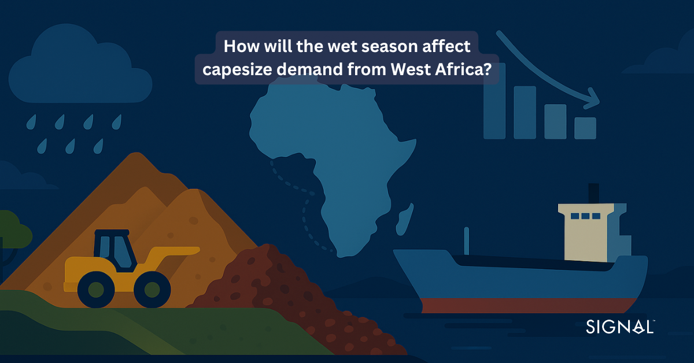
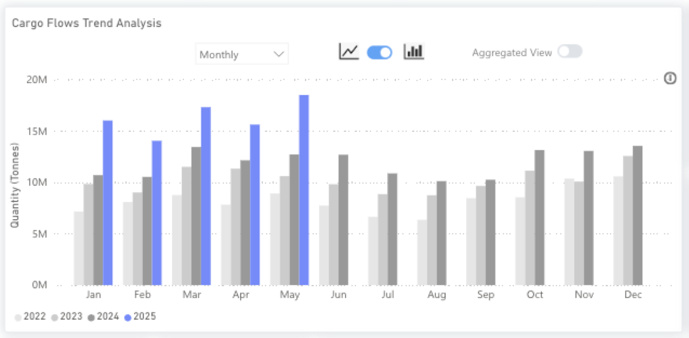
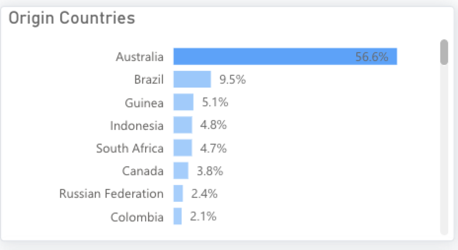
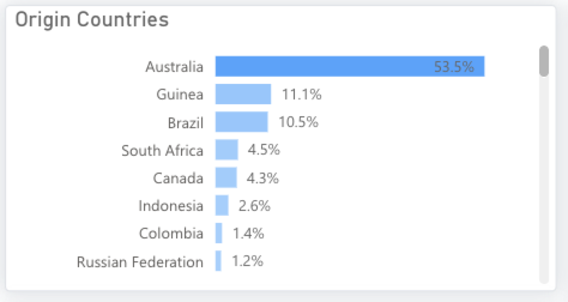
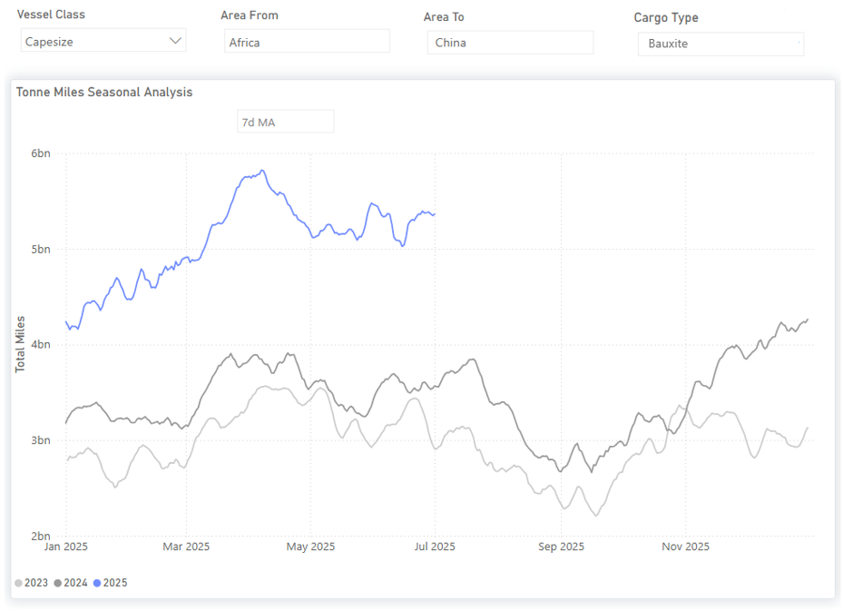
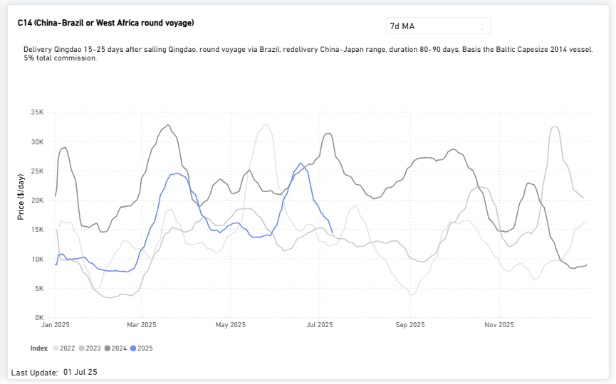
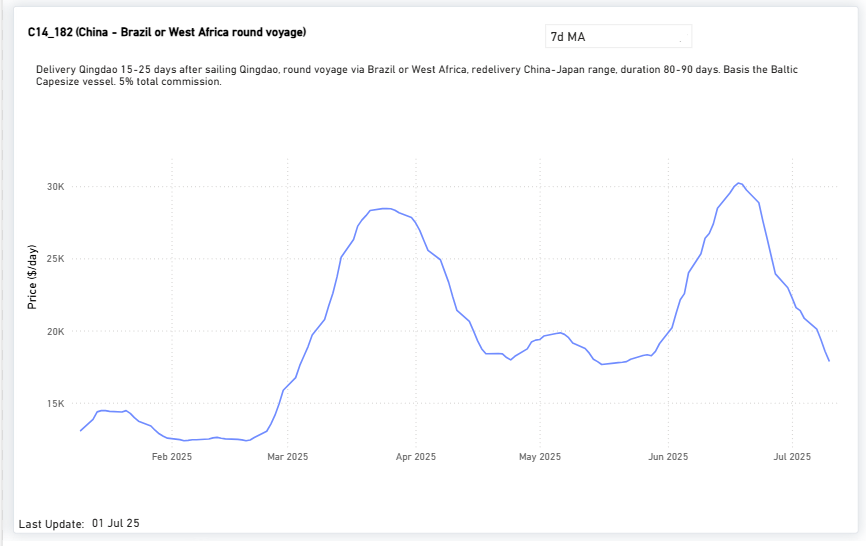
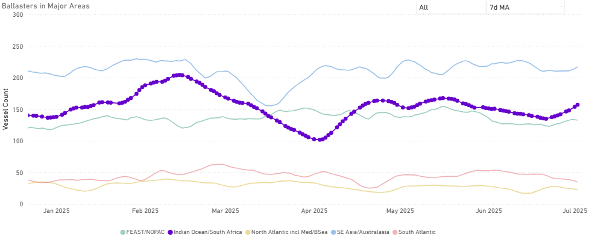

# West Africa’s Wet Season: Impact on Commodities & Capesize Shipping

**Date**: July 3, 2025 | **Category**: Market Insights | **Section**: Newsroom | **Source**: [https://www.thesignalgroup.com/newsroom/how-will-the-wet-season-affect-capesize-demand-from-west-africa](https://www.thesignalgroup.com/newsroom/how-will-the-wet-season-affect-capesize-demand-from-west-africa)

---

## In our recent report onhow bauxite exports from Guinea are driving capesize demand, we explored how surging demand for bauxite from China has led to the aluminium ore overtaking coal as the second-largest capesize-shipped product. This report provides an update and gives a short-term outlook on how the wet season on Africa’s West coast may dampen vessel demand.

*Signal Figure*

## Current performance of bauxite exports

As reported in our last insight on the topic, bauxite exports from Guinea have performed remarkably well so far in 2025, up 37% from last year and 56% from 2023. Chinese demand for the ore to feed its growing aluminium need has been the strongest driver, and over the past decade, Chinese involvement in the country’s bauxite sector has continued to evolve and grow. This took a major step in the early 2020s with major rail and port developments. This has helped bauxite to overtake coal as the second-largest driver of capesize demand globally and has established West Africa as one of the key regions for capes.‍

*Guinea bauxite exports from the Signal Ocean Platform (TSOP)*

‍

*Signal Figure*

*Origin of capesize demand in 2022 vs 2025 to date from the Signal Ocean Platform (TSOP)*

‍

## Seasonality impacts on Capesize vessel demand

Given the geographical location of Guinea, near the equator and the Atlantic Ocean, the country experiences a West African Monsoon season typically between May and October. This period of intense rainfall impacts the entire supply chain, from mine performance to road and rail to port infrastructure.

This is seen in the steady drop-off in bauxite exports during these months from the chart above, with July and August often showing the lowest figures. Therefore, Q3 has historically experienced the lowest export volumes, falling by between 12% and 17% from 2022 to 2024. Asimilar dropin 2025 Q3 vs Q2 could see a fall of around 7Mt of bauxite being exported from Guinea.

However, 2023 and 2024 were particularly wet, with 2024 seeing notable flooding across many West African countries. The drop off in exports in the third quarter of 2023 and 2024 was 14% and 17% respectively, higher than the 12% drop seen in 2022 Q3. The overall expectation for rainfall in Guinea during the 2025 monsoon season is much closer to an average, with coastal regions expecting lower than average rainfall, given the La Nina weather system. However, inland regions are expecting average-to-above-average rainfall over this period, which is more likely to affect mine performance and the infrastructure that links mines to ports. This squeeze on supply also helps to boost bauxite CIF China prices, so miners that can handle the poorer mining conditions are well-positioned from a profitability standpoint.‍

## Demand - Tonne mile seasonal analysis from Africa to China

As seen in the surge of bauxite exports during the first two quarters of the year, the impact on Capesize vessel demand is evident in the increase in tonne-miles. The 7-day moving average has hovered above 5 billion, with a record spike reaching around 6 billion at the beginning of April. This marks the highest tonne-mile level observed over the past three years. In comparison, tonne-mile levels at the end of June were closer to 3 billion in 2023 and 3.5 billion in 2024. It remains to be seen whether the predicted drop in Guinean bauxite exports will also be reflected in a slowdown in tonne-mile growth in the third quarter. If historical seasonal patterns hold, a Q3 decline of around 1 billion tonne-miles is likely. However, this would still mark a higher seasonal low compared to the previous two years, reflecting the stronger-than-usual start to 2025.‍

*Demand seasonal analysis from the Signal Ocean Platform (TSOP)*

‍

This analysis explores whether the surge in bauxite shipments during the first half of this year has had any measurable impact on the Capesize freight market. To do so, we examine the historical evolution of rates on the C14 and the C14_182k dwt route (China–Brazil or West Africa round voyage).‍

*Capesize market prices from the Signal Ocean Platform (TSOP)*

‍

Although these routes are primarily associated with iron ore exports from Brazilian ports, they also reflect the bauxite trade potential from Guinea to China. Notably, two distinct rate spikes were observed, one before the end of the first quarter and another in mid-June, both aligning across these correlated routes in their year-to-date trends.‍

*Capesize market prices from the Signal Ocean Platform (TSOP)*

‍

What’s particularly interesting is that, despite the significant increase in bauxite shipments this year, the recovery in freight rates has not reached historical highs. This may be partially explained by vessel supply dynamics.‍

*Ballasters overview - Capesize insights from the Signal Ocean Platform (TSOP)*

‍

The first quarter began with a strong presence of Capesize ballasters in the Indian Ocean and South Africa. A downward trend followed in April and May, but since June, the number of ballasters has been rising steadily. By the end of June, the 7-day moving average reached an estimated 150 vessels, around 30 more than at the same time last year. This suggests that, even with the boost from higher bauxite volumes, the persistent oversupply of vessels, evidenced by ballaster counts staying well above the average baseline of roughly 100, is keeping downward pressure on the Capesize freight market.

## Key takeaways

South Africa is clearly on an upward trajectory in its mining sector, and this momentum is beginning to be reflected in the dry bulk shipping market. Following a strong start to the year, we anticipate that bauxite and other bulk shipments from the region will surpass volumes seen over the past two years. This growth is contributing to rising tonne-mile demand—particularly on Capesize routes—and is providing underlying support to freight rates, even amid ongoing pressure from elevated ballaster levels. Crucially, South Africa is positioning itself as a long-term, strategic player in global mining. As industry leaders have emphasized, the country is “well-endowed” with mineral resources and currently faces a significant opportunity to expand its mining output and drive broader economic development. This growing export potential suggests that South Africa’s role in Capesize vessel utilization is not only increasing in the near term but is also likely to become a lasting structural feature of the market. This will continue to support vessel demand and help stabilize freight rates along the South Atlantic–Far East corridor, particularly on routes such as C17 (Saldanha Bay–China), while also contributing to the broader Atlantic round voyage trends reflected in the C14 index.Stay updated with platform enhancements, insights, and market analysis. For demo inquiries,reach outto us and visit theSignal Ocean Newsroomfor the latest updates on market trends and platform developments. This article was authored byMaria BertzeletouandLuke Nickels. To check out our previous newsroom articleclick here.
