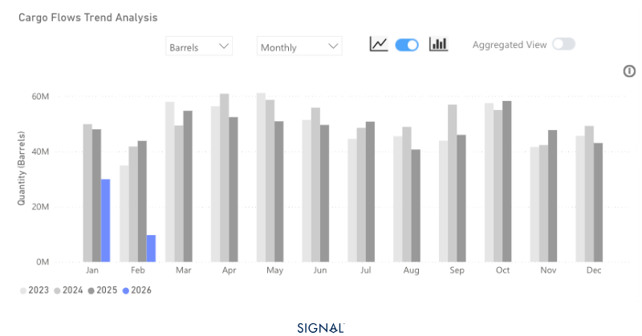
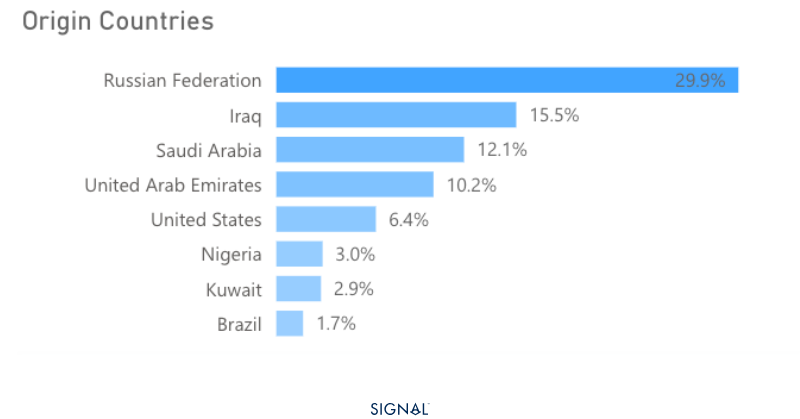

# MARKET INSIGHTS | India Drops Russian Crude, Secures US Tariff Relief

**Date**: February 3, 2026 | **Category**: Market Insights | **Section**: Newsroom | **Source**: [https://www.thesignalgroup.com/newsroom/india-drops-russian-crude-secures-us-tariff-relief](https://www.thesignalgroup.com/newsroom/india-drops-russian-crude-secures-us-tariff-relief)

---

## Market Insights: CRUDE OIL

## Energy Realignment: India Drops Russian Crude, Secures US Tariff Relief

On Monday, 2nd February 2026, U.S. President Donald Trump announced a new trade deal with India. The deal laid out how India will stop purchasing Russian crude oil and import more from the U.S., and possibly Venezuela.

- India has taken a third of all Russian crude exports since February 2023. This equates to over 1.8bn barrels of oil.
- Steep discounts on Russian oil have been the driving factor for India's sourcing from Russia in recent years.
- No confirmation yet from India around if domestic refiners will be told to completely halt Russian imports. If they do, oil prices could jump as replacement barrels are sought despite a well-supplied market.
- The U.S. will cut tariffs on Indian goods to 18% from the current 50% if India stops buying Russian crude.

*Source:Crude oil flows from Russia to India from Signal Ocean*

India’s continued buying of Russian crude oil despite pressure from the West has been a source of strain between the two regions. The latest deal announced by President Trump on Monday looks set to ease the tensions.

Since February 2023, TSOP recorded that India has been the destination for a third of all Russian crude flows, accounting for around 1.8bn barrels. This highlights how crucial the Russia-India relationship has been for Russia. The deal would turn this on its head and see India replacing the Russian crude oil with shipments of crude from the U.S. or even Venezuela.

India imported a total of 2.1bn barrels of oil in 2025, with only 6% coming from the U.S. and 30% from Russia. The large discounts on Russian crude have been the driving factor for this. Displacing the entirety of this Russian crude would be a lucrative trade for the U.S. and would see an extra 640m barrels of U.S. oil sent to India. Yet this move would heap pressure on those covering the freight costs, given the much-increased distance between the U.S. Gulf and Indian ports. Historically, prices have needed to be competitive enough that freight costs do not significantly alter the economics.

TSOP has already started to see India taking less Russian oil, though, and has reported on ithere. It would be logical that India’s imports of Russian crude trend down rather than drop off instantly, given there has been no confirmation from India yet that refiners will completely halt Russian imports. Despite the market being well supplied, a sudden shift in buying like this from India would inevitably drive oil prices higher, even for a short period of time.

The tariff reductions do, though, offer significant upside for India if it can manage the replacement of Russian crude. The 50% tariff on Indian goods has remained a strong barrier to finished goods entering the U.S. market. These tariffs falling to 18% boost the price competitiveness of Indian origin good and open up the largest consumer market.

*Source:Indian crude oil sources in 2025 from Signal Ocean*

## Takeaways

India looks deeply incentivised to replace the majority, if not the entirety, of its Russian crude oil imports, with a greater proportion of them coming from the U.S. or Venezuela. Indian refiners have not confirmed if they will completely halt Russian oil imports, and doing so would likely push oil prices up higher. This is driving our view that the imports will see a steep decline rather than an abrupt stop. This is also supported by the fact that cargoes have already been booked for February and March, with Reliance Industries confirming it is doing so in sanction-compliant deals.

The benefit of reduced tariffs on Indian goods, from 50% down to 18%, could be a huge win for India as its goods become more price-competitive instantly and open more possibilities in the largest consumer market.
