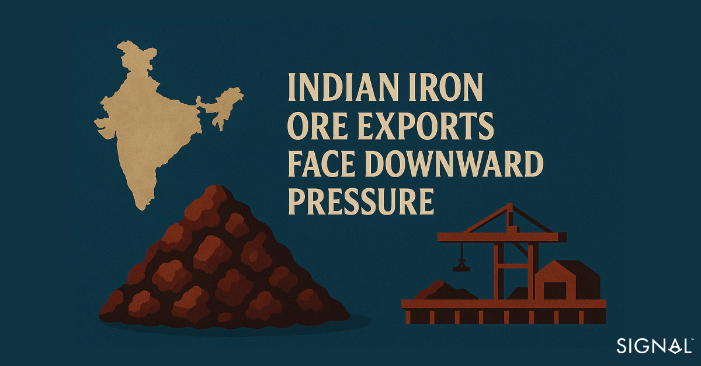
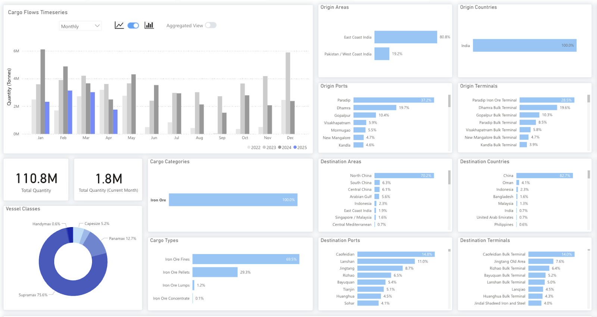
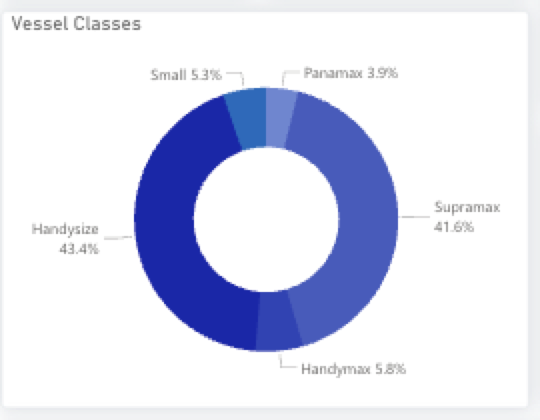

# Indian Iron Ore Exports Face Downward Pressure

**Date**: April 22, 2025 | **Category**: Market Insights | **Section**: Newsroom | **Source**: [https://www.thesignalgroup.com/newsroom/indian-iron-ore-exports-face-downward-pressure](https://www.thesignalgroup.com/newsroom/indian-iron-ore-exports-face-downward-pressure)

---

Through our dry bulk flow tool, we have identified changing trends iniron ore flowsfrom Indian ports. Growing domestic demand from the steel industry and weaker demand from China have led to less iron ore leaving Indian ports so far in 2025. Fully utilizing the dry bulk flows feature enables maritime professionals, as well as shipping companies and logistics firms, to spot, monitor, and forecast the flow of commodities and position themselves to take advantage of changing market conditions. As raw material sourcing fluctuates, this tool enables valuable insight for shipping companies and firms operating in the dry bulk sector into this ever-changing landscape. This report illustrates how Supramax demand from India may come under considerable pressure for the rest of 2025.

*Signal Figure*

## Iron ore flows from India slip from previous highs

India is the fifth-largest exporter of iron ore globally and sends the vast majority to mainland China. Seaborne iron ore flows leaving India are concentrated at three major ports: Paradip, Dharma, and Gopalpur, which account for over two-thirds of the iron ore leaving India. The vessel type is also very concentrated to ships such as capesize and supramax, which transport about 75% of the iron ore leaving India by sea.

Yet in 2025, total seaborne iron exports figures appear considerably weaker than those in the same period of previous years. This is despite a rise in iron mine output, according to the Ministry of Mines in India, as iron ore export volume was higher in previous years.

*Signal Figure*

## Domestic needs and sliding Chinese demand weigh on iron ore exports.

The two reasons for the weaker exports are occurring at both ends of the supply chain. The first reason is that India is growing in its domestic steel production capacity, which requires greater quantities of iron ore. India is already the second largest steel producer, behind China, and plans to increase capacity to 300 Mt by 2030, needing an annualised growth rate of around 5% each year. The steel sector in India has received comprehensive long-term support from the national government through initiatives like the National Steel Policy 2017, which aims to develop India into a technologically advanced steel manufacturing hub. There has also been substantial investment from both domestic and international players in the Indian steel industry.

India is experiencing rapid urbanisation and spending on construction and infrastructure projects as the most populous country in the world looks to develop. The current trajectory of house building, a major steel-consuming sector, would see an additional 25 million housing units built by 2030. This is alongside all the infrastructure needed to accommodate such a growing population, steel demand, and as a result, iron ore demand, will continue to accelerate.

The second, and maybe most impactful, reason is that Chinese demand for iron ore is falling. The National Development and Reform Commission (NDRC) of China plans to restructure the domestic steel industry by cutting production, with many market analysts expecting the reduction to be around 50 million tonnes. This would likely mean a decrease in iron ore demand of around 75 million tonnes.

The restructuring is important for two key reasons. The first is that China wants to help stabilise profits for the domestic steel industry. China has faced persistent overcapacity in the steel industry, and profits have been in decline for steel mills for several years. China also relies on exports of steel to manage this surplus, but the world is becoming a much harder place to export Chinese steel, as many regions introduce more protectionist policies.

The second is that China is actively looking to reduce carbon emissions. The steel industry is responsible for between 15% and 20% of all carbon emissions within the country. The reduction in capacity will likely target old, inefficient blast furnace operations, as they emit between 5 to 7 times the amount of carbon dioxide per tonne of steel produced compared to a new EAF (electric arc furnace). Currently, around 90% of the steel made in China is made using a blast furnace.

## Future outlook

Given India will continue to increase steel production, the country will require greater quantities of domestic iron ore, leaving less for export. Furthermore, restructuring of the Chinese steel industry will also result in softer demand for iron ore from India. This will put pressure on surpamax demand loading at Indian ports, with Dhamra and Paradip likely to be most affected, given that iron ore accounts for 87% and 83% of all the cargo from these ports. Over the next five years, forecasts suggest Indian iron ore production and exports may experience moderate growth, influenced by both domestic demand and global market trends.

One thing we could see is greater steel cargoes arriving in India. Demand for steel from construction and infrastructure projects could outpace the increase in domestic steel production, leading to the need for greater steel imports. Given that steel is typically shipped to India via supramaxes or handysize, this could mean that more Supramax vessels are unloading in India without a new cargo to load.

*Signal Figure*

## Key takeaways

Weaker demand from China and increased consumption domestically have led to falling exports of iron ore from India. Supramax vessels are most exposed to this, as iron ore accounts for 47% of all the cargo carried by them out of India. As a result, supramax vessels arriving in India will be competing for fewer cargoes and will likely see rates drop. This would be amplified if India imports more steel, as 42% of steel imports to India are carried by supramaxes. Greater steel imports into India would be an expected outcome if domestic steel production capacity growth does not match or exceed that of steel demand in the country.Stay updated with platform enhancements, insights, and market analysis. For demo inquiries,reach outto us and visit theSignal Ocean Newsroomfor the latest updates on market trends and platform developments. To check out our previous newsroom articleclick here.
