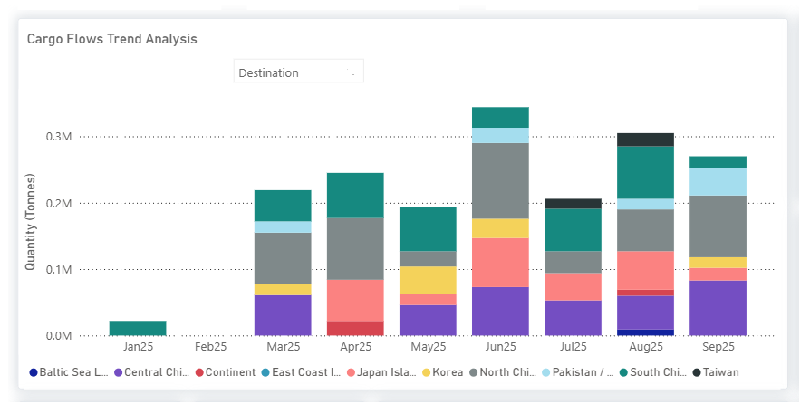
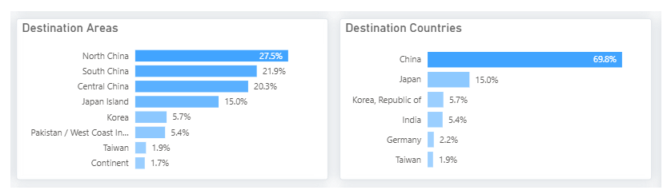
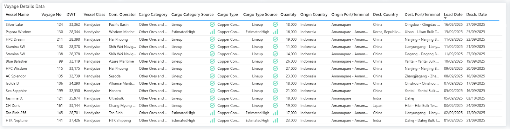

# Indonesian Copper Flows to China at Risk in October

**Date**: October 7, 2025 | **Category**: Market Insights | **Section**: Newsroom | **Source**: [https://www.thesignalgroup.com/newsroom/indonesian-copper-flows-to-china-at-risk-in-october](https://www.thesignalgroup.com/newsroom/indonesian-copper-flows-to-china-at-risk-in-october)

---

## MARKET INSIGHTS: DRY BULK FLOWS | COPPER

## Indonesian Copper Flows to China at Risk in October

- ASeptember accidentat Grasberg, Indonesia’s key copper mine, has triggered aforce majeure.
- Exports to Asia, especially China, are set to declinestarting in October.
- Peaks around0.3–0.35M tonnes(June, Aug).
- Chinese buyers are likely to seek alternatives(Chile, Peru) to cover supply gaps.

The Signal Ocean Cargo Flows Trend Analysisenables users to filter byOrigin: IndonesiaandDestinations: China, Japan, Korea, Taiwan, and India. It also supports toggling between aggregated and detailed views, providing greater flexibility and control over the displayed data.

*Signal Figure*

The September 8 accident at Indonesia’s Grasberg copper mine is expected to disrupt exports to Asian markets, particularly China. Although a force majeure has been declared, the impact is unlikely to be reflected in September shipments, as some cargoes had already been loaded or were en route.

*Signal Figure*

The voyage details highlight a series of copper concentrate shipments from Amamapare, Indonesia, during early to mid-September 2025, a period that coincides directly with the Grasberg mining accident on September 8. The data shows a clear dominance of China as the key destination market, with indicative fixtures discharging at major smelter hubs such as Qingdao, Nanjing, Lianyungang, Yantai, and Zhangjiagang. Typical parcel sizes range between 14,000 and 27,000 tonnes, carried primarily on Handysize vessels due to port draft restrictions. Taken together, these voyages represent some of the last uninterrupted flows before Grasberg’s suspension, confirming both China’s reliance on Indonesian supply and the potential scale of disruption in October.

*Signal Figure*

‍From October onward, export disruptions are set to strain copper markets, leaving Chinese buyers with narrowing options for alternative supplies.

With Indonesia’s recent supply disruption, attention has shifted toward Chile, Peru, and the Democratic Republic of Congo as possible fallback sources. Chile, however, faces its own pressures: national output declined by nearly 10% year-on-year in August, a fatal accident at Codelco’s El Teniente mine reduced production by ~33,000 tons, and the company has trimmed its 2025 forecast. Additional operational challenges, including a fire at Glencore’s Lomas Bayas mine and earlier smelter issues at Altonorte, add to uncertainty.

Taken together, these developments point toward a more constrained copper supply picture. For China, the world’s largest copper consumer, options appear more limited than before, suggesting a period of tighter balances and heightened market sensitivity to future disruptions.

Stay ahead of the curve. Get access to theSignal Ocean Platform.
