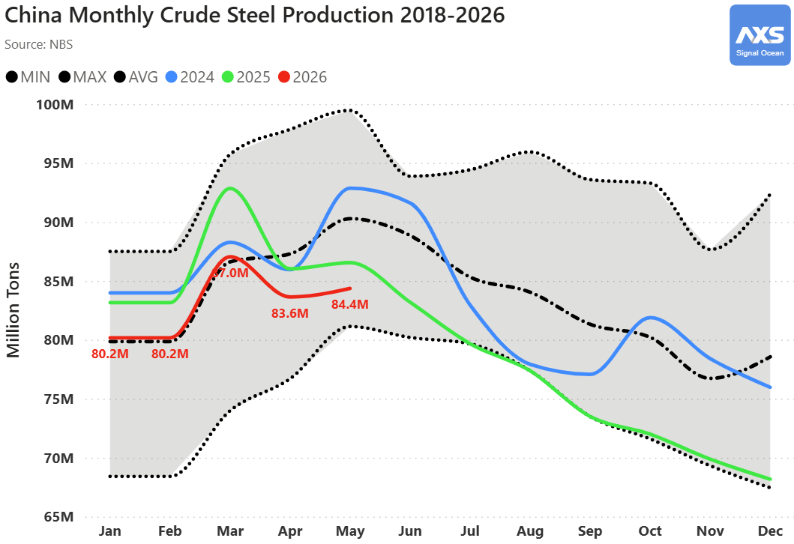
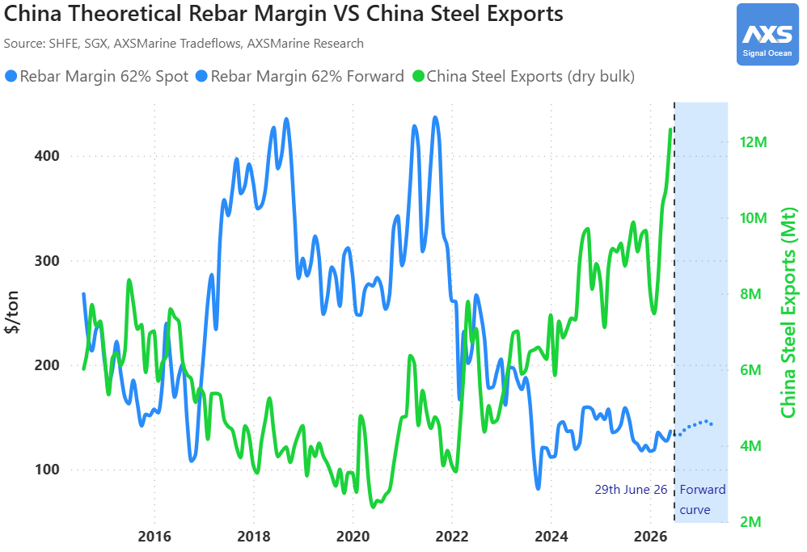
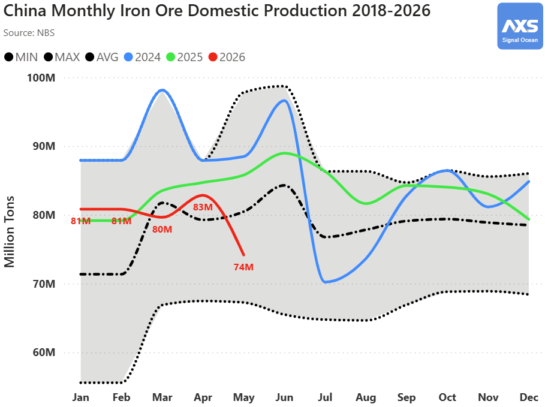
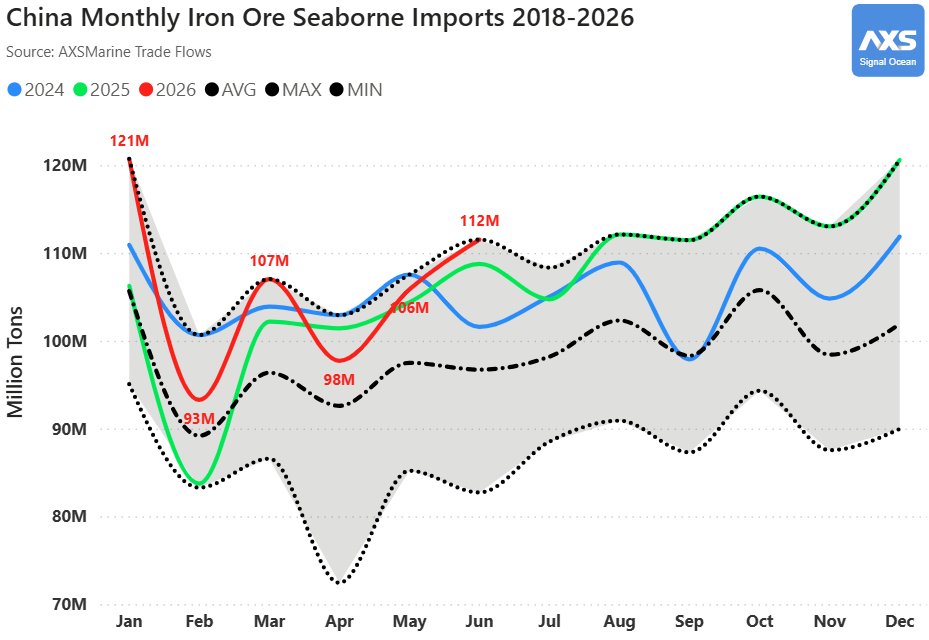
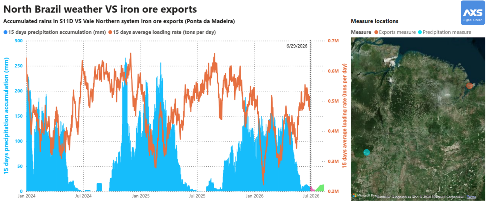
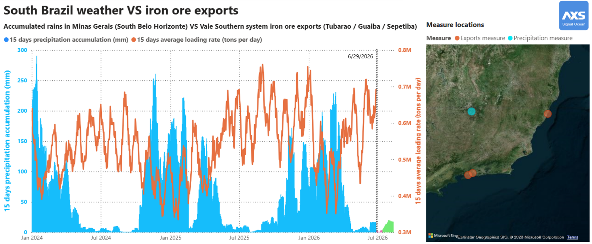
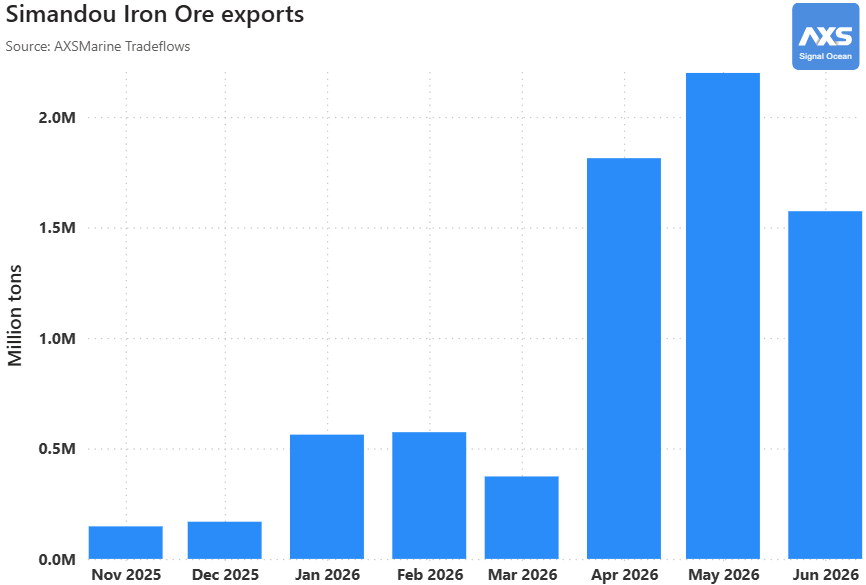
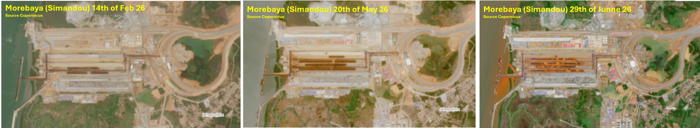
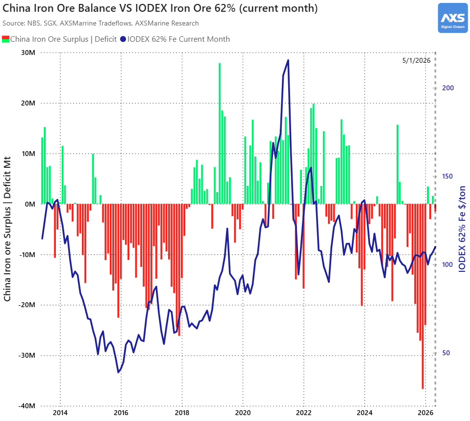

# Iron Ore Surplus Builds as Chinese Steel Margins Remain Under Pressure

**Date**: June 30, 2026 | **Category**: Market Insights | **Section**: Newsroom | **Source**: [https://www.thesignalgroup.com/newsroom/iron-ore-surplus-builds-as-chinese-steel-margins-remain-under-pressure](https://www.thesignalgroup.com/newsroom/iron-ore-surplus-builds-as-chinese-steel-margins-remain-under-pressure)

---

## Iron Ore Surplus Builds as Chinese Steel Margins Remain Under Pressure

China’s steel market continues to show signs of softness. The National Bureau of Statistics reported crude steel production fell 2.5% year-on-year in May 2026 to 84.4 million tons, while pig iron — produced via blast furnace — declined 1.5% to 72.9 million tons.

*Signal Figure*

Domestic conditions remain under pressure. China’s theoretical rebar margin* stays near decade lows, a level that has historically shown an inverse correlation with strong steel export volumes**. Elevated exports signal weak domestic consumption, compressing mill profitability. And the rebar margin forward curve, despite being slightly in contango, does not suggest, as end of June, any meaningful improvement.

*China Theoretical Rebar margin ($/t) = Rebar (SHFE) – 1.6 Iron ore 62% (SGX) – 0.66 Coking coal (SGX)

** China Steel Exports (dry bulk shipments only, it does not consider containerized steel exports)

*Signal Figure*

On the supply side, domestic iron ore production — lower-grade than seaborne material — dropped sharply by 13.5% to 74.2 million tons (equivalent to 27.5 million tons at 62% Fe), suggesting some adjustment on the supply side but not enough to rebalance the market.

*Signal Figure*

Despite this domestic pullback, seaborne arrivals continue to flow in, up 4.8% year-to-date to 636 million tons including June discharges expected at 111.6 million tons.

*Signal Figure*

Brazil and Australia are the main drivers of this trend. Also, Brazil volumes from both the Northern and Southern systems are expected to stay elevated until December, when the rain season begins.

*Signal Figure*

*Signal Figure*

Adding to supply pressure, the Baowu/Winning Consortium and Simfer operating the Simandou mine have shipped a combined 7.4 million tons across 35 cargoes since November 2025.

*Signal Figure*

June, however, saw a slowdown: loadings dipped 0.6 Mt to 1.5 million tons, as Guinea’s rainy season is now affecting mining and loading operations — elevated moisture content is visible in recent satellite imagery of the Morebaya stockpile.

The orange coloration in the stockpile reflects elevated moisture, a direct consequence of Guinea’s rainy season. Loading rates are expected to recover once conditions improve.

*Signal Figure*

These supply dynamics point to a market that remains well-supplied. The iron ore balance has been in surplus since mid-2025, triggering a rise in inventories now at 160 Mt according to Steelhome. With Brazilian volumes on an upward trajectory and Simandou ramping up, the balance* is likely to remain in surplus for the rest of 2026 — unless China increases crude steel output or cuts domestic iron ore production further. A key downside risk: should Chinese steel exports face new tariffs, reduced export capacity could push domestic steel inventories higher, weigh on prices, and further compress steel margins which could affect iron ore price on the downside.

*Signal Figure*

*Balance Methodology: Iron ore needed from Pig Iron production NBS – (China Domestic iron ore output Fe adjusted NBS + China Iron Ore seaborne import Fe adjusted AXSMarine Tradeflows)
