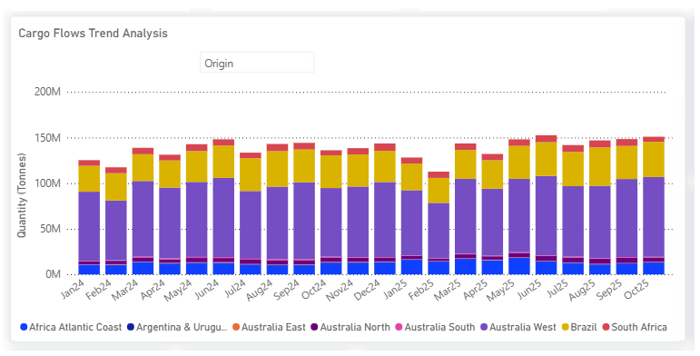
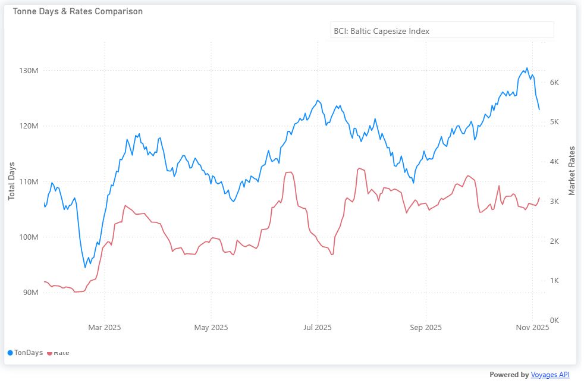
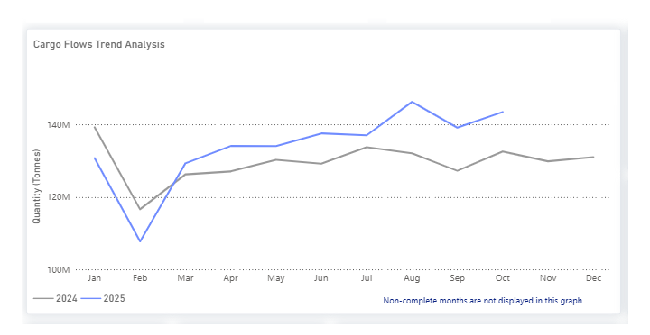

# Iron Ore’s Shifting Currents: Supply Surge Meets China Slowdown

**Date**: November 11, 2025 | **Category**: Market Insights | **Section**: Newsroom | **Source**: [https://www.thesignalgroup.com/newsroom/iron-ores-shifting-currents-supply-surge-meets-china-slowdown](https://www.thesignalgroup.com/newsroom/iron-ores-shifting-currents-supply-surge-meets-china-slowdown)

---

## Simandou and Australian Supply Expansion Promise a Boost to Capesize Tonnage, but Iron Ore Prices Face China Headwinds

*https://app.signalocean.com/dry/dynamic/drybulkflows*

## Australia, Brazil, and West Africa Lead the Charge

In the Pilbara, BHP is doubling down on growth, pledging A$1.4 billion to enhance Port Hedland infrastructure and sustain export capacity near 305 million tonnes per annum (Mtpa). The investment signals confidence in steady, high-volume output from Western Australian miners through 2026.

Brazil’s Vale posted 94.4 Mt in Q3 2025, its strongest quarterly output since 2018, keeping it on track for the top end of its 325–335 Mt guidance. Stronger performance from the Northern System and better weather lifted loadings from Ponta da Madeira and Tubarao, cementing Brazil’s role in the Atlantic-to-Asia trade.

## Simandou Nears Launch, Redefining Atlantic–Pacific Iron Ore Trade Routes

In West Africa, momentum is finally building. Simandou in Guinea is moving from construction to early stockpiling, with first shipments expected in late 2025. The long-awaited, high-grade project could redefine trade patterns, positioning West Africa as a new long-haul supplier to China.

## Tonne-Mile Growth Fuels Capesize Rally as Long-Haul Flows Expand

For the freight market, the implications are clear. The recent increase in iron ore supply from major export hubs such as Australia, Brazil, and emerging West African origins is already visible through a sharp rise in tonne-days, up by roughly 25–30% since early 2025. This surge reflects stronger long-haul activity and greater tonnage absorption, supporting improved Capesize rate performance and a sustained recovery in the BCI. Continued expansion of these export flows, particularly from projects like Simandou, is expected to further boost tonne-mile demand and gradually rebalance Atlantic–Pacific trade dynamics.

*https://app.signalocean.com/dry/dynamic/timeseries_dry*

## Chinese Steel Slowdown Offsets Supply Gains - Port Stocks on the Rise

However, the recent renewed supply optimism contrasts sharply with China’s weakening macroeconomic outlook. The world’s largest iron ore importer continues to struggle with a sluggish property sector and compressed steel margins, both of which are limiting restocking appetite.

As illustrated in the chart, iron ore shipments to China have grown markedly in 2025, with monthly arrivals consistently exceeding 2024 levels since March. Volumes climbed from around 115 million tonnes in February to more than 140 million tonnes by October, reflecting stronger export flows from Australia and Brazil.

*https://app.signalocean.com/dry/dynamic/drybulkflows*

Yet this growth in seaborne supply is occurring at a time of soft domestic steel demand and seasonal production slowdowns. Rising port inventories, together with a lack of meaningful policy stimulus from Beijing, have therefore kept spot prices under downward pressure. As winter maintenance cuts steel output, the continued inflow of cargoes risks widening the imbalance between supply and consumption, reinforcing the bearish tone in the iron ore market.

## China Eyes Yuan-Based Iron Ore Pricing

Adding another layer of complexity, discussions are resurfacing about pricing iron ore in yuan rather than U.S. dollars. Such a shift, if it gains traction, would mark a significant geopolitical move, aligning with China’s broader strategy to internationalize its currency and reduce exposure to dollar-denominated commodities. While symbolic for now, yuan-based pricing could eventually alter how iron ore trade and financing are conducted, with potential implications for hedging and contract benchmarks.

In short, the iron ore market is preparing for an influx of supply just as China’s demand signals weaken and currency politics enter the pricing equation. For Capesize owners, this combination could mean greater volatility, but also new opportunities as trade routes diversify and tonne-miles expand.

To read more articles like thesesubscribe hereor email us atresearch@thesignalgroup.com. For demo inquiries,reach outto us and visit theSignal Ocean Newsroomfor the latest updates on market trends and platform developments. To check out our previous newsroom articleclick here.
