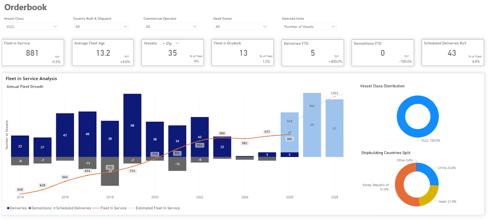
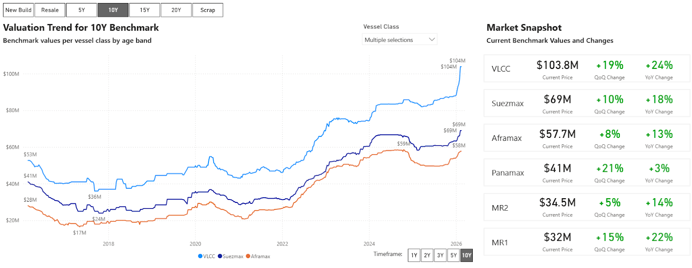
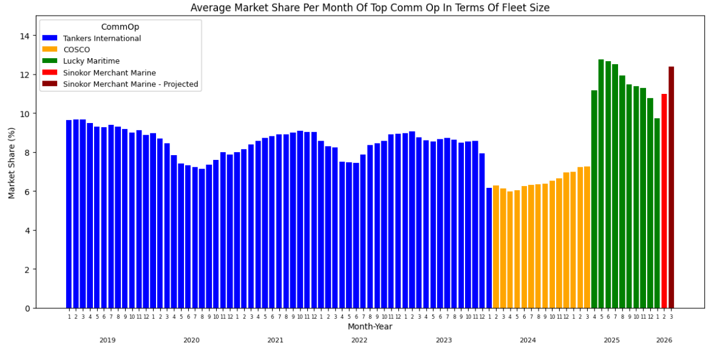
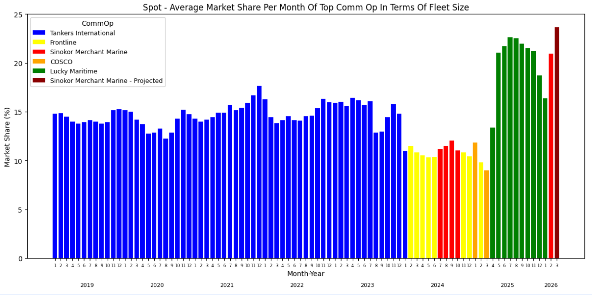
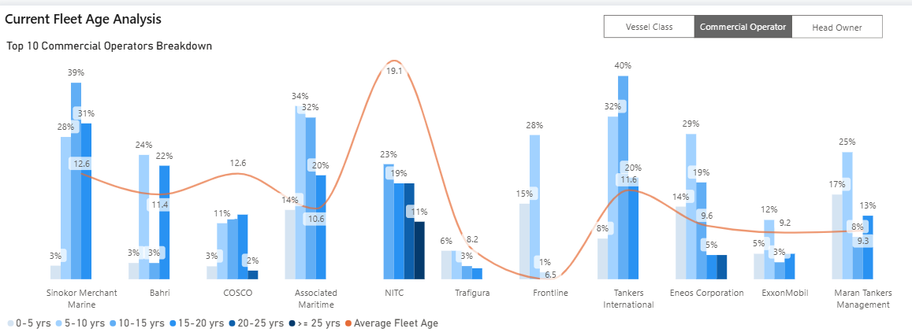
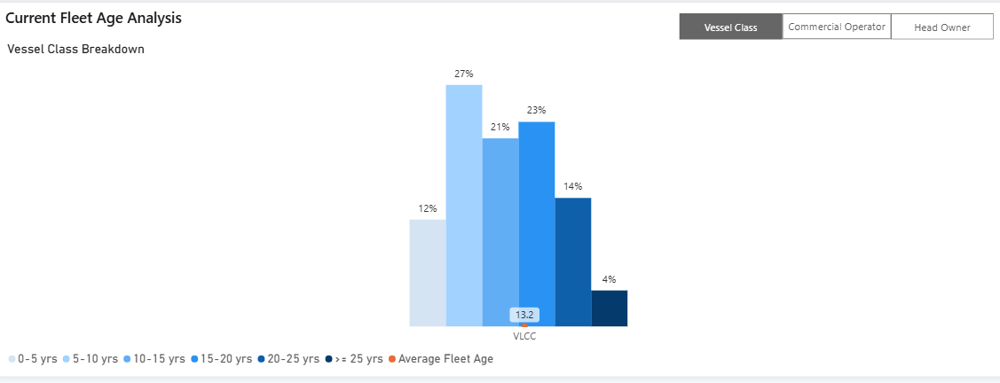

# MARKET INSIGHTS |  A New VLCC Leader - Inside Sinokor’s Market Rise

**Date**: February 18, 2026 | **Category**: Market Insights | **Section**: Newsroom | **Source**: [https://www.thesignalgroup.com/newsroom/market-insights-a-new-vlcc-leader---inside-sinokors-market-rise](https://www.thesignalgroup.com/newsroom/market-insights-a-new-vlcc-leader---inside-sinokors-market-rise)

---

## MARKET INSIGHTS | VLCCs - Entering the Sinokor Era

## Executive Overview

Global VLCC fleet capacity is projected to expand more aggressively through 2028. Taken together, scheduled deliveries from all major shipbuilding countries implyan average annual VLCC fleet growth rate of approximately 6% by 2028, assuming the current orderbook is delivered as planned.

*TSOPOrderbook Insights*

Within this evolving environment,Sinokor Merchant Marine (Sinokor) has expanded its VLCC commercial footprint, positioning itself as the single largest Commercial Operator in terms of fleet size. The company’s timing aligns with a transitional point in the tanker cycle, where the balance between vessel supply growth and effective transportation demand will influence freight rate direction.

Data derived from the Signal Ocean Platform (TSOP) were used to evaluate the impact of Sinokor’s expansion on the VLCC market. The analysis examines fleet size, market share, and age distribution in order to provide a comprehensive and data-driven assessment of how Sinokor’s positioning alters the competitive landscape.

## Sinokor’s Strategic Expansion

Over the past few months, it has been widely reported that Sinokor has embarked on an aggressive expansion in the VLCC segment, targeting both secondhand acquisitions and time-charter arrangements. Market chatter intensified in mid-December, pointing to a notable uptick in tanker S&P activity, although transaction details and counterparties were not yet fully disclosed.

By January, greater clarity began to emerge, with Sinokor identified as the principal buyer behind a substantial number of VLCC transactions. Reported figures varied considerably, with market estimates ranging from 20 to as many as 50 units.

As of today, we have confirmed36 acquisitionsthrough cross-referencing multiple market reports with TSOP vessel lists, which indicate Sinokor as the new Commercial Operator in the majority of cases. Approximately 26 vessels have already been delivered, while a further 10 are scheduled for delivery within the current or early next quarter. This total may increase further as additional transactions are finalized and pending deliveries are completed.

The aggressive expansion of the VLCC fleet is noteworthy, as the decision coincides with an upward trend in benchmark valuation assessments. For instance, the valuation for a 10-year-old VLCC has experienced a 24% annual increase, reaching its highest value in the last decade.

‍

*TSOPValuation Insights*

## Mapping the New VLCC Commercial Order

The objective of this analysis is to quantify the impact of recent acquisitions on the ownership structure of the VLCC market and to place Sinokor’s positioning in a historical context.

For this assessment, the VLCC fleet includes only active, compliant, non-sanctioned vessels with identified commercial operators.

Based on conservative estimates, Sinokor currently controls approximately78 VLCCsactive in the spot market. This figure is expected to rise to at least88vessels within the current quarter, with market reports suggesting the fleet could ultimately exceed100units, potentially reaching120–130vessels.

At the88-vessel threshold, Sinokor becomes the largest commercial operator in the VLCC segment, accounting for roughly24% of the spot-trading fleetand approximately12% of the total global VLCC fleet, an unprecedented level of concentration for a single commercial entity in this market.

To contextualize this development, we examined monthly data from 2019 onward (Chart 1), identifying the leading commercial operator by average fleet size each month.Historically, Tankers International dominated the segment through the end of 2023, with its pooled fleet accounting for close to 10% of the total VLCC fleet. In 2024, COSCO Shipping Energy Transportation emerged as the largest operator, controlling between 6% and 8% of the fleet.

In 2025, Sinokor and Trafigura jointly marketed their vessels under the Lucky Maritime platform, at times surpassing 12% of total VLCC capacity. Following the dissolution of that partnership in January 2026, Sinokor consolidated its position independently.

With its confirmed acquisitions, Sinokor now stands as the largest single commercial operator observed in the modern VLCC market, controlling approximately 12% of the global fleet under one commercial platform, a scale that materially alters the competitive structure of the segment.

Chart 1: Average Market Share of Leading Commercial Operator Per Month-Year

*Source: Signal Ocean Data Warehouse (TSOP); based on aggregated fleet and commercial operator data from multiple industry sources.*

## Unprecedented Concentration in the VLCC Spot Market

Sinokor’s expansion is most visible in the spot market, where commercial concentration has reached historic levels. (Chart 2)

Until the end of 2023, Tankers International led the segment, consistently controlling around 15% of the spot-trading VLCC fleet. In 2024, market leadership became more balanced, with Sinokor, Frontline, and COSCO each managing approximately 12–13% of the spot fleet.

A significant shift emerged in 2025, when Lucky Maritime became the first commercial platform to surpass 20% of spot market capacity. Following the dissolution of that partnership, Sinokor is projected to independently controlat least 24% of the VLCC spot fleetin 2026, an unprecedented level of concentration in the modern market. This development marks a fundamental change in the competitive dynamics of the VLCC spot segment, elevating Sinokor to a scale never previously observed for a single commercial operator.

Chart 2: Spot Average Market Share of Leading Commercial Operator Per Month-Year

*Source: Signal Ocean Data Warehouse (TSOP); based on aggregated fleet and commercial operator data from multiple industry sources.*

## Sinokor Fleet Age Profile vs. Major VLCC Operators

A notable feature of Sinokor’s recent acquisitions is the age profile of the vessels, with a large portion concentrated around 14 years. This points to a strategy focused on the short- to medium-term outlook of the VLCC market, particularly inan environment shaped by sanctioned tonnage and tightening fundamentals.

TSOP data show that Sinokor’s fleet has an average age of12.6years, with roughly70%of its vessels older than 10 years. While this average is close to the overall VLCC fleet average of 13.2 years, the composition differs.

Sinokor’s fleet is more concentrated in mid- to older-aged vessels, indicating greater exposure to ships in the later stages of their trading life. By comparison, although the overall VLCC fleet is also aging, it retains a stronger representation of younger vessels, with approximately 38% below 10 years old.

‍

*Signal Figure*

*TSOPOrderbook Insights*

## Key Takeaway: Sinokor’s Expanding Role and the Spot Market Reinforcement Effect

Sinokor’s recent acquisition strategy reflects a clear emphasis on near- to medium-term spot dynamics. By prioritizing mid- to older-aged vessels, typically available at a discount to modern tonnage, Sinokor has been able to increase fleet exposure without a proportional rise in capital deployed.The resulting expansion of its trading fleet strengthens Sinokor’s participation in spot activity and broadens its commercial presence within the segment. Greater scale enhances operational flexibility and cargo coverage capacity, particularly in a tightening supply environment.This development in itself may help support the realization of its initial expectations for a strong freight environment.

All data, estimates, and projections presented herein are based on information available as of [February 18, 2026]. While every effort has been made to ensure accuracy, the analysis is subject to revision as additional information becomes available.

Speak to experts:Maria Betzeletou                                                           Georgios SakellariouSenior Market Analyst - Signal Ocean                            Chartering Analyst - Signal Maritimem.bertzeletou@thesignalgroup.comg.sakellariou@thesignalgroup.com
