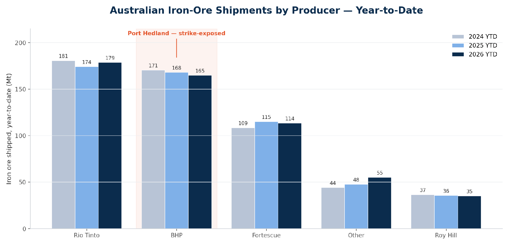
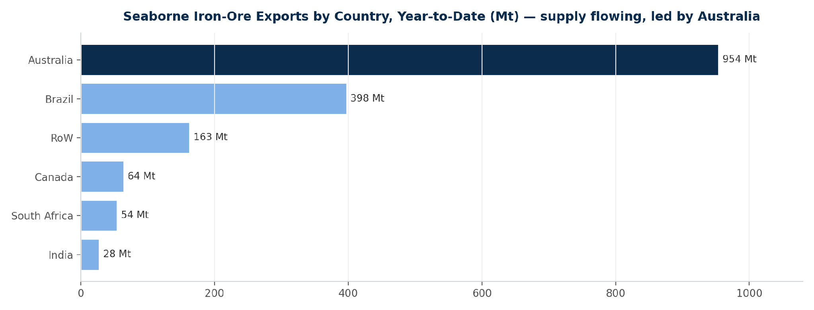
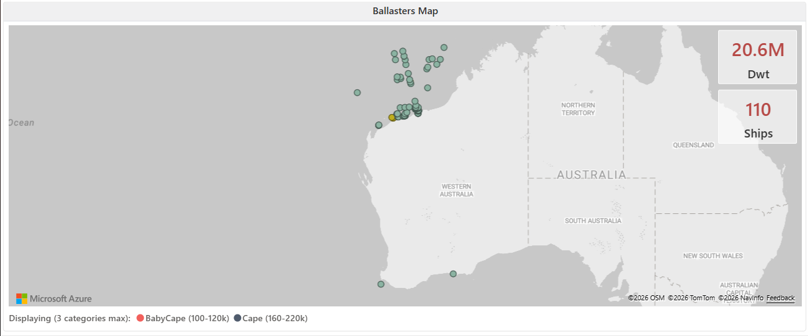
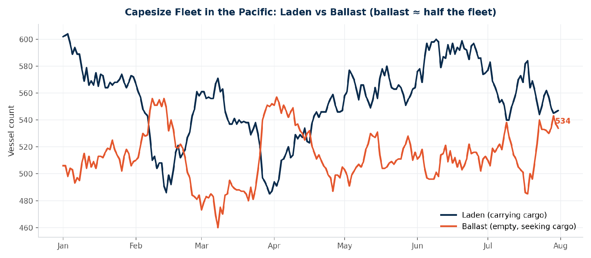
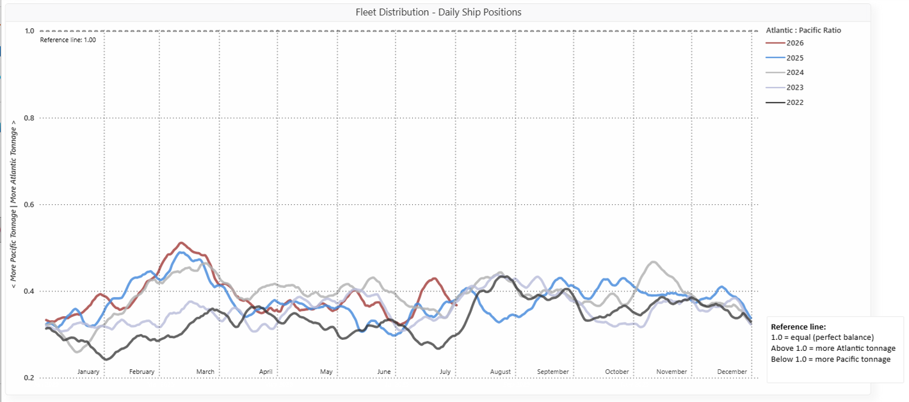
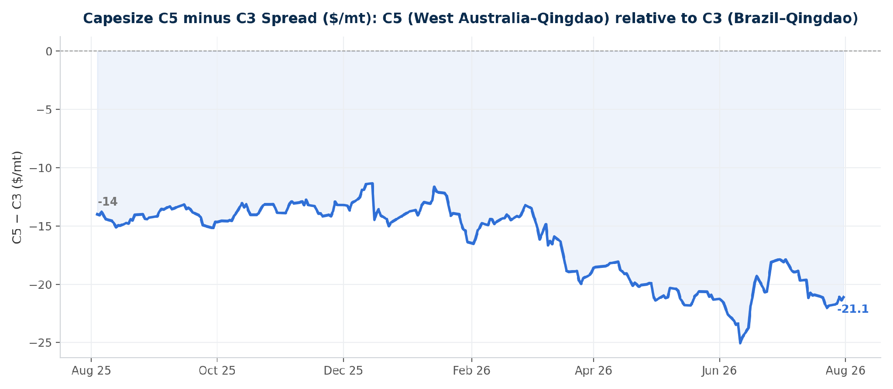

# MARKET INSIGHTS | A Renewed Chapter on the Strikes: The Capesize Pacific in Focus

**Date**: August 3, 2026 | **Category**: Market Insights | **Section**: Newsroom | **Source**: [https://www.thesignalgroup.com/newsroom/market-insights-a-renewed-chapter-on-the-strikes-the-capesize-pacific-in-focus](https://www.thesignalgroup.com/newsroom/market-insights-a-renewed-chapter-on-the-strikes-the-capesize-pacific-in-focus)

---

## ‍SIGNAL OCEAN AXS DRY INSIGHTS · MARKET INSIGHTS

## A Renewed Chapter on the Strikes: The Capesize Pacific in Focus

August opens with a renewed chapter on the Port Hedland strikes. Using AXS Dry Insights, we review the Capesize Pacific the flow of iron-ore shipments and the ballasters map to gauge the impact on today’s spot market.

*Australian iron-ore shipments by producer, year-to-date. BHP’s volumes move through Port Hedland, the terminal at the centre of the dispute (Source:AXS Dry Insights).*

## THE RENEWED CHAPTER

August has opened where July left off. Industrial action has been announced at BHP’s Port Hedland terminal, with a planned24-hour ban on ship-loading from 05:30 AWST on 8 August, followed by a24-hour work stoppage from 05:30 AWST on 9 August. About 150 workers are expected to take part, and the action could delay around 16 shipments over the two days. It follows the 16 July stoppage, the first protected industrial action at the terminal in more than 25 years. It comes after Fair Work Commission-facilitated talks failed to break the deadlock, with the unions due to meet BHP again on 4 August. BHP has said it offered a 16% pay rise and has contingency plans to keep operating.

Port Hedland is the world’s largest bulk iron ore export port and the core of BHP’s Western Australia supply chain, so a two-day stoppage presents a risk to loading schedules. Yet the Capesize Pacific is not trading as though a squeeze is coming. To understand why, we look through AXS Dry Insights at two things: how the cargo is flowing and where the ships are.

## THE FLOW OF SHIPMENTS

Current export flows do not point to a tightening physical market. Australian seaborne iron ore exports ran at 16.5 Mt in the latest full week and 953.7 Mt year-to-date, 1.3% above the same point last year, while Brazil shipped 9.1 Mt during the week. Among the majors, Rio Tinto has shipped 178.8 Mt year-to-date, BHP 164.9 Mt (close to last year's 168.0 Mt) and Fortescue 113.5 Mt. The volume flow remains intact, with no evidence so far of a material shortfall in iron ore loadings that would, on its own, tighten the Pacific market or lift C5. If anything, last week's data suggested marginally softer Australian export volumes rather than signs of tightening cargo availability.

*Seaborne iron-ore exports by country, year-to-date (Source: AXS Dry Insights).*

## THE BALLASTERS MAP: WHERE THE SHIPS ARE

The ballasters map shows the prompt vessel supply around Western Australia. Around110 Capesize ballasters,representing approximately 20.6 Mt of deadweight, were positioned off the Western Australian coast, with54already bound for Port Hedland, a further 16 heading for Port Walcott and 9 for Dampier. These vessels are sailing in ballast towards the loading ports in search of their next cargo, with supply concentrated across the region most exposed to any disruption in loading schedules.

*Ballasters map, ballast Capesizes positioned off Western Australia: 110 ships, 20.6 Mt dwt (Source: AXS Dry Insights).*

The fleet balance suggests that prompt vessel supply remains elevated. As of 31 July, the Pacific Capesize fleet comprised 547 laden vessels and 534 in ballast, leaving 49% of the fleet available for its next voyage—above the level seen at the start of the year. The Atlantic-to-Pacific ballast ratio stood at around 0.38, remaining well below 1.0 and indicating a continued concentration of ballast tonnage in the Pacific. In that context, any temporary interruption to loading schedules would leave more vessels competing for available cargoes rather than reduce vessel availability.

*Capesize fleet in the Pacific, laden versus ballast, 2026 (Source: AXS Dry Insights).*

*Fleet distribution, Atlantic: Pacific ratio of ballast Capesizes, by year; below 1.0 = more tonnage in the Pacific (Source: AXS Dry Insights).*

## THE SPOT READ: C5 THE WEAKER LEG

C5 (West Australia–Qingdao) is trading well below C3 (Brazil–Qingdao): the spread sat near –$21/mt at the end of July, wider than about –$14/mt a year earlier, with C5 running at roughly 0.37 times C3. With export volumes remaining stable and ballast supply elevated, there is little evidence to support a narrowing of the C5–C3 differential in the near term.

*Capesize C5 minus C3 spread ($/mt) over the past year (Source:Signal Ocean).*

## WHAT TO WATCH

Two factors will determine the near-term direction of the market. If ballast arrivals continue to outpace cargo availability, competition for prompt cargoes is likely to remain elevated, limiting support for C5 relative to C3. The planned industrial action at Port Hedland represents the principal upside risk. Should loading disruptions prove more prolonged than currently anticipated, reduced loading activity could tighten the prompt cargo market and provide support for C5 relative to current levels.

For now, however, the market appears to place greater weight on current fleet positioning than on the risk of operational disruption. The Pacific Capesize market continues to have a sizeable pool of ballast vessels, while the extent and duration of any disruption at Port Hedland remain uncertain.

## METHODOLOGY

Freight, fleet, export and vessel-position data are from AXS Dry Insights (AXSMarine), as of 31 July / 1 August 2026, covering iron-ore export volumes, Capesize C3 and C5 assessments, laden and ballast fleet status in the Pacific, global ballast share, and daily ballast-vessel positions off Western Australia. Details of the industrial action reflect contemporaneous public news reporting. Figures are reported as sourced; no independent forecast is implied.
