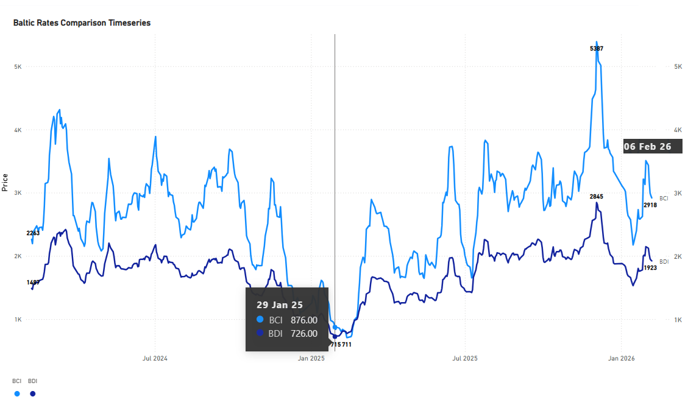
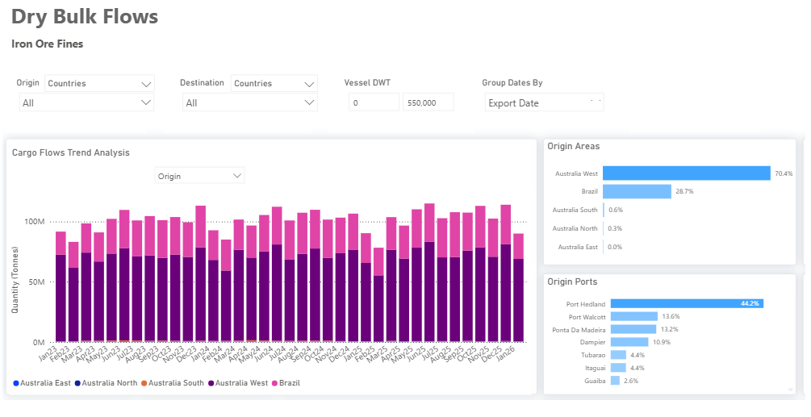
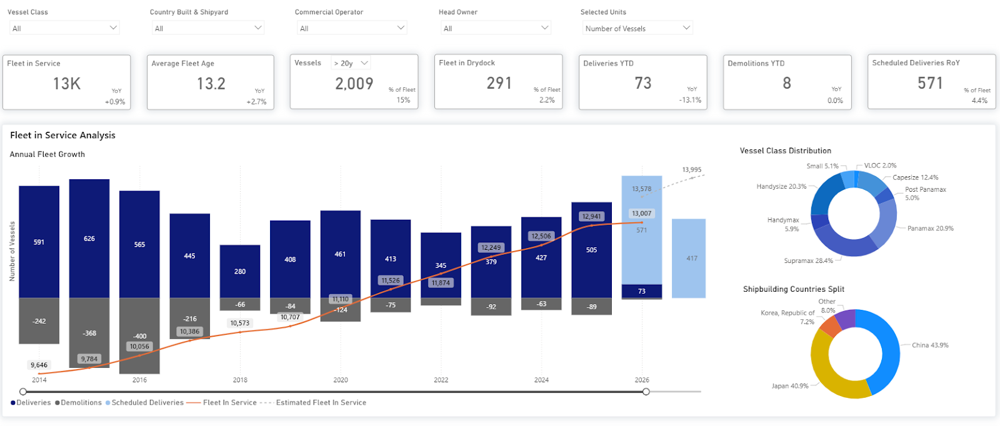

# MARKET INSIGHTS |  BDI vs BCI Ahead of the Lunar New Year

**Date**: February 9, 2026 | **Category**: Market Insights | **Section**: Newsroom | **Source**: [https://www.thesignalgroup.com/newsroom/market-insights-bdi-vs-bci-ahead-of-the-lunar-new-year](https://www.thesignalgroup.com/newsroom/market-insights-bdi-vs-bci-ahead-of-the-lunar-new-year)

---

## Market Insights | BDI vs BCI Ahead of the Lunar New Year

*Spot Comparison: availablehere*

## Market Overview

The Baltic Dry Index (BDI) recorded a sharp recovery ahead of the Lunar New Year before correcting on Friday, 6 February 2026. While dry bulk indices have historically softened into the holiday period due to seasonal disruptions, index levels this year remained firmer than at the start of 2025.

## Index Performance

The BDI closed on 6 February at more than double its level on Chinese New Year 2025 (29  January). A comparison between the BDI and the BCI confirms that Capesize vessels were the main contributors to the index’s strength. The continued firmness was largely driven by steady iron ore flows and China's prevailing steel production mix.

## Seasonal Context

Attention is focused on the late timing of the 2026 Lunar New Year, which falls on February 17th. Historically, the holiday has fallen after 10 February roughly once every three to four years, while particularly late occurrences around 19–20 February are observed about once per decade. The most relevant historical comparison is 2015, when the Lunar New Year fell on 19 February, and the BDI reachedmulti-decade lows(approx 500 points). That downturn was triggered by a sharp contraction in vessel demand, severe fleet oversupply following heavy newbuilding deliveries between 2008 and 2014, and record-low Chinese imports.

## China and Iron Ore

Industry focus remains centered on the Chinese steel sector, where iron ore prices have shown signs of softening amid ample supply relative to demand. Despite this, the outlook is not expected to turn decisively bearish. Available data indicate that the 2025 decline in Chinese crude steel production was not concentrated in electric arc furnace output, which would otherwise have led to a sharper reduction in iron ore demand. While further pressure on steel production is anticipated in 2026, the prevailing production mix is expected to remain supportive of iron ore-based steelmaking.

Iron ore trade flows continue to be supported by almost steady annual volume growth of shipments from Australia and Brazil (3.8bn total quantity tonnes in the period 2023-ytd), alongside initial cargoes from Guinea’s Simandou project, which reached China in December 2025 and January 2026. Although iron ore prices traded below USD 100 per tonne in the run-up to the holiday period, current levels reflect softer demand rather than a collapse.

*Dry Bulk Flows: availablehere*

## Fleet Supply

Fleet supply dynamics remain a key risk factor. In early 2015, freight rates collapsed amid an unprecedented surge in vessel deliveries. While scrapping activity has remained limited and the dry bulk fleet continues to expand, scheduled vessel deliveries have remained below 2014–2016 levels. Current conditions, therefore, do not mirror the wave of vessel deliveries that characterized the 2015 market collapse, when the fleet in service grew rapidly, surpassing 10,000 vessels.

*Orderbook Trends: availablehere*

‍

*Signal Figure*

## Outlook

The dry bulk market enters the 2026 Lunar New Year period with stronger momentum than in previous late-holiday cycles. Capesize earnings continue to provide meaningful support to the BDI, while iron ore trade flows remain supportive despite moderating steel demand growth. Elevated port inventories, ongoing fleet growth, and anticipated pressure on Chinese steel output in 2026 warrant close monitoring, with the post-holiday period expected to provide clearer signals on the durability of current rate strength.
