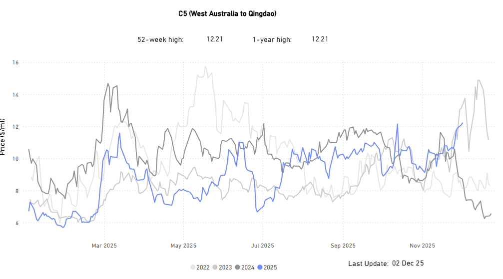
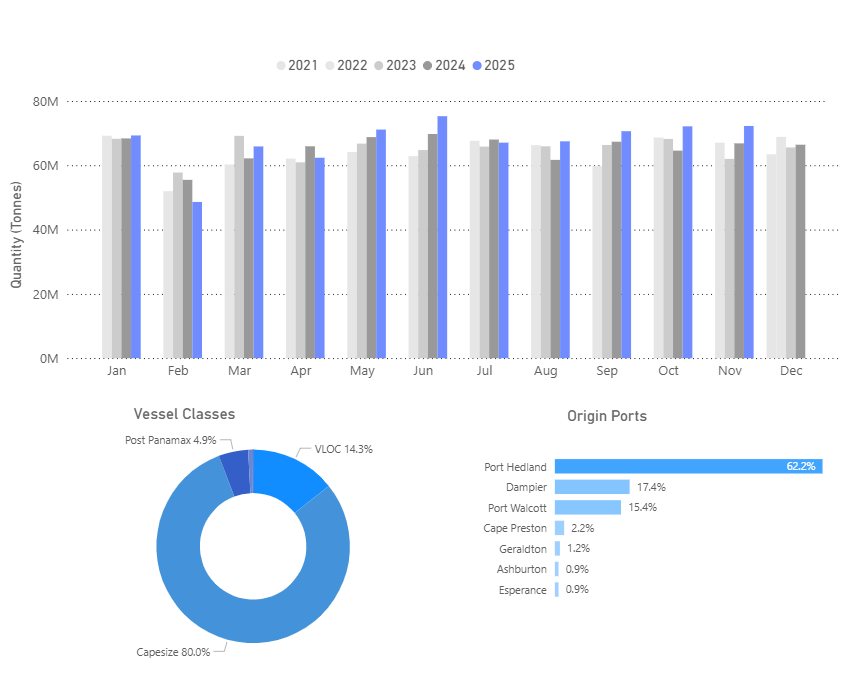
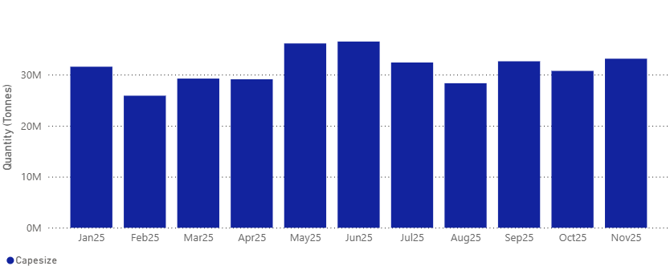
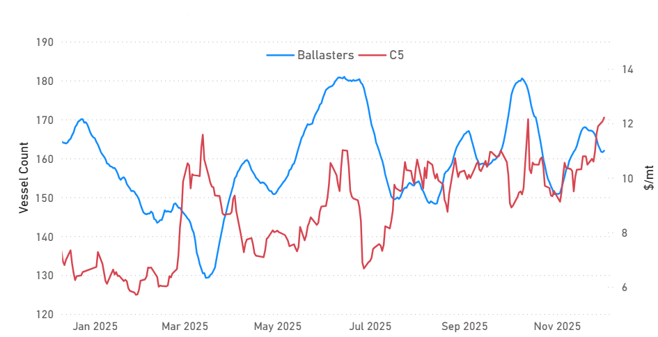

# MARKET INSIGHTS: C5 Spikes to Year-High, Matching 4Q23 Peak

**Date**: December 4, 2025 | **Category**: Market Insights | **Section**: Newsroom | **Source**: [https://www.thesignalgroup.com/newsroom/market-insights-c5-spikes-to-year-high-matching-4q23-peak](https://www.thesignalgroup.com/newsroom/market-insights-c5-spikes-to-year-high-matching-4q23-peak)

---

## Market Insights | C5 Spikes to Year-High, Matching 4Q23 Peak

### Rising Australian ore loadings keep upward pressure on WA–Chinafreight.

In our previous market insights, we explored theSimandouiron ore story and whether it could meaningfully challenge the long-standing dominance of Australian and Brazilian exporters. This week, we shift focus to Western Australia’s iron ore dynamics behind the recent strength in the C5 freight route assessment. With year-end approaching, we review how shipment volumes have evolved and whether Q4 is on track to deliver a firm close for Australia’s iron ore industry.

*Signal Figure*

- C5 assessments have climbed back to the peak levels last seen in 4Q23,  the highest in nearly a year.
- The momentum from October carried straight into November. Even with theAustralian cycloneseason beginning in November and running through April, and with no cyclone disruptions so far, sentiment remained firm.
- Chinese demand remains a key driver: despite the drag from theproperty sector, iron ore imports continued to rise through October and November, with Port Hedland at the forefront of the increase.
- Iron ore stockpiles across China’s 45 major ports (tracked by Mysteel) increased by 1.6 million tonnes, or 1%, in the week of Nov 21–27, reaching 152.1 million tonnes, the highest level in nine months and 1% above last year’s level, marking the first year-on-year increase since mid-April.

## Spotlight on West Australian Iron OreFlows| China

- Seasonal High: China’s Iron Ore Intake from Western Australia exceeded 70M mt in Q4

‍

*Signal Figure*

‍

The strong sentiment from October continued into November, with the early start of Australia’s tropical cyclone season not yet impacting the market. Chinese iron ore imports increased through October and November despite ongoing pressure from the property sector. Export volumes from Port Hedland were also firm, confirming that Western Australia’s shipments held up well ahead of the main cyclone months. Looking ahead to the November–April period, weather-related risks could affect export activity, while wider economic challenges will continue to weigh on Chinese iron ore demand.

- Port Hedland| Capesize Iron Ore Exports to China Exceeded 33million metric tonnes in November

‍

*Signal Figure*

‍

In November, Port Hedland’s Capesize iron ore shipments to China climbed past 33 million metric tons, coming close to the May high of more than 35 million tons. Dampier and Port Walcott added meaningful volumes as well, but Port Hedland remained dominant, representing over 60% of Western Australia’s total exports to China.

## Ballasters Vs C5 Rates

- Ballaster availability has tightened, with the 21D MA dropping to 162 vessels

‍

*Signal Figure*

Ballaster numbers have retreated significantly from their early-October peak of roughly 180 vessels to around 160 by late November. This decline aligns with the pick-up in iron ore loadings out of Western Australia, which has helped absorb the excess tonnage. The tighter vessel supply, together with stronger export flows, has supported firmer C5 sentiment, with rates rising from around $10/mt in early October to approximately $12/mt by late November.

## Pilbara Infrastructure Keeps the Flow Moving

- Western Australia’s iron ore export capacity remains well supported by ongoing investment and operational improvements.

Pilbara miners continue to upgrade and digitalise their supply chains, from Rio Tinto’s US$733m West Angelas investment to recent AI-driven rail efficiency gains,  strengthening the underlying infrastructure that enables stable production and shipment capability. While the official cyclone season is underway and weather risks remain, these developments point to a robust export system. Combined with the firm shipment levels seen in recent months and steady Chinese offtake, the increased flow of cargoes from Western Australia has helped absorb ballasters and supported the firmer sentiment observed in the C5 market.

## Q1 26: Short-Term Downside Risks

The C5 market is entering the most weather-disrupted phase of the year, when even brief cyclone-related outages at Port Hedland or Dampier can materially derail cargo programs and impact vessel availability in the Pacific. At the same time, deteriorating steel mill margins and ongoing output restrictions in China raise the likelihood of a near-term slowdown in iron ore intake, particularly if mills prolong production cuts or defer restocking.

Overall, in the absence of a meaningful rebound in downstream steel demand or consistently robust Pilbara export performance, the sustainability of the recent C5 upswing appears increasingly challenged heading into early Q1.

Use Signal Ocean’s Voyage Details to spot emerging signals and stay ahead of shifts in the oil world. For more insights, pleasecontact our team. Stay ahead of the curve. Get access to theSignal Ocean Platform.
