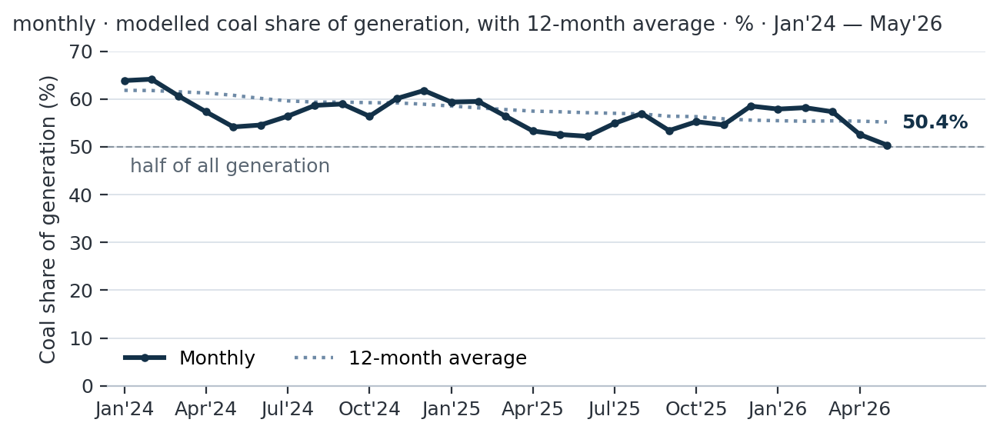
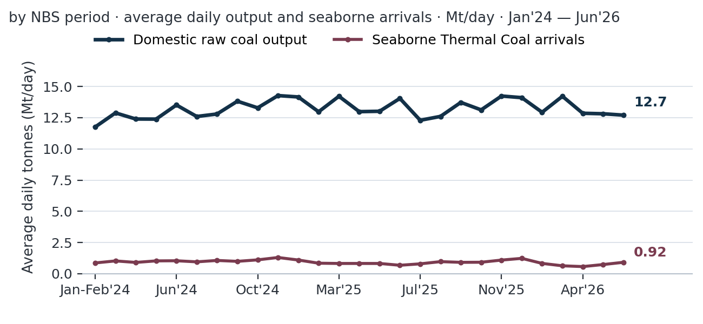
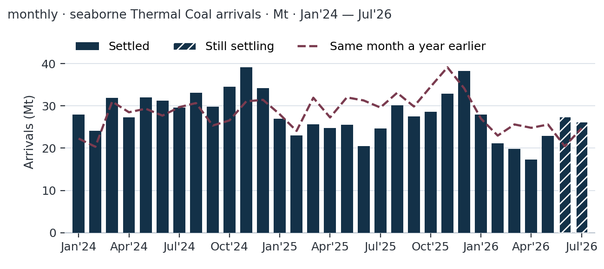
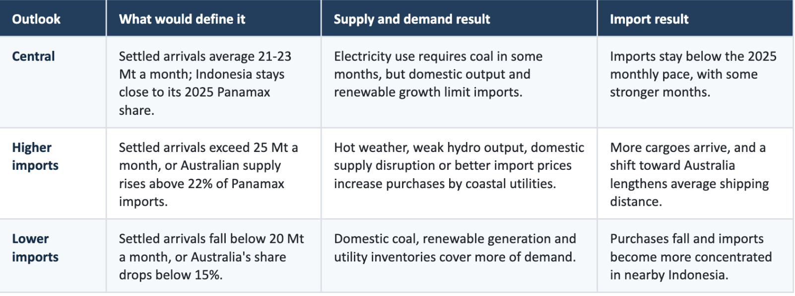
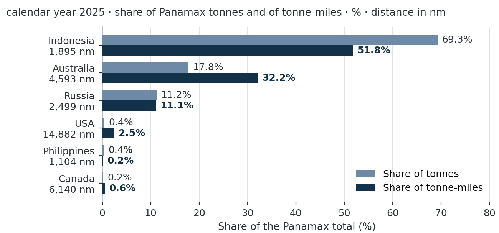

# MARKET INSIGHTS  |  CHINA SUPPLY AND DEMAND OUTLOOK  |  AUGUST 2026

**Date**: August 14, 2026 | **Category**: Market Insights | **Section**: Newsroom | **Source**: [https://www.thesignalgroup.com/newsroom/market-insights-china-supply-and-demand-outlook-august-2026](https://www.thesignalgroup.com/newsroom/market-insights-china-supply-and-demand-outlook-august-2026)

---

## MARKET INSIGHTS  |  CHINA SUPPLY AND DEMAND OUTLOOK  |  AUGUST 2026

## China Thermal Coal Outlook: Domestic Supply Keeps Import Needs Contained

Power demand continues to support coal generation, but domestic output and renewable growth are likely to keep seaborne purchases below last year's pace.

Esther Chua  |  Senior Dry Bulk Analyst

Published 6 August 2026  |  Data available through 4 August 2026; the latest month varies by series

China is entering the second half of 2026 with a smaller need for imported thermal coal, but not with a collapse in coal-fired electricity generation. Settled vessel records show that seaborne thermal coal arrivals fell 13.5% from a year earlier in January-May, to 109 million tonnes. Preliminary June and July records narrow the seven-month decline to 4.8%, although both months are still being updated as late voyage records are matched to cargoes.

The demand picture is mixed. Coal supplied 49.7% of China's electricity in the first half, the first half-year below 50% in the available official series, while renewables reached 41.2%. Yet total electricity use rose by 56.0 terawatt-hours in May from a year earlier. Wind, solar, hydro, nuclear and other renewable sources supplied 45.2 terawatt-hours of that increase, leaving about 10.9 terawatt-hours to be met mainly by coal- and gas-fired plants.

This report's central outlook is for seaborne thermal coal arrivals to settle at 21-23 million tonnes a month through the second half. Domestic production should continue to meet most demand, and Indonesian coal should remain widely available. Imports could rise above that range during periods of hot weather, weak hydroelectric output or domestic supply disruption, but current evidence does not point to sustained growth.

MAIN CONCLUSIONPower demand will continue to support thermal coal use, especially in coastal regions, but domestic supply and renewable generation should keep seaborne purchases contained. The most likely outcome is a steady second half rather than a return to the record import volumes of 2024.

China's power system is using a wider mix of energy sources. Official data show coal's share of generation at 49.7% in the first half of 2026, while renewables accounted for 41.2%. A separate monthly estimate places coal at 50.4% in May, down from 52.6% in May 2025 and 54.2% in May 2024. On that measure, coal's share has fallen by roughly two percentage points a year over the past two May-to-May periods.

A smaller share does not automatically mean less coal is used in every month. When electricity demand grows faster than wind, solar, hydro and nuclear generation, fossil-fuel power plants still have to increase output. That happened in May 2026: cleaner sources met most of the annual increase in electricity demand, but not all of it. Thermal generation, which includes coal, gas and oil, was therefore about 10.9 terawatt-hours higher than a year earlier.

For the second half, weather and hydroelectric production will be decisive. A hot summer would raise cooling demand, while weak rainfall would limit hydroelectric output and increase the need for coal generation. A mild summer or strong rainfall would have the opposite effect. The report does not assume a lasting rise in coal-fired generation; it assumes that coal remains necessary when electricity demand rises faster than cleaner supply.

*Figure 1. Estimated monthly coal share of electricity generation, with a 12-month average. The May 2026 estimate was 50.4%. Sources: National Bureau of Statistics, China Electricity Council via Ember, and Signal Group Trade Flows.*

## Supply: domestic production remains the foundation

Domestic coal production is much larger than seaborne supply. On the available comparison, China produced about 12.7 million tonnes of raw coal a day, while seaborne thermal coal arrivals averaged about 0.92 million tonnes a day. A separate estimate places imports at roughly 7.5% of thermal coal supply in June, within a recent range of 4.7% to 9.2%.

These figures show scale, but they are not a complete physical balance. Domestic statistics cover raw coal before washing and processing, whereas seaborne arrivals are measured as delivered thermal coal. The comparison therefore makes imported coal look smaller than it would on an equal-quality basis. The report also does not directly measure power-station inventories, inland movements or price differences between domestic and imported coal.

Even with those limits, the direction is clear: domestic mines cover most national demand, while imports give coastal utilities flexibility. Buyers can increase seaborne purchases when domestic supply is disrupted, electricity use rises quickly or imported coal becomes less expensive. They can reduce purchases when inventories are high or domestic coal is readily available.

*Figure 2. Domestic raw coal output and seaborne thermal coal arrivals on a daily basis. The two series are not directly comparable because domestic output is measured before processing. Sources: National Bureau of Statistics and Signal Group Trade Flows.*

## Indonesia should keep nearby supply available

Indonesia remains China's main seaborne source of thermal coal, particularly for lower-energy grades used by coastal power plants. Indonesia's initial 2026 production quota was about 600 million tonnes, well below reported 2025 output of 817.5 million tonnes. However, first-half production reached 367.1 million tonnes, or 61.2% of the annual quota, and authorities allowed applications for higher production plans through the end of July.

The quota therefore appears more flexible than the headline number suggests. Large producers have maintained output, while much of the reduction has fallen on smaller miners. For China, that makes a severe shortage of Indonesian coal less likely in the central outlook. It also means nearby supply can meet much of any short-term increase in coastal demand.

## Imports: the decline is narrowing, but the latest data are preliminary

China received 328.6 million tonnes of seaborne thermal coal in 2025, down 12.4% from 375.0 million tonnes in 2024. The fall continued into early 2026. Settled records for January-May show arrivals of 109.0 million tonnes, compared with 126.0 million tonnes a year earlier.

June and July were stronger. Current records show 27.6 million tonnes in June and 26.3 million tonnes in July, taking the preliminary seven-month average to 23.3 million tonnes. Those two months narrow the annual decline to 4.8%, but they should be treated as minimum estimates until late cargo records are fully assigned. The January-May comparison remains the firmer measure of the trend.

The central outlook of 21-23 million tonnes a month is close to the 21.8 million-tonne average recorded in settled January-May data and below the 25.2 million-tonne average in the same period of 2025. Power demand should support occasional stronger months, but the evidence does not justify assuming that the preliminary June and July pace will continue throughout the second half.

*Figure 3. Monthly seaborne thermal coal arrivals. June and July 2026 remain preliminary because late voyage records can be added after month-end. Source: Signal Group Trade Flows.*

## Outlook scenarios

The outlook depends on two linked questions: how much coal-fired generation China needs, and how much of that need cannot be met by domestic supply. The following guideposts distinguish a normal range from clearly stronger or weaker import outcomes.

*Signal Figure*

## Shipping implications: Panamax carries most of the trade

Panamax vessels carried 216.0 million tonnes, or 65.7%, of China's seaborne thermal coal in 2025. Supramax vessels carried 70.6 million tonnes, or 21.5%, while Capesize and Handysize vessels accounted for most of the remainder. This concentration means steady import volumes support Panamax employment and makes the vessel class most directly exposed to changes in China's import volume and sourcing pattern.

For January-July 2026, current records show Panamax thermal coal volume rising 3.9% from a year earlier to 114.8 million tonnes. Panamax tonne-miles rose 9.8% to 317.7 billion, because the average haul increased 5.7% to 2,768 nautical miles. Tonne-miles multiply cargo volume by voyage distance and therefore measure how much vessel work a trade creates. These comparisons include preliminary June and July records; settled Panamax volume for January-May was 4.8% lower than a year earlier.

Supramax performance was weaker. January-July volume fell 25.0% to 28.7 million tonnes, while tonne-miles declined 15.9% to 65.6 billion. The number of Supramax arrivals fell to 591 from 801. The difference between vessel classes reflects China's greater use of larger Panamax parcels and changes in origin mix.

Origin remains decisive for tonne-miles. In 2025, Indonesia supplied 69.3% of China's Panamax thermal coal volume but generated 51.8% of Panamax tonne-miles, with an average haul of 1,895 nautical miles. Australia supplied 17.8% of volume but generated 32.2% of tonne-miles, with an average haul of 4,593 nautical miles. Moving five million tonnes of supply from Indonesia to Australia would add about 13.5 billion tonne-miles, equal to roughly 4.2% of the current seven-month Panamax total.

*Figure 4. Origin mix of China's 2025 Panamax thermal coal imports. Indonesian cargoes dominate volume; Australian cargoes contribute a larger share of tonne-miles because the voyage is longer. Source: Signal Group Trade Flows.*

The Baltic Exchange's P5TC Panamax time-charter average was US$19,530 a day in July 2026, while the S11TC Supramax average was US$21,433 a day. These are whole-market freight measures, not China-coal prices. Grain, minerals, competing routes and fleet supply also influence them, so the supply-and-demand outlook should not be read as a direct freight-rate forecast.

## Risks to the outlook

Weather and electricity demand.Prolonged heat would raise power consumption, while drought would reduce hydroelectric generation. Either could increase coal use. Mild weather and strong rainfall would reduce it.

Domestic production.Mine safety inspections, transport disruption or policy changes could reduce inland supply and increase coastal purchases. Strong domestic output would keep imports lower.

Prices and inventories.The report does not forecast the price gap between domestic and imported coal and does not directly measure utility inventories. Both can change buying decisions quickly.

Indonesian policy.A strict application of the production quota would tighten nearby supply. A higher quota or continued flexibility would keep coal available to Chinese buyers.

Preliminary shipment records.June and July arrivals are still being updated. The apparent recovery could strengthen or weaken as late records are added.

BOTTOM LINEChina's coal use is becoming a smaller part of a growing power system, not disappearing. Domestic mines will continue to supply most thermal coal, while seaborne purchases remain a flexible supplement for coastal consumers. On current evidence, imports are likely to average 21-23 million tonnes a month in the second half of 2026.

## Scope and methodology

This report covers thermal coal only. Seaborne import figures are derived from vessel movements into mainland China and exclude overland trade, domestic coastwise movements and cargoes that could not be classified. China's customs data cover a broader range of coal products and entry routes, so the two series should not be compared as if they measured the same market.

Shipment records are considered settled about five months after month-end. January-May 2026 is therefore the firm comparison used in the report; June and July remain preliminary. Power-generation data are available through May. The monthly coal share is an analytical estimate based on official generation data, while the first-half shares are official statistics.

Primary sources: National Energy Administration; National Bureau of Statistics; China Electricity Council via Ember; China Customs; Indonesian government and industry reporting; Signal Group Trade Flows. Figures may differ slightly from earlier platform views as late voyage records are added.

Esther Chua  |  Senior Dry Bulk Analyst  |  esther.chua@axsmarine.com  |  esther.chua@thesignalgroup.com

This report is the exclusive property of The Signal Group. No part may be copied, reproduced or redistributed without written consent. It is provided for research purposes and does not constitute investment or commercial advice. Readers should make decisions using their own judgement and the most recent available information.
