# Market Insights | Crude-Laden Tankers Build in Hormuz as Production Cuts Loom

**Date**: March 17, 2026 | **Category**: Market Insights | **Section**: Newsroom | **Source**: [https://www.thesignalgroup.com/newsroom/market-insights-crude-laden-tankers-build-in-hormuz-as-production-cuts-loom](https://www.thesignalgroup.com/newsroom/market-insights-crude-laden-tankers-build-in-hormuz-as-production-cuts-loom)

---

## Crude-Laden Tankers Build in Hormuz as Production Cuts Loom | Market Insights

What Vessel Data Show this Week

- Record crude buildup: ~130 million barrels now stored onboard laden vessels.
- Flow imbalance: Laden vessels exceed ballast, signaling disrupted circulation.

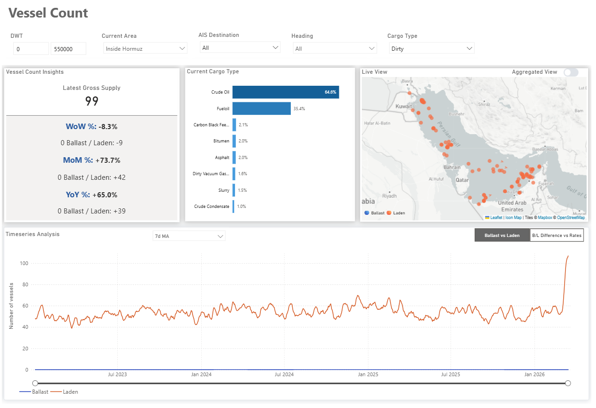
*The Signal Ocean Platform (TSOP) | Vessel Count*

## Executive Overview

Tensions in the Gulf have been escalating for nearly two weeks, culminating most recently in U.S. strikes on military targets on Kharg Island, Iran’s primary crude export terminal. In parallel with disruptions to export flows, Gulf producers have announced production curtailments of approximately 10 million barrels per day, equivalent to around 5 VLCC cargoes per day, removed from the seaborne market.

To evaluate how these developments are affecting tanker activity in the region, vessel data from The Signal Ocean Platform (TSOP) were analyzed. The scale of the latest production cuts, combined with the record accumulation of laden crude tankers within the Strait of Hormuz, points to the potential for deeper supply reductions and increasing upward pressure on oil prices, with market expectations now shifting toward levels above $100 per barrel.

This analysis focuses solely on non-sanctioned vessels and examines the number of laden and ballast vessels currently operating in the Strait of Hormuz, as well as capacity utilization across crude and product tanker segments. These indicators provide an early view of how tanker markets are responding to the rapidly evolving security environment in the Gulf.

## Laden Tanker Counts Reach Record Levels

Recent AIS data show a sharp reversal in the typical ballast–laden balance in the Strait of Hormuz, with laden vessels now significantly outnumbering ballast vessels.

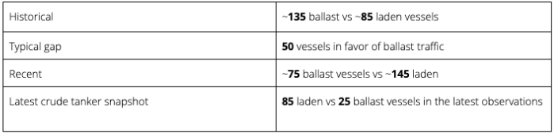
*Signal Figure*

## Chart 1: Historical Tanker Traffic in the Strait of Hormuz (2020–2026)

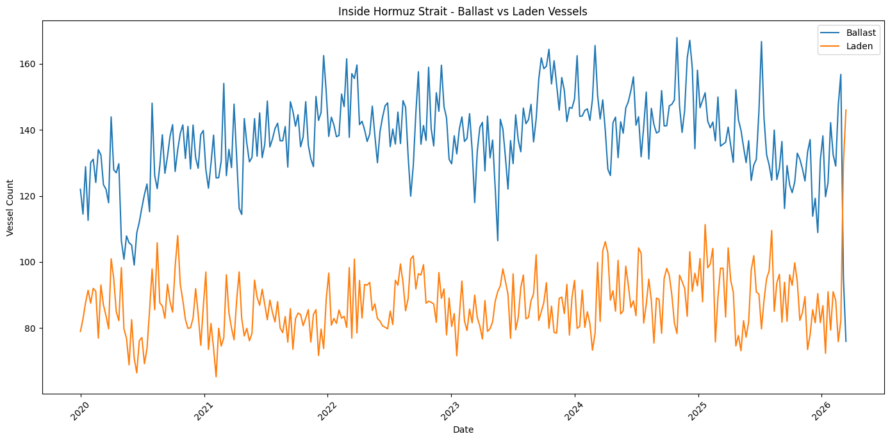
*Source: Signal Ocean Data Warehouse (TSOP); based on AIS data*

‍

During March 2026, owing to the effective closure of the Strait of Hormuz, a clear divergence emerged between ballast and laden tanker counts. Ballast tanker numbers declined sharply, falling from an average of 135 vessels to around 75. Over the same period, laden tanker counts increased significantly, rising from an average of 85 vessels to roughly 145.

## Chart 2: Recent Breakdown in Ballast–Laden Traffic Balance (2026)

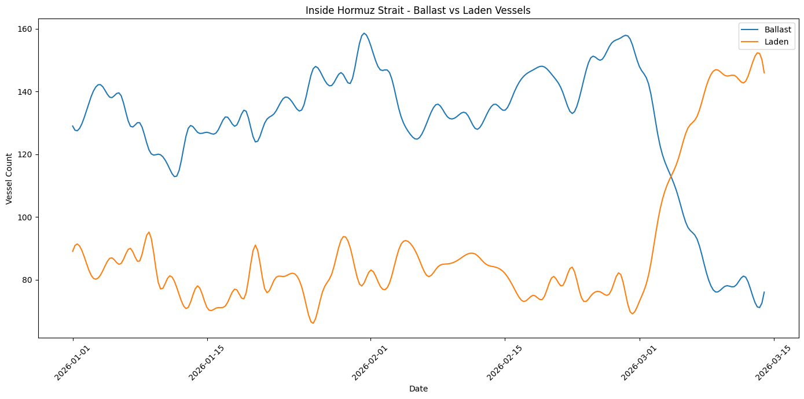
*Source: Signal Ocean Data Warehouse (TSOP); based on AIS data*

## Where the Distortion Is Most Visible

The imbalance becomes particularly clear when focusing on crude tankers specifically. Laden crude tanker counts have risen to roughly 85 vessels, while ballast crude tankers have fallen to about 25 vessels. This indicates a buildup of laden crude carriers inside the Gulf, instead of the normal circulation of vessels exiting the region.

Chart 3: Crude Tanker Traffic Inside the Strait of Hormuz (Ballast vs. Laden)

‍

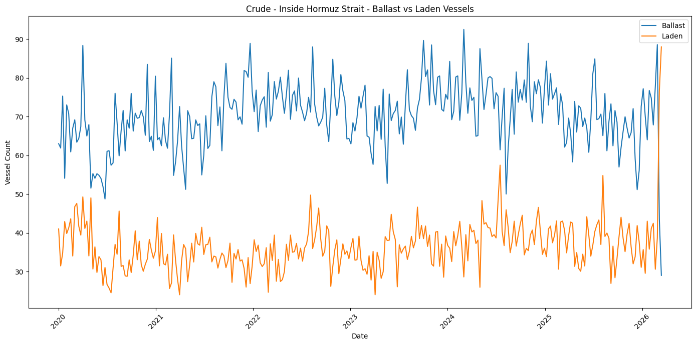
*Source: Signal Ocean Data Warehouse (TSOP); based on AIS data*

## Crude Cargo Buildup Inside the Strait of Hormuz

Based on AIS-derived estimates, approximately 130 million barrels of crude oil are currently onboard tankers in the region, with around 40 million barrels of spare capacity remaining.

The pattern is similar for clean product tankers, though on a smaller scale. Roughly 25 million barrels of refined products are currently onboard vessels, with about 20 million barrels of spare product tanker capacity available.

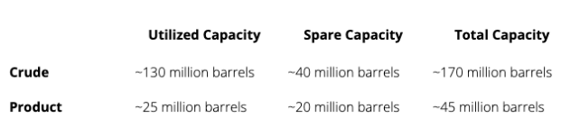
*Signal Figure*

Chart 4: Utilized | Spare Tanker Capacity | Total Capacity

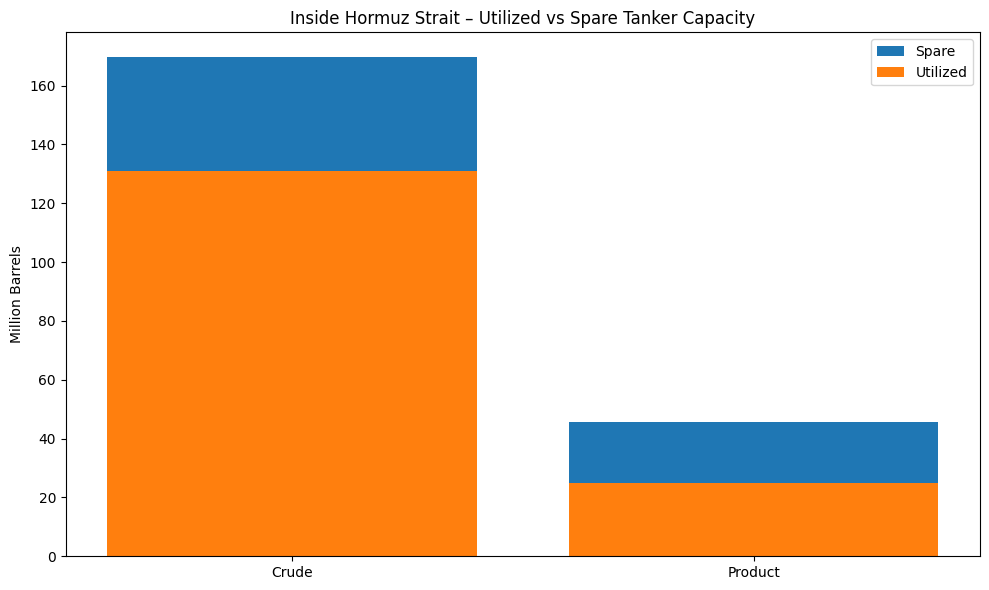
*Source: Signal Ocean Data Warehouse (TSOP); based on AIS data*

## Estimated Daily Transit Capacity

In January 2026, under normal operating conditions, the number of daily tanker transits through the Strait of Hormuz was around 20 each for West to East and East to West (total 40).

Chart 5: Estimated Daily Transit Capacity (Baseline – January 2026)

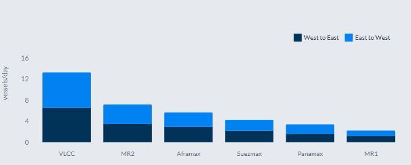
*Signal Figure*

## Today’s Reality| Average Daily Transit <2 Per Vessel Class, (March 1-16)

Chart 6: Estimated Daily Transit Capacity (Observed, March 1–16)

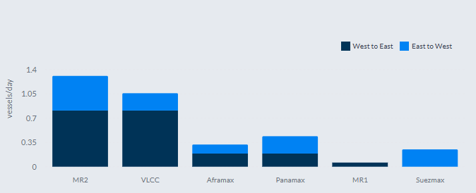
*Source: Signal Ocean |WaypointsAPI Data (last update: March 16, 2026)*

AIS vessel counts should be interpreted as indicators of traffic patterns rather than direct measures of crude or clean product export flows.

Although only one or two confirmed vessel transits per day per vessel class are observed on average per day per vessel class, this does not necessarily mean that only that number of ships are passing through the strait. Limited AIS visibility, delayed reporting, or selective disclosure by operators can significantly reduce the number of visible movements. Even under elevated security conditions, the strait may still record approximately 10 to 15 tanker movements per day, if including the vessels not detectable via AIS, which tends to make traffic patterns less predictable due to shadow fleet activity.

Read more at AXSMarine:Strait of Hormuz: Managed Dislocation, Not Market Collapse

## Per Commercial Operator | VLCC, strong concentrations of Asian-linked companies

The operator distribution also highlights a notable presence of Asian-linked companies, including Sinokor, Idemitsu, Unipec, COSCO, Bahri, and trading houses such as Trafigura. Their presence among VLCC operators aligns with the high number of tanker transits through the Strait of Hormuz, as these vessels are largely employed in transporting Middle Eastern crude to Asian import markets.

Chart 7: VLCC Fleet Status by Commercial Operator

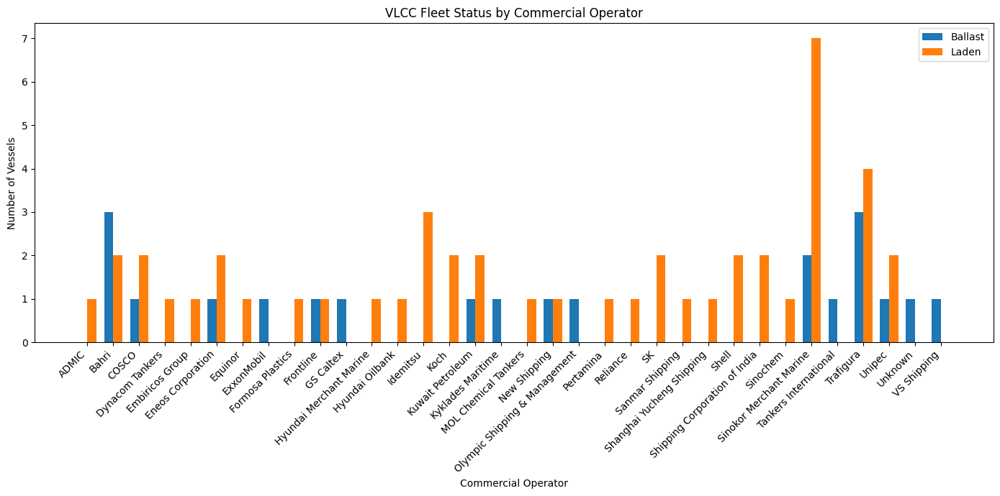
*Source: Signal Ocean Data Warehouse (TSOP); based on AIS data*

## Tanker Transits and Insurance Environment

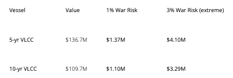
*Signal Figure*

War-risk premiums for Gulf transits have risen significantly following the recent escalation. Industryindicationssuggest that premiums have increased from roughly 0.2–0.4% of vessel value previously to around 1% in many cases, with significantly higher levels possible for voyages assessed as carrying elevated risk (from 3% to 5%).

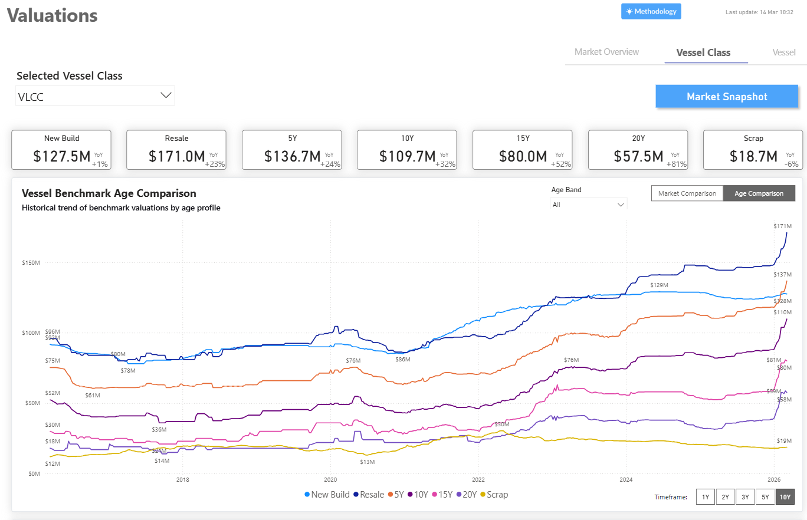
*The Signal Ocean Platform (TSOP) |ValuationsMarket Snapshot*

‍

Based on indicative VLCC market valuations of approximately $137 million for a five-year-old vessel and about $110 million for a ten-year-old vessel, a 1% premium could imply costs in the range of approximately $1–1.4 million per transit, with higher-risk scenarios potentially resulting in materially higher premiums.

## Market Outlook

Maritime security across the Gulf remains highly volatile, and tanker operators are likely to remain cautious until clearer signals emerge regarding the stability of navigation through the Strait of Hormuz.

In the near term, developments surrounding Iranian export infrastructure, the availability of war-risk insurance, and the willingness of shipowners to deploy vessels in the region will remain key factors shaping tanker freight markets and crude trade flows. At the same time, the continued expansion of Russian exports toward Asia, the increased use of Red Sea export routes for Saudi crude, and the operational flexibility of the shadow fleet demonstrate that global energy logistics are already adapting to the evolving geopolitical landscape.

With the Strait effectively closed and no tonnage replenishment entering the Gulf, vessels already inside are increasingly filling with crude and acting as temporary floating storage. This provides producers with a short-term buffer, but as long as export bottlenecks persist and tanker capacity becomes saturated, further production cuts may become increasingly unavoidable.

All data, estimates, and projections presented herein are based on information available as of [March 16, 2026]. While every effort has been made to ensure accuracy, the analysis is subject to revision as additional information becomes available.
