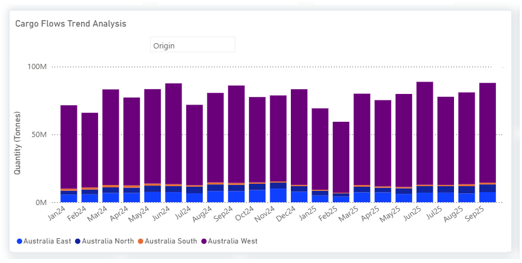
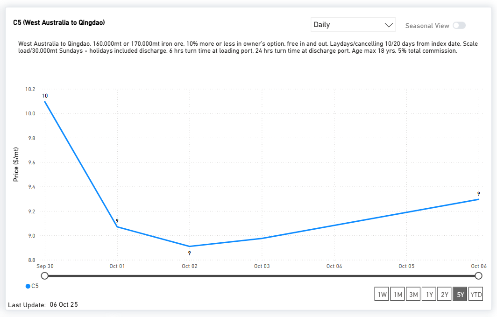

# MARKET INSIGHTS: DRY BULK FLOWS | IRON ORE

**Date**: October 7, 2025 | **Category**: Market Insights | **Section**: Newsroom | **Source**: [https://www.thesignalgroup.com/newsroom/market-insights-dry-bulk-flows-iron-ore](https://www.thesignalgroup.com/newsroom/market-insights-dry-bulk-flows-iron-ore)

---

## MARKET INSIGHTS: DRY BULK FLOWS | IRON ORE

## China hits BHP’s West Australian flow - Rio reinforces Pilbara output

- China’s state-controlled buyer,CMRG, is reported to have instructed steelmakers and traders tosuspend new dollar-denominated BHP iron ore cargoes, a sharp escalation in pricing negotiations that raises concerns about disruptions to BHP’s China supply.
- The freight market reacted swiftly: spot Capesize rates tumbled in the week following the standoff, as sentiment weakened on expectations of reduced Chinese liftings from the Pilbara
- Amid the tension,Rio Tinto unveiled a US$733 million investmentin its West Angelas / Robe River joint venture (with Mitsui and Nippon Steel) designed to preserve Pilbara output and sustain supply relationships with Asian customers.

*Signal Figure*

*Signal Figure*

Stay ahead of the curve. Get access to theSignal Ocean Platform.
