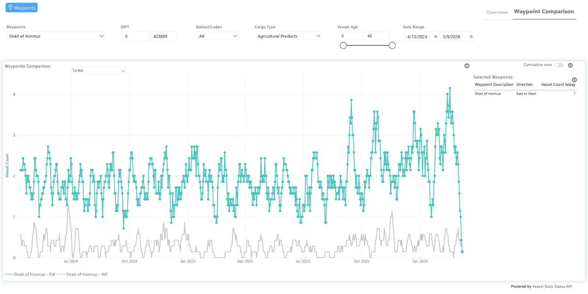
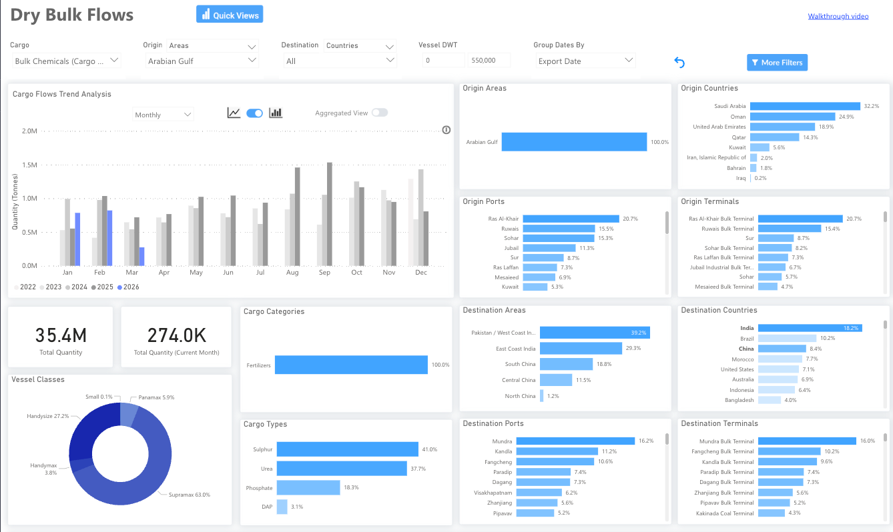
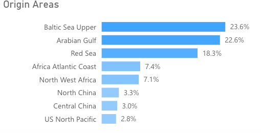
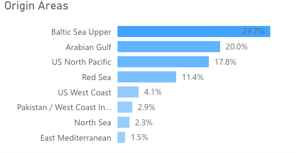

# Market Insights | Fertiliser markets suffer from Arabian Gulf Conflict

**Date**: March 9, 2026 | **Category**: Market Insights | **Section**: Newsroom | **Source**: [https://www.thesignalgroup.com/newsroom/market-insights-fertiliser-markets-suffer-from-arabian-gulf-conflict](https://www.thesignalgroup.com/newsroom/market-insights-fertiliser-markets-suffer-from-arabian-gulf-conflict)

---

## Iran- USA/Israel Conflict impact on fertiliser markets

While global markets are currently preoccupied with the potential impact of escalating Middle East tensions on oil, the crisis also poses a significant, though less discussed, risk to fertiliser supply chains. This disruption could ultimately affect global agriculture and food prices. Given the Arabian Gulf's crucial role in global fertilizer production and export, it is essential to consider the implications of the current crisis for the agricultural sector, apart from the primary focus on energy.

TSOPwaypoints data (Strait of Hormuz EW), for the agriculture cargo type, is already capturing the near standstill of vessel count from the onset of the crisis.  If sustained, disruptions to fertiliser exports could create challenges for agricultural producers, potentially influencing crop yields and contributing to upward pressure on food prices in the months ahead.

*Signal Figure*

In our analysis below, we take a closer look at what if the conflict persists could mean for the fertiliser supply chain that also depends heavily on the Gulf.

## Fertiliser Flows

- ~20% of all fertiliser flows originate from the Arabian Gulf
- ~46% of global urea flows from the Arabian Gulf

*Source: Vessel CountTSOP| Fertiliser flows from the Arabian Gulf*

‍

The Arabian Gulf is one of the most important regions for global fertiliser production and trade. Countries including Saudi Arabia, Qatar, Oman, and the United Arab Emirates host major facilities producing key inputs such as urea, sulphur, and ammonia. Iran is also a notable producer of ammonia, an essential component used in nitrogen-based fertilizers.

Given the region’s central role in fertiliser production and exports, developments affecting logistics and maritime transit in the Gulf are closely monitored by agricultural and commodity markets.

Signal Oceanrecorded that 20% of all fertiliser flows originated from the Arabian Gulf in 2025. This proportionality increases to 46% when considering only urea, the most widely used nitrogen fertiliser globally.

As a result, with the Iran-US/Israel war effectively closing the Strait of Hormuz, the market could lose between 3-4mt of fertiliser a month, with the two most populated countries in the world, India and China, being the most exposed.

## Exposure of Major Importers

- India and China are most exposed to limited fertilizer flows from the Arabian Gulf, as the region accounts for 23% and 20% of all fertiliser imports, respectively.

*Signal Figure*

*Source: Fertiliser flows to IndiaTSOP, fertiliser flows to ChinaTSOP*

‍

Read more at AXSMarine:Key Dry Bulk Data Trends: February 2026

## Potential Agricultural Effects of Reduced Fertiliser Flows from the Arabian Gulf

A reduced flow of fertiliser from the Arabian Gulf will have substantial knock-on effects for agricultural yields in the coming year. In situations like this, there tends to be a chain of events that farmers use to mitigate the impact.

Lower fertiliser application

Thefirstis that producers use less fertiliser. There is evidence that most producers use more fertiliser than needed as an insurance policy. However, less fertilizer does make crops less robust against challenging weather conditions such as drought or intense heat. This would likely lead to smaller crop yields, with the weather being the swing factor in terms of how much they fall.

Shifts in crop selection

Thesecondis that farmers switch to crops that require less nitrogen, opting for legumes such as soybeans rather than corn. The obvious outcome of this is that there is a glut of a certain crop and a lack of another. Corn, for instance, is nitrogen-intensive to produce; if enough producers swapped out of producing this, animal feed prices would likely rise, impacting the cost of meat or farmed fish.

Reduced planting on marginal land

Thethirdis that farmers reduce planting in marginal areas. This cuts initial costs and increases efficiency as less profitable land, which requires more fertiliser, is not used. The outcomes for farmers are a better return per acre planted. The issues arise from a compounding effect of multiple farmers following this, with a global decrease in yields. The effect of higher food prices comes later.

## Takeaway

Overall, the disruption of fertiliser flows from the Arabian Gulf is likely to tighten global agricultural supply, particularly for nitrogen-intensive crops such as corn and wheat. While farmers may partially mitigate the impact through reduced fertilizer use, crop switching, and focusing on higher-yield areas, these measures cannot fully offset the loss of inputs. The result is likely to be smaller global harvests, higher feed and food prices, and increased volatility in agricultural commodity markets, with major importers like India and China feeling the effects most acutely. Markets will closely watch alternative exporters, such as the United States and Brazil, as they may step in to fill supply gaps, but the timing and scale of such responses will determine the severity of the impact.

‍
