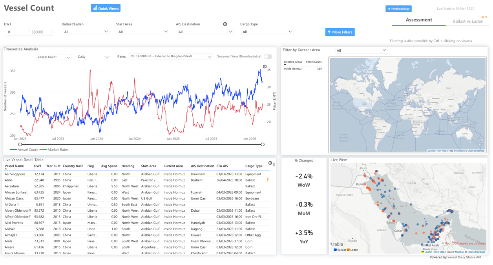
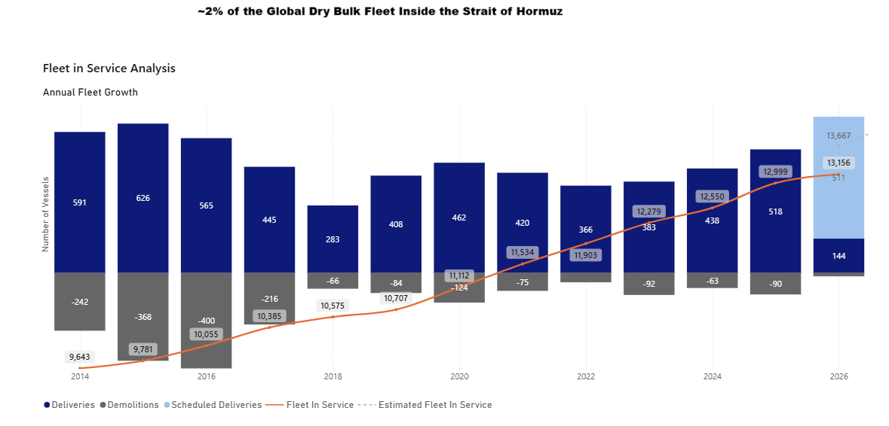
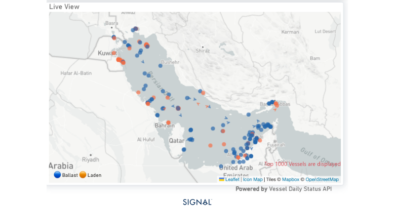
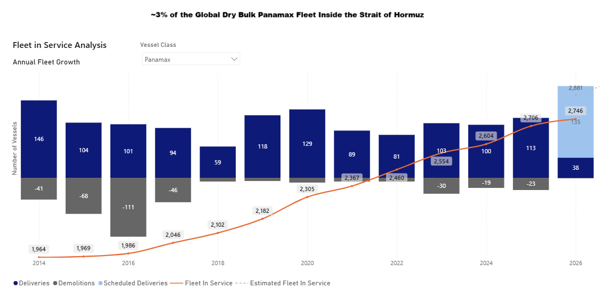
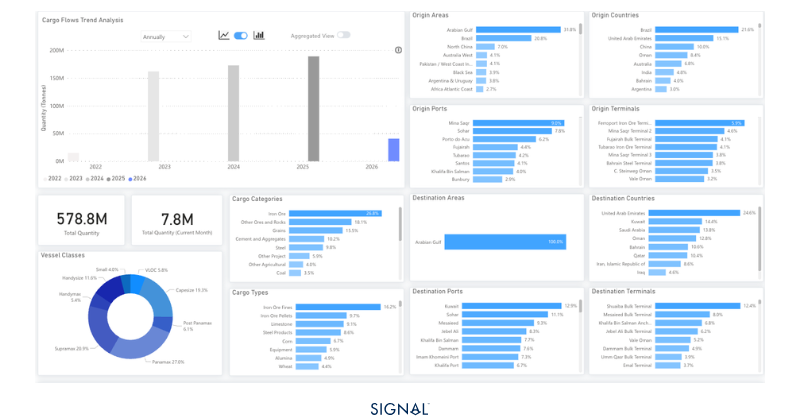

# MARKET INSIGHTS |  Iran- USA/Israel Conflict impact on bulk

**Date**: March 5, 2026 | **Category**: Market Insights | **Section**: Newsroom | **Source**: [https://www.thesignalgroup.com/newsroom/market-insights-iran--usa-israel-conflict-impact-on-bulk](https://www.thesignalgroup.com/newsroom/market-insights-iran--usa-israel-conflict-impact-on-bulk)

---

## Iran- USA/Israel Conflict impact on bulk

Dry bulk trade through the Strait of Hormuz faces disruption, with the impact largely concentrated in minor bulk trades.

## Executive Overview

The Strait of Hormuz is the most important waypoint for vessels destined for the Arabian Gulf, as the largest discharge ports are located on the western side. Given the current conflict in the region, many vessels currently inside the Gulf are unlikely to risk exiting in the near term, effectively limiting available tonnage.

*Source: Vessel CountTSOP| Dry Inside Hormuz*

- ~320 bulk vessels are currently inside the Strait of Hormuz
- ~20% of vessels have a DWT below 25kt
- Only 2 vessels have a DWT above 180kt (Capesize)
- The number of stranded vessels represents less than 2% of the total dry bulk fleet (~13,000 vessels)  and ~3% of the Panamax fleet.

*Source: Dry Fleet in Service AnalysisTSOP*

Overall, given the small share of vessels relative to the total fleet, any impact on the dry bulk freight market is expected to be limited and primarily concentrated in smaller and mid-sized vessel segments.

## Spotlight | Dry Bulk Vessels Inside the Strait of Hormuz

The Strait of Hormuz is a key waypoint for vessels destined for the largest dry bulk discharge ports in the Arabian Gulf. According to data fromSignal Ocean, there are currently 324 bulk vessels located within the Strait of Hormuz region, with vessel sizes ranging from 5,000 DWT to over 183,000 DWT.

Around 51% of these vessels are currently laden, indicating that a significant share of tonnage is actively engaged in ongoing cargo movements. In terms of vessel size distribution, approximately 23% of vessels fall within the small bulker segment (below 25,000 DWT), highlighting the presence of smaller trading units in the region.

In addition, around 8% of the vessels operating in the area are linked to sanctioned entities, reflecting the continued presence of vessels associated with Iranian trade flows. Even before the recent escalation in the region, sanctions risks were already shaping Iranian-linked bulk trading. For example, in early 2026, an Iran-flagged vessel listed under U.S. sanctions records delivered a cargo of urea fertilizer toBrazilafter loading in Asaluyeh, highlighting how Iranian fertilizer shipments have continued to move through international dry bulk routes despite existing sanctions.

*Source:View of vessels inside the Strait of Hormuz, Live at 09:37 GMT March 05 2026*

Although more than300vessels are currently located inside the Strait of Hormuz and effectively removed from active trading, this represents a relatively small share of the global dry bulk fleet. The vessels account for roughly2%of the total active fleet, although the share rises to around3%of thePanamaxfleet currently in service.

*Source: Dry Fleet in Service AnalysisTSOP*

## Spotlight | Dry Bulk Flows - Arabian Gulf

The Arabian Gulf is a growing destination for dry bulk demand, with dry bulk commodity flows to the area increasing by 9% in 2025 to reach 579mt, marking the third consecutive year of growth. The majority, 31% in 2025, originates from the Arabian Gulf as well, with the UAE, Oman, and Bahrain accounting for over 86% of all Arabian Gulf-to-Arabian Gulf dry bulk flows.  On a global count of flows to the Arabian Gulf, the same countries account for over 27%.

*Source:Dry bulk flowsdestined for the Arabian Gulf*

Given that the majority and largest discharge points sit inside the Strait of Hormuz, dry bulk flows to the region are likely to come under significant pressure during the Iran–U.S./Israel conflict, as vessels avoid the chokepoint, war-risk insurance is withdrawn, and carriers suspend transits, even if some Gulf ports remain technically accessible. However, because the Arabian Gulf accounts for a relatively small share of global dry bulk trade, around 3% according to Signal Ocean,  the impact on the wider dry bulk market or bulk commodity prices is expected to be limited unless the disruption at Hormuz becomes prolonged.

## Takeway

The dry bulk sector remains significantly less exposed to disruptions than tanker or LNG shipping, which rely heavily on energy exports from the Gulf region. As a result, the impact on dry bulk freight rates is expected to remain limited unless disruptions become prolonged. Energy markets have nevertheless reacted to rising geopolitical tensions, with oil prices trending higher and signalling increased risk for the global shipping market.

Fertilizertrade has already begun to reflect these developments, as the Gulf region hosts some of the world’s largest fertilizer production hubs. Disruptions in the region are contributing to rising fertilizer prices, increasing the risk of higher agricultural input costs and potential food price inflation. In the event of a broader or prolonged escalation in the Middle East, fertilizer-related dry bulk trades could face additional pressure, particularly as global urea supplies were already relatively tight prior to the current tensions and geopolitical risks remain elevated.

All data, estimates, and projections presented herein are based on information available as of [March 5, 2026]. While every effort has been made to ensure accuracy, the analysis is subject to revision as additional information becomes available.

‍

Speak to experts:Maria BetzeletouSenior Market Analyst - Signal Oceanm.bertzeletou@thesignalgroup.com

Luke NickelsSenior Market Analyst - Signal Ocean‍‍l.nickels@thesignalgroup.com

‍
