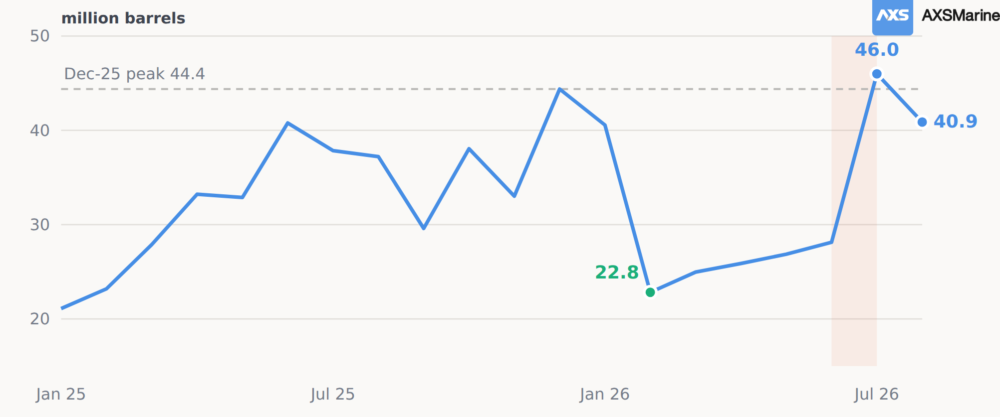
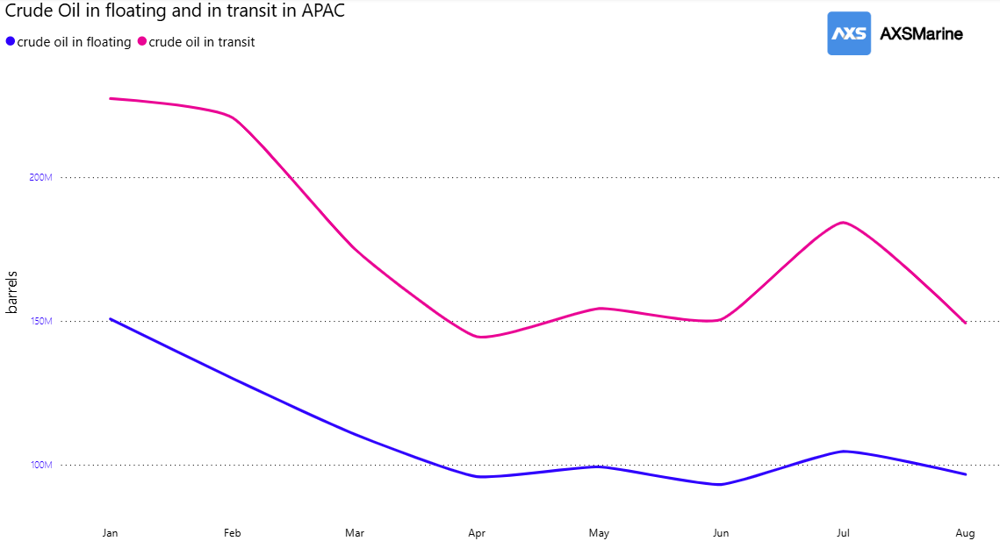
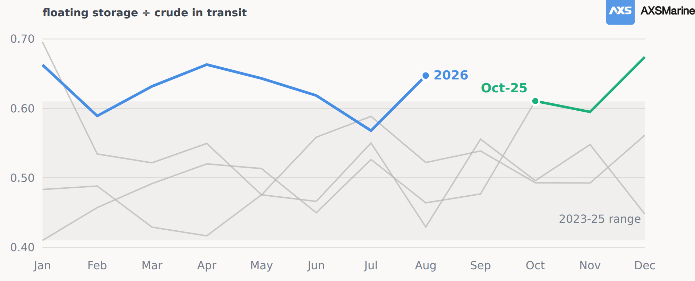
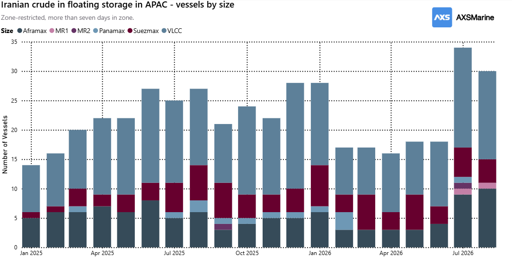
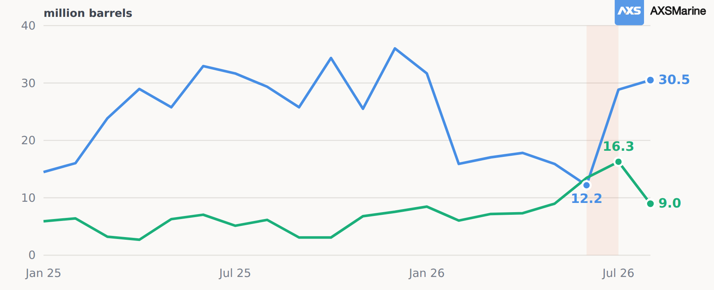

# MARKET INSIGHTS  |  Iran's bottleneck is Hormuz, not the buyer.

**Date**: August 25, 2026 | **Category**: Market Insights | **Section**: Newsroom | **Source**: [https://www.thesignalgroup.com/newsroom/market-insights-irans-bottleneck-is-hormuz-not-the-buyer](https://www.thesignalgroup.com/newsroom/market-insights-irans-bottleneck-is-hormuz-not-the-buyer)

---

## Iran's bottleneck is Hormuz, not the buyer.

The Iranian crude that reached Asia is being taken. The crude that has not reached it is standing at the strait and behind it, and there is nearly twice as much of that.

AXSMarine · Data to 15 August 2026 · All volumes million barrels

Iranian crude sitting in Asian waters peaked at44.4 million barrelsin December. By February it was22.8, a fall of nearly half in two months.

The pile did not stay down. From February it rose every single month. Slowly, but in one direction. By the time the US sanctions waiver opened on 22 June the refill was already four months old.

The window ran three weeks. By the end of July, the pile stood at46.0 million barrels, above its December peak. So, the waiver finished a refill that was already under way and did in one month what the previous four had managed between them.

*Figure 1: Iranian-linked crude in floating storage in Asian waters, monthly. Shaded band: the June to July policy window.*

## The region emptied around it

What makes the Iranian build stand out is that it ran against the tide. Asia's total crude on water fell23.6%between January and July. Both halves fell together, floating storage by 30.6% and crude in transit by 19.0%, which is the detail that matters: had one fallen while the other rose, barrels would simply have been changing state.

*Figure 2: Crude oil in transit & crude oil floating in APAC region*

Two months break the pattern and they belong together. July is a surge in cargo moving, up 22.4% on June and the busiest month since February. August gives all of it back. Barrels moved, then they stopped moving.

## More of what stays is standing still

Divide crude into floating storage and in transit and you get a rough measure of how long a barrel floats before someone takes it. For three years that ratio sat around0.50. Since October 2025 it has averaged0.63.

*Figure 3 : Ratio of crude in floating storage to crude in transit, by month, in APAC.*

The number itself is not unprecedented. January 2023 printed higher than any month of 2026 and reverted within weeks. What is new is that it took longer to revert. Eight of the eleven months since October 2025 have printed at or above 0.61; one month in the previous thirty-three did. And the fourth quarter of 2025 averaged 0.63 the same as for the eight months of 2026.

## July was relocation, and the queue starts at the strait

The measured part is the split at Hormuz.39.8 million barrels stand east of the strait in the Gulf of Oman and 37.1 million remain west of it, 76.9 million of Iranian crude across the Gulf region on 47 hulls, seven in ten of them VLCCs. Asian waters held40.9 millionin August.

The fleet tells the same story as the volumes, and it tells it the whole way along. West of Hormuz the cargo sits in big parcels waiting for the door: 21 hulls, 17 of them VLCCs, averaging1.77 million barrels each. East of the strait the mix breaks up, 26 hulls averaging1.53. Inside Asia the fleet went from eighteen hulls to thirty-four across the window, the growth all in the smaller sizes, and the average parcel fell to1.35. Parcel size declines at every step from MEG to a Chinese berth, which is what ship-to-ship redistribution looks like rather than bulk storage.

*Figure 4 : Iranian crude in floating storage in APAC by vessel size.*

## August looks like a stoppage. It is not one.

The floating to transit ratio (Figure 3) jumped again in August, and the intuitive reading is exactly wrong. Crude in floating storage fell 7.6% that month. Crude in transit fell 18.9%. The ratio rose because the denominator collapsed. Had refiners shut the door, floating storage would have climbed. It did the opposite.

So, the same indicator has now risen twice for opposite reasons. In October 2025 the numerator did the work: crude in floating storage jumped 24% in a single month while crude in transit barely moved, which is cargo arriving faster than it could be taken away. In August 2026 the denominator did the work: crude in transit fell 18.9% while floating storage fell too, just more slowly. Less crude heading for the region at all.

Chinese refinery runs were cut hard, from 14.6 million barrels a day in March to 12.7 in May. But China built crude stocks through the disruption and drew only marginally afterwards. Throughput fell from 14.6mbpd to 13.4 to 12.7 across March, April and May, a drop of 1.9mbpd. Over the same three months crude imports fell from 11.8mpbd to 9.4 to 7.8. Both fell, but not by the same amount, and the gap between them is the whole story.

## It is not one pile. It is a queue with two stages.

Which points to the reading that ties the year together. Iranian crude floating off Malacca is best understood as Chinese inventory that has not yet crossed customs. Drawing it down never shows up in import statistics, which is precisely what makes it useful.

## Singapore   Chinese coastal zones

*Figure 5 : Iranian crude in floating storage in APAC by region.*

August is the part worth stopping on. Chinese-zone holdings fell 45%, from 16.3 million barrels to 9.0, while the Malacca hub grew 6%. That is what discharge looks like in this dataset, and it is the first clear instance of it all year.

## What to watch

Whether the Chinese leg keeps drawing. This pile has only fallen substantially once this year, from 44.4 million barrels in December 2025 to 22.8 in February, and it rose every month after that. August's fall was the first decline since. The Chinese-zone portion alone fell7.3 million barrels in the month, while Singapore rose by a far smaller 1.7 million. Refiners are expected to accelerate their commercial inventory drawdown over the next two to three months to bridge the feedstock gap. And on market-circulated information most of the floating barrels have already been sold, even if that has yet to show through in the regional total, so the demand is there. And the pile is now the nearest crude in the region: Malacca to a Chinese berth is about a week, against three weeks from the Gulf and rather more than that from a Saudi cargo going the long way round Africa.

Fundamental data from AXSMarine. Chinese production, throughput and customs data are official.

‍
