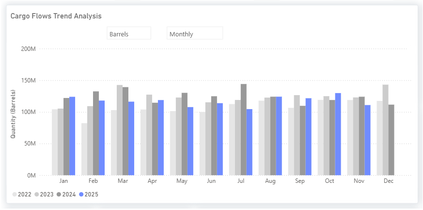

# MARKET INSIGHTS: Oversupply Ahead? Early Signs Signal Weaker U.S. Crude Oil Flows

**Date**: November 19, 2025 | **Category**: Market Insights | **Section**: Newsroom | **Source**: [https://www.thesignalgroup.com/newsroom/market-insights-oversupply-ahead-early-signs-signal-weaker-u-s-crude-oil-flows](https://www.thesignalgroup.com/newsroom/market-insights-oversupply-ahead-early-signs-signal-weaker-u-s-crude-oil-flows)

---

## MARKET INSIGHTS: Oversupply Ahead? Early Signs Signal Weaker U.S. Crude Oil Flows

Signal Ocean’s preliminary data, derived directly from Voyage Details movements, indicate a sharp reversal in U.S. crude oil flows in November, following a standout performance in October.

*https://app.signalocean.com/tanker/dynamic/oilflows*

- Flows climbed to 129.8 M barrels in October 2025, the strongest monthly level of the year and the culmination of steady growth from August through October. However, early November Voyage Details show a steep pullback, with estimated flows currently approx. 110 M barrels for the end of the current month.

- The slowdown aligns with rapidly deteriorating export economics. A sharp rise in VLCC freight has closed the arb to the Far East, while tight Suezmax lists have restricted opportunities into Europe. At the same time, Europe is still clearing heavy October-arriving WTI Aframax flows, leaving the North Sea crude complex oversupplied amid subdued refinery demand.

- Upward pressure on expected U.S. crude inventories. With outbound flows constrained and refinery runs still limited by autumn maintenance, the upcoming EIA release will be key in confirming whether crude oil inventories are beginning to rise, pending improvements in export arbs and a pickup in refinery activity.

Use Signal Ocean’s Voyage Details to spot emerging signals and stay ahead of shifts in the oil world. For more insights, pleasecontact our team. Stay ahead of the curve. Get access to theSignal Ocean Platform.
