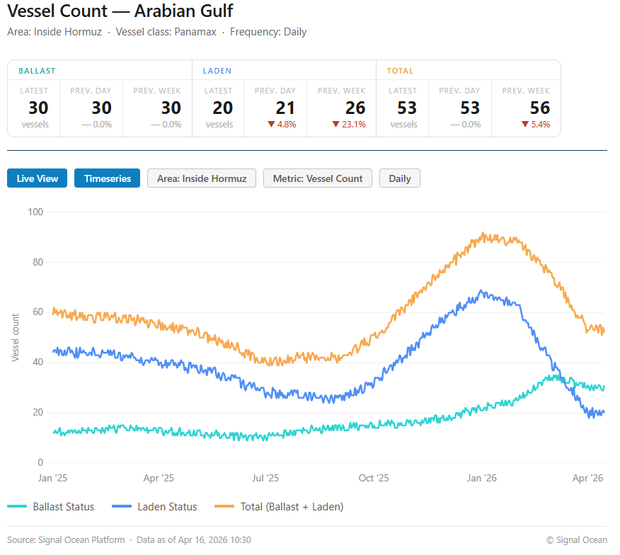
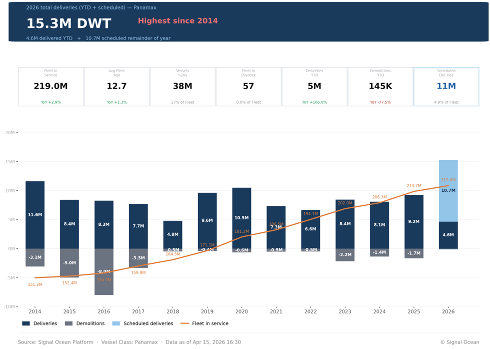
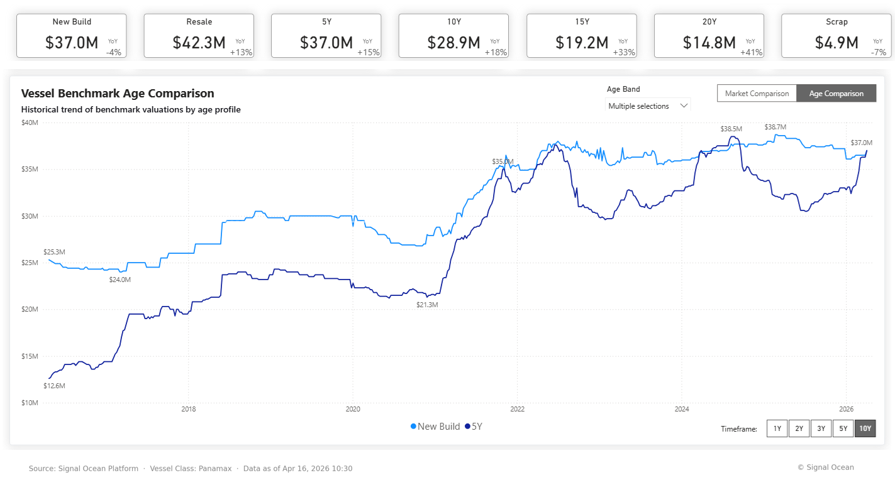

# Market Insights | Panamax Supply Outlook as Hormuz Faces Strain

**Date**: April 17, 2026 | **Category**: Market Insights | **Section**: Newsroom | **Source**: [https://www.thesignalgroup.com/newsroom/market-insights-panamax-supply-outlook-as-hormuz-faces-strain](https://www.thesignalgroup.com/newsroom/market-insights-panamax-supply-outlook-as-hormuz-faces-strain)

---

The ongoing uncertainty surrounding the Strait of Hormuz is impacting the Panamax dry bulk segment. According to recent media reports, a potential two-week extension to ceasefire discussions is under consideration, although this remains unconfirmed at the official level.

In this context, Signal Ocean data show that the number of Panamax vessels in ballast condition within the Strait has remained stable at around 30 (as shown in the chart below), while laden vessel counts have declined sharply from late-February highs. This divergence points to emerging delays in loading or transit for vessels operating in the region amid ongoing disruptions.

*Signal Figure*

## Scheduled Vessel Deliveries Highest since 2014

Panamax vessel deliveries are projected to reach a record high in 2026, with approximately 15 million dwt of new capacity entering the market, up from roughly 10–11 million dwt in the prior year. This expansion is expected to push the global dry bulk fleet near 220 million dwt, reinforcing a clear supply-side growth cycle.

This increase in fleet capacity is taking place against a plateauing outlook for coal demand. According to projections in the IEA's Coal Mid-Year Update (July and December 2025), global coal demand was expected to reach a record ~8.85 billion tonnes in 2025, before edging slightly lower in 2026 and stabilising near ~8.7–8.8 billion tonnes.

*Signal Figure*

## Coal Demand Outlook: Policy Shifts and Market Pressures

## Energy Mix Trends

The latest coal demand trend reflects structural changes in the global energy mix, particularly in China and India, which together account for the majority of consumption. While both countries are expanding renewable capacity at scale, coal continues to play a central role in energy security. This is resulting in a dual-track approach, combining ongoing coal utilisation for system stability with continued investment in renewables.

## China Market Dynamics

In China, recent developments point to a gradual shift. While earlier data indicated a slowdown in coal plant approvals, geopolitical developments have reinforced coal’s role as a reliability buffer. At the same time, policymakers continue to advance a broader transition toward renewables and nuclear power. Domestic coal production remains a priority, limiting incremental import demand.

## India Market Dynamics

In India, policy has moved more decisively toward reducing reliance on seaborne coal. The government is targeting an approximate 30% reduction in thermal coal imports in 2026, replacing imports with increased domestic production. At the same time, coal-fired plants are being operated at full capacity during peak demand periods, indicating higher utilisation without a corresponding rise in imports.

## Short-Term Drivers

Recent geopolitical developments in the Middle East have introduced short-term volatility into energy markets, tightening gas supply and prompting temporary fuel switching toward coal in some regions. At the same time, these developments are accelerating investment in renewables and broader energy security measures.

## Demand Outlook

If disruptions to energy markets persist, coal demand could see modest short-term support, potentially offsetting part of the expected decline in 2026. However, policy direction in major consuming countries suggests that any increase is likely to remain cyclical rather than structural, with long-term demand stabilising rather than returning to sustained growth.

## Will Vessel Orders Surge Continue…?

Geopolitical tensions in the Middle East are likely to keep Asian buyers focused on energy security, slowing efforts to reduce reliance on coal imports. This may lend some short-term support to coal demand, although the broader trend still points to a more stable, rather than growing, demand profile as the energy transition continues.

At the same time, newbuilding prices have recently moved in line with second-hand values, with a 5-year-old Panamax bulker valued at approximately USD 37 million. This shift may begin to support newbuilding orders relative to second-hand purchases, although ordering activity remains sensitive to geopolitical market conditions.

*Signal Figure*

Against this backdrop, the key question remains whether the recent momentum in orders can be sustained, as the market continues to watch oil prices, potential supply disruptions, and ongoing uncertainty around bunkering in the Arabian Gulf.

Maria Betzeletou, Senior Market Analyst - Signal Ocean

All data, estimates, and projections presented herein are based on information available as of [April 16, 2026]. While every effort has been made to ensure accuracy, the analysis is subject to revision as additional information becomes available.
