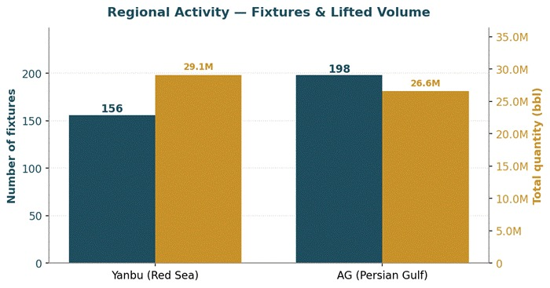
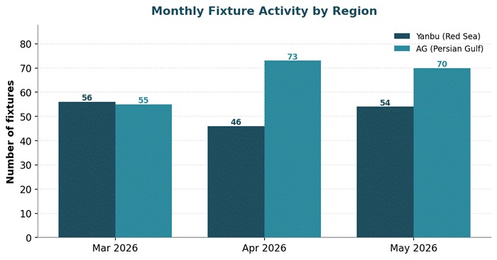
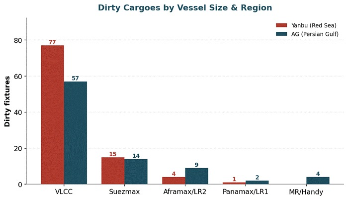
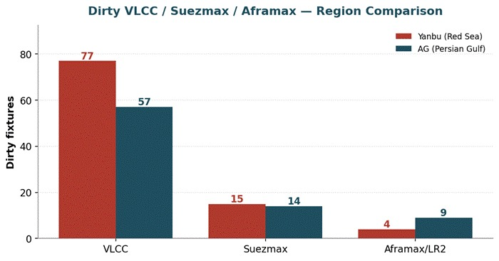
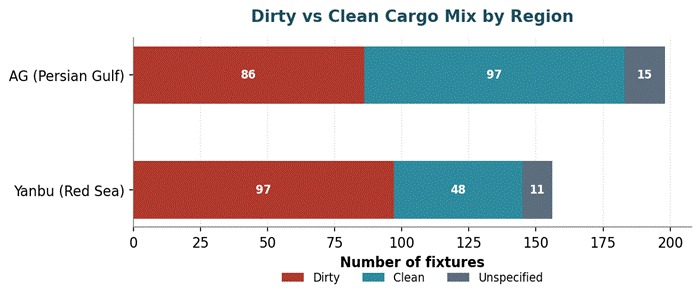

# MARKET INSIGHTS | Red Sea vs Arabian Gulf: Comparing the Fixing Activity Behind the Barrels

**Date**: June 9, 2026 | **Category**: Market Insights | **Section**: Newsroom | **Source**: [https://www.thesignalgroup.com/newsroom/market-insights-red-sea-vs-arabian-gulf-comparing-the-fixing-activity-behind-the-barrels](https://www.thesignalgroup.com/newsroom/market-insights-red-sea-vs-arabian-gulf-comparing-the-fixing-activity-behind-the-barrels)

---

## Red Sea vs Arabian Gulf: Comparing the Fixing Activity Behind the Barrels

Tanker Fixtures, 2 March – 29 May 2026     · 	Reported spot fixtures only

*Signal Figure*

## Executive Overview

Over the spring of 2026, we logged354 reported tankerfixturesacross two of the Middle East's principal crude gateways and set them side by side to compare how each region's fixing activity behaves:Yanbuon Saudi Arabia's Red Sea coast and the widerArabian Gulf (AG)complex stretching from Fujairah and the UAE to Oman. The aim is to look past the raw fixture count to a more useful question: how the two regions' fixture volumes compare by barrel, by ship size, and by terminal, and to do so against the backdrop of an unusually disrupted quarter.

Three observations emerge from the data. First, while fixture activity appears broadly balanced at a headline level, the underlying trade dynamics differ considerably. TheArabian Gulf generated more fixtures (198 versus Yanbu's 156), yet Yanbu accounted for a larger share of crude volumes, loading 29.1 million barrels compared with 26.6 million barrels from the Gulf. This reflects a stronger concentration of large-parcel exports and greater utilisation of VLCC tonnage at the Red Sea terminal.

Third, among Gulf load ports, the spot market now runs through Fujairah, whileRas Tanura, normally a Saudi mainstay, barelyappears, a pattern that closely tracks the events of early March.

## Activity vs. Volume — More Ships in the Gulf, More Barrels from Yanbu

At first glance, the Gulf looks busier, and on a pure fixture count, it is. But counting ships flatters the picture. When we follow the barrels rather than the bookings, Yanbu pulls ahead, its mix is weighted toward 270,000-barrel crude liftings, whereas the Gulf carries a longer tail of smaller clean and product parcels that lift the fixture tally without moving comparable volume. The result is a neat inversion: fewer fixtures at Yanbu, but more oil on the water.

*Fixtures and total lifted volume by region, 2 Mar – 29 May 2026.*

Monthly fixture trends reinforce the contrast. Yanbu maintained relatively stable activity throughout the quarter, whereas Arabian Gulf fixtures increased progressively, resulting in a wider gap in activity by the end of the period.

*Monthly fixture activity, both regions, March–May 2026.*

## The Dirty Book — Where the Two Regions Genuinely Diverge

The differences become clearer when focusing on dirty cargoes, crude oil, and fuel oil, and examining fixture activity by vessel class. The divergence is concentrated in the VLCC segment.Yanbu recorded 77 dirty VLCC fixtures compared with 57 in the Arabian Gulf, accounting for its higher total crude volumes despite fewer overall fixtures. Activity in the Suezmax segment was broadly balanced, with 15 fixtures from Yanbu and 14 from the Arabian Gulf. In the Aframax/LR2 segment, however, the pattern reversed, with the Arabian Gulf recording 9 fixtures against Yanbu's 4.

Read together, the shape is intuitive. Yanbu behaves like a pure crude-export artery feeding long-haul VLCC trades; the Gulf's dirty book spreads further down into the mid-sizes, reflecting a more varied set of loadings and shorter-haul work.

*Dirty fixtures by vessel-size class, Yanbu vs AG.*

*The same comparison, narrowed to the three sizes that matter most for dirty crude.*

The cargo mix underneath tells the complementary half of the story. Yanbu's book is the dirtier of the two,97 dirty fixtures against 48 clean, while the Gulf is far more balanced (86 dirty, 97 clean), buoyed by the steady stream of naphtha and refined products out of Sohar, Duqm, and Ruwais.

*Dirty vs clean cargo mix by region.*

## Gulf Load Ports — Fujairah Leads, Ras Tanura Goes Quiet

The Gulf's loadings are spread across more than a dozen named terminals, but the spot market clearly runs through Fujairah, which alone accounts for 76 fixtures, ahead of Sohar (32), Duqm (29), and Mina Al Fahal (21). What draws the eye, though, is at the bottom of the graph.Among named ports, Ras Tanura, one of Saudi Arabia's flagship crude terminals, appears with just 1 fixture.

Ras Tanura's limited spot fixture count should be viewed in the context of two important factors. First, most crude exports from the terminal move under long-term contracts and therefore do not appear in reported spot fixture activity. As a result, spot fixture counts capture only a small portion of the terminal's overall export programme. Second, regional disruptions and heightened security concerns at the beginning of the period coincided with increased use of the East-West Pipeline export route, supporting higher loading activity at Yanbu.

*Gulf named load ports ranked by fixture count, split by cargo type. A small group of fixtures logged only to the region — with no named terminal — is shown separately below the divider, since it cannot be attributed to any single port. Ras Tanura highlighted.*

## Market Context — A Quarter Shaped by an Unresolved Crisis

None of the above patterns should be viewed in isolation. The fixture window coincided with a period of regional disruption, making the data a reflection of market behaviour under exceptional conditions rather than a structural shift in Middle East crude trade.

The sequence, as understood at the time of writing in early June 2026, began on 2 March when a drone strike targeted Saudi Aramco's Ras Tanura refinery. Although reported damage was limited, operations were temporarily suspended as a precaution, and some export flows were redirected through alternative routes. Part of the increased activity observed at Yanbu may therefore reflect Saudi volumes moving through the Red Sea rather than the Gulf coast.

The disruption also altered the relative attractiveness of regional loading locations. Fujairah benefited from its position outside the Strait of Hormuz and its connection to inland pipeline infrastructure, while Omani terminals provided direct access to the Arabian Sea without requiring transit through the Strait.

Against this backdrop, the Baltic Exchange launched a public trial of TD34, a 270,000-tonne dirty tanker route from the Gulf of Oman to China on 26 March. The route was introduced to improve market transparency following disruptions to Middle East Gulf trade, with Oman serving as a natural reference point given its location outside Hormuz.

Conditions remained unsettled through early June. A renewed exchange of attacks between Iran and Israel on 7 June underscored the continued sensitivity of regional shipping markets to security developments.

Other explanations fit the timeline less well. The UAE's withdrawal from OPEC, effective 1 May 2026, occurred after both the Ras Tanura incident and the launch of TD34. Likewise, while existing pipeline infrastructure supported Fujairah's role as an alternative loading location, the timing of the shift in fixture activity aligns more closely with the disruption to Gulf export routes than with changes in energy policy or infrastructure investment.

## The Takeaway

On fixture count alone, the Arabian Gulf and Yanbu appear broadly comparable. A closer examination of cargo volumes, vessel deployment, and loading locations, however, reveals distinct market profiles. Yanbu accounted for more crude volume despite fewer fixtures, reflecting its concentration in dirty VLCC liftings and the temporary redirection of some Saudi export flows toward the Red Sea. The Arabian Gulf generated more fixture activity overall, with Fujairah emerging as the main centre of spot market activity while Ras Tanura remained largely absent from reported fixtures. These patterns were shaped primarily by disruptions to regional export routes and uncertainty surrounding the Strait of Hormuz, rather than by structural changes in trade flows or energy policy. As long as those conditions persist, loading patterns and vessel deployment are likely to remain sensitive to developments in the regional security environment.

All data, estimates, and projections presented herein are based on information available as of [June 9, 2026]. While every effort has been made to ensure accuracy, the analysis is subject to revision as additional information becomes available.
