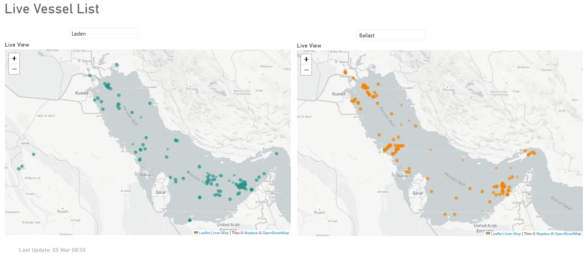
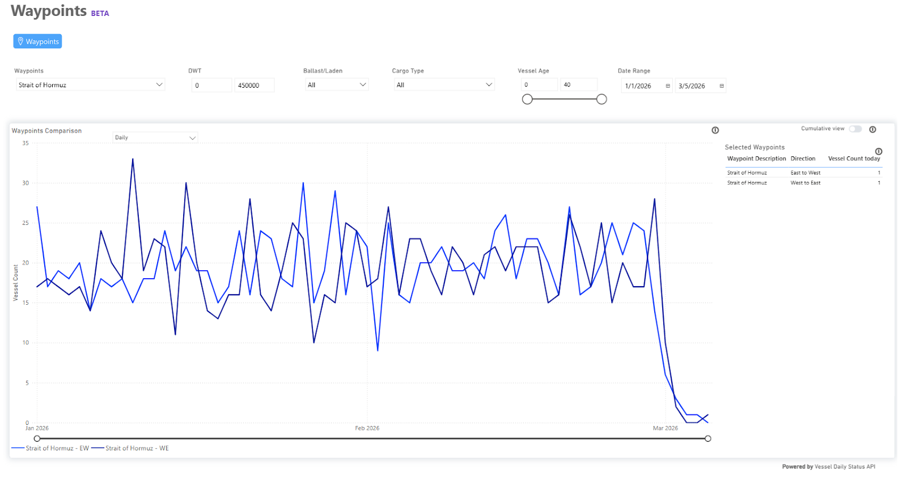
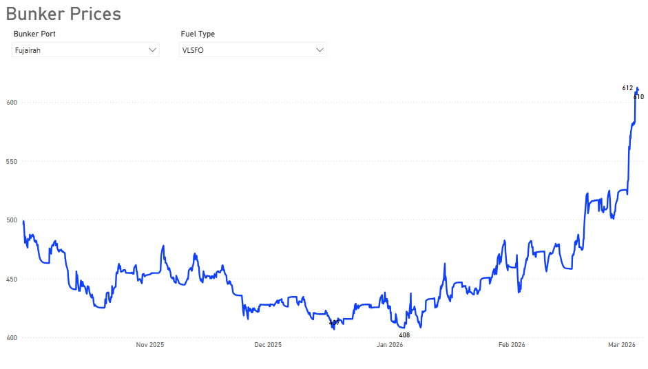
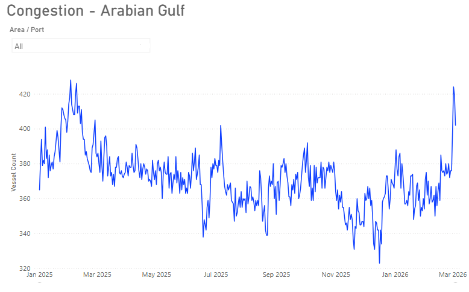

# MARKET INSIGHTS |  Rising Tensions Since Saturday Escalate Energy Risk

**Date**: March 6, 2026 | **Category**: Market Insights | **Section**: Newsroom | **Source**: [https://www.thesignalgroup.com/newsroom/market-insights-rising-tensions-since-saturday-escalate-energy-risk](https://www.thesignalgroup.com/newsroom/market-insights-rising-tensions-since-saturday-escalate-energy-risk)

---

### ‍Strait of Hormuz | From Vital Energy Chokepoint Point to PressurePointThe sustained tensions since Saturday continue to diminish the prospects for de-escalation.

‍

*Signal Figure*

TSOPIran Tensions Insights

## Executive Overview

Tensions around the Strait of Hormuz are increasingly spilling into global oil markets, raising concerns about potential disruptions to one of the world’s most critical energy transit routes. As regional tensions evolve, the central question for markets is no longer whether disruptions may occur, but how long they could persist.

Major Asian importers appear particularly exposed. China and India remain heavily dependent on Gulf crude supplies, although India has indicated that national inventories could cover approximately 40–45 days of demand.Russiais expected to increase oil exports to both countries, which may partially offset any sustained disruption to Gulf shipments.

At the same time, the maritime risk environment in the Gulf is tightening. Marine insurers have issued notices regarding war-risk coverage for vessels operating in the region, with changes reportedly taking effect from 5 March 2026. Marine insurance brokers indicate that war-risk premiums have increased sharply, in some cases by50–100%.

According to reports in Iranian state media, Iran's Islamic Revolutionary Guard Corps has announced a ban on the transit of vessels linked to the United States, Israel, Europe, and other Western allies through the Strait of Hormuz. In response to this tension, China has urged de-escalation. Furthermore, regional players such as the United Arab Emirates and Qatar are reportedly promoting diplomatic initiatives to avert a sustained interruption of regional trade and energy exports.

Taken together, these developments point to a rapidly evolving risk environment in the Strait of Hormuz, where geopolitical tensions and rising insurance costs may increasingly shape vessel movements through one of the world’s most strategically important shipping corridors.

## What We Know So Far

The Strait of Hormuz has long been central to geopolitical tensions affecting global oil markets. While the Strait has never experienced a prolonged closure, periods of escalation have historically influenced shipping costs and operational conditions across the Gulf. What makes the current situation notable is that market indicators began adjusting even before the escalation resulted in confirmed disruption.

Ship traffic has nearly stopped in the Strait of Hormuz

Based on TSOP AIS vessel tracking data, daily crossings through the Strait of Hormuz declined sharply in early March to near zero.

Waypoints Strait of Hormuz

*Signal Figure*

TSOPWaypoints Comparison

## Bunker Fuel Prices Spike in Fujairah

Bunker fuel prices in Fujairah have risen sharply over the past week, with VLSFO reaching$610/tonon 5 March,up 22% WoW.

*Signal Figure*

TSOPIran Tensions Insights

## Hormuz Disruptions Push AG Congestion Higher

Security disruptions in the Strait of Hormuz appear to be pushing up Arabian Gulf port congestion, which increased by ~7%between 27 February and 4 March 2026.

*Signal Figure*

TSOPIran Tensions Insights

## Potential Scenarios: A Duration Framework

The path of oil prices will largely depend on how long the disruption lasts.

If tensions ease within about a week, Brent crude could stabilize in the $80–$90 per barrel range before gradually retreating toward $70 as the geopolitical risk premium fades.

If disruptions persist for several weeks, supply could tighten, and Brent may move above $100 per barrel as inventories decline and refiners seek alternative barrels. In a prolonged disruption scenario, Brent prices could move well above $100, with some industry estimates pointing toward $120per barrel. Export bottlenecks could force production cuts across the region as storage facilities fill and logistics become increasingly strained. A disruption lasting around twenty-five days could turn market volatility into a more structural supply shock.

## What’s Next

At this stage, the central question across the industry remains straightforward: is the Strait of Hormuz actually closed, and what would that mean in practice? From a legal standpoint, the strait has not been closed, and no official announcement or navigation notice has been issued suspending transit. Operationally, however, the situation can look very different. When security risks rise, crews become reluctant to sail in the area, and war-risk insurance is restricted or withdrawn, the strait can effectively become extremely difficult to use, even if it technically remains open.

Based on current data, the duration of the disruption remains uncertain. A prolonged crisis scenario currently appears less likely, as an extended interruption would place increasing pressure not only on the major import-dependent economies of Asia but also on Gulf economies. In response to potential disruptions in the Strait of Hormuz, Saudi Aramco has already activated contingency measures, including the use of its Red Sea export route via Yanbu to bypass the strait. In any case, shipping has already experienced one of the most significant disruptions in recent decades, and even if tensions ease, it may take time before normal conditions in maritime transport are fully restored.

All data, estimates, and projections presented herein are based on information available as of [March 5, 2026]. While every effort has been made to ensure accuracy, the analysis is subject to revision as additional information becomes available.
