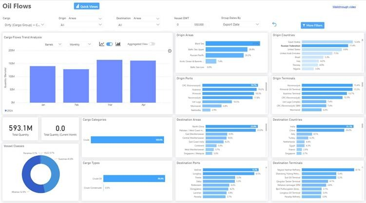
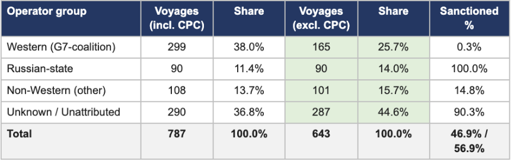
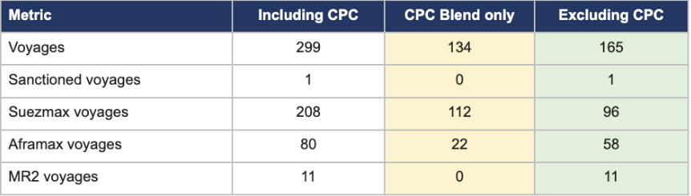
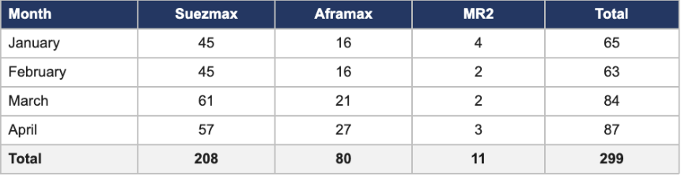
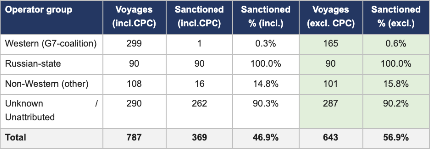
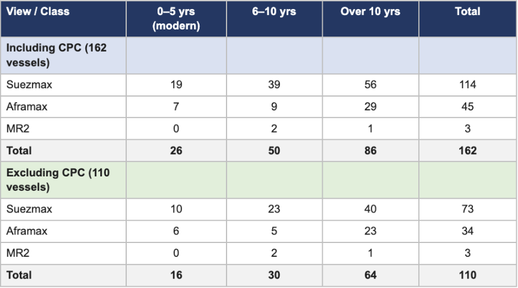

# MARKET INSIGHTS | Russian Crude Exports: Who Carries the Barrels

**Date**: May 26, 2026 | **Category**: Market Insights | **Section**: Newsroom | **Source**: [https://www.thesignalgroup.com/newsroom/market-insights-russian-crude-exports-who-carries-the-barrels-jan-apr-2026](https://www.thesignalgroup.com/newsroom/market-insights-russian-crude-exports-who-carries-the-barrels-jan-apr-2026)

---

## ‍MARKET INSIGHTS | Russian Crude Exports — Who Carries the Barrels, Jan–Apr 2026

*Signal Ocean Platform — Oil Flows dashboard, Russian crude exports, January–April 2026*

## Executive Overview

Over the first four months of 2026, the Signal Ocean Platform recorded787 crude voyages lifted from Russian ports, totalling approximately 593 million barrels. This insight goes a layer deeper than the dashboard view above: using the underlying voyage records, it examineswho is commercially operating the tonnage. It isolates the share of voyages that carry Kazakhstan-origin CPC Blend rather than true Russian-origin crude.

Three findings stand out. First, Western (G7-coalition) commercial operators are involved in 38% of Russian-port liftings, but only 26% once CPC Blend is stripped. Second, the sanctioned share of total flow rises from 47% on the headline (including CPC) to 57% on a true-Russian-crude basis. Third, the Western fleet active in this trade is mainly old: 53% of the 162 Western vessels involved are over ten years old, rising to 58% of the 110 vessels that touched true-Russian cargo at any point in the period.

## Commercial Operators — Western Share Falls Sharply Once CPC Is Removed

*Source: Voyage records, Jan–Apr 2026. Green cells = excluding CPC Blend (true-Russian-origin only).*

The Western market share, initially recorded at 38%, decreases to25.7%upon the exclusion of CPC Blend voyages. This represents the most significant variance identified in the study: specifically, of the 299 Western voyages,134—representingapproximately50%—constituteCPCBlendoperationsattheNovorossiysk-CPCterminal, involving the transport of Kazakhstan-origin crude as opposed to Russian-origin petroleum.

Conversely, the Unknown / Unattributed category remains largely unchanged across both analytical perspectives, adjusting from 290 to 287 voyages. Consequently, the activity within this group is almost entirely composed of true-Russian-origin exports. This segment exhibits the highest concentration of sanctions risk, as 90.3% of Unknown voyages involve vessels designated by the EU, OFAC, or OFSI.

## Western (G7-coalition) - Higher exposure to True Russian Crude per Vessel Size

- CPC Blend:134 voyages (44.8% of Western total).
- True Russian-origin:165 voyages (55.2% of Western total).
- Unlike Suezmax vessels,which primarily carry CPC Blend (Kazakh-origin), Aframax vessels are the workhorses for true Russian-origin crude.72.5% of Aframax voyages (58 out of 80) carry true Russian crude.In contrast, only 46% of Suezmax voyages (96 out of 208) carry true Russian crude, with the majority being the exempt CPC Blend.
- 72.5% of Aframax voyages (58 out of 80) carry true Russian crude.
- In contrast, only 46% of Suezmax voyages (96 out of 208) carry true Russian crude, with the majority being the exempt CPC Blend.
- Lower Overall Volume than Suezmax: While Aframax is the second most used vessel size, its total volume (80 voyages) is significantly lower than that of Suezmax (208 voyages), representing about 27% of the total Western-operated fleet in this dataset.

- 72.5% of Aframax voyages (58 out of 80) carry true Russian crude.
- In contrast, only 46% of Suezmax voyages (96 out of 208) carry true Russian crude, with the majority being the exempt CPC Blend.

CPC Blend is loaded at the Novorossiysk-CPC marine terminal but originates from Kazakhstan, shipped via the Caspian Pipeline Consortium across southern Russia. Within the Russian-port system captured on the platform, the CPC complex (terminal plus SBM) is the single largest loading point of the period. The table below shows what happens when this Kazakhstan-origin flow is isolated:

*Source: Voyage records — Western (G7-coalition) operators only. Yellow = CPC Blend; green = true-Russian-origin.*

The distribution of voyages across vessel classes reveals a distinct operational preference based on the origin of the cargo. Suezmax vessels are split nearly evenly between CPC Blend and true-Russian crude, with 112 voyages (53.8%) dedicated to the Kazakhstan-origin CPC Blend and 96 voyages (46.2%) carrying true-Russian petroleum. In contrast, Aframaxes demonstrate a significant lean toward true-Russian exports, with 58 out of 80 total voyages (72.5%) transporting Russian-origin cargo, while only 22 voyages are attributed to CPC operations. Participation from the MR2 class is uniquely specialized, as all 11 recorded voyages were exclusively utilized for true-Russian trades.

This trend aligns with the logistical requirements of the underlying trades. The long-haul routes originating from the Novorossiysk-CPC terminal favor the economies of scale provided by larger Suezmax tonnage. Conversely, the shorter maritime corridors, such as Baltic-to-Europe and Baltic-to-Mediterranean routes, are more efficiently served by Aframaxes and, for the smallest parcel sizes, MR2s.

## Monthly Trend - Western Activity Built Through the Period

- Significant Growth in Activity: Total voyages by Western operators grew from 65 in January to 87 in April, representing a 33.8% increase over the four months.
- Dominance of Suezmax Vessels: Suezmax vessels are the primary vessel class used by Western operators, accounting for the majority of voyages each month. Their activity peaked in March with 61 voyages.
- Rising Aframax Usage: There has been a steady increase in the use of Aframax vessels, which rose from 16 voyages inboth January and February to 27 voyages in April.

Voyage activity within the Western group demonstrated a clear upward trajectory over the four months. Following relatively stable levels in January and February, with 65 and 63 voyages respectively, activity accelerated markedly in March to 84 voyages before reaching a four-month peak of 87 voyages in April (+38%). From a fleet composition perspective, Suezmax vessels consistently dominated the trading pattern, maintaining a stable and significant contribution throughout the period with monthly voyages ranging from 45 to 61. Aframax participation displayed greater month-to-month volatility, fluctuating between 16 and 27 voyages. Meanwhile, MR2 vessels accounted for only a limited share of total activity; however, their participation remained steady across all four months.

*Source: Voyage records — Western (G7-coalition) operators, Jan–Apr 2026*

## Sanctions Exposure

The increase in the sanctioned share from 46.9% to 56.9% is primarily the result of removing predominantly non-sanctioned CPC Blend voyages from the dataset, which concentrates sanctioned activity within a smaller total pool of voyages. After excluding Kazakhstan-origin CPC Blend cargoes, the remaining 643 true Russian-origin voyages exhibit significantly higher sanctions exposure. Western-operated activity remained almost entirely compliant, with 99.4% of voyages classified as non-sanctioned. In contrast, the Unknown / Unattributed segment accounted for 44.6% of ex-CPC voyages and represented the main concentration of sanctioned activity, with 262 out of 287 voyages (90.2%) conducted by vessels sanctioned by the EU, OFAC, or OFSI. The findings highlight a clear distinction between the G7-compliant infrastructure supporting Kazakhstan-origin CPC Blend exports and the shipping networks transporting true Russian-origin crude.

*Source: Voyage records, Jan–Apr 2026. Sanctioned = vessel on EU, OFAC or OFSI designation lists. Green cells = excluding CPC.*

## Western Fleet Age - Structurally Old, Particularly on True-Russian Cargo

The 162 Western-operated vessels active in this trade are weighted to older tonnage. Suezmaxes dominate the count (114 of 162 vessels) and are the oldest sub-fleet — only 19 of 114 are under five years old, while 56 are over ten. Aframaxes (45 vessels) show a similar skew: 7 modern, 29 over ten.

*Source: Voyage records — Western (G7-coalition) operators. Age calculated as (2026 − Year Built).*

Looking at the 110 Western vessels that touched true-Russian-origin cargo specifically (the ex-CPC view):64 of 110 are over ten years old (58%), and only 16 are under five years old (15%). The implication is that the Western fleet that remains active in true-Russian-crude movement after CPC is stripped out is meaningfully older than the headline Western fleet figure suggests, and is dominated by Suezmax tonnage approaching the end of conventional trading life.

## Key Takeaway: Two Views Tell Different Stories

The headline platform view describes a 593-million-barrel Russian-port export trade, dominated by Aframax and Suezmax tonnage and split principally between Chinese, Indian, Mediterranean, and Continental destinations. That picture is correct as far as it goes, but it conflates two functionally different cargo flows: true-Russian-origin crude (subject to the G7 price cap) and CPC Blend (Kazakhstan-origin, outside the cap, but loaded at a Russian port).

Pulling those two flows apart materially changes the operator and compliance picture. The Western (G7-coalition) operator share drops by twelve percentage points (38.0% → 25.7%) when CPC is removed. The total sanctioned share rises by ten percentage points (46.9% → 56.9%) for the same reason. And the Western fleet that remains involved in true-Russian-origin movement, after CPC liftings are excluded, is older than the headline Western fleet figure indicates.

## Discover the Data That Drives These Stories

This insight was produced by combining the Signal Ocean Platform Oil Flows dashboard (shown above). The platform supports interactive filtering by cargo group, origin area, destination, vessel DWT, and date grouping; the Voyage Details dashboard and Signal Ocean Data Warehouse APIs expose the underlying records that power the operator-level analysis presented here.

## Methodology

•       Source: Signal Ocean Platform voyage records, crude liftings ex Russian Federation load ports, 1 January – 30 April 2026.

•    The underlying voyage feed contains the commercial-operator name only — no country, jurisdiction, parent-company, or beneficial-owner field.

•       CPC classification: any voyage with origin port containing "CPC" tagged as CPC Blend. All other Russian-port liftings (Primorsk, Ust-Luga, Murmansk, Kozmino, Nakhodka, Sabetta, Prigorodnoye, non-CPC Novorossiysk) are classified as true-Russian-origin.

•       Sanctioned = vessel appears on at least one of the EU, OFAC, or OFSI designation lists in the source dataset.

•       Counts are voyage counts, not market-share by tonnage.

All data, estimates, and projections presented herein are based on information available as of [May 22, 2026]. While every effort has been made to ensure accuracy, the analysis is subject to revision as additional information becomes available.
