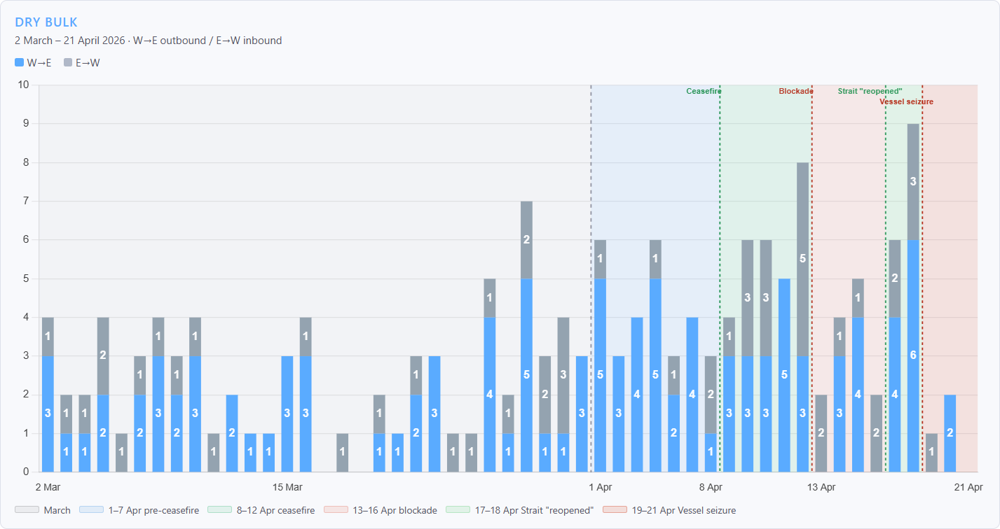
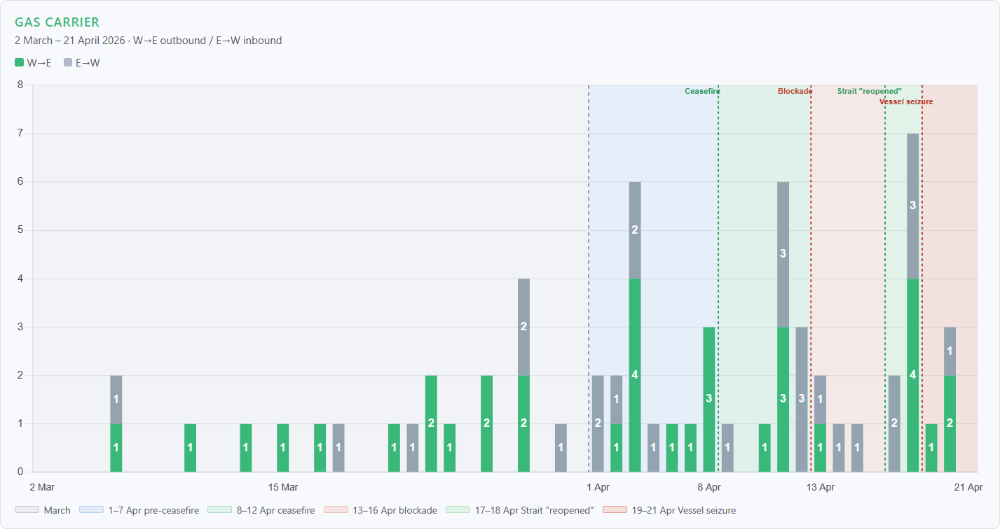
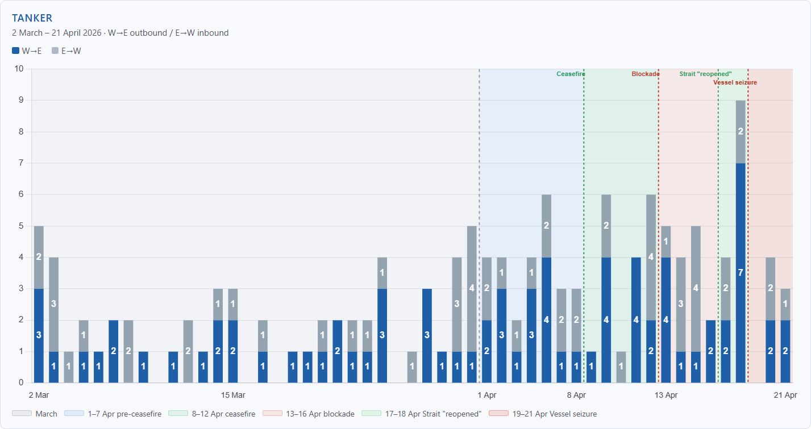
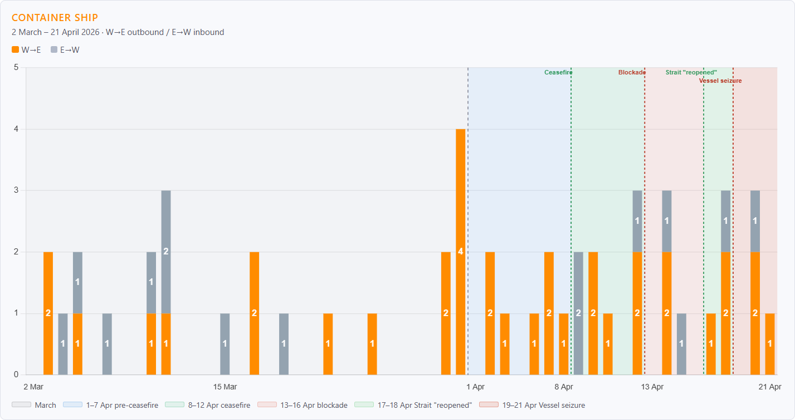
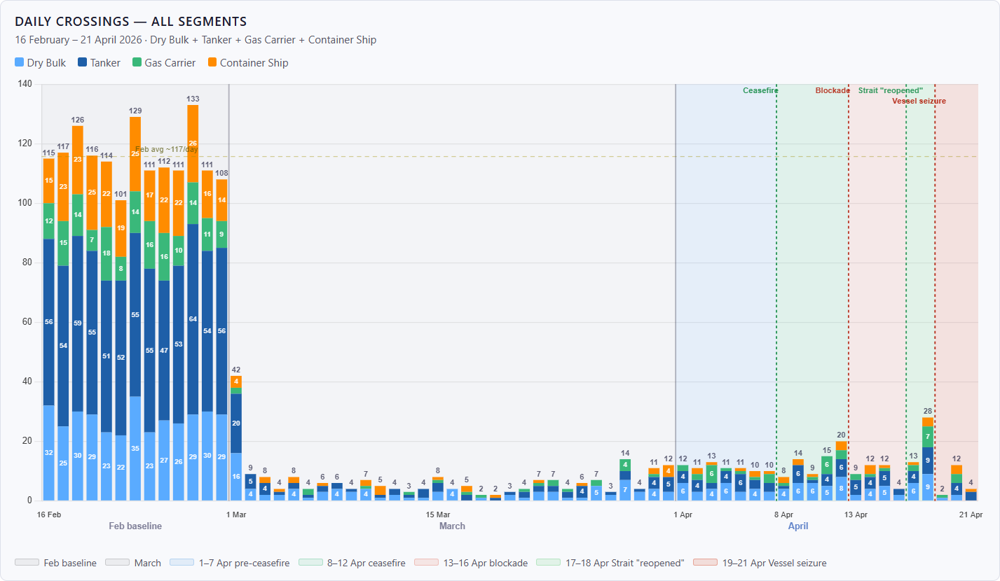

# Market Insights | The Strait After the Ceasefire. Seven Weeks of Data from the Gulf's Only Maritime Exit

**Date**: April 24, 2026 | **Category**: Market Insights | **Section**: Newsroom | **Source**: [https://www.thesignalgroup.com/newsroom/market-insights-the-strait-after-the-ceasefire-seven-weeks-of-data-from-the-gulfs-only-maritime-exit](https://www.thesignalgroup.com/newsroom/market-insights-the-strait-after-the-ceasefire-seven-weeks-of-data-from-the-gulfs-only-maritime-exit)

---

AXSMarine AIS-derived crossing data, collected continuously from 1 March through 21 April 2026, documents how the Strait of Hormuz has functioned - and who has been willing to use it - in the weeks since the conflict began.

## From Stillness to Structure

When we published When the Gulf Went Still in early April, the defining feature of the Strait of Hormuz was absence. Crossings had collapsed to near zero in the first days of March. The 353 dry bulk and multipurpose vessels confirmed inside the Gulf by 5 March had nowhere to go. Seven weeks of continuous AIS tracking later, traffic has not recovered in any meaningful sense. What has emerged instead is a stratified corridor: thin, defined less by commercial logic than by risk tolerance, flag of convenience, and proximity to the sanctioned fleet.

Across the full post-conflict period from 1 March to 21 April, AXSMarine recorded 446 confirmed crossings across dry bulk, tanker, gas carrier and container ship segments - an average of 8.6 per day, against a pre-conflict baseline of 115.7. That figure masks significant phase-to-phase variation, from a low of 6.6/day in March to a brief peak of 28 crossings on a single extraordinary day in late April.

## March: The Residual Fleet

The first operators to move in March were Greek Panamax owners under acute commercial pressure - vessels that had completed discharge cycles and needed to exit. GEORGIA T, MINOAN SKY, STAR GWYNETH and MINOAN DIGNITY all crossed outbound between 13 and 16 March, followed by Chinese-operated Panamaxes including BAILIAN STAR and BROAD RICH. The common thread was size and cargo type: 70–85k DWT bulk carriers that had been working grain and fertilizer trades and were furthest behind on their next fixture. These were not operators scheduling new fixtures through Hormuz - they were completing existing ones and exiting.

*Signal Figure*

In the tanker segment, the structural signature of a disrupted corridor was already visible. Of the 67 tanker crossings recorded in March, 39 - fully 58% - involved vessels with sanctioned, ghost fleet or opaque ownership profiles. Western-flagged transparent operators accounted for just 21% of March tanker movements. Sanctioned-adjacent and opaque fleets - sanctioned and ghost fleet - were maintaining the thin thread of crude and product flows that conventional operators had abandoned.

Gas carrier traffic was comparatively thin: 21 crossings against a February baseline of 12.6/day. The most notable development was the emergence of Indian-flagged LPG carriers - BW ELM, BW TYR, PINE GAS, JAG VASANT and SHIVALIK - operating under the diplomatic exemption Iran announced covering India, China, Russia and Pakistan. Their sustained presence, against a backdrop of sanctioned-fleet dominance elsewhere in the segment, reflects a fleet operating under a different risk and legal framework from the rest of the market.

*Signal Figure*

Container ships recorded the most complete withdrawal of any segment. Of 27 March crossings, half involved Iranian-flagged or Iran-owned vessels on domestic routes. The only Western liner operator to move was Maersk’s ASTRID MAERSK (190,567 DWT) on 1 March - the last day before the commercial withdrawal became total. The two COSCO giants CSCL INDIAN OCEAN and CSCL ARCTIC OCEAN (both 184,320 DWT) crossed on 30 March; no comparable vessels followed.

## April: A Corridor, Not a Recovery

The ceasefire announced on 7 April changed the operating environment without restoring normal conditions. The 1–12 April period averaged 11.1 and 13.2 crossings per day respectively, a modest improvement over March but far below any definition of commercial normalcy.

The most significant tanker movement of the entire post-conflict period occurred on 11 April: four VLCCs crossed in a single day - COSPEARL LAKE (299,118 DWT, Chinese-owned), HE RONG HAI (320,612 DWT, Chinese-flagged), SERIFOS (309,396 DWT, Greek-owned) and MOMBASA B (299,392 DWT, Korean-owned). The concentration of four VLCCs on one day suggests coordinated movement through what operators perceived as a brief safe window - a pattern consistent with the IRGC toll-charging phase observed in March, and with the broader behaviour of an industry that had learned to read the corridor’s risk signals carefully.

*Signal Figure*

When the US blockade of Iranian ports took effect on 13 April, traffic dipped to 9.2 crossings per day over four days. Notably, Iranian-flagged vessels continued to cross throughout: CLAVEL (50,072 DWT chemical/oil tanker) inbound to Chabahar on 17 April, NESHAT (23,116 DWT MPP) on 16 April. The blockade’s stated scope - restricting vessels entering or leaving Iranian ports while preserving freedom of navigation to non-Iranian ports - created an ambiguity that operators of all nationalities were actively navigating.

## 72 Hours That Defined the Period: 17–19 April

The most volatile sequence in seven weeks of data is compressed into three days. On 17 April, Iran’s Foreign Minister Abbas Araghchi announced the Strait was open to all commercial vessels for the duration of the Lebanon ceasefire. Oil prices fell around 11%. In the AIS data, the effect was immediate.

18 April recorded 28 crossings - the highest single day since 1 March, the last day of normal trading. Every segment posted its highest post-blockade daily count simultaneously. FPMC C LORD (301,861 DWT, Taiwan-owned VLCC) crossed outbound alongside DESH GARIMA (114,790 DWT, Indian-flagged) and NAVIG8 MACALLISTER (75,618 DWT, Singaporean-owned) - the most significant return of mainstream commercial operators to the corridor since early March. In dry bulk, nine crossings included Greek-owned Panamaxes DANAE (81,252 DWT) and CECI (82,338 DWT) alongside UAE and Kuwait-owned vessels, and in gas, seven crossings brought the segment’s highest post-conflict daily count, though dominated by sanctioned and ghost-fleet operators including NV AQUAMARINE, GAS LEADER and RAINE.

The window lasted hours. President Trump confirmed the US blockade of Iranian ports remained in effect. Iran reversed its announcement; the IRGC declared the Strait had returned to its previous state, and IRGC gunboats reportedly fired on at least one merchant vessel. On 19 April, USS Spruance intercepted and seized the Iranian-flagged cargo vessel TOUSKA in the Gulf of Oman - the first vessel seizure of the conflict. That day recorded two crossings across all segments.

*Signal Figure*

The three days following the seizure averaged 6.0 crossings per day - the lowest sustained rate since late March. The reopening window had averaged 20.5.

## Who Is Still Moving

The vessel-level data across the full period tells a consistent story about which operators have remained active and which have not.

In dry bulk, Greek owners account for 55 of 180 crossings from 1 March to 21 April - more than any other nationality, nearly double the Iranian tally of 34 and well ahead of Chinese operators at 23. But the character of that Greek participation matters: these are almost entirely outbound Panamax and Kamsarmax bulk carriers completing legacy discharges, not operators committed to new routing through the Strait. The size distribution - 68 vessels in the 25–55k range, 52 in the 55–82k range, 17 above 82k — reflects exactly the Supramax and Panamax trades that dominated Gulf commodity flows before the conflict.

In tankers, sanctioned and opaque-ownership operators have accounted for a majority or near-majority in every period except the brief reopening window. Of 32 VLCC and Suezmax crossings (above 100,000 DWT) recorded from March to 21 April, the majority carried opaque or sanctioned ownership structures.

The 18 April spike is the clearest signal in the data about what demand actually looks like. When both governments simultaneously indicated the Strait was open, 28 vessels crossed in a single day. The operators were positioned. The tonnage was ready. The resumption of commercial traffic at scale is not a question of vessel availability or market appetite.

Container ships remain the starkest case. TEMA EXPRESS (50,790 DWT, German-owned, Liberia-flagged) appeared on 21 April after a month-long AIS blackout - a single data point from a vessel whose schedule has been absent from the corridor for weeks. Its reappearance underscores both the latent demand and the conditions that currently prevent it from being met.

## What the Data Shows

Seven weeks in, the Strait of Hormuz functions at roughly 7–9% of its pre-conflict utilization rate during stable periods, with brief spikes when political signals align and sharp contractions when they don’t. The corridor that remains is dominated by operators with higher risk appetite, diplomatic exemptions, or ownership structures that make the calculation different from the one facing mainstream commercial fleets.

*Signal Figure*

The 18 April data remains the most important single observation: given the signal, the market responded within hours. The question of when normal traffic resumes is entirely political. The commercial infrastructure to support it is already in place.

Data source: AXSMarine AIS-derived crossing data, 1 March – 21 April 2026. All figures are based on AIS-visible transits only and exclude vessels operating in confirmed blackout. Vessel-level crossing data available on request.

Learn more about AXS Data & APIs: public.axsmarine.com/data-and-apis
