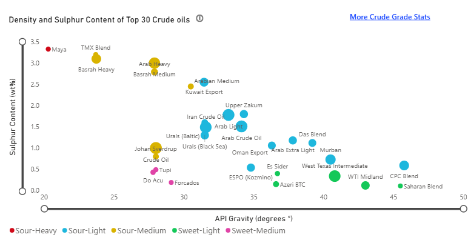
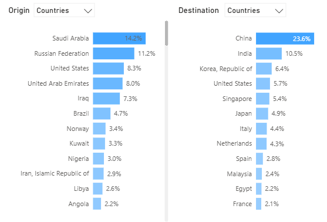
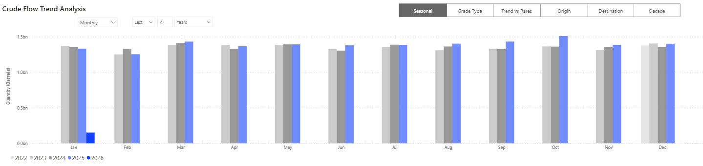

# MARKET INSIGHTS | Venezuela, Russia, and the Oil Balance

**Date**: January 5, 2026 | **Category**: Market Insights | **Section**: Newsroom | **Source**: [https://www.thesignalgroup.com/newsroom/market-insights-venezuela-russia-and-the-oil-balance](https://www.thesignalgroup.com/newsroom/market-insights-venezuela-russia-and-the-oil-balance)

---

## Venezuela, Russia, and the Oil Balance | Interpreting Current Signals for Tanker Demand

Renewed attention on Venezuela’s oil sector has re-entered market discussion alongside the continued geopolitical reshaping of global crude trade flows. For freight markets, the relevance of these developments lies less in oil reserves potential or political signalling and more in how existing and incremental barrels interact with supply–demand balances, price structure, and established trade routes.

## Venezuela: reserves versus freight-relevant reality

Venezuela holds one of the world’s largest proven crude oil reserves. However, reserves are not a freight variable. Tanker demand responds to barrels produced, exported, and moved, not to in-ground resource estimates.

‍

*https://app.signalocean.com/tanker/dynamic/crude_oil_flows*

‍

The differing crude quality profiles of Venezuelan heavy sour grades and Russia's Urals blend underscore structural variations in their compatibility with refineries and typical trade routes. Specifically, Venezuelan grades, such as high-sulphur, extra-heavy, Maya-like crudes, are characterized by their low API gravity and high sulphur content, placing them in the low-API/high-sulphur sector of the crude quality distribution chart.

Current Venezuelan production and export capacity remain constrained by infrastructure conditions, investment requirements, and the quality of crude oil. Venezuelan output is predominantly heavy and extra-heavy, which limits the range of compatible refineries and typically favors Atlantic Basin destinations with complex refining capabilities. Any increase in exports is therefore expected to be incremental rather than large enough to alter the global supply balance in the near term materially.

In terms of near-term disruption, Chinese teapot refineries currently absorb up to around 700 kbpd of Venezuelan Merey crude, typically at discounts of up to $20/bbl. It remains unclear whether these flows will pause, as the Venezuelan government remains intact at present. Meanwhile, U.S. refiners predominantly rely on Canadian (WCS) and Mexican (Maya) heavy sour feedstocks. Canadian volumes in particular flow to the U.S. Midwest via pipeline and rail, whereas Venezuelan crude would need to reach the U.S. Gulf by tanker. As a result, limited direct displacement of existing Canadian or Mexican supply should be expected at this stage.

From a freight perspective, this frames Venezuela primarily as a trade-flow reallocation story. A shift toward more regular Atlantic Basin trade would shorten average voyage distances relative to Asia-bound routes. Under such conditions, seaborne volumes could rise modestly while tonne-mile demand remains flat or declines, depending on the degree of route shortening.

## Short-term market considerations

Near-term freight markets could experience some impact, with Aframax fixtures on Caribbean–U.S. Gulf routes potentially requiring a premium to reflect elevated risk perceptions amid regional escalation. A less likely, though more severe, scenario would involve Venezuelan actions affecting Guyana’s oil infrastructure, operated by ExxonMobil and Chevron. Such a development would likely trigger a sharp increase in Suezmax rates on Guyana-related employment, although this outcome remains improbable at present.

## Russia: the structural long-haul baseline

Russia's role in the global oil market structure is now defined by its structural contribution to long-haul tanker demand, rather than its former position as a swing supplier. Despite sanctions, Russian crude exports have continued through a sustained reorientation towards Asian markets like China and India.

This shift has created longer average voyage distances than the pre-2022 short-haul European trade patterns. Consequently, crude moving from the Baltic and Black Seas to Asia significantly increases tonne-mile demand per barrel for tanker markets. This structural effect supports shipping utilisation, independent of minor fluctuations in global supply volumes.

Furthermore, sanctions compliance has segmented the global tanker fleet, effectively reducing the pool of vessels available for compliant trades. This segmentation introduces market inefficiency, increasing vessel time at sea and supporting overall fleet utilisation, even when growth in global oil demand is moderate.

## Interaction between Venezuela and Russia

The combined impact of Venezuela and Russia reveals that freight outcomes are complex and not simply driven by supply changes. The possible shortening of Atlantic routes due to Venezuelan normalisation is counterbalanced by Russia's continued long-haul exports to Asia. This creates an asymmetric system: while Atlantic routes may shorten, flows from Eurasia to Asia remain extended. Consequently, this dynamic interaction limits the power of any isolated regional event to substantially decrease overall global tanker demand.

‍

*https://app.signalocean.com/tanker/dynamic/crude_oil_flows*

‍The concentration of long-haul global crude exports into Asia is pronounced. Analysis of these flows by origin and destination underscores the structural significance of Russia in meeting the import demands of China and India.

## Supply–demand balance and price signals

The broader oil market backdrop is defined by supply growth outpacing demand growth as the market moves into 2026. According to the International Energy Agency’s December 2025Oil Market Report, global oil supply is now projected to increase by roughly 2.4 million barrels per day in 2026, while demand growth is forecast at around 860,000 barrels per day. This imbalance implies a continued supply surplus, and inventory builds under an unchanged producer policy.

Oil prices reflect this configuration. Brent crude ended December 2025 near $60.85 per barrel, reflecting persistent oversupply and demand softness, and the U.S. Energy Information Administration projects Brent will average around $55 per barrel in 2026, with prices expected to remain near that level as inventories continue to build and supply outpaces demand.

*https://app.signalocean.com/tanker/dynamic/crude_oil_flows*

‍

Monthly global crude flows show stable volumes with seasonal variation, indicating that changes in tanker demand are driven by routing, storage, and time at sea rather than step-change volume growth.

## Longer-term considerations for oil prices

Over the longer term, it is difficult to identify a scenario other than continued downward pressure on oil prices. For Venezuela to ramp up production materially, substantial investment would be required, whether from U.S. companies or other international players. However, it remains uncertain whether oil companies would be incentivised to commit such capital in an already oversupplied market, particularly given the long lead times involved. Even over the medium term, if current Venezuelan volumes of around 1 mbpd were to flow freely to the market, this would increase optionality for buyers and is likely to exert additional downward pressure on prices.

## Contango and storage economics

Price structure matters as much as absolute price levels. Contango describes a forward curve in which futures prices for later delivery trade above the prompt or spot price, reflecting the cost of carrying oil over time, including storage, financing, insurance, and freight. This structure most commonly emerges when near-term supply exceeds immediate demand, pushing barrels into future delivery.

When the contango spread is sufficiently steep, it can incentivise storage, as the futures premium compensates for physical holding costs. In such environments, floating storage on tankers can become economically viable, temporarily tightening effective vessel availability and supporting tanker demand.

However, low prices alone do not generate storage demand. Storage economics depend critically on the shape and persistence of the forward curve, as well as on credit conditions and operational costs.

In the absence of a material and sustained contango, excess supply is typically absorbed through adjustments in trade flows, including longer-haul exports, refinery run cuts, or inventory builds onshore, rather than through large-scale floating storage. As a result, additional supply does not automatically translate into higher tanker demand.

## Producer policy and offsets

Adjustments by major producers and alliances such as OPEC+ remain an important moderating factor. Output decisions elsewhere in the system can offset incremental barrels, limiting net changes to global balances.

For freight markets, these policy responses matter less for total volume than for how they redirect crude flows between regions, altering voyage length, ballast patterns, and vessel utilisation.

## Longer-term considerations for tanker demand

Over the longer term, with respect to tanker demand, even if Venezuelan barrels are pulled toward the U.S. Gulf, supporting Aframax and Panamax employment, oil displaced from U.S. refineries, such as Canadian or Mexican crude, would still need to be exported overseas. As a result, a reduction in ton-mile demand should not be assumed at this stage, and any firm prediction would be premature.

### Freight market takeaways

Under current conditions, tanker demand is shaped primarily by existing trade structures and price signals rather than by reserve potential or long-term development ambitions. Russia’s long-haul export orientation continues to underpin global tonne-mile demand. At the same time, Venezuela’s impact remains concentrated in route allocation rather than scale, limiting its ability to alter overall freight demand materially.

For further discussion or inquiries, readers are welcome to contact the Signal Ocean research team atresearch@signalocean.com. For more insights, pleasecontact our team. Stay ahead of the curve. Get access to theSignal Ocean Platform.
