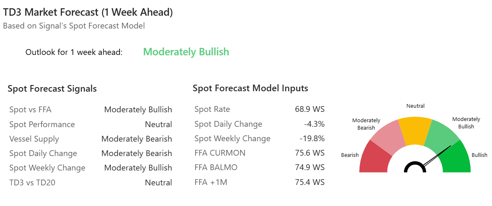

# MARKET INSIGHTS: VLCC Market Pulse

**Date**: October 7, 2025 | **Category**: Market Insights | **Section**: Newsroom | **Source**: [https://www.thesignalgroup.com/newsroom/market-insights-vlcc-market-pulse](https://www.thesignalgroup.com/newsroom/market-insights-vlcc-market-pulse)

---

## MARKET INSIGHTS: VLCC Market Pulse

## 1-Week Ahead Market Sentiment: TD3C outlook turnsmoderately bullish

‍

#### Arabian Gulf–China VLCC rates (TD3C) appear set for a modest rebound as vessel supply tightens and Chinese port congestion rises.

- TheTD3C spot ratehas declined19.8% WoW.Forward levels show clear premiums, with thecurrent month FFA trading +6.7 WS, thebalance of the month +6.0 WS, and theone-month forward contract +6.5 WSabove the spot rate.

##### Supply Dynamics – Arabian Gulf Focus

- Net supply: 93 VLCCs in the Arabian Gulf (–5% WoW)
- 12-month average: 109 — indicating a tighter tonnage list.

Congestion Impact

- China: 32 vessels (+28% WoW)
- Arabian Gulf: 31 vessels (–31% WoW)

‍

*Signal Figure*

Stay ahead of the curve. Get access to theSignal Ocean Platform.
