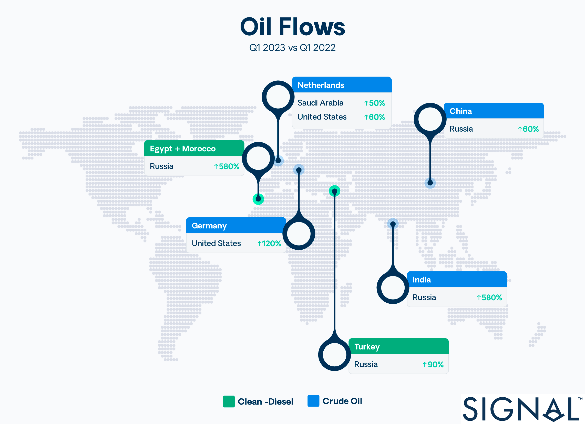

# Monthly Market Monitor: Tanker Freight Market

**Date**: April 5, 2023 | **Category**: Market Insights | **Section**: Newsroom | **Source**: [https://www.thesignalgroup.com/newsroom/monthly-market-monitor-tanker-freight-market-changing-trade-flows-in-q1-2023](https://www.thesignalgroup.com/newsroom/monthly-market-monitor-tanker-freight-market-changing-trade-flows-in-q1-2023)

---

*Signal Figure*

## Signal Ocean looks at the evolution of oil flows amid the enforcement of EU sanctions on Russian oil

The European Union embargo on Russian petroleum products took effect on 5 February and is based on the $60 oil price cap introduced on 5 December by the major G7 (Group of Seven) countries. In the first quarter of 2023, China, India and Turkey, in particular, increased their purchases to partially offset the decline in Russian crude oil exports to Europe. Interestingly, Russian oil continues to enter Europe through the key Druzhba pipeline and via tankers across the Black Sea to Bulgaria, which are exempt from the EU embargo.

In January and February, Russia became the largest exporter of crude oil to China, overtaking Saudi Arabia, which last year ranked first among oil suppliers to the world's second-largest economy. Despite the recent slump in Brent crude prices, China remains interested in buying cheaper Russian crude, and it remains to be seen whether this trend will continue for other Asian countries.

As for oil prices, the first quarter has been characterised by a strong current downward correction, strongly supported by the turmoil in the European and American banking sectors. ​Brent crude oil priceshave fallen about 10% since mid-March to less than $70/barrel, one of the lowest levels in the past year. However, the momentum reversed in the first few days of April, and oil prices are now on the rise again, withBrent crude trading above $80/barrelafter Saudi Arabia, Iraq, and several Gulf states announced plans to cut oil production by more than one million barrels per day. Meanwhile, Russian oil production is expected to reach its monthly target of 500 million barrels per day, and this trend will not change through June.

In the wake of recent geopolitical tensions and oil price developments, seaborne oil flows have shifted from importing to exporting countries, with European and Asian countries rebalancing their sources of origin. Since our lastCrude Oil Tanker Annual Review 2022, when the European ban on Russian crude was already in place, we have been looking at the new patterns of oil flows that have been emerging since the end of 2022. At this point in the year, following the enforcement of the EU ban on Russian oil products, we are reviewing the tanker market in the crude oil and clean tanker segment with a focus on oil flows using data from theSignal Ocean Platform.

‍Our analysis focuses on how Russian oil flows are diverted to other, non-European countries and what sources other than Russian oil purchases arise for European countries.

## I. Oil flows to Europe & Asian Region

##### Top European Destinations

Overall, seaborne oil flows to European destinations (the Netherlands, Italy, Spain, UK, France, Greece, and Germany) showed a firm pace of growth in the fourth quarter of last year, while the gradual slowdown to Europe intensified in February and March following the enforcement of the Russian oil export ban. (Image1) The Russian Federation led the way in European oil imports, but it now remains to be seen whether the U.S or other Middle Eastern countries such as Saudi Arabia will take the lead. Suezmax and Aframax tankers have a significant share of oil business to Europe, 38% and 25% respectively, while crude oil accounts for 64% of oil trade and gasoil/diesel for 14%.

*Image 1: Oil flows to top European destinations (Netherlands, Italy, Spain, France, UK, Greece, Germany)https://app.signalocean.com/tanker/dynamic/oilflows*

##### Top Asian destinations

In contrast to the main European oil importing countries, where there was a steady decline in the first quarter of the year, seaborne oil flows to the main Asian countries, China and China, Korea, Japan and others, showed a clear upward trend in March. This included imports from Russia and other origin countries. (Image2) The top three Asian destinations were China, India, and Japan, accounting for 46%, 23%, and 14%, respectively, while Saudi Arabia was the top source country. However, Russia is expected to surpass Saudi Arabia's crude oil exports to China and India in the coming months, with VLCC tankers covering 60% of the trade.

*Image 2: Oil flows to top Asian destinations China, India, Malaysia, Indonesia, Japan, Taiwanhttps://app.signalocean.com/tanker/dynamic/oilflows*

The next two sections, focusing on Russian oil exports, examine the new patterns in oil flows for Russia's losses and the alternative sources of European energy demand in the first quarter of the year.

## Section II: Russian oil flows to other non-European destinations

##### Increase of Russian crude oil to China & India

Amid the enforcement of European import bans on Russian oil, China and India topped the list of those that increased purchases of Russian crude at discounted prices, with the trend continuing to firm in the remaining months of this year. In the first quarter of this year, Chinese oil imports from Russia increased by around 60% compared to the first quarter of last year. (Image3) Even more surprisingly, Indian crude oil imports from Russia are now 600% higher than they were in the first quarter of 2022, with Indian refiners seemingly intent on continuing this buying spree as long as they benefit from cheaper Russian oil. (Image4)

*Image 3: Crude Oil exports to China from Russian Federation 2022-2023https://app.signalocean.com/tanker/dynamic/oilflows*

*Image 4: Crude Oil exports to India from Russian Federation 2022-2023https://app.signalocean.com/tanker/dynamic/oilflows*

##### Increase of Russian diesel oil to North African Countries & Mediterranean

Clean oil exports from the Russian Federation found strong buyers in North Africa and the Mediterranean. The first quarter of the year saw a surprising record increase in Russian exports to Morocco, Egypt, and Turkey. March peaked with massive export volumes and increases indicating that Morocco and Egypt are now buying nearly seven times as much oil from Russia as they did in the first quarter of last year, and Turkey twice as much, with further monthly increases expected.

MR1 tankers seemed to capture nearly half of the business. However, the new direction of more Russian diesel oil to Turkey, Morocco and other African countries, has no significant impact on the growth of tonne-miles for product tankers are considered short-haul routes, but a possible increase in Chinese naphtha imports from Russia could increase significant product tonne-miles demand.

*Image 5: Clean Oil exports to Morocco. Egypt, Turkey from Russian Federationhttps://app.signalocean.com/tanker/dynamic/oilflows*

## Section III: European countries and oil imports

(sources other than Russian oil purchases)

##### Crude

When it comes to European energy needs, the question is how the main importing countries will replace Russian oil or whether they can meet their needs by supporting each other with the oil supplies they already have. In the case of the Netherlands, imports from Saudi Arabia increased by around 50% in the first quarter of the year, and March ended with the highest volume of imports since the beginning of 2022, with VLCC tankers accounting for almost 80% of trade. (Image6)

*Image 6: Crude Oil exports to Netherlands from Saudi Arabiahttps://app.signalocean.com/tanker/dynamic/oilflows*

Before the end of last year, with the first enforcement of the European ban on Russian crude oil imports, there were various scenarios and forecasts for the U.S contribution to the energy import needs of European countries. For the first quarter of this year, U.S crude oil exports to the Netherlands increased by about 60% and to Germany by more than 100% (Image7) compared to a similar period in 2022, with February recording the highest growth for the U.S crude oil exports to Germany.

‍

*Image 7:Crude Oil exports to the Netherlands from the U.S.https://app.signalocean.com/tanker/dynamic/oilflows*

*Image 8:Crude Oil exports to Germany from the U.S., 2022-2023https://app.signalocean.com/tanker/dynamic/oilflows*

##### Clean

In the clean segment, we have noticed a trend of more exports from Qatar to the Netherlands in the first three months of the year. We have noticed that the Netherlands has increased its diesel oil imports from Qatar, buying almost twice the volumes now, compared to the small volumes it bought in January and February last year. (Image9)

*Image 9:Clean Oil exports to Netherlands from Qatarhttps://app.signalocean.com/tanker/dynamic/oilflows*

##### The increase and decrease in the Dirty and Clean Tanker vessel sizes

##### Dirty - Demand Ton Miles

*Image 10: Demand Tonne Charts, Dirty Tankers, 2021-2022-2023https://app.signalocean.com/tanker/reports/toncharts-trade*

##### Clean - Demand Tonne Miles

*Image 11: Demand Tonne Charts, Clean Tankers, 2021-2022-2023https://app.signalocean.com/tanker/reports/toncharts-trade*

‍

## Section V: Vessel Speed

##### Increasing VLCC seagoing ballast speed to adjust to the recent mood in the freight market

The first quarter of the year ended with the highest sea speed ever recorded for VLCC tankers since the beginning of 2021. In the last days of March, VLCC tanker ballast speed exceeded the 12 knot ceiling as rates from WS MEG /China peaked before the end of the month. It appears that the remarkable upward cycle of rates seen in March is now gradually cooling, but the upward trend remains to support higher ballast speed nodes for crude oil tankers. (Image12)

*Image 12: Vessel Speeds & WS Rates, VLCC Tankers, 2021-2022-2023https://app.signalocean.com/tanker/reports/vesselSpeedshttps://app.signalocean.com/tanker/dynamic/market-prices-tankers*

##### Looking ahead - Expectations

The overall view of the first quarter of the year has already posed significant challenges for oil purchasing countries in Asia and Europe with Russian oil still finding new partners buying strong volumes of Russian crude and diesel oil. In Europe, it  remains to be seen what the impact of the U.S and Saudi Arabia imports will have on the energy requirements of the top European destinations, and how these new patterns in oil flows will trigger further increases in the crude demand tonne miles.

We will continue to monitor changes in oil trade with Asia and Europe, as well as changes in market prices, vessel speeds and demand that will determine the outlook for crude oil and product tanker demand in the first half of the year.

For more information on tanker fundamentals, see Freight Analytics and Reports Tonne Charts, Vessel Speeds, and Oil Flows

For the latest updates and insights, make sure to visit theSignal Ocean Newsroomwebsite page. Clickhere to request a demo.

For more weekly information on market changes, please subscribe to our FREE weekly market trends email, please contact us: research@thesignalgroup.com

##### -Republishing is allowed with an active link to the source
