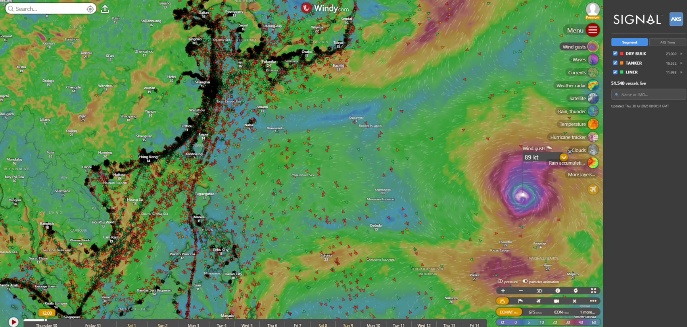
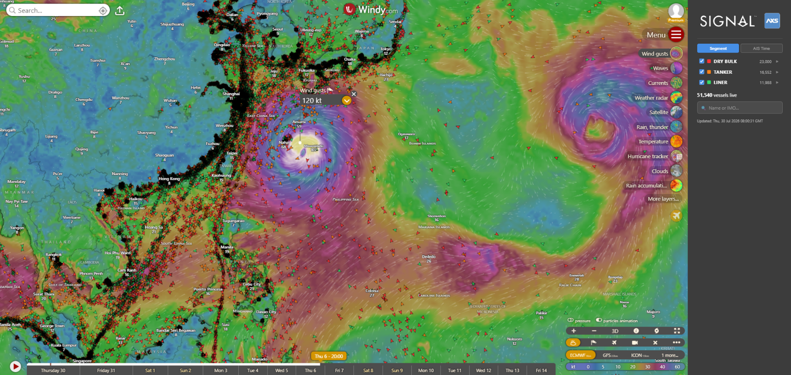
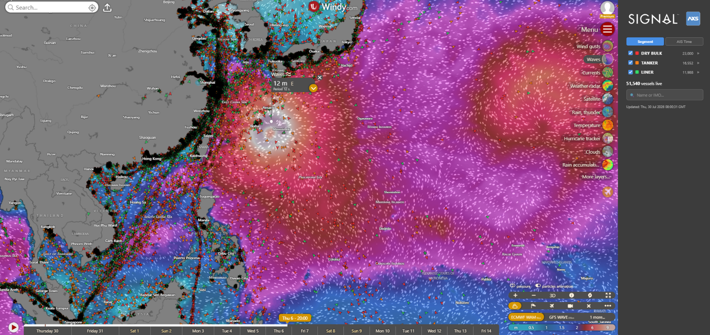
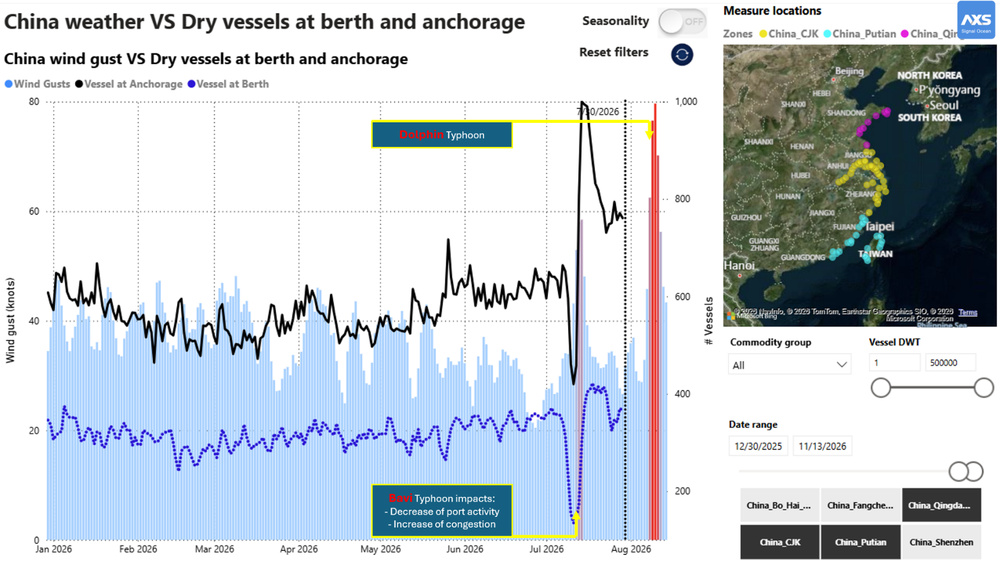
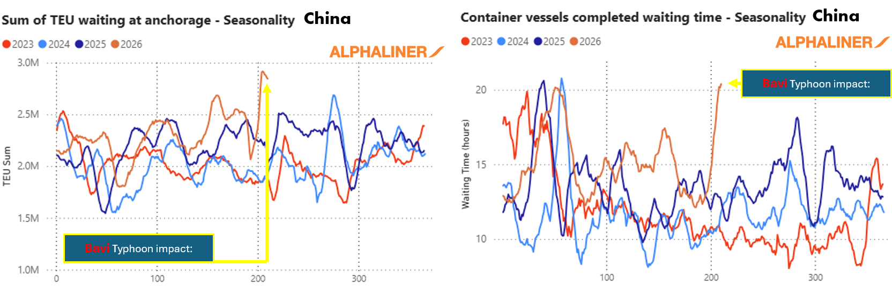
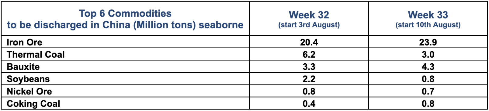

# New Super Typhoon Could Disrupt Taiwan & China Ports Again

**Date**: July 30, 2026 | **Category**: Market Insights | **Section**: Newsroom | **Source**: [https://www.thesignalgroup.com/newsroom/new-super-typhoon-could-disrupt-taiwan-china-ports-again](https://www.thesignalgroup.com/newsroom/new-super-typhoon-could-disrupt-taiwan-china-ports-again)

---

## New Super Typhoon Could Disrupt Taiwan & China Ports Again

Super Typhoon Dolphin is currently rated Category 5 byECMWF, andWindytracking shows it heading toward Taiwan and China, following Typhoon Bavi which impacted the Chinese supply chain mid-July. The system could approach the coast on Thursday, 6 August, with gusts reaching approximately 100 knots and waves of up to 12 meters with a 12-second period.

*Signal Figure*

The precise track and intensity may still change, but the projected conditions would be sufficient to disrupt navigation and port operations across the region.

*Signal Figure*

*Signal Figure*

## Potential impact across vessel segments

As a result, all vessel segments — dry bulk, container, tanker, and gas — face potential disruption. Container services could see congestion rise again as some Chinese ports close or scale back operations for safety reasons. Dry bulk terminals may also slow down, adding to congestion and tightening vessel supply across the Pacific. Tankers and gas carriers face similar exposure, with reduced manoeuvring capacity and possible delays to loading and discharge; even a brief port suspension can leave effects lasting well beyond the storm itself, as vessels bunch and compete for terminal availability once operations resume.

## Existing congestion could amplify the impact

Bavi’s impact remains visible in Chinese dry bulk vessel activity. Around the storm period, port activity declined while the number of vessels waiting at anchorage increased. Although operations have gradually resumed, congestion remains elevated, as shown in the graph below.

*Signal Figure*

Alphaliner reports that Bavi also caused a noticeable increase in container vessel congestion in China. Both the amount of container capacity waiting at anchorage and completed vessel waiting times rose following the storm. While conditions have started to improve, the disruption has not yet been fully absorbed, leaving the market more exposed to another round of port restrictions or vessel bunching if Dolphin follows its current projected path.

*Signal Figure*

## More than 66 million tonnes scheduled for discharge

Iron ore, thermal and coking coal, bauxite, soybeans, and nickel ore are the commodities most exposed by volume should Dolphin hit Chinese ports hard. Across these six commodities, approximately 33.3 million tonnes are scheduled to be discharged in China during Week 32, followed by another 33.5 million tonnes in Week 33 — together more than 66 million tonnes. Iron ore represents the largest share, with 20.4 million tonnes expected in Week 32 and 23.9 million tonnes in Week 33.

## Top 6 Commodities to be discharged in China (Million tons) seaborne

*Signal Figure*

The immediate risk is a potential delay in discharge activity, which could extend anchorage congestion and tighten available vessel supply across the Pacific. With Bavi's backlog still clearing and a second storm now approaching the same corridor within a month, the key indicators to watch over the coming days will be changes to Dolphin's projected track, port suspension notices, vessel accumulation at Chinese anchorages, and the pace at which congestion clears once the storm passes. We will continue tracking crossing volumes and discharge data across all vessel segments as the picture develops.
