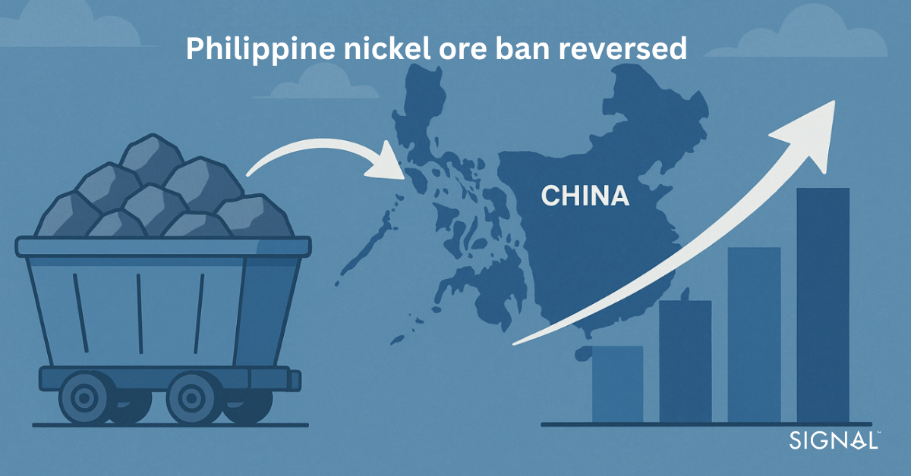
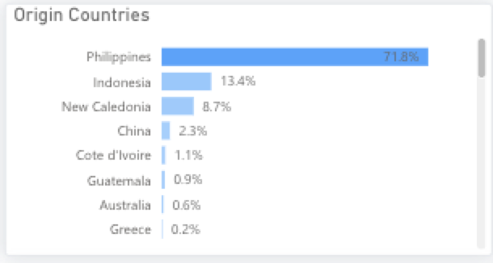
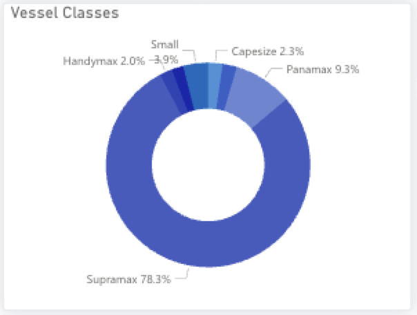
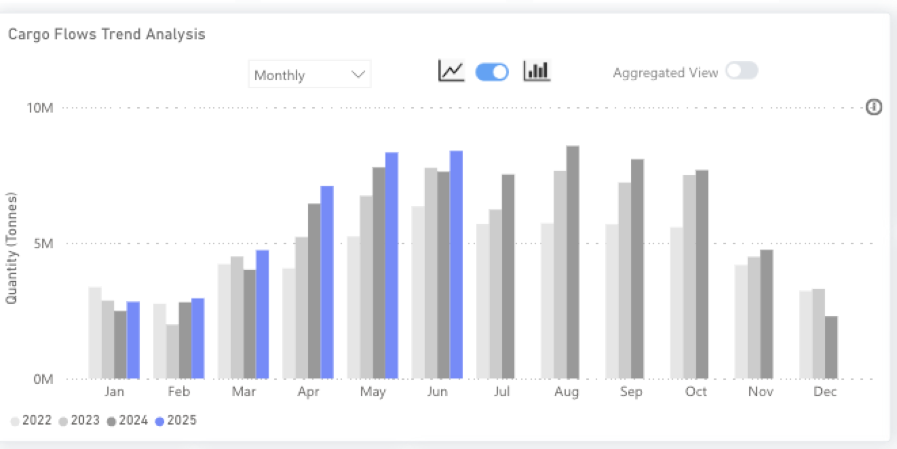

# Philippine Nickel Ore Ban Reversed: Commodity Market Impacts Explained

**Date**: July 7, 2025 | **Category**: Market Insights | **Section**: Newsroom | **Source**: [https://www.thesignalgroup.com/newsroom/philippine-nickel-ore-ban-reversed-what-are-the-impacts](https://www.thesignalgroup.com/newsroom/philippine-nickel-ore-ban-reversed-what-are-the-impacts)

---

## The Philippine government sought to introduce a ban on nickel ore exports from 2030 to enhance domestic processing capabilities and advance up the value chain. This decision was rescinded in mid-June, and this insight will look into the effects this will have on freight in the region.

*Signal Figure*

## Why did the Philippines propose a nickel ore export ban?

Despite ranking 6th by size of nickel reserves, the Philippines has been the largest exporter of nickel ore since 2015, a year after Indonesia, home to the world's largest nickel reserves, introduced a ban on unprocessed nickel ore exports. Since then, the regulations surrounding what nickel can and cannot be exported from Indonesia have fluctuated, but in 2020, they were fully reinstated, meaning that no unprocessed nickel ore can be exported.

‍

Indonesia banned ore exports to encourage investment and development of processing infrastructure in the country, creating higher-value exports. This aim appears to have been met, with reports of Indonesian nickel-related export values surging from $1.4 billion in 2014 to $22 billion in 2024, and a steady stream of foreign and domestic investment into the country’s processing industry. Indonesia is now the leading refined nickel producer.

‍

The Philippines saw banning nickel ore exports as a way for the country to develop similarly, and the Senate passed a bill to ban the export of unprocessed nickel ore by 2030 on February 3rd, 2025. However, the country’s nickel industry did not welcome the bill, and the removal of the plan was welcomed by the Philippine Nickel Industry Association.

‍

*Origin of nickel ore exports from 01/01/2022 to now from the Signal Ocean Platform*

‍

## Nickel drives vessel demand in the Philippines

Currently, nickel ore makes up over 70% of dry bulk commodity exports from the Philippines, according to TSOP, followed by thermal coal, which is just under 14%. Over 87% of Philippine nickel ore is exported to China, where it is primarily used in stainless steel (around 80%) or increasingly in battery production (around 15%). As a key commodity for industrial and energy applications, booming Chinese stainless production has kept Philippine nickel demand high, and with greater electrification, demand from the battery sector will also increase.China would be hard-pressed to find an alternative to Philippine nickel ore, given that many other large producers such as Australia and Indonesia process the ore domestically before exporting the higher-value commodity products. There is seasonality in the exports of nickel ore from The Philippines which is also impactful. Given the monsoon season that runs from June to October, mining, port, and transportation operations can be affected heavily. TSOP shows this with exports trending lower in the second half of the year. The first quarter also typically has some downward pressure on exports due to the Chinese New Year slowing buying and importing activity, but Philippine exports do ramp up quickly through the end of the quarter.

Supramax demand outpaces any other vessel class that loads in the Philippines. An outright ban on nickel ore exports as previously proposed would likely reduce vessel demand in the short term as supply chains take some time to readjust, but given the ban has been vetoed, demand for vessels will likely stay healthy, softening with the typical seasonality through Q4 and into 2026 Q1.‍

*Vessel demand for loading in The Philippines from 01/01/2022 to now from the Signal Ocean Platform (TSOP)*

‍

*Nickel ore exports from The Philippines from the Signal Ocean Platform*

‍

## Demand Outlook

Given the end-use sectors of nickel are expected to perform well in the largest export region of China, vessel demand, particularly of supramax to load in the Philippines, will remain strong and have good, mid-to-long-term growth potential. The shorter-term outlook is likely to be softer as China already has high stainless steel inventories and may reduce production to support prices; the ripple back would be to lower nickel ore imports, thus reducing vessel requirements. Seasonality will also weigh on demand over the second half of 2026 and into 2026 Q1.

## Key takeaways

The proposed nickel ore export ban was introduced to try to increase the value of Philippine exports, in a similar vein to the successful implementation by Indonesia. This would have had a direct impact in supply chains as China would have needed to source new nickel ore, an industrial commodity that remains difficult to substitute, as many other larger producers have also moved up the nickel product value chain.

The rescinding of the ban will keep the status quo of nickel ore commodity exports to China. The outlook for nickel ore demand in China is positive given the expectation that stainless steel production, used for infrastructure upgrades, and battery production will continue to be strong. These are mid-to-long-term drivers but should enable growth in vessel demand for loading in the Philippines. Given the typical tonnage of nickel ore exports, supramaxes are likely to be the biggest winner in terms of demand growth.

Stay updated with platform enhancements, insights, and market analysis. For demo inquiries,reach outto us and visit theSignal Ocean Newsroomfor the latest updates on market trends and platform developments. This article was authored byLuke Nickels. To check out our previous newsroom articleclick here.
