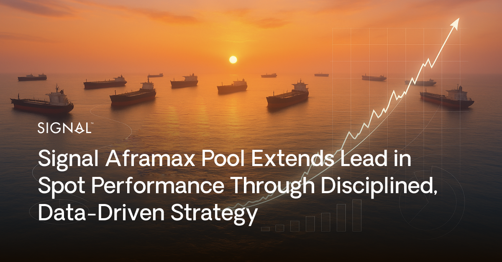
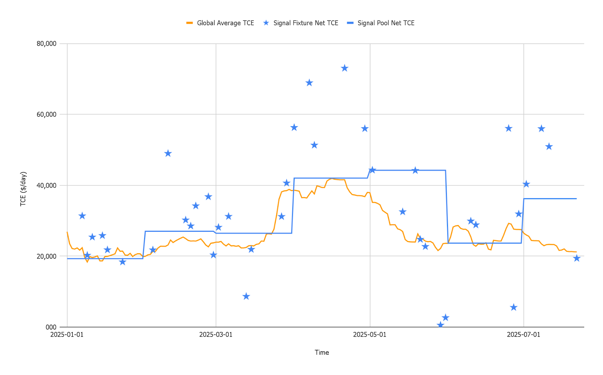

# Signal Aframax Pool Extends Lead in Spot Performance Through Disciplined, Data-Driven Strategy

**Date**: August 4, 2025 | **Category**: Market Insights | **Section**: Newsroom | **Source**: [https://www.thesignalgroup.com/newsroom/signal-aframax-pool-extends-lead-in-spot-performance-through-disciplined-data-driven-strategy](https://www.thesignalgroup.com/newsroom/signal-aframax-pool-extends-lead-in-spot-performance-through-disciplined-data-driven-strategy)

---

## Signal Aframax Pool Extends Lead in Spot Performance Through Disciplined, Data-Driven Strategy

*Signal Figure*

### 

Building on the strong momentum reported earlier in the year, the Signal Aframax Pool continues to demonstrate exceptional and consistent results, solidifying its position as a top performer in the sector. The pool's year-to-date (YTD) net Time Charter Equivalent (TCE) has reached an impressive$31.5k/day, underscoring the success of Signal’s disciplined, risk-aware, and data-driven commercial strategy while delivering a safe, high-quality service to charterers and maintaining trusted, long-term relationships defined by transparency, responsiveness and commercial mindset.

This strong performance places Signal significantly ahead of its competitors. The pool is currently outperforming its peers by approx.$2.8k/dayand the spot market average by approx.$1.7k/day. This material delta translates into hundreds of thousands of dollars in additional revenue for pool partners over the period, highlighting the tangible value of Signal's commercial management.

## A Strategy of Patience and Precision Timing

These results are not a matter of short-term luck but the outcome of a deliberate and flawlessly executed strategy. The key to outperformance lies in two core principles: patience during market lulls and precision timing for high-value voyages.

Instead of diluting their position when key loading areas like the US Gulf face low markets, Signal exercises strategic patience, avoids committing to discounted fronthauls and instead fixes vessels on shorter, local voyages. This approach keeps vessels in position, covering costs while waiting for the market to rebound. When the market strengthens, vessels are primed to capture the peak rates on lucrative fronthaul voyages, maximizing profitability.

This discipline is complemented by the timing of fixtures. A detailed analysis of Signal performance shows the consistency of high-earning fronthauls and long-haul voyages fixing during market peaks, while strategically executing necessary backhauls or repositioning voyages during market troughs. This allows Signal to minimize opportunity cost and maximize vessel earnings across the cycle.

## Visualizing the Strategy's Success

The effectiveness of this approach is clearly illustrated in the graph, which plots Signal’s fixtures (blue stars) and the monthly Signal Pool performance (blue line) against the global average spot Aframax market (orange line) in TCE ($/d) terms for the first 200 days of 2025.

*Graph notes: (1) Signal Pool Net TCE per month is affected also by fixtures done in previous months, (2) Each blue star shows the average Net TCE of all fixtures done within the same day by Signal.*

‍

The chart demonstrates how Signal strategy translates into tangible outcomes, resulting overall in an average performance well above the market. The majority of the fixtures are clustered well above the global market average, representing the high-value fronthauls secured during periods of market strength. In fact,78% of Signal’s fixtures have beaten the market average.The remaining 22%, often seen below the orange line, are not missed opportunities, they are calculated decisions; strategic backhauls consciously fixed in weaker conditions to reposition the fleet for its next high-earning employment. This visual evidence reinforces Signal’s ability to generate superior returns through a disciplined, three-pronged strategy of patience, optimal timing and optimal geo-positioning.

## Leading with Skin in the Game

The Aframax segment continues to be shaped by a complex interplay of shifting trade patterns and regional demand imbalances, making adaptability crucial. Signal's ability to consistently outperform the market since its inception in 2018 is a testament to the effectiveness of its approach.

Looking forward, Signal is doubling down on their commitment. To further increase the "skin in the game" and align interests with pool partners, Signal has recently taken one more vessel on Time Charter-In and placed it directly into the pool while actively discussing more such opportunities to further support the pool’s growth and performance. This move signals the profound confidence in the commercial strategy and dedication to leading the spot market.

‍
