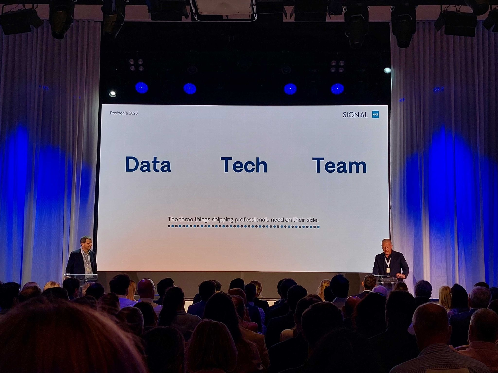

# Signal and AXSMarine welcome the shipping community to "A New Course" at Posidonia 2026

**Date**: June 4, 2026 | **Category**: Press Releases | **Section**: Newsroom | **Source**: [https://www.thesignalgroup.com/newsroom/signal-and-axsmarine-welcome-the-shipping-community-to-a-new-course-at-posidonia-2026](https://www.thesignalgroup.com/newsroom/signal-and-axsmarine-welcome-the-shipping-community-to-a-new-course-at-posidonia-2026)

---

## Signal and AXSMarine welcome the shipping community to "A New Course" at Posidonia 2026

*Signal Figure*

Athens, 4 June 2026- Nearly a thousand guests - clients, partners and friends from across shipping - gathered in Athens as Signal and AXSMarine hosted "A New Course": an evening about how technology, and now AI, can turbocharge data and processes in the new era.

It was the first time the two companies had shared a stage since Signal's acquisition of AXSMarine earlier this year. The conversation covered where the industry is heading, what the past can teach us about handling change, and why Signal and AXS chose to join forces and what products they are working on. Mr. Martinos, the founder of Signal, emphasized the importance of Trust in the shipping space, the one thing that gets more valuable, not less, as the industry speeds up.

“Relationships matter most in Shipping and Technology will revolutionise shipping. Both arguments are true”, said Ioannis Martinos, CEO of Signal. But he was clear-eyed about what AI will and won’t change. “Shipping moves big things over long distances, that doesn’t change”. But the slow parts will go faster, and as they do, relationships and companies you trust will matter even more.

Ioannis Martinos and Jacques Goudchaux, CEO of AXS, explained the rationale of the two companies joining forces. AXS had spent twenty-five years building one of the largest data operations teams in the shipping industry. But the moment called for something more. A need to move beyond data alone. “Data alone is no longer enough,” said Goudchaux. “What matters now is speed and clarity from data to decisions.”

The companies used the evening to show, in practical terms, what the unified team of 400 is building for the 1,600 collective clients and tens of thousands of users across containers, tankers, dry bulk and gas. Demonstrations focused on everyday freight workflow: finding the right data quickly, staying on top of changing data while keeping people in control, and getting time-consuming tasks done faster. Mr. Martinos was direct about the ambition: "We are planning to deliver more in the next two years than the two companies did in the previous eight combined."

Signal & AXS launched their new AI assistant and the associated MCP server and shared the product roadmap that they are working on in 2026 - 2027 covering Email, VMS, technical ERP and Commodities.

For an industry built on long relationships and carefully earned trust, the evening felt like a natural moment. Two companies, one direction, and a room full of people they have been serving for a long time.

‍

Media Contact:Ash Torvi|a.torvi@thesignalgroup.com
