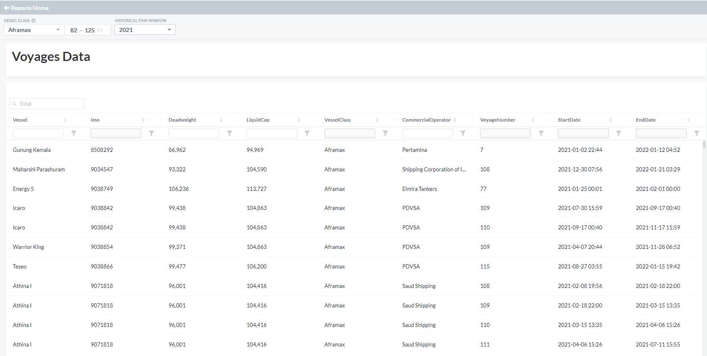

# Signal Maritime | Our Story of the Month - January 2022

**Date**: January 24, 2022 | **Category**: Market Insights | **Section**: Newsroom | **Source**: [https://www.thesignalgroup.com/newsroom/signal-maritime-our-story-of-the-month-january-2022](https://www.thesignalgroup.com/newsroom/signal-maritime-our-story-of-the-month-january-2022)

---

## “Materialising demurrage business upside in low market levels”

During a period of low market levels, Signal’s chartering team has leveraged technology to identify opportunities for demurrage business in order to boost the revenues generated in both Aframax and MR fleets.

Analysing the port stay in "Voyages Data" in TheSignal Ocean Platform, we acquire an overview of delays across different ports taking into consideration other parameters such as the timing and seasonality.

*Reports Dashboard, The Signal Ocean Platform*

Based on data analysis conducted for the year 2021, companies who systematically leverage such information based on voyages and port data experience a $500-700 per day per vessel impact on their revenues.

.png)
*Examples demonstrating the strategy*

In the first example voyage we accumulated 72 days of demurrage that improved the voyage’s TCE by $10.2K/day.

On another case, anticipating increased Turkish Straits delays during the start of winter we chartered this voyage with more than 17 days of demurrage.Request ademotoday to learn more aboutSignal Ocean features. For the latest updates and insights, make sure to visit theSignal Ocean Newsroomwebsite page. Clickhere to request a demo.
