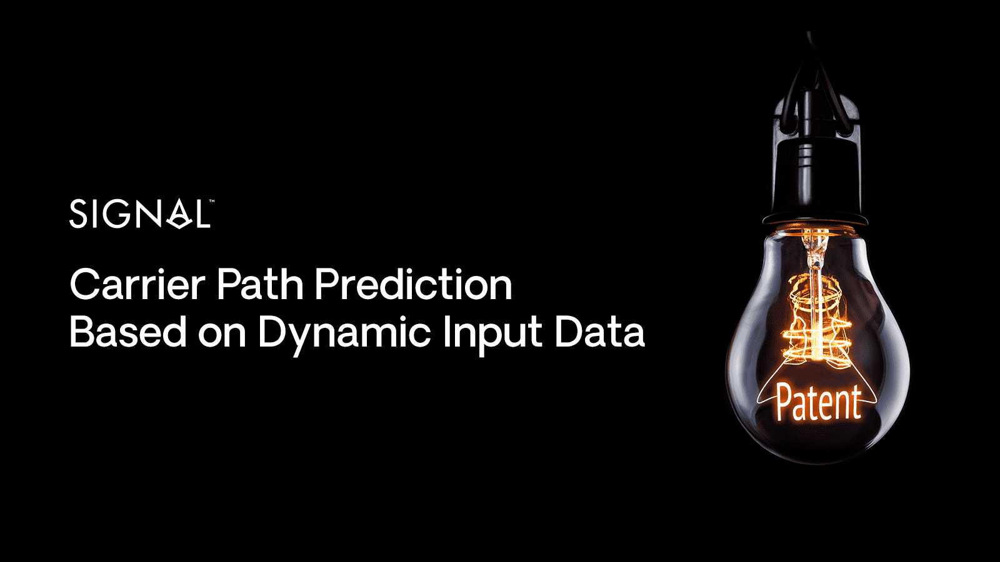

# Signal's forecasting algorithm gains a USA patent

**Date**: April 22, 2021 | **Category**: Market Insights | **Section**: Newsroom | **Source**: [https://www.thesignalgroup.com/newsroom/signals-forecasting](https://www.thesignalgroup.com/newsroom/signals-forecasting)

---

## Signal Ocean Tackles Complex Ship Prediction with Novel Approach

Trying to form accurate predictions of commercial ships seems easy enough to the sound of it, they are pretty slow beasts anyway. But if the predictions need to be commercially valuable i.e. months ahead over multiple voyages, then it becomes a quite challenging and novel problem, with no ready made solutions.

We addressed this challenging problem by turning it into two different sub-problems: first, define the search space, and second derive a reward function that gets its maximum value over the best solution in that space. Both problems turned out to be of similar difficulty.

For the first sub-problem you can actually try the brutal force solution of any possible ship voyage, but estimating anything more than a single load-discharge pair becomes exponentially difficult i.e. a no-go solution. Even cutting it down to all possible solutions for a particular ship at a particular location leaves you with a prohibitively high number of possible solutions. To address that we utilized a Graph-Theoretic approach over which we find the most probable paths over all the data points (i.e. particular commercial info regarding the ship at hand). For example, if the only data point that we have is that the next discharge of a VLCC tanker is going to be in China we can estimate that its loading port is going to be somewhere in AG so we form a “load-AG discharge-China” prediction. Adding to that the output of AI models we can pin down this prediction to specific ports. Applying this data-algebra over all the data inputs we can generate a set of solutions that is guaranteed to contain the optimal one, albeit being of small size.

*Signal Figure*

Having generated the search space is only half the story. The story is not complete until you select the one solution in the set that best matches your data, taking into consideration that the data itself is “untrustworthy”, “conflicting”, “noisy”, “ambiguous” and “incomplete”. In other words, all the bad data words you can find in all of the data science papers combined. Again here using a lot of business knowledge and appropriate handling of all data formats, that range from gps readings of the ship’s locations to ship open ports advertised over “what’s app”, we designed a sorting algorithm that selected the best path more than 95% of the time. More than 40 different statistical models and advanced algorithms have been combined to reach such a high level of accuracy.

All this has come together into our first USA awarded patent (link1,link2). To get a first idea of the commercial result,sign up to the Free edition of the Signal Ocean Platform.

For the latest updates and insights, make sure to visit theSignal Ocean Newsroomwebsite page. Clickhere to request a demo.
