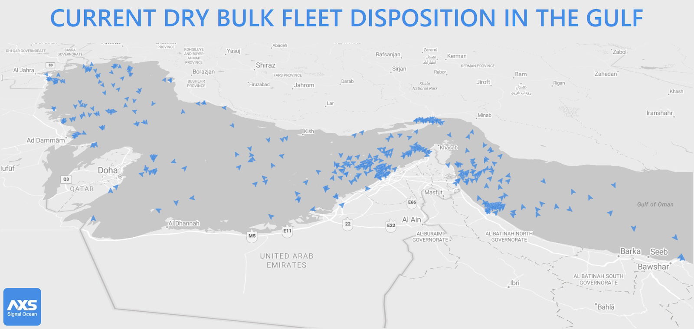
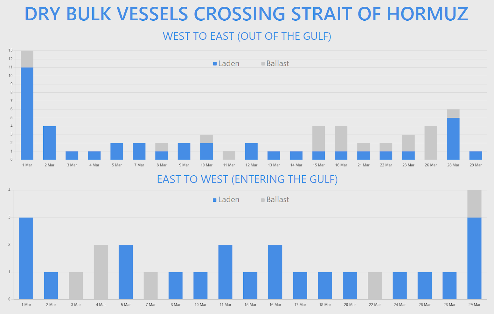

# Strait of Hormuz: Limited Vessel Transits Continue as Outbound Flows Dominate

**Date**: March 30, 2026 | **Category**: Market Insights | **Section**: Newsroom | **Source**: [https://www.thesignalgroup.com/newsroom/strait-of-hormuz-limited-vessel-transits-continue-as-outbound-flows-dominate](https://www.thesignalgroup.com/newsroom/strait-of-hormuz-limited-vessel-transits-continue-as-outbound-flows-dominate)

---

## Strait of Hormuz: Limited Vessel Transits Continue as Outbound Flows Dominate

Vessel traffic through the Strait of Hormuz remains active, but at significantly reduced and highly selective levels amid heightened regional tensions following escalating conflict in the Middle East.

Based on AIS-derived tracking over the past week, a combined total of 40 merchant vessels have been recorded crossing the Strait across two recent observation windows, including dry bulk carriers, tankers, gas carriers, container vessels and MPP units. While transits have not ceased entirely, the data highlights a clear and persistent imbalance between outbound and inbound flows.

At the same time, a much larger fleet remains positioned within the Arabian Gulf, with visibility increasingly affected by AIS disruption and irregular signal behaviour.

## A growing fleet inside the Gulf with limited visibility

Current positioning data shows 319 bulk carriers and MPP vessels located west of Hormuz, of which 162 are assessed as laden and 157 as ballasting. The fleet includes 201 bulk carriers and 118 MPP units.

*Signal Figure*

Notably, 82 vessels are currently operating under AIS blackout conditions, limiting real-time visibility and complicating efforts to assess operational status and cargo activity across the region.

This combination of high vessel concentration and reduced transparency underscores the continued uncertainty surrounding shipping activity within the Gulf.

## Outbound flows continue to dominate

Across both datasets, west-to-east movements clearly outweigh inbound crossings, confirming that vessels are continuing to exit the Gulf at a higher rate than new entries.

In the earlier observation window, 15 vessels transited west-to-east, including a mix of dry bulk carriers, tankers and one LPG carrier. These included Panamax bulkers such as MDL KAMRAN, LH ANTHEA and MINOAN SKY, as well as tanker movements involving the VLCC NORA and multiple MR2 product tankers.

The more recent dataset reinforces this pattern, with a further 11 dry bulk vessels exiting the Gulf, including:

- ARVIN (72.6k dwt), carrying approximately 60,000 MT of iron ore
- ARTMAN (53.5k dwt), transporting around 44,000 MT of gypsum
- Several ballasting Panamax units such as GLYKOFILOUSSA, ZEA and STAR KAMILA

In addition, vessels such as LUCKY LONG and PERLITA completed their transits with AIS switched off, highlighting the growing prevalence of reduced signal transparency even during active crossings.

Overall, outbound movements include both laden vessels completing discharge cycles and ballast repositioning, indicating that operations continue, but under increasingly cautious conditions.

## Inbound activity remains constrained

Inbound crossings into the Arabian Gulf remain significantly lower across both datasets.

In the earlier observation period, 8 vessels transited east-to-west, including a mix of bulk carriers, tanker units, one LPG carrier and a single container vessel. Tanker activity in particular showed a strong presence of sanctioned or shadow fleet operators.

More recent data shows only 4 additional inbound crossings, including:

- NJ JUPITER (56.0k dwt), carrying approximately 51,000 MT of corn
- GIACOMETTI (81.7k dwt), which has since discharged around 74,000 MT of grains at Bandar Imam Khomeini
- Two ballasting vessels, ARDAVAN and GOLSAN

The limited number of laden inbound vessels suggests that fresh cargo inflows into the Gulf remain highly selective, with many operators continuing to delay or avoid entry altogether.

*Signal Figure*

## AIS disruption and data opacity increase

A recurring theme across both datasets is the growing impact of AIS disruption.

In addition to the 82 vessels currently under AIS blackout conditions within the Gulf, several vessels completing transit were observed with either disabled signals or irregular AIS behaviour. In multiple cases, this makes it difficult to reliably determine whether vessels are laden, ballasting or actively engaged in commercial operations.

This trend reflects a broader shift toward reduced transparency in vessel movements, particularly in higher-risk operating environments.

## Segment dynamics highlight uneven risk appetite

The data also shows clear differences in activity across vessel segments:

- Dry bulk carriers account for the majority of transits, particularly in outbound movements, likely reflecting the completion of existing fixture commitments rather than fresh cargo appetite
- Tanker activity continues, but with a notable presence of sanctioned or higher-risk operators, suggesting that mainstream tanker operators are largely standing aside
- Gas and container segments show very limited participation, consistent with the availability of alternative routing options and heightened cargo and insurance constraints

These differences suggest that risk tolerance varies significantly across segments, with some operators continuing to engage while others remain largely absent.

## Conclusion

While vessel traffic through the Strait of Hormuz has not ceased entirely, it remains highly uneven, selective and increasingly opaque.

Outbound flows continue to dominate, supported by both cargo movements and ballast repositioning, while inbound activity remains materially constrained. At the same time, a large number of vessels remain inside the Gulf, with a growing share operating under limited AIS visibility.

Taken together, the data points to a market where transits are still possible, but conditions remain materially disrupted and far from pre-crisis levels. Looking ahead, a sustained uptick in laden inbound crossings would be the clearest signal that risk appetite is recovering. Until then, operational decisions are likely to remain shaped by risk exposure and uncertainty rather than commercial opportunity.Learn more aboutAXS Data & APIs.
