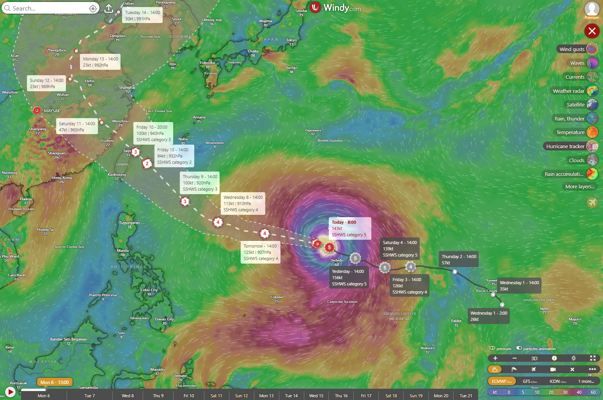
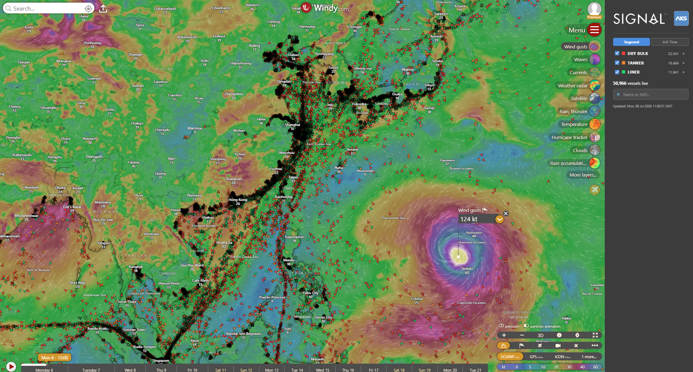
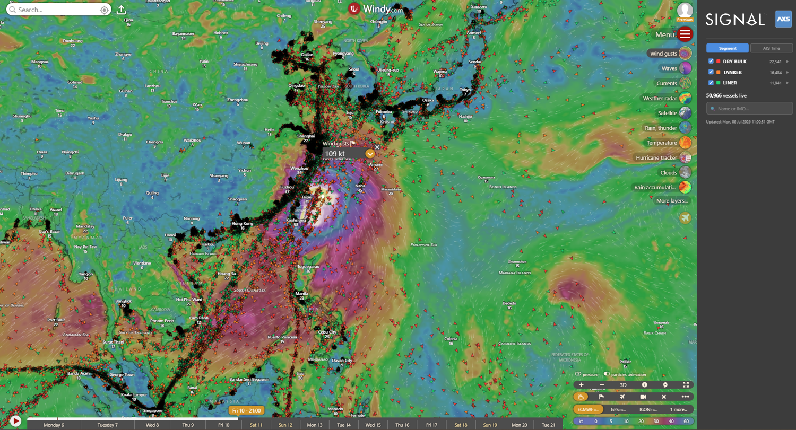
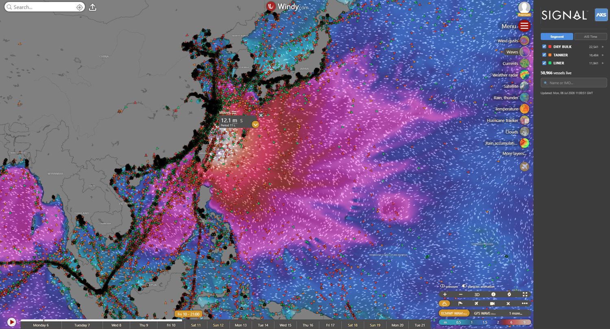
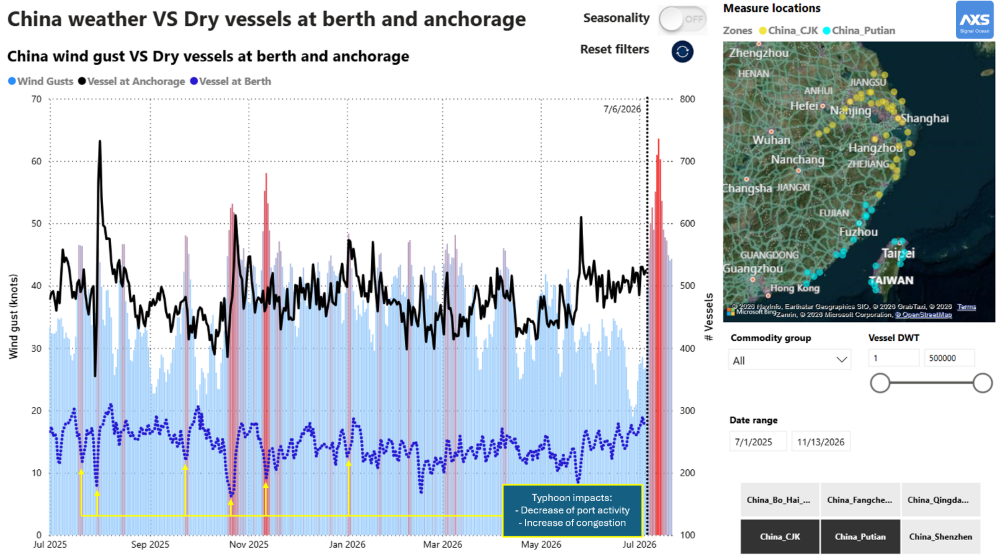
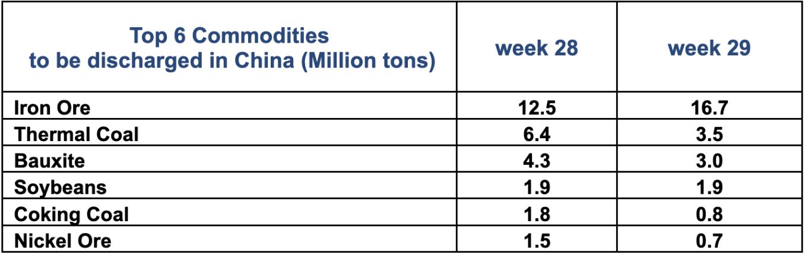
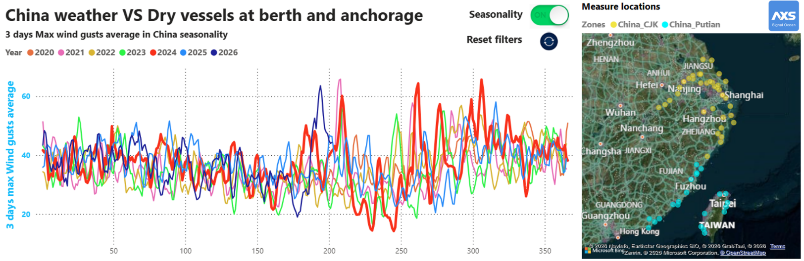

# Super typhoon Bavi heading to Taiwan & China might disrupt commodity supply chain and Pacific vessel supply

**Date**: July 6, 2026 | **Category**: Market Insights | **Section**: Newsroom | **Source**: [https://www.thesignalgroup.com/newsroom/super-typhoon-bavi-heading-to-taiwan-china-might-disrupt-commodity-supply-chain-and-pacific-vessel-supply](https://www.thesignalgroup.com/newsroom/super-typhoon-bavi-heading-to-taiwan-china-might-disrupt-commodity-supply-chain-and-pacific-vessel-supply)

---

## Super typhoon Bavi heading to Taiwan & China might disrupt commodity supply chain and Pacific vessel supply

Super Typhoon Bavi is currently rated Category 5 byECMWF, andWindytracking shows it heading toward Taiwan and China. It is expected to reach the coast on Friday, 10th July, with wind gusts of up to 100 knots.

*Signal Figure*

Vessels are already avoiding the typhoon's path, as confirmed by the Signal & AXSMarine Windy.com plugin.

*Signal Figure*

However, by Friday 10th July, Bavi could cross one of the busiest shipping lanes in the region, with gusts of 100 knots and waves of 12 meters at an 11-second period — conditions that threaten to disrupt both navigation and port operations.

*Signal Figure*

*Signal Figure*

As a result, all vessel segments - dry bulk, container, tanker, and gas - face potential disruption. Container services could see rising congestion as some Chinese ports close or scale back operations for safety reasons. Dry bulk terminals may also slow down, adding to congestion and tightening vessel supply across the Pacific.

*Signal Figure*

‍

Iron ore, thermal and coking coal, bauxite, soybeans, and nickel ore are the commodities most exposed by volume should Bavi hit Chinese ports hard.

## Top 6 Commodities to be discharged in China (Million tons)

*Signal Figure*

‍

With typhoon season now underway, elevated wind gusts events are likely to persist through November, as shown in the seasonality data below — keeping supply chain risk on the radar for the coming months.

*Signal Figure*

‍
